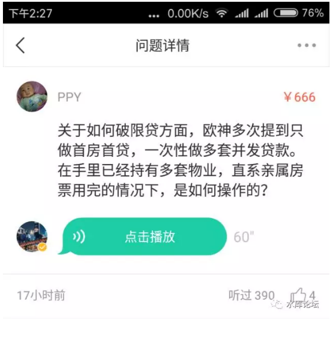
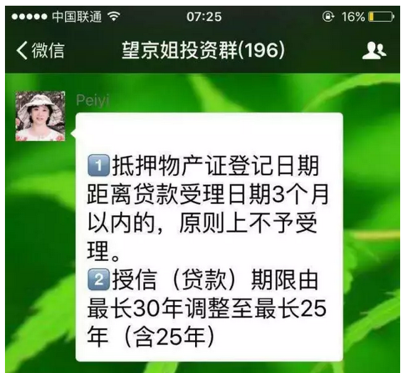

# xyz单 \#1270

原创： yevon\_ou [水库论坛](/) 2017-03-22

xyz单 ~\#1270~
==========================================================================================================

今天我们介绍一种特殊类型的"ABC单"。

在某些城市，也被称为"公证交易"。

 

 

 

一）ABC单

 

首先，让我们回忆一下，在《ABC单》~\#1210~中，对于ABC单的描述。

 

-   ABC单适用于极短期的撮合式操作

-   ABC单本金极少，杠杆率极大

-   A一般不知道C

-   后手是埋雷流和毁约流

 

 

但是，ABC单还有一个变种："操刀"的时间极长，甚至长持。杠杆率也很大，专注于贷款，而不是接盘侠Ｃ。

 

 

1）房东是x，房子价值1000W，还含有550W贷款

2）你是y

 

这时候，你去和房东谈，y把x的房子买下来。但是；

 

3）不过户，节约税费

4）不提前还贷。而是由Y来代还

5）给房东450W现金

6）做450W抵押证，锁死房子

 

 

形似而神不似，虽然看起来ABC单和XYZ单很象，但其实却是完全不同的东西。

尤其是内里的思路和逻辑，南辕北辙。

 

             ABC       XYZ
  ---------- --------- ----------
  节约税费   √         √
  不受限购   √         √
  放大杠杆   √         √
  时间：     超短期    长期
  策略：     挖笋      大势
  赢利点：   接盘侠C   贷款额
  短肋：     脱档      房东变卦
  案例：     很多      很少

 

 

首先，和ABC单一样。xyz单也是不用过户的。这样就不受5.55%增值税+所得税+契约，不受政府的层层盘剥。可以完全独享利润。

 

其次，和ABC单一样，xyz单也是不受"限购限贷"限制的。无论你已经买了多少套，无论政府的"限制"如何苛刻。它都是管不了你的。你依然可以拼命地买。无限量买。

 

 

 

那么，ABC和XYZ的区别是什么呢。

区别是，ABC是没有"能力"啃下这整幢物业的。

 

好比我们在《[ABC单](http://mp.weixin.qq.com/s?__biz=MzAxNTMxMTc0MA==&mid=2651015550&idx=1&sn=3f5268d172dbe3f031646ff9456b4f83&chksm=80721f6db705967bd2910f8e843779a24aaf1b253b850964ab6f994ca53b07b56a1fa4d55b0d&scene=21#wechat_redirect)》~\#1210~中，举了一个郭应泉啃22亿大厦的故事。

但其实他并不是一个十亿富豪。这个人甚至连A9都不到。

ABC单只能立足于快速出货"空手套白狼"。一旦卡死，立刻就是塌定清盘的惨状。

 

 

但是XYZ单，他是立足于"长持"的。

Y是有能力啃下这整幢物业的。

甚至可以说，XYZ单只不过工整的说法。Z不存在也行，只要XY就可以成单。

 

 

 

二）XYZ单

 

那么，XYZ单的手法策略是什么呢。XYZ单，主要是冲着"X手里的贷款"去的。

 

 

五天前，北京出3.17新政。二套首付八成。

昨天晚上，燕郊廊坊宣布限购。

今天早上，抵押又有新闻：

 

 

"全款抵押"这条路又被堵上了。资金从出产证，又要再等三个月。也就是一共要六个月左右。

对于"过桥"来说，六个月是几乎不能忍受的。

 

我们知道，"三个月"和六个月，不是同等数量级的概念。

三个月时间，光信用卡免息周期就有56天。你找二百万的信用卡刷一下，在"信用卡假期"就把过桥事给办了。

 

但是"六个月"已经是中期的概念。需要寻觅中长期资金。

不仅利率成本大大上升，来源也少很多了。

 

 

 

哥哥昨天打游戏到3:30，今早十二点刷牙的时候，我就在想，要不要写一篇《我的亲爱的，我的贷款在哪里》。

我们知道，真正赚钱的是房贷，房产只不过载体。

但是在今天"调控"的大环境下，贷款越来越难以获得。政府层层围堵，贷款才是真的难。

 

早上我想写一篇《贷款在哪里》。列举十个小技巧，在每一个角落做好1%。积少成多就凝聚成了专业化。

-   卖房子，优先卖没有贷款的

-   离婚析产做首套

-   第一套一定要贷足

-   年限比利率更重要

-   等额本息比等额本金更好

-   优先用掉瑕疵房票

-   贷款时保持多核，核心洁净

-   拒绝短视置换

-   适度做到负现金流

-   跨城市破除首套

 

 

这些东西，如果你找"UC震惊部"起一个标题，例如；

《震惊！十个技巧帮你省下百万》

《震惊！一个女人和108次离婚的故事》

 

（震惊：女人只要有钱有房子，管你是不是禽兽......）

 

 

起个"爆款"标题，分分钟就是网络爆文。

于是写了2000字，哥哥把文件删掉了。

 

为啥呢，因为太低级。从头到尾全部都是已知的科技树。

整理"限购目录表"之类庶务，交给瓜田这种公众号就行了。

水库出干货。

 

水库文章成体系的。成体系的就不能用"震惊"。

水库标题三言二语，《[ABC单](http://mp.weixin.qq.com/s?__biz=MzAxNTMxMTc0MA==&mid=2651015550&idx=1&sn=3f5268d172dbe3f031646ff9456b4f83&chksm=80721f6db705967bd2910f8e843779a24aaf1b253b850964ab6f994ca53b07b56a1fa4d55b0d&scene=21#wechat_redirect)》《XYZ单》《[对敲](http://mp.weixin.qq.com/s?__biz=MzAxNTMxMTc0MA==&mid=2651014922&idx=1&sn=1c214c174849286499f23a2e8efecbc0&scene=21#wechat_redirect)》《[截断和再抵押](http://mp.weixin.qq.com/s?__biz=MzAxNTMxMTc0MA==&mid=2651014912&idx=1&sn=42f1eacd72da0e7e87280d55f206937f&scene=21#wechat_redirect)》。

三言二语都是精华。

 

 

 

言归正传，ABC单和XYZ单的区别。在于二者的出发思路就是不同的。

ABC单的本质是"套利"。归类可归入"药单流"一种。

ABC单是独立于大市的。不赌大势涨跌，套利七折笋。

 

而XYZ单的本质是"长持"。是属于"大面积低单价"囤房流派。

目标是通过尽可能少的资金来控制房子。着眼点依然是"贷款"。

 

 

 

XYZ单操作时，一方面要考察房屋本身的品质。考察房屋升值潜力。

另一方面则要问清；

"还剩多少贷款"

"七折的还是八五折的"

"房东愿意配合我加按么"

"太棒了"!

 

 

 

和深圳某些流派类似。深圳的"公证交易"十分流行，常常有长持三五年，换六七个主人，不换房本的。

但是，"形似而神不似"。

 

深圳的"公证书交易"，通常是全款的。追逐利润的着眼点，也往往放在"升值""热点"，放在了房子身上。

对于雅房这种低科技树行为，俺们痛心疾首。暴殄天物！

 

买椟还珠, 买椟还珠, 买椟还珠!

 

 

 

三）缺点和风险

 

和ABC单一样，XYZ单也有自己的忌讳和风险。

 

我们知道，ABC单的定位是"短炒"。利润来源是"笋盘套利"

所以ABC单高度忌讳"玩脱手"，空手套白狼招数越精妙，出差池的几率越大。

由此演化出了埋雷流和毁约流。

 

 

 

XYZ单有二个缺点。

1）稀少

2）房东人品

 

 

XYZ单少，极少，非常少。

如果说ABC单已经属于冷门货，一般人不接触的领域。则XYZ单的数量，比ABC还少1:10

 

对于ABC单，B是职业炒家。A是普通人。

而对于XYZ单，[通常X和Y都是职业炒家]。这就决定了此类交易的非常少见。

 

 

因为这么复杂的逻辑关系，只有职业炒家的脑子才能搞得明白。

而且视房子如玩具，如筹码。彼此买来买去。普通人心脏病都要吓出来了。

 

对于普通人来说，"一套房子就是一辈子"。

一辈子能攒一套房子就不错了，北京能落脚就不错了。你和他说XYZ，他肯定吓得夜夜失眠。

只有你们2N房产证打扑克的人，才是同类。

 

 

XYZ单主要常见于多军内部的互相交易。

因为每个人都会有流动性缺口，间隙性缺钱。银行还要隔夜拆借呢。

 

而多军之间买卖很容易。

大家都是聪明人。

三言二语几段微信，就敲定了数百万的往来。普通社会上，要找X的货源，可真心不容易。

 

 

 

第二个缺点，任何产证不在自己的名下，终究是有麻烦的。

XYZ单再怎么说，也是占用了X的房票和名字。

 

我们知道，ABC单往往是很短期的。四至六个月分出胜负。

而XYZ单虽然可以长期，3\~5年没有问题。但终究还是要把手尾清掉的。

 

 

 

四）高阶用法

 

照例，我们写一下XYZ流的高阶用法。

 

第一个用法，是反过来问"对方"借钱。

好比说，房子1000W，含有贷款550W。房东X应得450W。

可是你手里连450都没有，你只有100W。

 

 

100W可不可以买1000W的房子，答案是可以的：

 

1）房子由X卖给Y

2）原有贷款550W，由Y继承，每个月月供由Y付

3）X再借350W给Y，算作借款。

 

Y应付的是450W，但是他只有100W，他可以问X透支350W。算利息。

 

4）Y首付100W

5）Y支付550W按揭月供28000+350W私人借款月供35000=63000

6）Y获得了一千万的房产

 

 

 

这样，Y只用100W，就撬动了一千万的房产。

而月供按揭，可以拉平成为一个[不太重]的细水长流负担。

杠杆十倍。

 

 

你完美继承了原先几百万八五折的贷款

不用交税，避开限购

还有十倍杠杆。流水负担也不重。

 

 

 

第二个用法，是"再抵押"。

 

等你过了几年，1000W的房子涨到2000W了。百万本金翻十倍了。

你跑过去恳求房东，"做个二按再抵押"吧。

 

 

这个时候的二按，用的是房东的征信。

从银行里再借五六百万出来。各项债款还清，窟窿填掉。

笑不动了。

 

 

 

第三个用法，是"回购条款"

 

部分XYZ单，X会提供"回购承诺"。譬如五年后原价回购，或者五年后+30%回购。

 

也是一门好生意。

 

 

 

五）结语

 

在政府管制不到之处，我们见证了自由市场之魅力和强大。dT\>0

 

 

 

（yevon\_ou\@163.com，2017年3月22日午）

 

 

 

 

 

 

 

 

我3.25去南方躲雾霾，顺道被布老师拉去为"慕道社"做嘉宾。

准备考察一下长沙，郑州市场。预期断更一周。

有事上分答找我，付费问答。
