# 我也很绝望啊 \#1280

原创： yevon\_ou [水库论坛](/)

**水库论坛**

微信号 Shuiku-net

功能介绍 科学尚未普及

2017-04-01

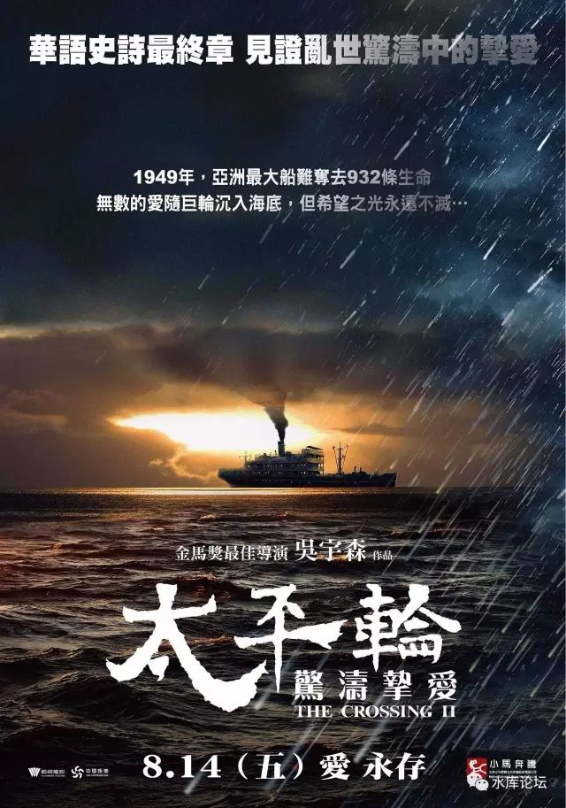 我也很绝望啊 ~\#1280~
===================================================================================================================================================================================================================================================================

 

Q：欧大，新一轮限购升级，破解越来越困难。应该如何配置。

A：我也很绝望啊............

 

 

 

一）新政

 

2017.03.17我们写了《[北京调控政策分析](http://mp.weixin.qq.com/s?__biz=MzAxNTMxMTc0MA==&mid=2651015665&idx=1&sn=f0d2a546c81dde7c1a09828d703dc1ad&chksm=80721fe2b70596f4c0773a755d6b21427920693ef76b4ad41d79235f0d116d354243569d9e55&scene=21#wechat_redirect)》\#1260

日光之下，并无新事。调控的所有"前因·后果"都已经被分析清楚。市场有充分的抗药性。

 

任何人，包括甲方乙方，都清楚地知道，调控不可能使房价降低。

不许买卖，您就多住几个月地下室。等生了小孩总是要买的。

 

 

 

可是我们没想到的是，政策的后劲是很足的。"3.17调控"不是一股政策，而是连续的"十天九政"。

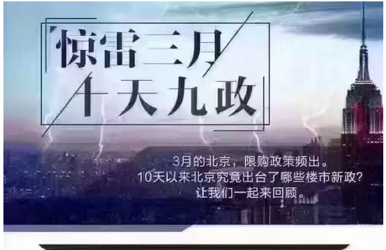

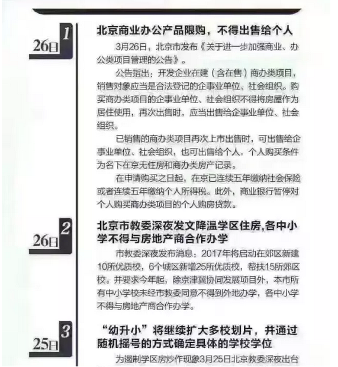

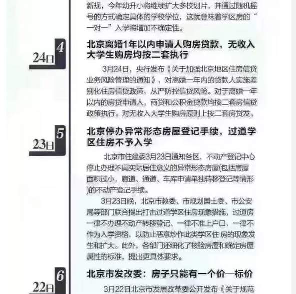

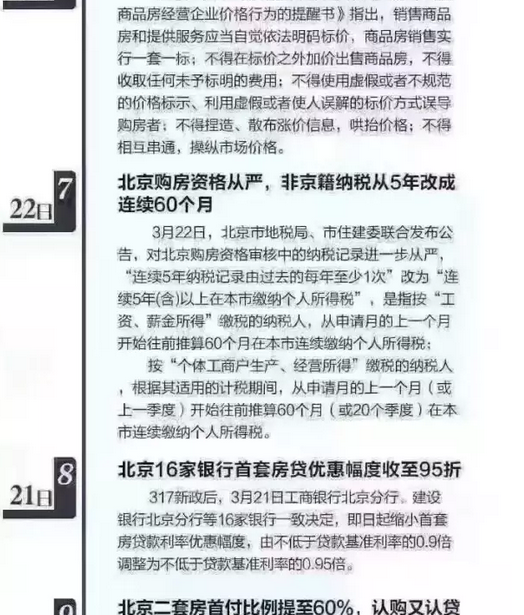

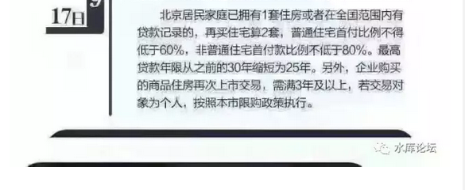

 

 

看到了这么多政策出台。北京的咨询者急了。常规的"招数"不灵了。

 

Ｑ:"离婚购房"大法不行了，怎么办。

Ａ: 破，可以破。

 

Ｑ: 购房资格连续60个月，怎么办

Ａ: 破，可以破。

 

Ｑ: 史上最严"商住限购"怎么办

Ａ: 破，可以破。

 

 

咨询的人二眼放光，泛着白花花的泪光。

"原来都可以破，那您赶快教我们啊"。

"对不起，不教不教。这次真的不能教了"。无论付费私密，任何情况下都不能再教了。

 

 

不能再继续往下教，是因为我感到很"厌倦"。

之前的"离婚单身"，理论上可以辟路。但实际操作中，整个流程十分繁琐。中介小伙甚至要和70岁老太结婚。[\[1\]]

想想都累死人。

 

 

经过了"十天九政"调控升级，目前的政策，仍然可以破。

或者你可以说，"人类历史亘古至今"，你见过没有漏洞的制度么？

但是，我真心感到厌倦。

"破限购"这种事，变得越来越复杂，越来越漫长。整个流程走完，仿佛过掉了大半人生。

对于最后一班未上船的群众，拯救他们真的值得么。必要么。 

 

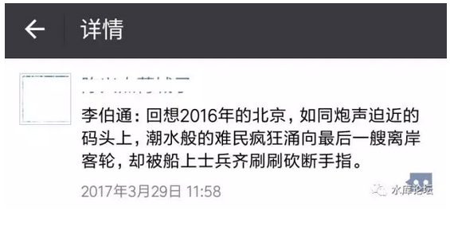

 

 

 从另一个角度讲，也有可能是我"没能力"再教下去了。

我们怀疑多军内部出了叛徒。

 

水库原本是一个极度小众的社群。属于"听说过，没见过"。

社会的主流，多的是年薪20\~30W的小白。

水库这种动辄A8的社群，玛丽苏都不敢写呀。

 

可是，"科学尚未普及"，随着水库名气越来越大，二五仔终于也混进来了。

我可不想让洞全塌光。

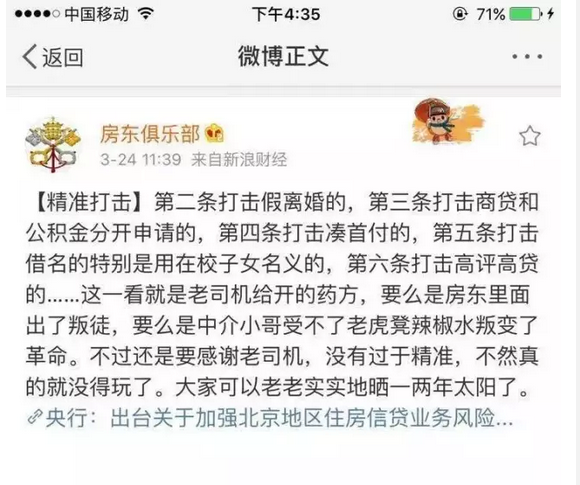

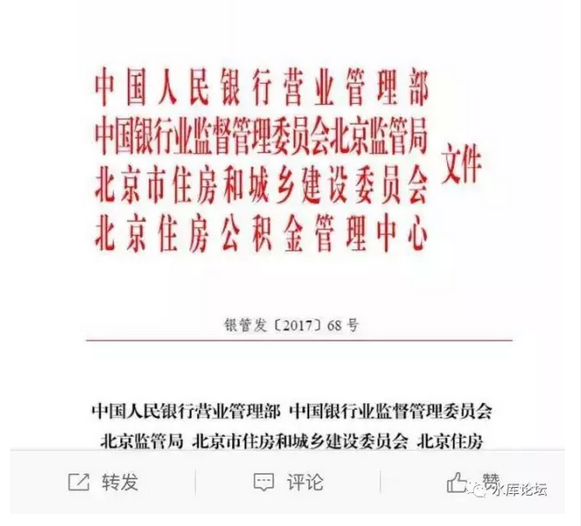

 

燕郊限购的那一天，俺随口说了廊坊办户籍不难。过了一周，三河就开始整顿户籍类中介。[\[2\]]

 

 

唉，无趣无趣。

爱党爱国，紧密团结在党中央周围。

听政府的话，跟着中央走。

没事就别给老大添乱了嘛。乖一点不好么。

 

 

 

二）上船者

 

绝大多数人，都没有搞清楚"京沪房产"的本质。

 

 

我们生活在一个剧烈"通货膨胀"的年代。

从1979年改革开放迄今，货币已经贬值了200倍以上。

哪怕2000年迄今，货币也贬值近5倍。

大约是每年12%的速度。

 

 

 

如果一个人很"勤奋"，很"节俭"。

类似于各位父母的那辈，他们一辈子省吃俭用，不舍得吃不舍得穿。

36元/月的工资，咬牙缝里还能储蓄15元。

 

可是这样一笔"血汗钱"。在30年后，回过头来看是如何呢。

 

没有了，消失了。

被通胀洗得干干净净。

你爷奶一辈，终身的积蓄5W元。你二个月工资就赚到了。

你父母一辈，终身的积蓄100W元。你三四年就赚到了。

 

 

而这个时候，"房地产"扮演的是怎样一种角色呢。

房地产是"保值增值"。

纸币会不断贬值，而砖头不会贬值。或者说，砖头贬值的速度很慢，远远慢于纸币崩坏。

 

如果你父母年代，存钱不是存"定期"，而是存"砖头"。

每一个月末发粮，把工资换成0.1平米的房子。

则他们毕生的积蓄，今天可能价值500W\~1000W。

每一个勤俭节约的人，都应该得到奖赏，而不是被抢劫。

 

 

对于"买房"这种事，买的其实是"保值增值"。

当你的纸币换成"京沪"房产那一刻，他就不受印钞机的威胁。

很多人毕生积蓄换一套房子。其实就是保护了毕生的储蓄。

 

 

 

这件事情，还可以再"继续一步"。

你除了把"当年"之前的毕生积蓄，全部都兑换成砖头。你还可以"贷款"。

好比你一个家庭，月收入5W，月消费2W，结余3W。

房贷上限3W。

 

贷款的逻辑是什么呢。它不仅把你"过去"的收入保值了，它还把你"未来收入"保值了。

 

 

如果你的月供是3W，则意味着物价无限上涨，而你的"月供"基本锁定。

你的未来三十年，未来的泰半人生，你的积蓄是有保障的。积蓄是不受通胀威胁的。

用一句话形容，可以说是"胜利大逃亡"。

 

 

 

我们这个社会，肯定是不断"通胀"的。

从人类有"纸币"这个怪物开始，通胀就从来没停过，没有任何一个政府，可以保持控制良好的财政声誉。

一旦风吹草动，国际变幻。则纸币贬值更快，甚至有可能是今天10倍。

 

 

我们知道，"通胀"肯定是要有受害者的。

通胀相当于一种隐形税收。是民间的财富被搜刮到印钞机，搜刮到中央银行。

 

（财富运转秘诀）

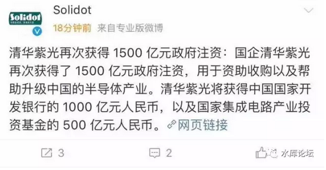

 

 

我们知道，"通胀"肯定是要有受害者的。

哪里有压迫，哪里就有反抗。

最聪明的那群人，逃得最快。

 

可是你也逃了，他也逃了。

谁来当受害者呢。

 

 

 

"限购""限贷"的本质，就是不让你保值。

既不让你保护过去的劳动财产，也不让你保护未来的劳动财产。

 

这个口子一定要开得很小。绝大多数的人得"圈下来"。

如果中产都顺逸逃走了，则底层（人均）负担就会加重。

就和1949年时，绝不允许你兑换金条。原理是一样的。

 

 

如果我们把多军加以分类的话，则多军内部也是分成好几批的。

1.  第一批是元老早期多军，早于2009年（限购限贷前）已建好仓，不仅打光手里的纸钞。而且建好贷款计划，把未来的收入也打了双保险。

2.  第二批是新进多军。时间是2012\~2016之间。在这段时间内，已经有限购限贷，但仍属宽松。花点心思，花点努力，还是可以保护你的过去\~未来收入。

3.  第三批是新手多军。时间是2017年以后才接触房地产的。尤其是"3.17"之后，对于他们来说，开局形势已极度恶劣。

 

 

而如果从政府的层面，政府的态度也是极其明确的。

1.  首房首贷不受影响。

 

 

或者说，任何人都有一次机会。一个人一辈子"仅有"的一次机会。

"首房首贷"，你可以最大化，放大你的杠杆。尽全力保护你的资产。

 

当然，如果有傻空手握着首房首贷的资格，却依然看空房地产。

政府已经[尽全力帮你]了，你却还祈望房价能再降一点点。

那我也没办法了。

 

 

对于泯泯普罗大众来说，未来整个社会的格局，或许就是；

-   每个人可以保留一套房子左右的资产，其他统统通胀拿走。

 

 

 

三）粮票的惩罚

 

如果我们脑洞大开，把事情想得彻底一点。将会怎么样。

 

假设"限购限贷"执行到这样一个地步，你没有任何漏洞可钻。

而通货膨胀又是如此惨烈，每隔三五年加个零（委内瑞拉）。

 

 

到了这种时候，整个国家会呈现怎样一种面貌呢。

答案是：完全没有任何人肯工作，大家抱着团死。

 

你设想一下，假设给你30000元/月的工资。

但是社会上什么物资也买不到。买布要布票，买米要米票，买彩电要彩电票。

 

 

当"票证"制度发展到了极限。也就意味着纸币制度的崩溃。

每多一种限购，纸币的购买力就被削弱一层。

 

如果生活中绝大多数物资都需要"票证"，则赚钱变得毫无意义。赚钱不能改善生活。

没有人愿意好好工作，没有人愿意奋斗。

没有人愿意商业创新，没有人愿意冒险和梦想

计划经济，极度的贫穷。

 

 

任何的限购，都在削弱北京这座城市的吸引力。

如果我做了一个很成功的App，或者是非常优秀的软件工程师。

可是你千军万马商战获胜赚到了钱，却不能买北京的房子。不能享受和消费。

那你还奋斗干什么。

 

 

当中国肆无忌惮地为城市加上一圈又一圈的"限购"。

那些颟顸官员在狂笑的同时，也在损伤着中国经济的活力。

 

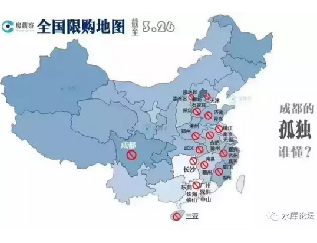

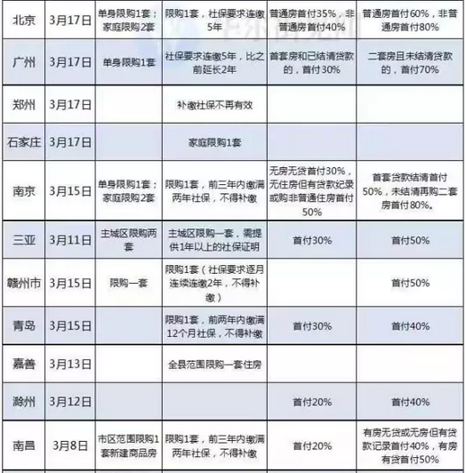

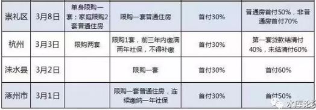
 

 

 

四）结语

 

多军基本上可以分三批。

-   已经上船的

-   部分建完仓的

-   刚到岸边的

 

"限购限贷"的本质，是交易成本。和营业税类似。

当"交易成本"无限大时，已上船和未上船，就成了二个世界。阶级在这一天固化。

 

 

从此以后，"有产阶级"和"桥洞阶层"各奔东西。越离越远，再没有见面的机会。

从纸币的角度看，还是有产阶级更稳妥一些。"货币供应量"很可能再加一个零，看大历史的概率走向。

最后一班船即将启航。没有上船的人，请自求多福。

 

 

 

对于我们来说，人有远近亲疏。

第一批多军，都是老朋友。第二批多军，都是好朋友。

而你是一个2017年的新朋友。

 

面对越来越深，几乎不可跨越的"壁垒鸿沟"。你问我如何保护你过去/将来的财富。

如何成为A8，或者A8.5，如何复制前辈，跨越阶层。

我也很绝望呀。

 

 

战略高于战术。一个好的将军，不会被逼到恶劣的地形进行战斗。今时今日

困兽犹斗，这本身就已经输了。

您早干嘛去了。

我也很绝望啊。我帮不了你。

 

 

 

 

（yevon\_ou\@163.com，2017年3月31日晚）

 

 

 

公告：

 

因上海公安指示（小人举报？），Shuiku.net将重新进行登记报备手续。

水库精神，一向是爱国爱党，紧密团结在红心周围。中华民族利益高于一切。

 

希望Shuiku.net恢复服务之后，大家珍惜大好局面。多谈风月，少谈楼市，不要给领导们添乱。

 

本公众号亦会转变风格。预计先更几篇\#F小说类，经济原理类。

低调低调。

 

 

[\[1\]]《中介乱象：为卖房  中介小伙和客户结婚4次  包括70岁老太》http://tv.people.com.cn/n1/2017/0329/c39805-29177329.html

[\[2\]]《严禁炒房、散布谣言！廊坊一家中介被河北住建厅约谈通报》https://view.inews.qq.com/a/20170330A09G0H00?cv=0x70000001&dt=6&lang=zh\_CN&pass\_ticket=8FFq1JSyPlCDfXnU5ufjFa0LRRlU4Ols4uHlXF4aJvRUmR%2FCjukP95n%2BsdDxaOPw
