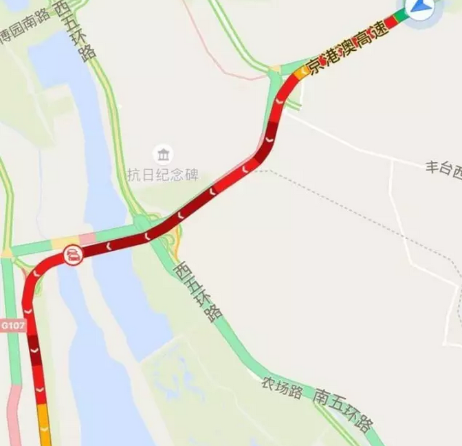
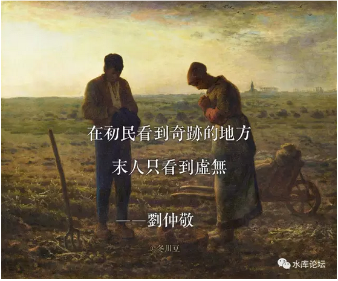
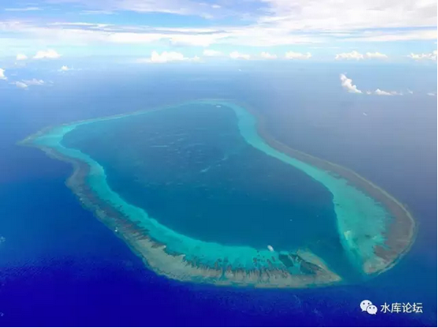
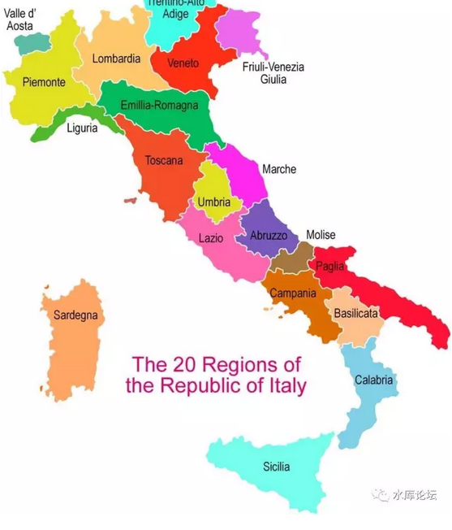
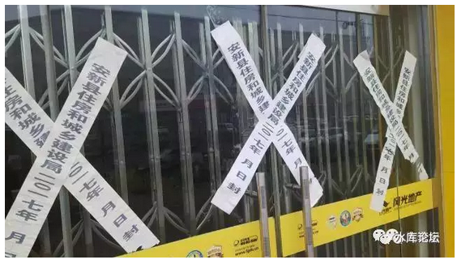
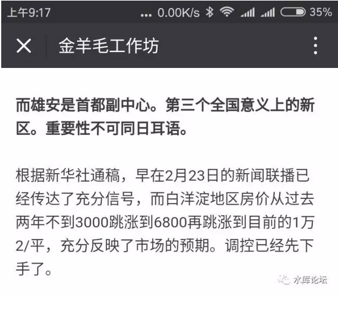

# 职业炒家会杀向雄安么 \#1290

yevon\_ou [水库论坛](/) 2017-04-02

职业炒家会杀向雄安么 ~\#1290~
========================================================================================================================

 
=

民生证券房地产团队到容安雄三县进行了深入的调研，调研下来我们认为三个县里面，安新离白洋淀最近（301医院要在此设疗养院），容城交通最便捷（南边是高速，北边是通往天津和保定的高铁），雄县基础设施最好，路最宽。目前三个县都已经冻结全部房产过户，本地人外地人都不能买了。北京的限购比起容（城）安（新）雄（县）来简直是小巫见大巫。在安新调研之后我们发现这边商品房一律停售，二手房中介全部关停。在建的房子一律停工，农民也不允许自建房，村口设卡禁止建材入村。建材商也不允许在辖区内做生意。

 

 

 

一）威尼斯

 

在分析雄安之前，首先我们要讲一个故事。一个关于水城"威尼斯"的故事。[\[1\]]

 

 

AD476年，西罗马灭亡。

但是中国人不知道的。罗马人并没有全部死光。

 

在罗马的东北部，有一支非常小的难民团在逃难。

他们的处境非常恶劣。因为其北面，是匈人的劫掠骑兵。骑兵移动力极高，一旦被追上，所有的罗马绅士都会被售卖为奴隶。

 

他们也不能向南逃。

南边是另一支蛮族军队，汪达尔人。挥舞着黑粗的鼻毛。

被Vandalism追上，下场只有更惨。

 

 

眼看二支追兵越追越近。残存的罗马人慌乱之余，他们向大海的方向奔去。

没错，就是大海。那茫茫的大海。

 

这个时候，神迹发生了！

残存的罗马人，幸运地发现，这一片海的深度很浅。而且又处于退潮时期。因此他们在海中走了很远。渡过片片沼泽。直到找到一个潟湖（读：xi）

 

 

潟湖是什么东西。来来，我们上一张图。

 

Oh，sorry，图拿错了。这张是中华人民共和国神圣不可分割的国土："黄岩岛"。

据说目前整个潟湖，已经从水下走上了水面。

整个岛屿，已经被中国人息壤成了一个巨大的工地。连机场都造起来了。

 

 

这张才是威尼斯的地图：

 

 

以及威尼斯在意大利的位置。东北角紫色的。

 

 

此后的故事，大家也都知道了。

经过了近1000年的繁衍生息。威尼斯逐渐成为了重要的城邦。

 

而其特殊的地理位置，商业文化，血脉和精神。

威尼斯成了14世纪最强大的国家。鼎盛时期，垄断了整个地中海的海军。

是不折不扣的强权。

 

 

威尼斯对文化和文明的保存。

使得14世纪"文艺复兴"首发于"佛罗伦萨\-\--威尼斯"一带。

为西方文明的复兴，打下了根基。

 

 

 

二）初民

 

我们讲这个故事的目的何在。在于引出一段话：

 

在初民看到奇迹的地方

末人只看到虚无

 

 

纵观史书，我们常常感到疑惑和迷惘。

兴亡，衰败，如何轮换。

罗马兴起时天下无敌。到末期空有大量领地，却连几千蛮族都打不过。

 

英伦三岛，地理上是"天涯海角般"遥远农业落后的小岛。

却爆发出"工业革命"，最终成长为日不落帝国。

 

 

西班牙以残暴出名。皮萨罗征服印加帝国，科尔特斯征服Aztec；

随着新大陆三大帝国全面沦丧，西班牙获得了海量一般的金银，国力急剧上升。

 

当时，英国人还没有击败"无敌舰队"。

因为害怕西班牙势力。英国的"美洲殖民者"只能尽量往北走。最终在极为寒冷的北美登陆。（现在纽约附近）

而不是流淌着奶和蜜，遍地是黄金和白银和香蕉的中南美洲。

 

事实的结果呢，500年之后，建立在北美的United
States成为了全世界最富裕，最繁荣，最强大的国家。

而空有资源富饶的墨西哥，却穷得天天要偷渡，做佣人。

 

 

我们看了那么多的史书，最终只想问一个问题：

 

一个城市，一个民族，一个文明，他想要发展起来。

最终依靠的是什么。

 

 

幸运的是，对于这个问题。我们并不是简单地抛出一个问号就撤了。我们是有答案的。

答案很简单，只有一个字：

 

德

 

 

三）何谓德

 

德，道德品德。

或曰信仰。

 

什么叫做道德。

凡是从事伟大的事业，必定先有伟大的理想。

 

 

Baptist清教徒来到美洲大陆，他们不是为了营营碌碌唱二人转。他们是为了"伟大的理想"。

当时，在清教徒看来，欧洲大陆有很多事是做得不对的，是邪恶的，是违背了道德的。

 

但是他们也无力推翻国王。

因此他们逃到New World，试图在新世界建造一个没有压迫的天堂。

相应的，他们把欧洲世界称之为Old World。

 

 

假如你不能理解这段话，那么你想象一下，欧洲大陆现在是"白左上台"。

-   彪形大汉可以进女厮所。

-   穆斯林可以强奸瑞典幼女。

-   任何人不许骂绿教。

-   LGBT，黑命贵泛滥。

-   圣母婊，环保婊，猫狗怜悯党泛滥

你如果生活在欧洲，你也会逃出来。

 

 

我们再回想一下，"深圳"当年崛起时的样子。

史诗中唱道："一九七九年那是一个春天，有一位老人在中国的南海边画了一个圈"

 

当深圳崛起时，中国的口号是"改革开放"。

"开放"，我们已经领悟是什么含义了。

"改革"，需要30岁以上的人生阅历才能参透。

 

 

"改革"甚至比"开放"更重要。

体制之痛，痛彻透骨。

 

 

当深圳刚刚开始"改开"的时候，深圳的土地是几乎白送给港商的。

当时对"港商"的要求；

-   我可以不要你的土地出让金

-   只要你带来最先进的文化

-   最先进的技术

-   最先进的企业管理理念

-   国际贸易的窗口

-   学习与国际交流的窗口

 

 

当深圳刚刚开始"改革开放"时，他的德是非常非常高的。

或者说，当时的领导人，他的理念是非常非常高的。

 

领导人是站在一个非常非常高的高度上，以大历史的眼光看待国门开放。

气势宏伟，布局深远，不计较一亩一地的得失。

融入全球贸易分工产业链，WTO承接发达国家技术转移，逐步升级。这个才是真正的国力生产力。

 

 

好了，现在让我们看看"雄安新区"

 

目前三个县都已经冻结全部房产过户，本地人外地人都不能买了。商品房一律停售，二手房中介全部关停。在建的房子一律停工，农民也不允许自建房，村口设卡禁止建材入村。建材商也不允许在辖区内做生意。

 

 

 

四）雄安

 

如果你让我经营"雄安特区"。我会如何安排。

我想，我可能会先争取"自由贸易权"。在这片土地买卖一定是自由的，dT\>0是奥派最最在意，财富的源泉。

 

 

其次，我希望一些"免于调控权"。

不要让国家各部委枉事添乱的政策，伤害到劳动和创新。

白洋淀本是一片水塘，没什么可失去的。您放手不管，也没有税务损失。

《劳动合同法》最好也不要管到雄安来。

 

 

 

哪里有自由，哪里就有繁荣。

当年深圳从一片"国营经济"中杀出重围，只有深圳可以自由办企业，自由创业，甚至创下了四天一层楼的"深圳速度"。

 

对于新区开发，原理是一样的。我并不需要你￥10000 00000000元的投资。

你只要给我自由。"部委"管得少一点。

不尚贤，使民不争。为无为，则无不治。

 

 

 

而我们现在看看，"雄安新区"都干了些什么。

-   在"雄安"政策宣布之前的二个月，当地政府就冻结了一切的户口流入。

-   停止一切"一手房/二手房"买卖。

-   合法的中介店勒令关店。

-   建材商禁止把建材运进雄安，在关卡设置路障。

 

当地管制全心全意的全部心思，都放在防止"炒房"上了。

 

对于雄安官员的三观理解，"发展经济"或许就等同于炒房吧。

 

河北人才是[骨子里]的炒房客呀。[\[2\]]

 

 

 

五）商人

 

如果你要问我对"雄安"的态度，那就是毫无兴趣。

 

 

你要说，"雄安新政"的核心，是没有限购限贷，没有营业税，坚固保证私有财产。保护处置和变卖权。

那我对雄安有兴趣。

 

如果你说，雄安的卖点，是投资了10000亿。然后当地的官员，就象土财主一样，牢牢把宝贝攥在手里。

那么我一点兴趣都没有！

都说"投资不过山海关"，东北振兴还投了1.4万亿呢。怎么没人高兴去东北。[\[3\]]

 

 

如果要说"单位面积投资最大"的话，则中国最大是汶川。

弹丸之地重建投资1万亿。

然并卵。[\[4\]]

 

 

想当年热捧"西部大开发"时，东南沿海的商人去西部洽谈投资。

西部官员说，"你来我们县，保证咱们县只有你这啤酒能卖。其他所有牌子，统统都打出去"。

 

东部商人一听，头也不回，扭头就走。

为什么，因为这是"理念"的差距，代际的差距。

"地方保护主义"就是你贫穷的根源。现代商业法治就是你致富的秘方。

这是整整一代的思想逆差。

 

 

如果雄安的官员表示他们尊重"自由贸易"，尊重"私人产权"。

能刹得住政府那只乱摸的手，让商业和交易自由进行。

则雄安自然可以雄起。平地上崛起座座金山。

 

 

如果雄安的官员满脑子"小农思想"。

目无法治，见利忘义。有利益而无规则，有蛮横而无道义。

则你这块土地，注定是失败的。

中国的"国家级新区"，难道还少么。[\[5\]]

 

 

 

六）职业炒家

 

很多人都误解了"职业炒家"。

在河北农民级的官员心中，他的思想还是活在上个世纪的。

 

他认为的"三观"，或许是：

-   房价是炒家炒起来的。

-   雄安变新区了，就要藏着掖着不能让炒家赚到了便宜。

这种人，是经济学上的文盲。

 

 

事情的真相是：

-   从来不存在炒家，只有价值的发掘者。是商品本身"物超所值"

-   没有希望的城市，没有炒家。

-   你越是朝令夕改，你越是没有希望。

 

 

穷山恶水出刁民。不懂得商业文明，却只想着把雄安的土地卖最大化。

逮着蛤蟆攥出浆。

河北人民嘴脸如此不堪。你请我去，我还没兴趣呢。

 

 

 

 

（yevon\_ou\@163.com，2017年4月1日晚）

 

 

 

 

 

[\[1\]]《水城威尼斯的木桩地基，为什么在千年后不腐烂，反而愈久弥坚呢？》https://www.zhihu.com/question/20014361/answer/150437977

\[2\]《惊！白洋淀神话升温？破灭？》https://mp.weixin.qq.com/s?\_\_biz=MzI3NDQ0MjkzMg==&mid=2247484374&idx=1&sn=aeb8b67e7736a406139d6e6733710005&chksm=eb12bc0ddc65351bd03b231844f22358a90b495d55e24efa67106fddb50e16cbf428fa021e14&mpshare=1&scene=1&srcid=0401cbFob68Z4wmr5dumtgHq\#rd

\[3\]《朋（qi）克（pa）的沈阳人买房指南》https://www.douban.com/note/612416511/

[\[4\]]一笔糊涂账

[\[5\]]目前一共有17个。见《[城市规划导论（三）](http://mp.weixin.qq.com/s?__biz=MzAxNTMxMTc0MA==&mid=401002514&idx=1&sn=0f99070edf8ec7390c1c5b987f446f5b&scene=21#wechat_redirect)》\#600
