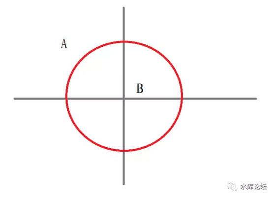

# 降维攻击 \#1310

原创： yevon\_ou [水库论坛](/) 2017-04-05

降维攻击 ~\#1310~
=================

谨以此文，献给朱红之泪《过往之事，再无新奇》系列

 

 

 

一）前言

 

上周我在长沙吃宵夜小龙虾，一边冰饮一边刷贴。无意中刷到朱红之泪写的《过往之事，再无新奇》（上），不由得拍案叫绝。

 

他这一篇写得很好。俺对长沙的分析也不用写了，珠玉在前。

 

但是，我又觉得他话讲得不透。

至少可以从另一个角度再阐述一下的。于是我耐心等他（上中下）三篇写完，到今天再开始写《降维攻击》。

 

 

什么叫降维攻击。如图；

请问，一个身处A点的人，如何进到B处去？ 

答案非常非常简单；"跳进去"。

从原地跳起来，一个虎跃，跳进去。

 

这个问题的答案，就在于把"二维"的问题，转换成"三维思路"。

在二维情况下，问题是无解的。A永远到不了B，有一圈红色的护城河挡着。

可是三维的情况下，A轻松跃过。

 

 

在北京待得久了，染上了北京PE/VC圈的一些坏脾气。

互联网思维那帮人，最喜欢讲的就是"降维攻击"。

你是一个老牌知名度很高的牌子，卖可乐我永远卖不过可口可乐。但是我可以卖喜茶呀，喜茶卖完卖丧茶。丧茶卖完了可以卖"丝袜奶茶"。

 

 

淘宝干翻了全国零售业，京东靠补贴干翻了全国电商业，滴滴干翻了全国出租车业。靠的就是"不和你一个维度竞争"。

我们卖的是替代产品。

三维产品。

 

 

 

二）降维攻击

 

为什么突然想起来讲这个话题呢。

因为房地产行业，它其实是一个典型的"降维攻击"行业。

 

 

最简单一点，假设你站在懵懵懂懂的2005年关头。

我问你"房价是涨，还是跌"。

"现在要不要砸锅卖铁，去买房子"。

 

你或许会二眼一抹黑地说："什么是买房子"。

"妈妈关照我的事，最重要的是读大学"。

"出国留洋，海外文凭"

"找个好工作，积蓄买余额宝"。

 

对于当年懵懂的你，或许不知道人类历史上"最大"的一次发财机会，就在你身边偷偷溜走。

在那些年代里，哪怕别人告诉你。你也不知道，也听不进去。

 

 

 

但是，在2005年，有一个特殊人群。他们是懂的。他们是知道房地产全部规律的。

哪怕房价已经涨了3倍，房价还可以再涨5倍，合计15倍！

什么人如此大胆，胆敢说出如此惊天预言。

哦，说穿了毫不稀奇。"经历过了"的香港人，台湾人。

也包括部分对香港楼市极为熟悉，香港历史极为熟悉的大陆人士。例如哥哥。

 

 

 

对于香港人，台湾人，他们从人均GDP3000美金\~12500美金的历程中，所发生的一切，全部都经历过了。

"日光之下，并无新事"。

 

对于香港人，他们很清楚地知道，GDP3000美金时，现代零售业，超市业开始逐渐起步。

GDP5000美金时，"吃"已经不是主要问题。家电消费成了热潮。

GDP7500美金时，房地产开始起步。而且雪坡漫长。

 

 

 

在香港，有所谓的"楼价学"之说。

楼价学，并不存在于任何殿堂学院。中文大学系不会有教授传授。

"楼价学"纯粹是民间智慧。市井口耳传说。

 

其中很有名的一条，叫做"升完仲可以再升"。

哪怕五浪衰竭，专家信誓旦旦一切利好出尽。

楼市专治各种不服。无风无浪帮你再拉一波狂潮大涨起来。

 

香港楼市，从1960年开始起飞。前前后后一共涨了约200倍。

你看到楼市涨了3倍，千万别尖叫。

千万别说"泡沫"。

后面还有67倍。

 

 

 

同样的道理，当香港人来到大陆，看见大陆的房价涨了三倍。

大陆人纷纷叫嚷，"泡沫，要崩盘了"。

 

香港人，台北人，会感到很疑惑。

"真的会崩盘么"。

"按照HK的经验，好像不会呀"。

"按照台北的经验，好像还要涨三倍呀"。

 

 

 

三）二线城市

 

同样的道理。今天我们不是来吹嘘，不是来嘲笑过往傻空的。

我们是说，当上海人来到二线城市，我们感受同样的降维预知。

 

 

我曾经有句话，上海就象20年前香港。

重庆就象20年前的上海。

 

 

日光之下，并无新事。

各个城市的走势，乃至于各个国家的产业升级次序。都是极度相似的。

游戏规则就这么几条，玩法套路也就这么几套。

 

-   上海从2000年开始启动的楼市行情。高度类似于香港1984年。

-   重庆从2016年开始启动的楼市行情。高度类似于上海2001年。

 

 

因为有历史和经验，使得我们对楼市的分析，有了极大的裨益。

2000年开始的上海楼市大涨，起因，阶段，结果。旁人看得若云里雾里，我们看得脉络清晰无比。

当年香港怎么走，香港人怎么呐喊，香港人怎么傻空。二个城市几乎完全一样的，重蹈覆辙。

 

 

 

从2016年开始，由于上海严格的限购。以及上海房价已经非常非常昂贵，和内地渐渐形成了10:1的价差碾压优势。

上海人逐渐走出上海，跨入全国各地。

 

一个普通的上海市民，卖掉一套老破中获得五百万。

跑去内地省会城市，就是不折不扣的王老五。土豪+金主。

这是俺吃小龙虾时的体会。

 

内地省会城市的生活，有个几百万现金。真的很滋润啊。

滋润得就象香港人当年进大陆，个个都被当作富豪。

 

 

 

四）二线城市的碾压行情

 

相应的，上海人接触迈入二线城市。若稍许花点心思，应该可以比"内陆土鳖"获得多得多的信息预判。

降维攻击，碾压优势。

 

 

当我2016.08开始写《[重庆卷](http://mp.weixin.qq.com/s?__biz=MzAxNTMxMTc0MA==&mid=2651015216&idx=1&sn=97469f3c6465a10b292bfe74afb57ed6&chksm=80721e23b7059735a454fb02ded0b397857082089b79ae976e2bcdb3155aeec83c0d2cde5856&scene=21#wechat_redirect)》时，后台留言就从来不乏"重庆中介"的冷嘲热讽。

归纳他们的发言，不外乎；

-   你们外地人不懂我们重庆的楼市啦。

-   重庆库存这么高，涨不起来的啦

-   重庆特有的地票制度，领导英明，永远只会8000/m啦。

-   你们外地人怎么专买南滨路，北滨路。重庆人不喜欢啦。

-   重庆人喜欢买渝北新区，喜欢买商铺。

 

哥哥冷眼旁观，暗自写下二字评语："SB"

 

 

当京沪的资深炒家来到重庆时；

他们相对于当地土著的见识，几乎是全方位碾压。

 

 

什么"万年不涨"，你懂个屁。涨起来让你妈都不认识。

什么8000涨到10000，就急着要抛，落袋为安。赚十几万小钱就捏不住。你懂个屁。真涨起来的涨幅，让你妈都不认识。

 

什么购买力最多承接到20000，你懂个屁。过二年玩个80000/m的房子给你看，你信不信。

什么涨了一年就喊风险，你懂个屁。你知道大牛市可以捏多久么。

 

 

-   限购限贷之后，房价会涨还是跌。

-   营业税之后，房价会涨还是跌。

-   加息之后，房价会涨还是跌。

这些问题，内地小白们都不知道。或者会给出错误的答案。而大城市来的高阶用户们，却开了金手指都知道。

 

贷款要贷到尽！！

 

每一次判断，你都会惶恐，都会输。

每一次判断，我都有经验，都会稳。

以先知对无知，就是碾压，就是屠杀。

我毫不怀疑[重庆土著中介]未来还有无数次怀疑人生，每次涨了+50%他就要心脏病发作，紧张痉挛是不是得赶紧抛落袋为安楼市快崩盘了。

朋友，见过Money么。

 

 

日光之下，并无新事。

对于人口1000W以上的特大规模城市而言，我们相信"运行"的规律都是类似的，至少是脉络类似的。

当你携着"20年上海楼市经验"，来看待CopyCat内陆楼市。自然会占尽信息和技巧上的优势。

 

 

 

五）长沙和雄安

 

同样道理，朱红之泪花了三篇的篇幅，来写长沙，成都和雄安。

他取的题目是《过往之事，再无新奇》，而我想说叫《降维攻击》。

 

 

对于长沙，成都，雄安这些市政府的玩法。其实套路都是一样的。

都是学上海浦东的，并没有太多的创新和革新见解。

 

具体的做法，都是"造新区，建新城"。

所谓的新区五部曲：湖光山色，政府大楼、图书博物、规划展览、工业园区。[\[1\]]

 

 

 

而从"炒楼学"上讲，新区一般都很贵。

新区政府，才是真正"炒房子"的。骨子里的炒楼客。

 

新区一开盘，KFS就把价格提到了脖子口。鸟不拉屎的地方，和N年后建成的市中心一样价钱。

但是KFS也没赚钱，因为拍地贵。

真正赚钱的，只有土地一级市场。

 

 

当长沙，成都，雄安等地"规划区"一公布。

自然会有一群"新房癌"，连夜开车赶往这一片"希望的田野上"。

土豪的钱好像是烧不光的。

韭菜的数量似乎永远也收割不光。东北，山东，山西，源源不断贡献着盲目的买家。

雄安居然已经有人高看5W的了。祝福，走好。[\[2\]]

 

你炫耀的始终是你的成本，而不是你的涨幅。

 

 

 

六）结语

 

炒楼是科学，

科学

科学！

重要的事情讲三遍。

 

 

在我们这一行，赚钱既很容易，又很不容易。

容易的是，只要你认认真真去做。"已有之事，后必再行"，地方政府可选的套路是极其有限的。

历史的分岔路，也是极其有限的。

 

 

如果你有"一线城市"的记忆。

"二线城市"大概率会复制一线城市曾经的走势。只不过时间拖后十几年罢了。

预知未来，赚钱不难。

碾压土著，降维攻击。

 

 

 

但是，炒楼是一门严肃的，专业的活。和工业工程师并无二致。

那些头脑发昏，只知道买买买CEO盘。烧现金全款的土豪，他们仅仅是"贵妇流"。

 

我唯一头疼的，是三五年之后，雄安鬼城。无知小编又要写"炒楼客魂断折戟"。

亲，他们和我们真的不是一路人。 

 

 

 

 

（yevon\_ou\@163.com，2017年4月4日晚）[\[3\]] [\[4\]]

 

 

 

[\[1\]]朱红之泪原创。https://mp.weixin.qq.com/s?\_\_biz=MzU1MTAxODc4OA==&mid=2247483845&idx=1&sn=b4703fc5cb4186d7c38367ec31f8a6f5&chksm=fb96898ecce10098493c61c7a5b39cd04cd42eeee4e1227eff8af2d505fbd027ac9762ef0b73&mpshare=1&scene=1&srcid=04047UOomGgb1t7n9enoLK7S&pass\_ticket=Xh8wtArJMZWCPiziBAA6G73pZ4R74vBGYsC3O6oWH1KpUVp2TYD7iiF3iFAa724P\#rd

\[2\]《雄县居民相信\"五万一平不是梦\" 有卖主开始违约》http://news.jstv.com/a/20170404/1491287119912.shtml

\[3\]雄安CBD的位置好像出来了，见《雄安新区规划图出炉，堪比超级故宫！！》http://www.suilengea.com/show/xabndxavi.html

\[4\]下一篇真的开始写\#F了，不嗑叨楼市了。避避风头。
