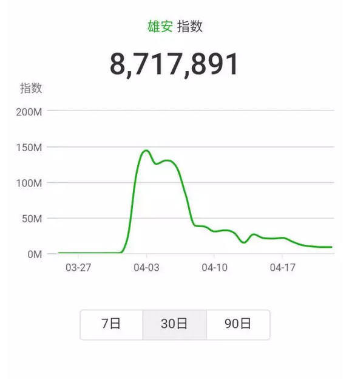

# 近期小密圈问题荟萃 \#1340

原创： yevon\_ou [水库论坛](/)

**水库论坛**

微信号 Shuiku-net

功能介绍 科学尚未普及

2017-04-25

近期小密圈问题荟萃 ~\#1340~
=======================================================================================================================================================================================================================================================================

 

熟悉水库的朋友们都发现了，近期Shuiku.net流量巨减。

不仅水库减了，甚至连"分答"的问题都少了。由以前每天10个，缩减到不到5个。

 

造成这些现象的原因，是因为日新月异的互联网，又出了一样新东西："小密圈"。

[小密圈]是一个微信公众号。也可以下载一个App。

 

小密圈的功能，类似于一个"付费的微信群"。

有了这个产品之后，私聊基本就在小密圈里面进行了。

 

（有意者扫码入群，收费群不便宜）

 

 

 

按惯例，我们也会定期披露一些小密圈的帖子。供大家分享。

 

1)「提问：  哪些房子升值潜力大?

房子所属板块会在近期发生质变的地方，房子升值潜力大。

我的问题是看一个板块是否会发生质变，最重要的观测指标是哪些? 」

A：被城市包进去

 

 

2)「匿名用户提问：欧神，都是新房你觉得，大渡口地铁房（20km）的单价是北滨路江景房（5km）的百分之多少比较合理？」

 

A：参见上海

5km 静安寺

7.5km 徐家汇

15km 莘庄

22km 九亭

你说2000年差几倍，2017年差几倍。

 

 

3)「匿名用户提问：欧大，在同一个盘高层塔楼和花园洋房优先选择花园洋房是吗，我感觉重庆似乎高层楼远胜花园洋房，花园洋房增值比塔楼更快吗？」

 

A：容积率。

你占多少地，别人占多少地。

不可复制。

 

 

4)「提问：  欧神，关于房子的价值，有估值模型吗？还是凭感觉，就像看到美女眼前一亮一样，看到后让人激动不已的房子就是价值被低估的房子? 」

 

A：市场经济的原则，就是市场说了算。

因此无论任何估值模型，都不如看房200套。

 

 

5)「匿名用户提问：欧大，请问你怎么看未来几年的信贷情况？作为二套改善，明显感觉到了银行的各种恶意，又害怕自己是只见木不见林。特此请教谢谢。」

A：一个人的奋斗啊，既要看个人的努力，也要看历史的大趋势

 

 

6)「提问：  欧大，您同意菜菜说的，京沪只剩3年关窗期，可我该怎么办？娃儿现在初三，以后要去京沪大都市发展，咱得给娃儿预备个房啊，没京沪。」

A：想多了，你只要关注财富增长速度就够了。

 

 

7)「匿名用户提问：欧神下午好，我是北京人，打算在外地购房，资金500w，目标城市有燕郊，重庆，长沙，嘉兴，南通，请欧神按投资价值给排个序，怎么组合比较好？谢谢」

A：除了燕郊外，任何一个城市都装不下500w现金，池子太小。

 

 

8)「匿名用户提问：夫妻两人都在上海工作，两个孩子在上海读私立，由于没上海户口教育和医疗是一笔大投入。但有北京户口有海淀区对应二流小学学区房，夫妻有一方曾在北京生活过10年，本科研究生3年工作在北京。上海的民办小学吃香花钱都不容易进，除非办居住证读菜场小学，以后考试还是去北京.北京跟上海好像不同，公立要吃香点。有必要全家考虑去北京吗，一方面教育与医疗都有些保障。唯一一个问题北京的房子比较小（但以后可想办法克服），就是雾霾怕影响孩子健康，主要看怎么对孩子的成长最有利，大人可吃苦可做牺牲」

 

A：大人赚尽量多的钱，以后你小孩就是赢家。

而不是大人围绕着小孩读书，规划职业发展。

这注定是低回报，甚至负回报的做法。

 

至于上海民办，真心不难考。

你只要同龄人Top 10%，就可以闭着眼睛进任何一家民办。

很难么，这点志气都没有么。

 

 

9)「匿名用户提问：欧大，今天有穷亲戚主动说借钱给我，问我愿意年底给他多少回报？5万10万的那种小钱。我该怎么回答他？2%月利率怎么样？太高了吗？值得吗？」

A：一般是年8%

 

 

10)「提问：  欧神，刚才老乡会有个60岁老乡，把北京朝阳管庄附近1980年的49.46平米的房子卖了287万。请欧神点评这个动作。他们打算去通州买。当然，现在只是在看，还没有买入。求大神点评」

 

A：如果拿回老家，就可以过地主翠花生活。

都几十岁人了，再打拼通州干嘛。

 

 

11)「匿名用户提问：雄安附近文安县城8000元／平的房子能买吗？」

A：微信指数: 雄安，自己看。

 

（不足高峰期5%）

 

12)「匿名用户提问：请问欧大，内环老房子收益率比得上外环吗？」

 

A：关键是价格。

最好的房子往往是涨幅最差的房子，例如ceo盘

 

 

13)「提问：  下一波上海涨起来是会从内环先涨逐渐扩散到外环外还是倒过来外环外先涨」

 

A：从来都是外环拉内环

 

 

14)「匿名用户提问：欧大，买个赵巷大虹桥1300w的别墅，在链家上查了下，毛胚租金只有一月1w，还有6到7家在排队出租，心中很是忐忑，如何破？谢谢」

 

A：买卖是买卖，租赁是租赁。别墅不是拿来租的。

有心力的话，可以兼职做民宿，爱情公寓。

 

 

15)「匿名用户提问：欧神，目前看中南京一个纯地铁40年4.8米挑高公寓，现在目前呢确实南京政府已经不批4.8米的商业公寓了！这个挑高公寓周边的二手公寓位置较差的租金已经能够覆盖月供，30平米，毛坯总价约70万，回报率约6%，欧神先生能买吗？」

 

A：一般没兴趣。都是吹

我赌一元钱。你的这些资讯，都是售楼员和你说的，而不是市场上问来的。

 

 

16)「匿名用户提问：请问欧神，北京25年以上老破小能抵押贷款吗？」

A：看ICBC皇恩大赦窗口

 

 

17)「匿名用户提问：欧大： 感谢指点，追问一下，因我从事的行业原因，可以稳定地做到把每套买来的房子月租金覆盖60%-100%的月供。（16年所买房均价2.7w左右）1.是否可以因此不断吃进？ 2.房票原因是否大面积低单价未来升A9更快？感谢！ 」

 

A：1) 难的是首付，从来不是租金。

2\) 难的是首付，从来不是租金。

 

 

18)「匿名用户提问：美国说要缩表，是真的吗？我们今年也说要缩表，一季度是缩表了吗？ 」

A：答过了，智商税

雄安难道不需要建设了么。

 

 

19)「提问： 
RMB贬值这条主线的确没问题，但中国的政体是否潜在风险偏大，是否海外投资30%，搞个移民抗风险?欧神有政体政策方面的预测分析么? 」

A：海外风险更大，亲

 

 

20)「匿名用户提问：欧神，为啥你说海外风险更大？」

 

A：慢性病也是死人的。

因为涨得慢。

和存银行同理。

 

 

21)「匿名用户提问：人民币贬值的问题欧神看到多少之前贬值100没理解是100%？」

 

A：汇率已经获得共识了。

蒙代尔三角形放弃哪一边？

 

（指保汇率还是保房价。答案肯定是二者都保，放弃外汇管制）

 

 

22)「匿名用户提问：欧神好，16年以来，很多三四线城市的涨幅高达70%，如张家口、沧州、衡水等地，而当地人均工资仅仅3k左右，在这种很难覆盖月供的情况下，很可能会加剧人口流出选择大城市就业，未来三四线城市房价会跌会不会是大概率事件？请教欧神怎么看」

A：大城市收入更不能覆盖房价。

 

 

23)「提问：  欧神您好！我周围好多朋友去西双版纳买房子，值得投资吗？ 」

A：孽债

 

 

24)「匿名用户提问： 5000w之前不能辞职。另，每一分钱都是用心灵折磨换的。------这是为什么呢？为什么不鼓励提问题的人找个社保公司代缴？他如果一个月做点别的类似淘宝店的生意或者其他无风险无资金的创业，一个月稳收入5-6万，那么，上班的意义在于什么？记得欧大也是早就辞职了，却鼓励我们这些人上班？？上班不是浪费时间的事吗？你的文章写，"真正勤奋的人是不上班的。"谢谢 」

 

A：因为辞职是一件耗费心力的事。

0---\>5000w过程中，最容易瓶颈短缺的，其实是心力。

 

和家里每一个人都吵过了，翻脸扔瓶子。

通讯录400个电话一个个打过去，每人借10w。

每一只都是小猪，都舍不得杀。而出账无数，绝望。

 

这种情况下你还要辞职，还要尝试孤苦无依脱离体制的痛苦。你心力够用么。

 

 

25)「提问：  那我直接这里说好了。挖到一款不公开发售的保额100-2000万杠杆1:1000的无捆绑纯消费型意外险。完美解决你在《炒房中的保险》问题。因为担心你认为是广告嫌疑所以想先发资料给你看看，微信没加。只能这里提问了。」

 

A：没兴趣

同一个时代，保险公司都是一样的。不可能有颠覆性的产品。

 

 

26)「匿名用户提问：欧大，+35%是您认可的脱离成本区，这个+35%数字怎么计算出来的；另外，+35%是基于什么的基础上呢？A. 买入价？B.买入价+税+中介费？」

 

A：1) 脱离成本线=永远也不会亏钱的价格

2\) 楼市最大回撤30%

 

 

27）「提问：  欧神说了这么多的买入信号，没怎么说过卖出信号。外汇操盘的经验可以融汇贯通其中吗？哈哈」

A：楼市不言顶

 

 

28）「匿名用户提问：欧神，老公说我不务正业，让我搞清楚，到目前为止，支撑我们生活的还是工资！支撑买房子还房贷的还是要靠工资，我该如何回应他！」

 

A：赚个200w扔他脸上。

"10年工资还你"

 

 

29）「匿名用户提问：请问欧先生 办信用卡是先把一张卡养大再批量申请其他银行，还是反之群养 」

A：一般还是数量强于质量

 

 

30）「匿名用户提问：在中国所有楼市中，欧大独独挑了重庆，是出于其经济来考虑，还是也有政治因素？如果今日成都和重庆价格持平，都是1万左右，或者一万出头，你会改推成都吗？上海超过香港有其政治因素，政策因素，重庆呢？」

A: cq可以打三到四颗星

是中国唯一打四星的城市(四个理由)

绝大多数城市，一颗星也没有。

 

 

31)「匿名用户提问：欧神，您说cq可以打三到四颗星是中国唯一打四星的城市(四个理由)绝大多数城市，一颗星也没有。四个理由，是哪四个理由？」

 

A: 1) 人口和人口结构

2\) 政治地位

3\) 现行房价

4\) 微观结构

 

 

32)「提问：  瓜瓜，请教一下，除了欧神公众号外，对于武汉本地市场或土地规划，市场动态外，可否有推荐的公众号或学习网站以便提高理论姿势水平。 」

A：对武汉的分析，请来欧大都推荐的一亩瓜田小密圈。

t.xiaomiquan.com/UJQZnMV

 

 

 

以上为试阅部分。

"水库"微信公众号会照常更新。

小密圈更偏重于"术"的东西。有意者付费，谢谢。

 

 

 

（yevon\_ou\@163.com，2017年4月24日子夜）
