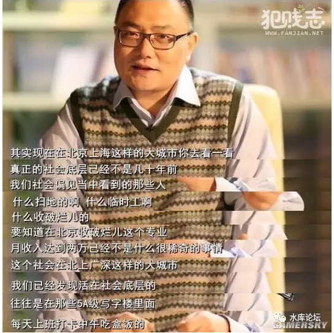
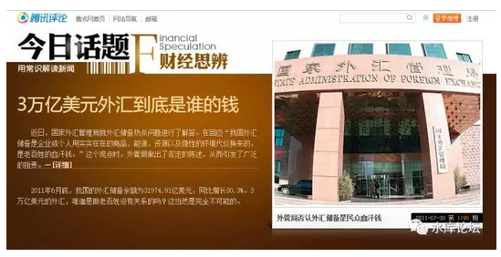
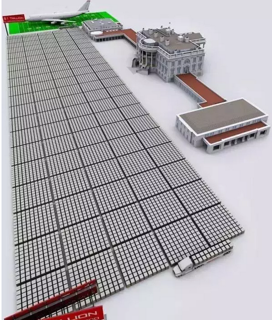
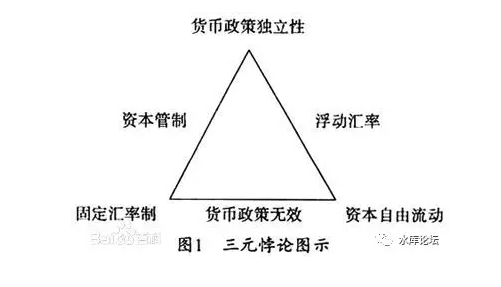
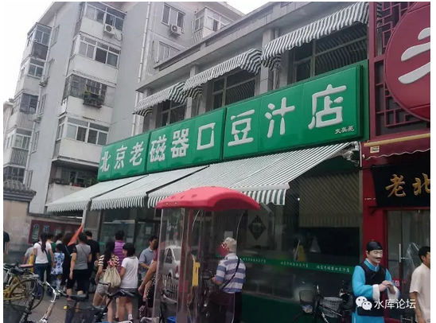

# 笨蛋，外储是单向膜 \#1370

原创： yevon\_ou [水库论坛](/)

**水库论坛**

微信号 Shuiku-net

功能介绍 科学尚未普及

2017-05-10

（无封图）

笨蛋，外储是单向膜 ~\#1370~

 

这二天，被一篇民科文章刷屏了。

《高手在民间，这是一篇预测中国经济神准的大雄文！》[\[1\]]

 

天天有人付费咨询我怎么看。

实在是不厌其烦，不如我写一篇。

 

 

 

一）结论

 

首先我们来说"结论"哈：

 

以上全错

 

这一篇文章彻头彻尾，从头到尾，全部都是错的。

作者对于真实的**官场**一无所知。对于真实的世界一无所知。

属于脑子烧坏掉了，穷书生躲在陋室里面，拿了二个专业名词YY。

 

而你的朋友圈里，凡是拿《高手在民间》转发的，炫耀的，点赞的。

拿来向你推荐的。

统统在备注栏里加上"SB"二字。最底层的肉猪炮灰就是这群人。 

 

你所看到的，所有关于外汇储备的分析，全部都是错误的。

外汇储备是一个单向膜。凡是不讲到单向膜的分析，全部都是错误的。

 

 

二）模型

 

"人民币对外升值，对内贬值"

"大排面迟早涨到30元一碗"。

 

 

今天社会上对于"外汇储备"的关注，可以上溯至我在2004年天涯写的一篇文章2004-07-31：

《人民币面临巨大的贬值压力》[\[2\]]

 

 

在文中，我们提出了一个模型；

-   人民币被低估

-   西方社会要求人民币升值

-   人民币坚持不升值

-   西方美金通过各种渠道进入中国，兑成RMB

-   央行被迫吃进USD，印刷RMB，增加M2

-   M2增加，房价大涨

 

 

在2001年朱相交棒时，全社会的M2仅仅才11万亿。

截至2017年春，全社会的M2............

呃，M2数据已高度造假。表外资产不计其数。我们改用另一个数据：金融业总资产。

目前这个数据是260万亿。

 

-   16年翻了25倍

-   平均每年+21%

-   GDP每年+9%

-   缺口每年+12%

 

 

在过去十六年中，京沪深宁等大城市，房价涨了15倍左右。

从6000\~7000的水平线，一路涨到目前的100000+

相应的，则是被折磨得麻木不堪的中产阶级。

一辈子的积蓄，只能够买个一室户。

 

 

当这股力量太强，太长，太折磨之后。

痛苦的小白领，就会转而寻求安慰："什么时候是个尽头\~啊"

 

你说，RMB升值预期 ------\> 导致外汇储备增加 ------\> M2增加 ------\>
通货膨胀。

可是连续经过无数年的"滥发纸币"之后；

朱相留下来的家底，终于被挥霍殆尽。

 

 

时至2016年，整个宏观经济大趋势开始逆转。

RMB进入了"贬值通道"，USD/RMB从年初的6.2一路狂贬，一口气贬到了6.99.

在整数7的关头，才因外交协议而终止。

 

京沪的小白领感动得眼泪往往。

"熬出头了，终于熬出头了"。

据传闻，外汇储备已经开始逆转。最差的时候，甚至跌破了30000亿美元大关。

 

 

如果外汇储备"加速耗尽"。

会不会导致"货币收缩"，基础货币收紧。

M2下降，通货膨胀不再。

 

不管是加息，加准备金率，还是种种高大上的名词。

总之让房价跌下来，或者不再涨了。

京沪小白领的心，热乎乎的。留下了感动的泪水。

 

 

于是他们去知乎发帖。

知乎是什么地方，高中生聚集地。水平一塌糊涂。

一群民科互相安慰。

哥哥真心不想打你的脸。

 

 

愿望是美好的，现实是残酷的。

哪怕RMB进入贬值通道，哪怕资金在流走。

房价还是要涨，房价还是要创新高。

为什么，因为外汇储备是一个单向膜。

 

 

 

三）谁的钱

 

在解释"单向膜"之前，我们先来看一个2011年10月的热点问题。

《外汇储备是谁的钱》[\[3\]]

 
当年，2011.10此话题曾引发了一场大规模，广泛的争论。

争论的结果，主要有二派观点。

1）一派认为，外汇储备是人民的钱。是十三亿中华儿女共同创造的财富。

2）一派认为，外汇储备是央行的钱。是央行的资产。

 

 

当年这二派吵得不可开交。照例是没有结果的。

哥哥默默买了一个冷水馒头，心想"你TMD还能更无耻一点么"。

 

3 0000 0000 0000美金啊！数零数得我目眩。

一万的一万的三万倍。你知道是什么概念么。

 

 

这么多的钱，央行说是央行300个员工创造的。

你这300个人，每天不吃饭不喝水。从早忙到晚。

你要赚\$3万亿，每人每天要赚多少钱。

 

你一不是农民，二不是工人。

你既不耕地，也不炼钢。

你三百号人，号称"\$30000亿美元是央行的钱"。

你从事什么劳动，能赚那么多的钱！

 

结论至为清楚：

3万亿美元，是人民的钱。是十三亿中国人民，辛苦耕地织布炼钢，几十年积蓄起来的血汗钱。

绝对不是央行的钱。

 
四）直升机箱子

 

好了，现在我们回想一个镜头。

 

话说加勒比海小国，多米尼加共和国。

Dominican的独裁者跨了，将军匆忙逃上直升机，随身带着二个巨大的大箱子。

一阵狂风吹过，箱子吹开了二条缝。

里面飞出里的，一张一张，\$100美元富兰克林头像。

 

话说加勒比海的小国。海地的军政府跨了。

海地总统匆忙跳上直升飞机。随身带着二个大箱子。

一阵狂风吹过，箱子露出了二条缝。纸币随风而散，\$100美元富兰克林头像。

 

 

这样的画面，是不是很熟悉。

在几乎每一个拉美，非洲的军政府政权，类似的场面一而再闪现。

 

好了，我们继续追问。

"这些美钞，是从哪里来的"。

答案是：中央银行的保险库里提出来的。

 

 

因为外汇储备，它具有这样一种特性。

外汇储备名义上是全国人民的财产，理论上应该安静储藏于中央银行的保险库。

但实际操作中，他是完全被（敏感词）控制的。

 

这部分解释了，许多政枚；哪怕汇率上吃点亏。

也非要削尖了脑袋，尽量窖藏一些外汇储备。

 

无论国内如何纷纷扰扰。

反正出国要花美金的。直升机落地之后，所有的消费都是美元账单了。

 

 

 

五）单向兑换

 

好了，知道了喝咖啡的原理。我们再看来兑换守则；

"哪头猪告诉你，RMB跌下来时，要动用外汇储备捍卫汇率的"？

 

 

当朱相治国，国泰民康，人民币具有升值魅力时。

全世界的资金涌入进来，USD尽力兑成RMB。

中国央行放开了印钞机，眉开眼笑地尽情接纳。外汇储备从3000亿美金一口气升到33000亿。

 

可是当中国经济死火，国进民退，企业家活力奄奄一息的时候。

全球资金逃出中国。希捷科技断腕关厂。

哪封告示承诺了，我要把USD兑给你RMB？

 

我就是不换，你能拿我怎样

我就是不换，你能拿我怎样

我就是不换，你能拿我怎样

土财主外汇储备藏在锅里的。

 

 

德意志银行在欧洲快破产了，火烧眉毛想拿中国区的赢利回去救急。

外管局就是不放。

人家都快要破产了。

"对不起，我们有流程要走。领导还需要看文件"。

 

 

对于中国来说，他从来没有承诺过这个义务，"燃烧外汇储备，保汇率"。

上次花了3000亿，狙击了一些外汇卖盘。

估计内部已经骂得象猪头一样。

哪怕汇率的大船沉了，也不许动直升机铁箱子。

 

 

更何况，当年进入中国的，还有很多"地下钱庄"的钱。

2003\~2013年间，每年都有大量的"遗失和勘误"。

对于这些"非贸易项"吃进的美金，央行更加不用理会。

我反正是肉不吐出来的。

想要换回去，没门。

 

 

 

六）单向兑换

 

前一阵子还有一个大热的话题，《保汇率还是保房价》。

水库为此还专门写了一篇\#F630.

 

 

保汇率，还是保房价？

答案再简单不过了。当然是二个都保。

 

请问， 2 \* 3 = 8

在公式中，拆掉哪一个数字使得等式成立。

答：把等号拆了。

 

 

 

这就是"蒙代尔三角形"的基本原理。

金融街咖啡馆，基金经理们天天吹蒙代尔三角形。怎么事到临头，反而不认识了呢。

 

蒙代尔三角形，就是 2 \* 3 = 8

请问，如何使得公式成立。答：把等号拆了（外汇管制）。

 

 

 

譬如说，北京的房价20万/平米。

一套100平米房子，2000万人民币。折合300万美金。

 

在USA，三百万美金差不多可以买最好最好的豪宅。

在New Jersey，可以买一幢庄园。

在北京，或许就是过道学区房。

 

 

请问，怎样防止北京人把房子卖了，去美国换10套别墅。

答：进行严格的外汇管制。

你手里的RMB，想要兑换成美金，请先填八十张表格。慢慢等去吧。

(伟大的北京豪宅)

象索罗斯这种人，如果想冲击人民币汇率的话。

明天就会因为嫖娼罪被逮进去。

后天就泪流满面，在电视镜头面前，恳求全国人民的原谅。

 

 

 

（yevon\_ou\@163.com，2017年5月10日暮）
