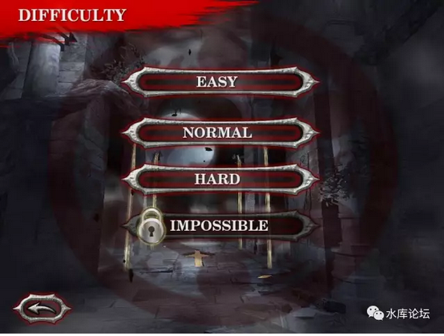
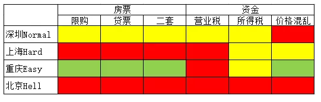
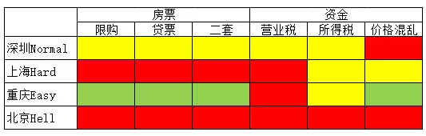
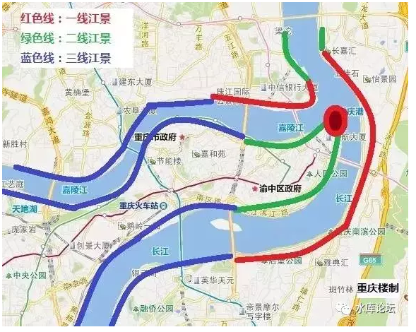
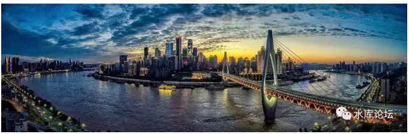
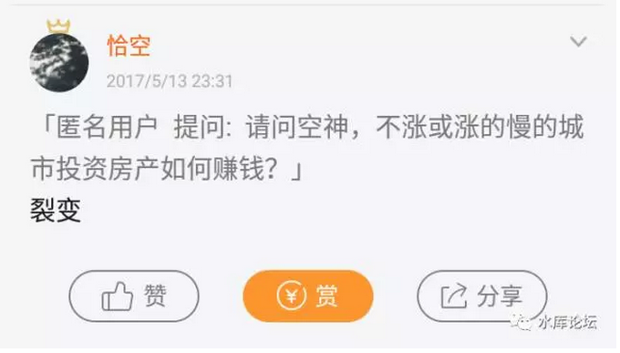

# 中国楼市的Hard模式 \#1400

原创： yevon\_ou [水库论坛](/) 2017-05-24

中国楼市的Hard模式 ~\#1400~

 

本篇极为浅显，严格说来没有任何营养。

 

只不过近来在"分答""小密圈"，连续不断有人问我类似问题。

而我，又不好意思反反复复收你同样的钱。

只好整理出来。做一个系统的回答。

 

}

 

 

一）Hard模式

 

深圳是Normal模式

上海是Hard模式

重庆是Easy模式

北京是Hell模式

 

我们有如下表格；

 

买房子这种事，在中国历年调控。折腾到现在，商品房不商品。最终剩下了二条主线；

-   房票

-   钞票

 

别人在小密圈问我，"能否去大城市配置资产"。

我一般第一句话反问："房票有么"。

 

 

高宗搞出来的"商品房"。商品房作为一种商品，而不是组织分房。其最基本的本意：

商品，拿钱就可以买。

 

也就是说，市场经济，只认钞票。

可是搞到今天，已经完全变了味了。大城市的土著，就是特权群体。土著有房票可以买。

外地来的土财，单身没结婚还不能买。

仅一个大城市的户籍身份，就可以价值几十万上百万。

 

 

对于房票+钞票这个组合，还可以加上十几个细化参数。

但是就总体而言，房票+贷票+二套，营业税+所得税+价格体系。

我们列出了六个最主要参数。并且按照绿灯，黄灯，红灯进行打分。

 

一看到这个表格，我们顿时被北京一连串的"红灯"晃花了眼睛。

但今天想讲的不是这个。

我们想说，买房，是分"模式"的。

 

 

二）Easy模式

 

重庆的房子，就是Easy模式。

对于新手来说，简直就是天堂。

 

 

首先，重庆不"限购"。

很多新手来说，没有"60个月社保"，JSCH，就已经免除了最难的一关。

 

其次，重庆"限贷"也很温和。

二套四成，利率上浮10%。不"认房又认贷"。很容易获得30年期，高成数低利率房贷。

 

第三，重庆"价格体系有序"。

这个也是非常重要的。对于北京、深圳的市场，我们真心灰心，乌云遍地。

地段靠蒙，潜力靠猜。这是我们不喜欢的。

 

 

北京的房地产市场，他是"点状"的。

好比一块大饼，零零碎碎洒了芝麻。

有芝麻的地方，就是平地蹿起一个个100000+的楼盘。

可是周边大块空地呢。对不起，没你的份。北京是不存在"地段"的。北京纯粹是一个"点"状市场。

 

 

北京地产逻辑，简直可以说"土豪驱动"。

土豪看中某一块地方，霄云路八号，直接几千万砸下去。买房也就是买个大玩具。

不需要考虑横比，竖比，性价比。

北京有钱人，不是身家几千万的人群，而是零用钱几千万的人群。

 

 

某一个地块，一旦崛起一家互联网风口期公司。顿时鸡犬升天。

股票，PE估值千百倍的增长。

公司一夜之间多出来几个营的千万富翁。

把附近楼盘全部买空。

 

而过了几年，风口过去。一切又回归平静。

西二旗的互联网公司，渐渐竞争不过望京。

整个土地地段估值也瞬间转移。

 

所以在北京，"地产"是非常非常难做的。

它根本没有"地段"的概念。

你不知道土豪下一秒会青睐哪个位置。

也不知道互联网哪家公司会崛起。

 

 

 

同样道理。深圳整个城市，基本是"带状"分布。政府一路向西，开发新区。

前二天去看了华侨城，心都凉了。

深圳最早的地标性顶级豪宅，整个城市的名片标杆。富豪云集，万金买邻之地。

20年来，保值了没有？

现在价格才8W不到。

 

 

深圳因为是"带状"城市，政府一路往西。

从最初的罗湖，香蜜湖，南山，到深圳湾，前海，后海，宝安，宝中。

政府永远在开发新区。

老地段永远都没有情结。

任何一套二手都被套在手里。

这也是"投资"的地狱。

 

 

 

相对来说，重庆就是"Easy"模式。

重庆依然保持着完整的"市区\-\--郊区"结构。市中心就是比郊区贵。人口也是远远密集。

 

尤其是南滨路，北滨路一带，由于有着不可替代的"大江大河"自然景观。更显地标锚的恒久。[\[1\]]

 

 

在重庆，我们可以说是"三容易"：

-   买房容易，没有限购。

-   贷款容易，首付很低。

-   选筹容易，不会大错。

 

 

各位，我们要知道一个基本结论：

房地产市场，大概率是上涨的。

 

只有买贵，没有买错。

尤其是那种一万，八千的房子。贴近成本线也不远。又是1000W以上人口的大都市核心区中心。

亏钱的概率微乎其微。

 

对于重庆，简直就是一个金矿。

只要你涉足，轻易就可以掘金。

 

（重庆很多时候是让你去练练手，或者用老人边缘贷票）

 

三）上海和深圳

 

相对而言：

-   深圳可以说Normal模式

-   上海可以说Hard模式

 

 

深圳破限购，主要是"移民入户"。

在中国目前所有一线城市中，深圳是唯一没关上户籍大门的。

不仅没关上，而且很欢迎。大学生入户，深圳甚至还有补贴。

 

深圳目前对人才基本只有二个要求。

1）大学生

2）45岁以下

 

可见，要获得深圳户口是非常容易的。作为一线城市，这也是我在分答上一再推荐的。

如果你是内陆省份，无论如何，你至少移"一个亲人"去深圳。

 

 

不仅仅是为了多一张深圳的房票。

而且只要有"一个亲人"在深圳，你就多了一个钩子。

 

以后哪怕深圳的户籍收紧，只要你有一个"钩子"在深圳。你自然就可以想办法，办父母慢慢投靠。

父母投靠了，再办小叔子，小姨子的投靠。

就好像美国只要录取了一个巴基斯坦人的移民申请，他就可以把一整个村庄的人都扯过去。

 

除了限购之外，深圳的种种"税收"也比京沪要轻。

知名不具。

 

 

上海已经连续五年GDP全国增速垫底。

上海目前有很多隐忧。

但今天我们不是来分析深圳上海的，Go Hell。

 

 

 

四）Hell模式

 

我们讲了Easy，Normal，Hard和Hell模式。想要表达什么意思呢。

是不是Easy模式的城市，更容易赚钱呢。

抱歉，并不是这个意思。

 

 

Easy和Hard模式，都不过是打怪通关的一种。

你见过有人因为Easy模式，就不玩Hard模式了么。

Easy模式，难道真的比Hard模式好玩么。

道理绝不是这样的。

 

 

如果我们看真实的世界的话。

在小地方赚了钱，最终是要向大城市走的。

在外省赚了钱，最终是要向首都走的。

京沪的房子，始终要比重庆武汉体面的。

在Easy模式赚了钱，最终是要向Hard模式走的。

为什么？

 

 

这里面有几个原因。一个最直观，也是最浅显的原因：池子。

重庆的池子非常小。

在A6数量级。

 

一般一套重庆的房子，建面12000/m已经算很好品质。哪怕买小三房，总价不超过150W元人民币。

这是什么概念，在京沪买个厮所都不够。

 

北京、上海人一过去，顿时就看傻了。

首付三成，每建仓一套CQ房子，才消耗现金40W。

 

 

在小密圈里，经常有人问我，"手握700W现金，请问如何配置"。

对于这种问题，我只有苦笑道，"大象只能待在京沪"。

（当然，还有人问我，"手握1亿现金，请问如何配置"。回答在小密圈里找）

 

 

因为重庆是一个很小的池子，仅适合新手练手。

大象蒲进浴缸，水就漫出来了。

 

700W现金，足足可以购买16\~17套重庆房产。

无论如何，银行也不会批这么多笔贷款给你的。你也找不到这么多贷票。

因此你只能待在京沪。只能耐心地和Hard模式格斗。

 

 

 

另一方面，谁告诉你Hard模式赚得比Easy模式少的。

不仅仅是体量问题。

哪怕单套也不惶多让好么。

 

 

在《[炒楼业黄金时代](http://mp.weixin.qq.com/s?__biz=MzAxNTMxMTc0MA==&mid=403391036&idx=1&sn=2416ee9f1731daca3905e605fbfbe55a&scene=21#wechat_redirect)》\#930及前后的二三篇文章中，我们详细说道了：

"宏观调控之后，炒家利润率急剧升高"的结论。

美国"禁酒令"颁布之后，才是酒贩子赚钱的黄金时代。卖卖沐浴露之类的。[\[2\]]

如果真的哪天不调控了，炒家反而全都死绝了。

 

 

经济是一件很玄妙，很复杂的事情。和大部分人的直观完全不同。

炒楼从来没有这么赚钱过，尤其是2012\~2015卡得最死，最严的时段。最赚钱。

 

Hard模式的背后，其实是竞争对手的极大削减。

在广袤无垠的大草原上，只有孤零零几只孤狼。

 

青霉素杀死了99.9999%，却让0.0001%独享美食。[\[3\]]

市场上的炒家越少，则笋盘必然越多。

 

 

Hard模式，只不过意味着赚钱方式的转变。

AK47用完了，开始用狙击枪了。

世上没有难赚的钱，只有不思进取的人。

 

要说赚钱，北京其实才是最好的市场。哪怕北京杠杆率最低，限购最难，板块最混乱。北京是Hell模式。

可是北京钱多啊。

 

你在钱多的地方，容易赚到钱。

还是钱少的地方，容易赚到钱。

 

进化，进阶。

 

 

 

（yevon\_ou\@163.com，2017年5月23日晚）

 

 

熟悉水库的朋友都知道，我文章评论下，有一位"麦田"先生，评论每次都精选。而且往往被刷到置顶。

这位是金主，广告商，得罪不得的。框内是广告，谢谢。

 

（POS机分大机和小机，花点钱，买个大机，值得的）

\[1\] 感谢"重庆楼"文章《重庆江景价值分析》https://mp.weixin.qq.com/s/n7aOBEnYDTlop5z4gJyX7Q

\[2\] 《除了喝沐浴液俄罗斯人还喝什么？》http://mt.sohu.com/20161223/n476773168.shtml，因为俄罗斯对酒精征收高得吓死人的酒税，因此大家都是喝洗发水的。

\[3\] 《恒纪元和乱纪元》\#F840
