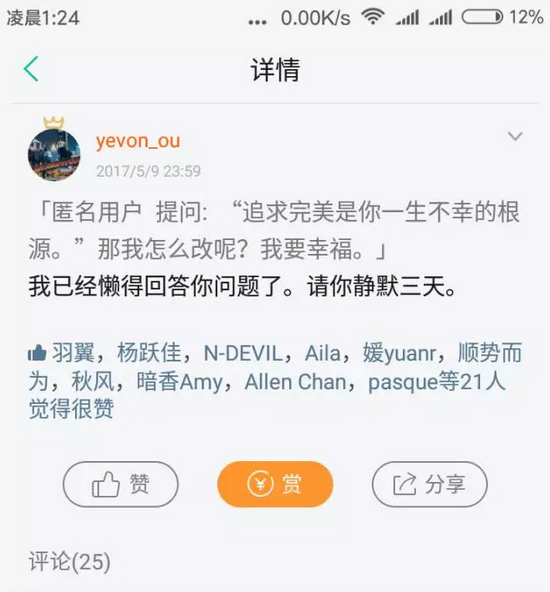

# 小密圈问题荟萃五月（下）\#1420

原创： yevon\_ou [水库论坛](/)

**水库论坛**

微信号 Shuiku-net

功能介绍 科学尚未普及

2017-05-27

小密圈问题荟萃五月（下）~\#1420~

（延续上篇）

 

41）「提问：\#顶复问题\# 
1、背景：这个讲顶复优缺点的视频，有点价值，辛苦您先看一下：链接：顶层能买吗？业界良心答案 \[1\]

 

2、问题：结合1中视频的提问：1）视频中哪些观点是谬误？2）哪些观点是有价值的？3）造成香港顶复贵、内地普遍顶复折价的原因是什么？观念？防水工艺？其他？」

 

A：二个字:什么年代了，买房子还停留在\"建筑材料\"。

再贵的建筑材料，都可以自己盖。不会超过1000元/m。

小地方没见过市面的乡下娃子。

 

 

42）「匿名用户提问：欧大，能说说建筑设计这个行业吗？工作五年，感觉很绝望。。。」

 

A：欧美已经死光了。中国晚几年............

 

 

43）「匿名用户提问：欧神，朋友想买个学区房，不贷款，总价2000或者3000以内都行，投资兼自住，请问能推荐几个地段或者小区吗？记得您以前说过静安的学区最好是吗」

 

A：不贷款的学区房。你花80w，买套使用权就可以了。钱多得烧么。

 

 

44）「匿名用户提问：欧大好，记得您上个月对商住的指导思想是长期看应卖出换筹，短期内先不卖，等过了压价期再卖。5月17日下午，上海市住建委发布《关于开展商业办公项目清理整顿工作的意见》。现在您的看法有变化吗？」

 

A：最重要的限购，限贷，都没有抄北京。

老文件重提，表忠心的。

 

 

45）「提问：殴大，以中国房产开始的十几年来看，今年的调控政策相当于什么水平？有没有哪一年比今年更严厉？」

 

A：1992年之后最严

 

 

46）「匿名用户提问：欧大，已网签，贷款2做1没成功，准备先全款再抵押，不过只能筹到全款的一半，希望争取和上家谈先付一半，剩下一半抵押贷出来再给，上家同意今天下午面谈，有什么技巧或值得注意的地方吗？」

 

A：1)出示你老爸，女儿，全家照。表示你是一个有正当职业的正经人。

2) 哭晕

 

 

47）「提问：欧大，外环内88平全款安置房，交易中心最低价做不进普通，比标准高了10w不到，要多交6w多契税，心要出血了。哭晕大法现在还能奏效哇？」

 

A：这个你不行，得让你奶奶来交易中心哭。

技术活，我都干不了。

基本哭到5:00拉住门不让下班就行了。

 

 

48）「匿名用户提问：神啊，你有没有这样的经历：穿着拖鞋，骑着电动车，车上一个破包，里面几十万，见到房东，喏，这套房俺要了」

 

A：我没电动车，其他都一样。

原则上我不穿拖鞋，这样显得很不尊重房东。房东会想，我漫不经心就把房子买了。是不是定价太便宜。

 

原则上我喜欢穿皱巴巴的裤子，装出一副穷酸样。

显得拼出了所有的资金，而又不领行情的蠢样。

 

 

49）「匿名用户提问：重庆有一些低首付房源，通过和房主签公正协议完成交易，由买家替房主还房贷。之后一切的房价涨跌和原房主无关。房屋过户的时候，原房主需配合。据说这种方式可以绕开限购和限贷。听起来似乎对买家单方有利，不清楚原房东为什么要这么做，有什么坑吗」

 

A：为了卖房咯。你把我手里房子1000w接过去，各种苛刻条款我也答应的。

 

 

50）「提问：在杭州买了一套房，定金交了，但是准备签合同时候，房东提出买了之后出租给他们几个月，个人觉得有风险，万一他们手上有多一本房产证，会骗定金的风险，不知道各位或欧神怎么看？是否应坚决拒绝对方。」

 

A：很常见，房东来不及搬家。留20w尾款即可。

 

 

51）「提问：遇到半路毁约又不想出违约金的极品租客怎么办」

 

A：几千元就认怂算了。房东很弱势，他可以放水泡你地板。

 

 

52）「匿名用户提问：「匿名用户提问：神，上海一手房在办产证钱遗失了发票，会对未来交易有什么影响吗？要怎么补救呢，谢神～」

 

您答道：1) 审税时可能会吃亏2) 去区档案馆补办，手续要做齐神，追问一下，档案馆补办之后未来审稅就可以当作发票用了是嘛？」

 

A：档案馆给你一份复印件。

敲档案馆的公章。有法律效应。

 

 

53）「匿名用户提问：有企业信用贷吗？刚成立的公司可否申请？」

 

A：现金流式贷款千难万难。所有的企业贷，拆穿了都是房产抵押，法人无限担保。

 

 

54）【图表】深圳市商业银行房贷利率表（20170525）

 

 

 

55）「匿名用户提问：欧神，只从风险角度考虑，负债率在不同年龄，资产人群有没有本质不同。你说5000万可以退休，比如现在一个40多岁的家庭。有5000万净资产，假设贷票不是问题，现在留2年月供，用1-2年时间全部配置为1亿房产，然后退休，是否有较大风险。」

 

A：其实没区别。

因为传统的风险控制理论，基于你的工资。

cf不靠你的工资。

 

 

56）「提问：请问欧神，为什么不做个互联网金融呢。感觉欧神做肯定能做得非常好」

 

A：跪在科长门口要牌照

 

 

57)「匿名用户提问：请教欧神，互联网+金融方向的创业，您看好啥方向呢」

 

A：不要牌照的方向。

 

 

58）「匿名用户提问：坐标上海：昨天去了一个商务楼，发现了几个现象：第一，因为去得太早，就在该楼里的一家餐厅顺便吃午饭，非常诧异地发现已经11:40am这样接近午饭时间的黄金时间，餐厅里寥寥无几，我一开始以为停业了或者不开了。哆嗦地问了一句，"营业吗？"营业员懒懒说了句，"有。"然后我找了个桌子坐下，一直到十二点，餐厅都没几个人吃饭，生意差；和去年该餐厅红火现象成强烈对比；第二，在商务楼里走了一下，发现那些几个冠名某某财富或者某某金融信息的公司，诺大的办公室里面也没几个员工------完全一副空壳公司的模样；第三，有业务往来的这家贷款中介公司看到我来了，一副跪舔的样子，"有生意要记得我们啊。"贷款中介为啥突然生意差了？」

 

A：上海陆家嘴20%租客是p2p

中晋倒闭后，连带连陆家嘴租金都暴跌了。

 

p2p大整顿。

 

 

59)「提问：欧大，我第一次问问题，您在文章中经常提起marketing，请问怎么在日常公司运营和房产投资中运用marketing精神?」

 

A：学会[放弃]一部分客户。

 

 

60)「提问：欧大，俺准备买最后一批书了，您的平装精装我也要买买买。还请您推荐一本讲市场营销的书～」

 

A：中国没有三观很正的marketing书籍。

都是\"点子大师\"野路子的。

 

英译中里淘淘。

 

 

61)「提问："如果我不乱扔东西，你们清洁工吃什么啊"这句话从经济学角度有无道理？」

 

A：有1/2道理。

乱扔东西，如果能节约作家的时间。

则专门请一个清洁工，是合理的。

 

如果清洁工是公费的。

则不合理

 

 

62)「提问：欧神，您上次说自学英文不必要，砍掉英文是正确的，还说，最终会退化成日本人的水平。想知道其中逻辑是什么呀？退化到日本人水平是什么梗？毕竟世界经济和科技实力最强的是英语国家，认同用英文获取信息还是很有用很重要的，身边很多朋友把孩子送到英美也是这个想法。」

 

A：日本人英文极烂，但是日本人翻译业极强。

凡事均有成本。

英文不是不好，但是花1/3主力课程去学english，是一件回报很低的事。

 

 

63)「匿名用户提问：请教欧神一个比较弱的问题，学金融的在大学怎么赚钱？」

 

A：何必急着这一二年。缺钱问你妈要2w

 

 

64）「匿名用户提问：欧大好，车子是家庭总净资产的百分之2.5，这个比例过分么？」

 

A：不超过你最大额度一张信用卡

 

 

65）「匿名用户提问：欧大早，在cq这件事上老婆觉得我是sb、狗屁，非常痛苦。想和她划清界限，怎么办。」

 

A：几十万的事，不用她掏钱。赚钱是大概率。拿到利润再和她说。

 

 

66）「匿名用户提问：敬爱的欧神，如何才能让吵架的男朋友迅速和好或者迅速分手？」

 

A：1) 待他妈好

2) 待他哥们好

 

 

67）「匿名用户提问：请问心理咨询是个有前（钱）途的行业吗？」

 

A：标准的心理咨询没前途，就像报纸纸媒穷途末路。

新媒体的心理咨询很有前途。如分答。

 

分答最大的三个板块：情感，职场，医疗。

房产每个问题666元，但还是排不上号。

 

上次我问分答。俺收入能排前100么。

分答哈哈大笑。说前几名都是情感类的。

情感类38元。问题是，每道题几千人偷听啊！

 

 

有些失恋女性，就是打开情感类话题，

然后把所有的问题从头听到尾。她也不怕重复。

Big market.

 

 

68）「匿名用户提问：请教欧神:呼市郊县亲戚，工薪家庭独女，28岁，师范毕业。相貌中上。目前当老师，未婚。想劝她离开家乡到一线城市。估计她家里担心大城市第一生存不易，第二没家长在身边，更易成为剩女，第三独女希望留在身边。我总觉得不对，但也没头绪，讲不出有说服力的话。第一点我自认可以帮忙立足。第三点我觉得挣钱后能解决，第二点找对象这个最没谱。我该努力劝说，还是放弃？」

 

A：相貌中上=差

来京沪必然找不到BF，剩女。

你姑父没错。

 

 

69）「匿名用户提问：因为是家里事，无耻得匿了。保障房还是几年前我大学时，妈妈以离婚为要挟买下的。这么多年，母亲连父亲存折都没见过。几年前买保障房时家里大闹，就因为父亲说没钱只肯出几万，然后母亲和奶奶外婆一起凑的。现在他说：不想来回倒腾了，我有点钱做本钱做做生意钱生钱也是好的。我真想干点事实。」

 

A：完全跳过你父亲。既然只差几万元，那么多办张卡就行了。某些星座是这种脾性。

 

 

70）「匿名用户提问：1.明星为何都有工作室？比起有限责任公司，有啥优势？普通人也注册一个，有用吗？2.文笔好的人，怎么利用文字特长赚钱？出版书籍有出息吗？经济效用是不是比较低？3.如何利用旅行赚钱？生活在一个地方久了就好腻。4.想去国外读书，美，澳，欧，拍个序；5.香港优才计划是什么鬼？有人申请这个，就为了香港护照？」

 

A：1) 收购工作室比付明星片酬更省税

2) 只有Top0.01%的人可以靠此赚钱

3) 一般不赚钱。或者只能赚小钱。

4) 你拿张纸，拿纸笔。写下10个你知道的外国大学名字。除了这个名单上的都不值钱。

5) 是的

 

 

71）「匿名用户提问：欧大，白金卡也和普卡金卡一样，要经常养卡的吗？白金卡提额应该不好提额度吧？大行白金卡都是需要流水什么的吧，小银行似乎到15W就不好提了，这个时候还需要精养卡，外币养卡什么的吗」

 

A：白金卡的好处是，一般无论你如何滥用，总不销卡 ------------ 因为你付年费的。

养额度主要看贡献度。可参见《工商银行贡献度积分标准》

基本只有四大才会批你50w以上的卡，因为钱多。

 

 

72）「匿名用户提问：两张中国银行的信用卡，额度分别是15万和2千，本来打算注销这个2000额度的信用卡的，客服说可以调整额度和15万的额度共享总额度。请问这个信用卡需要注销吗？留着它有什么用处吗？」

 

A：留一张在御用中介处，随时刷卡。

我们很多白金卡都需要三张副卡的，因为可以北京，上海，重庆同时刷。

 

 

73）「匿名用户提问："留一张在御用中介处，随时刷卡。我们很多白金卡都需要三张副卡的，因为可以北京，上海，重庆同时刷。"欧大，副卡一般是给谁申请？给爸妈还是配偶？举个例子，我光大银行有三张信用卡，不同类型，额度共享，但没有副卡，这种情况下，我如果把这三张卡给三个不同城市的人用，会不好有套现嫌疑，因为本人不会同时在三个城市出现。副卡对副卡持有人是影响他的额度还是利于他的信用？我一直很糊涂这个问题。谢谢。还有，三张副卡北京上海重庆一起刷的意义是什么？」

 

A：1) 银行一般不管

2) 你要买房子，你LP要买包包，你老娘拿着付旅行社。

 

 

74）「匿名用户提问："1)银行一般不管2)你要买房子，你LP要买包包，你老娘拿着付旅行社。"谢谢欧大回答。副卡持有人算副卡人持有人的信用卡数吗？如果逾期，副卡持有人的征信会不会受影响。副卡持有者是否上副卡持有者征信。」

 

A：如果你再纠缠于枝末细节，你这辈子也不会有出息。

 

 

75）「匿名用户提问：欧大，你已经好几次批评我纠缠于细枝末节了。为什么纠缠细枝末节难以有出息呢？弊病在于什么？」

 

A：追求完美是你一生不幸的根源。

 

 

76)「匿名用户提问："追求完美是你一生不幸的根源。"那我怎么改呢？我要幸福。」

 

A：我已经懒得回答你问题了。请你静默三天。

 

大家肯定已经猜到，问题72\~76是同一个用户问的。

所以我们下一篇写《双鱼座为什么不能炒房子》~\#1430~

 

 

 

（yevon\_ou\@163.com，2017年5月26日子夜）

\[1\]《顶层能买吗？业界良心答案》

https://mp.weixin.qq.com/s/0qPJwu5sYBNlbqUeID5f4g
