# 楼市的生命周期（上） \#1440

原创： yevon\_ou [水库论坛](/) 2017-07-04

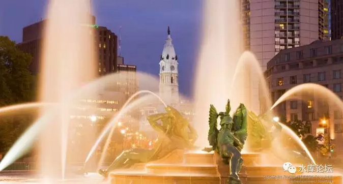

楼市的生命周期（上） ~\#1440~
=========================================================================================================================

 

分答的系统坏了，昨天的129定价一直没改过来.........

生，老，病，死

 

 

一）火车头

 

大约在一个月前，有人在分答上问了我这样一个问题：

 

http://fd.zaih.com/question/90000035953766463416

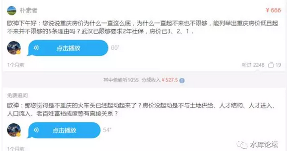

 

我觉得这个话题很有意思，可以展开好好阐述一下。

 

 

佛家说，世间万物都有"生，老，病，死"，都有生和灭的过程。

对于一个城市，乃至于一个国家的房地产市场。其实与此类似。

 

对于很多小白，大脑浆糊，他们喜欢以[波段论]形容楼市。

以为价格围绕着价值上下起伏。此[大错特错]。

 

楼市的演化阶段，其实很象是一个"人"。有幼年，壮年和老年阶段。

而且这些演化，是不可逆的。

同样也是没有轮回的。

 

-   懵懂阶段

-   启动阶段

-   成长阶段

-   泡沫阶段

-   衰老阶段

 

 

 

二）懵懂阶段

 

楼市的第一个阶段，是懵懂阶段。

谈论楼市，有一个话题，是无论如何也绕不过去的，"谁睡在马路上"。

 

 

你看，人人都有房。

整个大城市，并不缺房子。没有任何一个人睡在马路上。甚至说清洁工也有三套房。

从来不存在"刚需"，没一个人日子过不下去。

 

房子不是水，食物。

不是每天都要消耗的必需品。老房子稍微凑凑，继续住住行了。

 

(全国各大城市人均住房面积，来源：重庆楼)

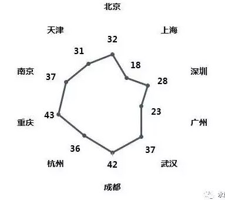

 

在这样一个"不缺房子"的大前提下，就养成了三四线城市（渝蓉）人口的一种观念：

 

-   要买房子干嘛

-   房子本身是不值钱的。

-   一点点折旧就不要了。

-   坚决不买二手房。

-   老破大没人要

-   买房不如买车

 

 

2016年重庆人民看待房产，如果用二个字形容他们当时心态，那么应该是：

绝望

 

 

绝望，真心绝望。

房子怎么可能涨得起来呢。那要多大的购买力，多大的拉力啊。

 

 

2016年你和重庆本地人讨论房子，土著那些所谓"高手"。

他们会真心劝阻你；

 

-   重庆这个市场，你们外地人不懂。

-   重庆的房子太多了，永远不会涨。

-   重庆人不缺房子，人人都有房子。

-   重庆因为其特殊的xx制度，xx制度，xx制度，决定了房价绝对不会涨的。

 

 

另一方面，成都的"朱红之泪"，则长篇累牍地控诉成都人"处女座"。

 

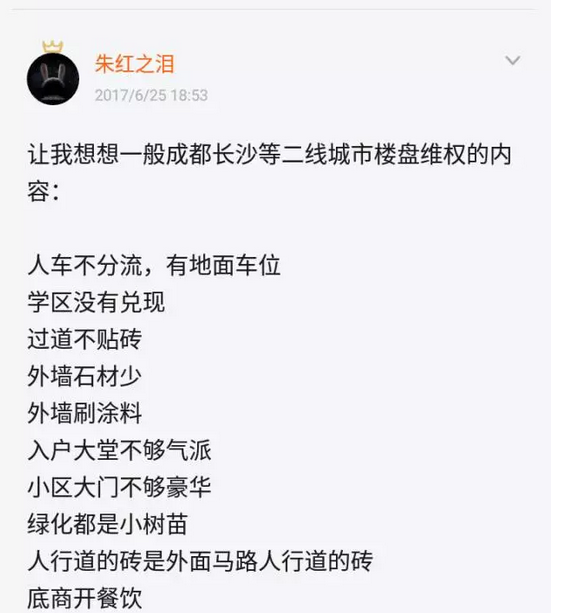

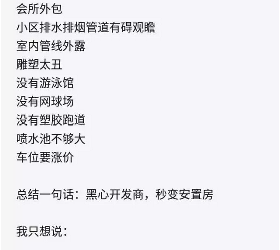

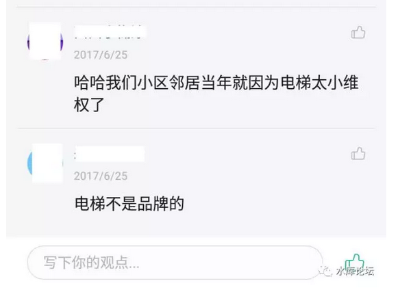

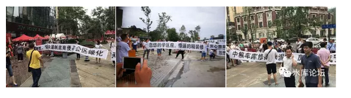

 

 

因为房子太便宜，所以消费者都被侍候成了大爷。

人行道的砖，是马路上人行道的砖。

喷水池不够大

车位要涨价

诸如此类的问题，都值得旷工一天跑过来维权。在京沪消费者眼中看来，这日子也过得太惬意了。

 

甚至水原怒喝一声：

"渝川人，配过这样的好日子么"。

 

 

 

三）启动阶段

 

楼市的第二个阶段，是"启动阶段"。

其具体的特征，是部分楼盘已经有了翻倍的涨幅，但并不是全部的楼盘。

火车头轰鸣，但时速还不高。

 

 

在启动阶段，主要的特征是"怀疑和野望并存"。

一方面，肯定有人啃了一口大葱，喝了一罐啤酒，吐了一口唾沫，狠狠地骂道：

"泡沫，肯定是泡沫"。

"怎么样上去，怎么样下来"

"有得好人跳楼去了"。

"全都是外地人炒房客在买，一群巴子不领行情"。

 

另一方面，肯定有人买买买买买。

例如武汉，一口气爆了114个"日光盘"。一直到旭辉御府，才因为性价比实在太渣。没有连续爆出第115个日光。

 

行情在犹豫和争议中产生。

 

 

 

启动阶段的特征，人群开始分化。分为二种，"觉醒者"和"傻空者"。

我们会发现，市场上存在一股非常强大的力量。

几乎要扫空一切货仓的力量。

 

市场上有一股"新力量"，哪怕把价格节节推高。从8000高买到11000，12000，14000，也在所不惜。

18000仍然买买买。价格翻翻仍然买买买。

 

 

而另外一种人，他们的人生观和十年前一样。

太阳照常升起，认为往昔[熟悉的生活永远不会打破]。一切规则都会和昨天一样。

 

只要任何新的，他们看不懂的东西。

他们就惊慌失措"泡沫，泡沫"。

 

 

 

四）启动阶段的重要影响

 

在楼市五个阶段中，"启动阶段"是最最最重要的。

因为"启动阶段"，几乎是唯一可以踩刹车的阶段。

 

急病下猛药，狠狠一棍子，敲得重了，直接打晕。一定要重。

滴墨战术，就打不死。

逐次添油的调控政策，什么下场，大家也看到了。因为宏观调控，所以房价飞涨。

 

 

 

我们曾经把房价比做"火车头"。

火车这东西，如果你想让一辆5000吨的火车启动，那是千难万难。需要极大的锅炉和压力。

而火车一旦启动，运行在铁轨之上，需要的能量却又不是太多。

 

等到你想刹车了。

火车刹车也不是件容易的事，动辄需要二三千米的长度来让火车慢慢减速。

这千万吨的庞然大物，想把速度降下来。也是吓死人的动能。

 

 

 

楼市的道理也是一样。

对于楼市，让一个3亿平方米存量的超级大城市楼市启动，那是千难万难。天时地利人和，缺一不可。

 

你听着这个庞然大兽嘶吼着，挣扎着，甩去身上的枷锁。

甩动抖掉碎石和铁链，一点一点尝试着爬行，慢慢加快了速度。

 

 

目前，整个重庆楼市，只能算是"小涨"。

表现最靓丽最耀眼的，是南滨路，北滨路。尤其是拥有一线无敌江景的，所谓"婆罗门"区域。

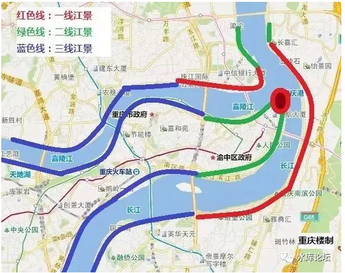

 

在过去约一年的时间内，"婆罗门"区域从8000单价，一口气涨到18000单价。部分楼盘下一期报价已高达22000.

 

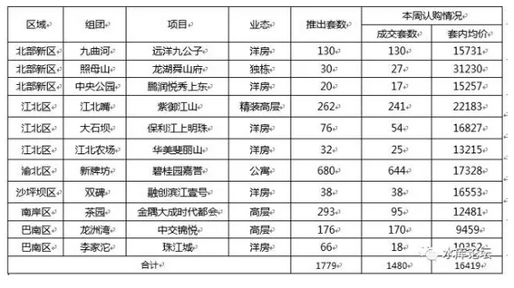

 

但是，在这一片"猜对走势"的庆祝声中，我们还要看到，整个市场，清楚地仍然存在"乌云"。

 

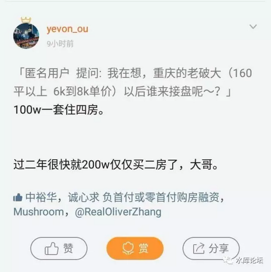

 

对于整个市场来说，依然存在"没涨上去"的物业类型。

这就是渝中区的老破大。

 

没涨上去的原因，依然是因为"启动阶段"。

启动阶段，一股强大的力量，扫光了"南滨路北滨路"所有的江景豪宅。

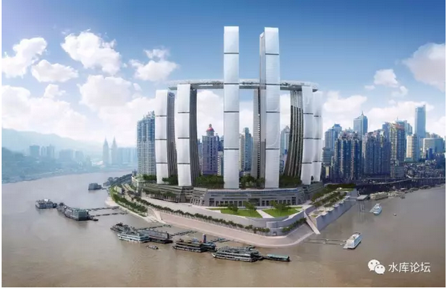

 

但是"土著"是迟钝的。

对于老重庆人，住了十几二十年的人，他们觉得太阳照常升起。丝毫也没有紧迫感。

丝毫也没有想要买房子的意思。

针对他们的物业类型，或者他们抛出的物业类型，价格就上不去。

 

 

 

你设想一下，160平米四房，单价只要6000元/平米，总价仅仅才100W。

一百万元，在未来楼市，意味着什么。

 

-   14500 \* 70平米，稍微像样点的房子，只能买二房。

-   22000 \* 45平米，有名有姓的豪宅，只能买一房。

-   25000 \* 80平米，楼市再涨上去，只能买厮所。

 

你现在四房只卖100万，显然是极其不合理的。\[1\]

 

 

 

五）成长阶段

 

楼市的第三个阶段，是"成长阶段"。

如果说，房价从8000涨到16000，是启动。依然唤不醒"沉睡的人"。

 

则楼市再翻一个跟头，16000\--\>32000是成长阶段。

再再翻一个跟头，32000\--\>64000也是成长阶段。

目前重庆处于"启动阶段"的话，武汉处于"成长阶段"。 

 

成长阶段有二个特征；

1）楼市开始有赚钱效应

2）开始有人买不起房子

 

 

重庆人的收入，大约是上海人1/2左右。

但是2016年八月，重庆房价只有上海房价的1/10。

比例完全不对等。

 

-   "骂房价贵"虽然已经成为了酒桌上的一句口头禅。

-   "口是心非"，重庆人买房子，其实一点压力也没有的。

 

一套房子80\~100W，小夫妻一年也有二三十万。

因为生活太安逸，所以不是不买房。是买得起而不买。

 

 

但是，当楼市从8000\--\>16000\--\>32000的过程中，他就逐渐产生了"财富效应"。

你8K买进，16K卖出，每一套房子，就有了"近百万"元的利润。

哪怕以20W的小夫妻年收入，这也相当于五年工资。

 

 

而如果楼价能有幸从16000涨到32000，

则很多人有幸，一套房子就价值三四百万。

比毕生积蓄，所有的工资储蓄还要多。

 

 

这就产生了"财富效应"

按照尹香武的说法，叫做"金融属性"。

一旦产生了财富效应，那就非同小可，非同小可。

 

 

中国古话，杀头的事情有人做，亏本的事情没人做。

A股，君子兰，比特币，一项投资哪怕再无情，再糟糕。只要它能赚钱，则勤劳勇敢的中国老百姓，如削尖了脑袋沙丁鱼，怎么堵都堵不住。

 

 

如果你的楼市，能真金白银让人看见，赚了几百万。

整个民间顿时就"爆炸"了。怎么拦也拦不住。

 

1990年，深圳卖认购证。排三天三夜的队。

对了防止插队和抢购问题。每一个人，都紧紧抱着前面一个人的腰。

不管你前面是大老爷们，还是妙龄少女。陌生人，就这样贴身抱着腰，一连抱了三天。

 

 

在生长阶段，势头是无可阻挡的。只要你一旦过了第一个200%，第一个300%，有了赚钱效应；

则你一定会快速狂奔，16000\-\--\>32000\-\--\>64000，这段涨幅是确定的。

 

 

在成长阶段，调控是无效的。

火车头一旦启动起来，就肯定奋力狂奔。

楼市只要可以赚钱，就一定有人前仆后继冲进来。

 

哪怕你把交易完全锁死掉，

TNND人家自住的，再不买就买不起了。

 

 

（未完待续）

 

 

（yevon\_ou\@163.com，2017年7月2日晚）

 

\[1\]有人谈论昆山，嘉兴房产。从字面上讲，嘉兴去年也涨了一倍。

但其实你们对于重庆"吹毛求疵"，若按同样的标准，嘉兴简直处处毛病。

嘉兴的涨幅，严重集中在一手房。嘉兴的老大楼，嘉兴楼市的整体二手，90%的存量房都没有涨幅。

六月因为封号风波，一共只推送了三篇文章。

七月更新会更勤快一点。

框内是"广告"，专做深圳复杂交易。感谢各位热心的朋友。
