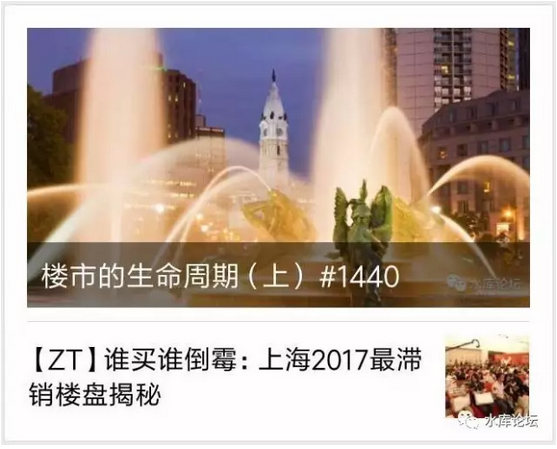
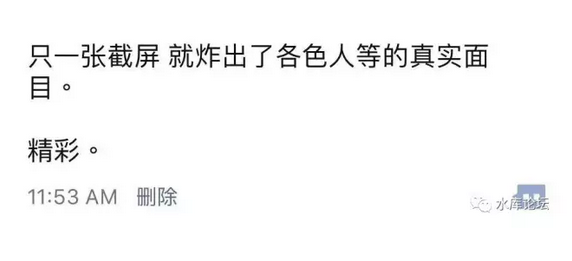
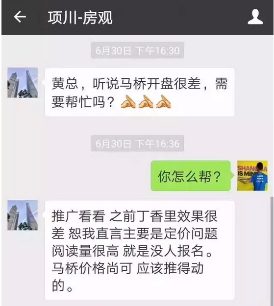
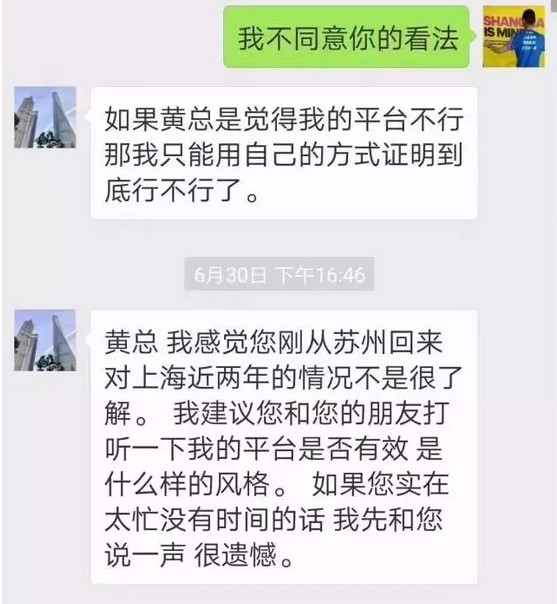
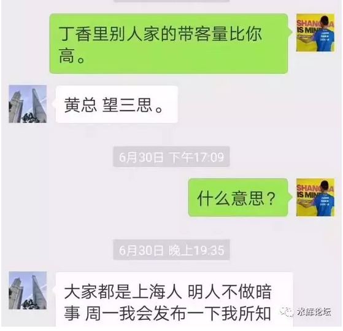
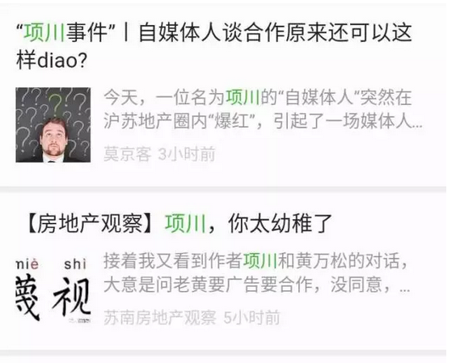
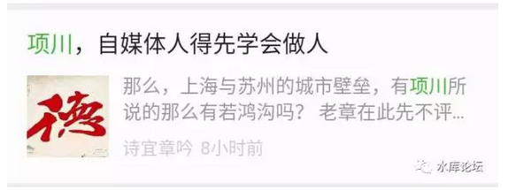
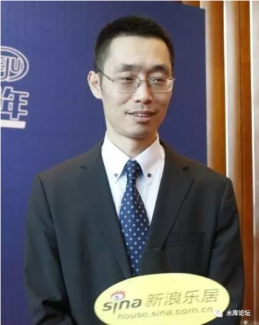
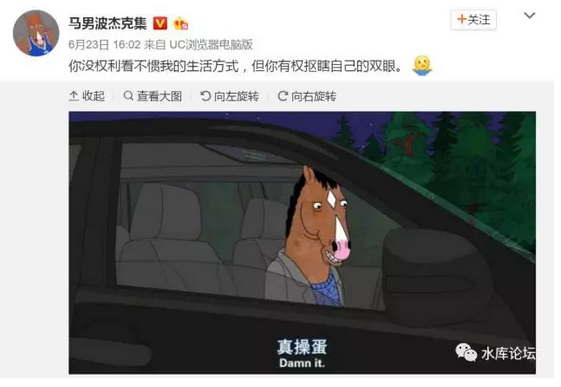

# 接上级领导通知，\#1440次文不转了。因此，也没有本篇了。

缺乏最基本的逻辑素养

 

 

一）前言

 

这二天，地产"自媒体"圈掀起了一阵腥风血雨。故事的源头，来自于[SPI撕马桥禹州府]。

 

水库一般很少发"次文"文章，但是在\#1440文后，很罕见地把整个帖子都转了一遍。

 
为什么关注这件事呢，因为我觉得这事很有趣。

在整个事件中，绝大多数人的三观完全不正。

 

为了这个三观，就值得我写一篇。

或者引用SPI（项川）本人朋友圈的图：

 
二）神转折

 

首先，请大家看一下《谁买谁倒霉：上海2017最滞销楼盘揭秘》帖子原文。

拨丝抽茧，嬉笑怒骂，该把"马桥禹州府"撕得一文不值。

黑心而又无能的KFS，跃然纸上。

 

 

整个事件的第一次神转折，发生在下图。

 

震惊，震惊，震惊

 

瞠目结舌，瞠目结舌，瞠目结舌。

 

 

整个事件发展至今，原来是这样的逻辑：

-   项川要求禹州投放广告。

-   禹州拒绝

-   项川以负面报道威胁

-   禹州曝光

 

热血沸腾的网友，于是得出了结论。

事情的真相已经十分明显了。善与恶，已经分清楚。

 

苏州的"自媒体"们，纷纷口诛笔伐。

短短的半天时间，又是好几篇千字长文。而且都是数万阅读。

 

 

咳咳，哥哥的意思，十分清楚。显然：

以上全错

 

 

三）对事不对人

 

为什么"以上全错"。为什么所有支持黄万松的人，几个自媒体，素质都很"差劲"。

 

（网络图片，不知真假，黄Sir）

 

因为有一件最基础的原则，做人的安身立命之处，你们没有学会。

对事不对人

 

 

对于整个事件，其实你只要问一句话：马桥禹州是不是烂盘。

是不是卖不动，是不是盛大开盘只卖了20%。

 

如果你的回答是："Yes"

那么事实十分之清楚，马桥禹州回避。

 

亲爱的购房者们啊，你们千万不要去买马桥禹州府。

[这才是地产自媒体，可以给予广大读者们，最有用，最富有价值的建议。]

 

 

 

而苏州那几个地产"自媒体"账号。他们纠缠的是什么呢。

-   项川是一个恶棍

-   项川是为了钱

-   项川是因为勒索不成

 

那么请问，项川是一个好人坏人，是否影响"禹州府大烂盘"这个结论呢。

你MOTHER有没有教过你逻辑，有没有教过你分析，有没有教过你对事不对人。

 

中国人遇到质量问题，伪劣投诉。首先想的不是如何改进自己的产品。

而是说投诉者人品不行，道德不行。

呸，没出息的东西。

 

 

 

四）勒索

 

如果说"对事不对人"，是最基础的道德伦理课。

还比较容易理解。

 

那么在奥派的框架内，对于"勒索"怎么看待。

我们的看法是：完全合法。

 

 

在整个奥派经济学的框架内，只有一件事不合法。那就是"暴力"。

除了暴力，其他任何事情都应该是合法的。

只要没有暴力，就不存在勒索。

只要没有暴力，我就没有办法伤害到你。 

 

 

举个例子，假设项川现在通过种种渠道，掌握了黄万松的"负面报道"。

项川有没有资格把它写出来，公之于众。

 

答案是肯定有的。

"言论自由"本身就是我们这个社会极其珍贵的一根支柱。而且对于负面能力的报导，可以帮助我们更快地修正错误，改善我们的生产力。

 

项川写《谁买谁倒霉》这篇文章，是一点问题都没有的。

只要你禹州府的确是卖不动。真人真事事实。

 

 

而接下来，项川拿着这篇文章，去找黄万松做一笔"交易"。

交易。

"你给我钱，我不出声"，请问交易是不是好事。

 

答案也肯定是"好的"。

dT \> 0，双方各取所需。双方都快乐。由此证明了"勒索"行为也是正当的。\[1\]

 

 

从经济学的一个"大图景"行为来看，"勒索"行为，事实上加速了"丑恶"的出清。

 

社会每时每刻都在产生着黑暗，每时每刻都有罪恶发生。

在大多数的情况下，这些"罪恶"并没有曝光。

因此消除这些罪恶，就需要非常长的时间。做恶事几十年后才会被天罚。

 

 

而"勒索"是一笔收入。有需求就有供给。

如果"做生意"dT\>0可以赚钱的话。相信有很多人愿意去做"合法的狗仔队"。

我的意思，并不是偷拍女明星白百合。

而是说，通过公开的渠道，汇拢信息，做个记者。

 

"收买"是行不通的。因为潜在的供应无数。

哪怕你今天收买了"项川"，明天还会有项河，项海.........

天底下的记者那么多，抱薪救火，越买越多。

 

如果不允许勒索，丑恶会更多

 

 

如果允许"合法狗仔队""勒索"等行为的存在。

事实上加重了"负面行为"的成本。并促使做得差的人，更快被市场淘汰。

 

也就是从"大义的名分"上来说。项川也没有错。

"负面报导，不买就爆"，本是记者人权。

 

 

 

五）不快

 

第三个层次的"毁三观"，是"不快"。

包括SPI（项川）本人也惊叹，他这篇文章发出去以后，跳得最高的，反而不是黄万松本人。

反而是苏州的几个"自媒体"号。

 

苏州几个号最愤怒的，是"浓浓的上海人优越感"。

你说操盘手渣也就罢了，为什么还要说"上海混不下去去苏州"。

苏州人感受到了浓浓的地域歧视。

 

 

中国的教育，长期以来缺乏"正本清源"的肃穆。

整件事最想问的，上海人有没有地域歧视的自由。

答案是：有的。

 

在水库文章《[[所有私营企业，不适用歧视原则]](http://mp.weixin.qq.com/s?__biz=MzAxNTMxMTc0MA==&mid=2651015846&idx=1&sn=fb785c87f365993160344c7355e011ba&chksm=80721cb5b70595a389e4f160280850b7633a50a14e7c5ecf54bbe34ea3abca762a20ae418b3d&scene=21#wechat_redirect)》~\#F1100~一文中，我们说到；

任何个人或者企业，只要他代表私营，就有权歧视任何人任何事。

我们要求的是公开的歧视的权利。

 
而荒谬绝伦的，反而是几个苏州人的理由："你使我感到不快了"。

 

感到不快，你回去抠瞎你的双眼去啊。

割掉你的耳朵，你就听不见难听的话了。

 

穆斯林还不想让哥哥吃猪肉呢。看见猪扒就说"使我不快"。

滚就一个字!

你只能管住你自己。一个人的自由，以另一个人为边界。

 

 

你可以骂我是混蛋，也可以取关我。

但是你说你"感到不快"，这个不是强迫别人的理由。

 

 

 

六）再次转折

 

问题的第三重转折，又开始了全盘的颠覆。

因为项川这篇《[[谁买谁倒霉：上海2017最滞销楼盘揭秘]](https://mp.weixin.qq.com/s?__biz=MzA4MTQ2MjIwOA==&mid=2653024647&idx=1&sn=55cc81c36144b065cc5375dd848a11c2&chksm=8441c728b3364e3eb4b7e9b61d4ac17708b56777da6f3955e43fdc3abb1d2cda22748fbd8119&mpshare=1&scene=21&srcid=0703GFuS6jUoiiRM3JjOYcz9&pass_ticket=CbG85plT8kt5QRBYCoPJisNWzwoBvLQGkHZ3pwNDWmGdzVZ80T767ojg0KXc4jwY#wechat_redirect)》，其实逻辑是不对的。

嗯，逻辑真不对。

 

 

如果你看文真仔细的话，项川提供了二次质疑；

1）马桥禹州府，去化率只有20%，上海最差

2）禹洲奉贤项目，畅销热销，因价格太底。

细心的读者，在这里其实已经发现了项川的"自相矛盾"之处。

 

 

-   价格定得高，去化缓慢

-   价格定得低，损害公司利益。

大哥呀，你这到底是要哪样啊！

 

 

面对项川和黄万松的指责，黄总完全可以面不改色地回答；

"马桥禹州府卖不动，是因为我们对股东有担待的公司。维护股东利益"。

 

你想，汤臣一品从2007年，100000元/平米入市。

在当时被誉为天价中的天价，彻底完全卖不动。

过了半年才卖了1套，第一年只卖了3套。

 

那么汤臣一品是不是一个糟糕的楼盘。你是不是要去指责汤臣集团管理不善呢。

显然也不是的。

此后"汤一"足足卖了十年。在2015年时据说销售过半。

今天估计卖了3/4.

 

 

"卖得好不好""去化率多少"从来不是一个操盘手的评分标准。也有可能公司战略，就是吊起来慢慢卖呢。

项川在这点上指责黄万松是毫无道理的。

 

 

而黄总，如果要反击，也十分容易。

他却选择了最下等的"人生攻击"。抹黑项川问他索取"金钱利益"。

完全不懂得对事不对人。

应变之差，未免令人叹息。

 

 

 

七）结语

 

好了，整件事我们翻过来，又翻过去。来回颠覆了好几次。

粗略的读者都搞糊涂了。你们到底立场如何。

 

 

咳咳，你只需要记住。

 

马桥禹州府定价高于市场水准，谁买谁套

 

就可以了。简单伐 :-D

 

 

 

(yevon\_ou\@163.com，2017年7月3日晚)

[\[1\] ]项川不需要对公众负责。如果他不是用政府资金的话。
