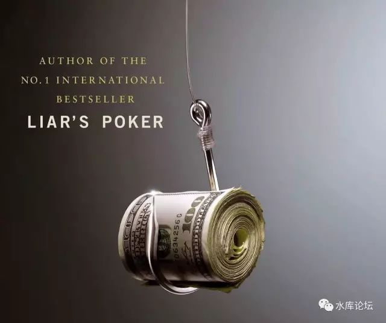
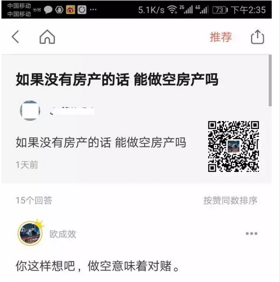
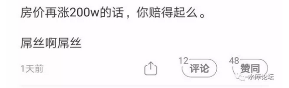
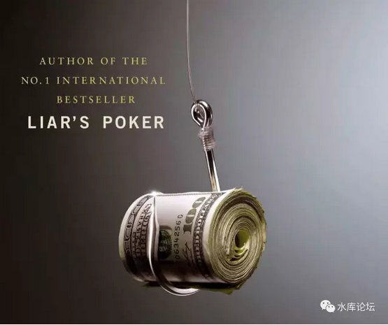
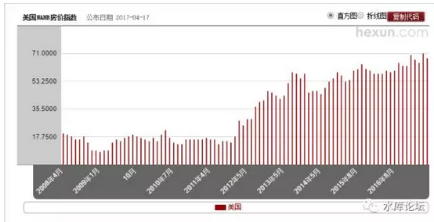

# 可以做空房产么 \#1480

原创： yevon\_ou [水库论坛](/)

**水库论坛**

微信号 Shuiku-net

功能介绍 科学尚未普及

2017-07-18

 可以做空房产么 ~\#1480~
========================================================================================================================================================================================================================================================================

 昨天周日，在《分答付费社群》例行值守。

有人问这样一个问题，感觉十分有趣。可以展开讲上一篇。

 

一）房地产股票

 

第一个方法，是做空房地产股票。

 

 

传统上三大屌丝聚集地：知乎，雪球，集思录。

如果你经常访问"屌丝社区"的话，你会发现，对于"做空"房产的需求是非常非常大的。

 

但是如何"做空"房价，屌丝们讨论来讨论去，好的办法却是不多。

第一重最先被想出来的，是做空"地产股"。

 

 

股市是经济的晴雨表。如果股价低迷，往往也就意味着产业低迷。

如果能象《大时代》刘青云一样，翻云覆雨，转手把地产股打到万劫不复。

甚至收购。

岂不是屌丝们扬眉吐气，地产霸权末日。

 

 

可惜的是，想法是好的，但是这套逻辑，却是完全违反经济学的。

首先，股市并不是很容易操纵的。

且不说有《证券法》之类法规保护恶意买卖。哪怕是无法无天，股市也有自身经济规律。

 

股票最终和赢利，增长，企业"内在禀赋"挂钩。

一只非常好的股票，你再怎么打压。最难把价格削去一半。

但价值总会要反弹的，不可能无限降低。

 

 

第二步说，中国股市和香港股市有很大不同。股权非常"集中"。

好比李嘉诚的长江实业集团（0001.HK）,李氏父子在其中的股权仅有13%左右，时刻面临攻击。

 

而中国的股市，绝大多数都是"国有股"。

部分看似股权分散的公司，还是"国有股"。

例如万科，几乎没有第一大股东。股权长期分散，内部人控制，腐败。

你去收购，好了，头破血流。

因此"收购/控股"这条路，也走不通。

 

 

好吧，大家一起抛售地产股，劝说身边所有的朋友，统统不要买地产股。

"饿死开发商"，房价能不能降下来？

 

股价长期低迷的坏处，主要是难以再融资。

股价不振，上市公司就难以配股\~定增\~高转送。KFS就被迫去借高利贷，最终把利润都吐出去，落个双手茫茫。

 

这里面就到了最讽刺的位置：

KFS其实是降低房价的。

 

傻空最悲哀的，是他们根本就不懂经济学。

-   生产者和生产者竞争

-   消费者和消费者竞争

-   生产者和消费者从不竞争

 

KFS并不是购房者的敌人，KFS是购房者的朋友。

因为KFS的"企业合作"成本，比"自助建房"便宜，因此才有了企业管理。

KFS彼此之间的竞争，进一步降低价格。

 

针对KFS的迫害，或者"地产股"的做空。

事实上增加了成本，推高了房价。

 

 

 

二）CDO

 

传统的金融工具不能满足目标，傻空们又把目光转向了"衍生产品"。

传说中，美国有一种复杂的复杂的复杂的CDO，宛如神话一般。

 

"次贷"危机的原理是什么，傻空也不大清楚，也说不清楚。

水库系列有一篇《手把手教你做次贷》\#F540，倒是可以一看。

 

 

但是，傻空要的并不是科学，人家要的是"希望"。

传说"大空头"这种电影里，主人公含辛茹苦，坚定信仰，坚信房价一定崩盘。最终获得了百倍千倍的回报。

 

首先要说的是，"大空头"这部电影是错误的。其中关于次贷的一切分析，全部都是错误的。

次贷根本不是那么回事。国内以讹传讹的转载再转载，翻译再翻译，全部都是错误的。

你跟着"大空头"做，大概率是赚不到钱的。而"大空头"整个团队，也并没有赚到如此高的回报。二三倍而已。并且很快地在之后几年亏完了。

 

首先，我们要解释一下，"大空头"团队并不是做空房价。

他们没有做任何事，也不可能做任何事，使得整个"美国房地产崩溃"。

他们仅仅是买了一个金融产品，"IF 金融崩溃 THEN 可以赚钱"而已。

 

 

举个例子，如果你预期房价即将崩盘，则你应该去买"搬家公司"股票。

因为楼市崩盘，肯定有很多人丧失住所。被扫地出门。

因而需要搬家。

 

你提早买入"搬家公司"股票，等金融风暴。

自然赚得盆满钵满。

 

 

 

但是你持有"搬家公司"股票，会导致楼市崩盘么。

绝对不会。

这个在逻辑上，属于"关联关系"，而不是"因果关系"。

 

老人一定有白头发。白头发染黑，你并不会变年轻。

逻辑是一门大学问。

 

 

 

其次第二个观点，"大空头"并不意味着看空美国楼市。

九年了，如果我们平心静气，抹去一切谎言和喧嚣的话。

"美国楼市真的跌过么"？

 

美国楼市已经创新高了。不仅是大都市圈，连乡村平均都刷了新高。

随着通货膨胀，楼市每年都有一点的涨幅。

美国，加拿大，澳大利亚，英国，新西兰，无一不是这样的规律。

 

站在2017年回头去看，所谓"2008大跌"只不过长线K图上的一个小波澜。

如图，美国楼市最糟糕的时候，也不过是局部地区的一些小麻烦。

真正WASP贵族精英居住的地区，你过去让人打折，人家正眼都不瞧你。

"买得起买，买不起滚"。

 

楼市并没有崩盘过。真正崩盘的是CDO，CDs的价格。

"大空头"团队发现了算法上的一些bug，真正崩盘的，是衍生证券产品的一些价格。

 

要指望楼市崩盘，靠CDS显然也不现实。

 

 

 

三）楼市期货

 

真的要真金白银，看空做空，恐怕只能实打实的搞"楼市期货"了。

 

好比石油期货，橡胶期货，期货和现货是联系在一起的。

-   期货市场崩盘了，现货市场一定崩盘。

-   期货市场看对了走势，做空就可以赚钱。

 

 

象香港这样以金融，地产立足的亚太都会城市。

早在1980年代，就开始搞"恒生指数期货"了。

而一直到今天，始终没有"地产指数期货"。

 

你纵观郑州商品期货市场，芝加哥商品期货市场。

全世界石油，煤炭期货很多，但是"钢铁"期货很少。为什么。

 

因为铜只有一种，石油有二种，煤炭有五六种，钢铁有几十种，而房产有几千种！

 

 

 

搞"房价期货"，假设以2017.07.01上海房价为准，起价60000元/m。

期货交易一个月，双方互有买卖，互有拉锯。

到了月终结算的时候，收盘价61000元/m。

 

如果你对于这个价格不满意，你就要进行"实物交割"。

假设我们交易的单位是"平米"吧。

（不是房产专业那个'平米'）

 

 

你说你交割内环线1平米。

-   老破小和汤臣一品，都算1平米么。

-   楼层户型朝向，怎么计算。

-   别墅怎么算

-   中环边的房子，可以交割么。

-   外环外的房子，怎么折算。对于折算比例不认可，怎么协调处理。

 

同样道理，有人实物交割，就有人实物提取。

-   提取哪一套实物，如何估价。

-   二个人同时看上，如何分先后。

-   手里只有5平米持仓，如何整取。

-   房屋维修养护，如何出租。

 

房产这种千奇百怪的东西，怎么能做到整齐化标准期货呢。

 

 

 

四）房产期货的设计

 

这个问题的答案是：可以做。

天底下没有二块一模一样的煤炭，没有二枝一模一样的小麦。

可是我们照样有煤炭期货，照样有小麦期货。

这其中的原理是，"忍受轻微损失"。

 

好比动力煤，因为其内含能量的不同，分为很多个档次。

但在郑州交易所就统一为TC。如果成色不足，按大卡打折计算。

 

美国和加拿大生产的小麦，质量也有好有坏。

芝加哥交易所统一以"蒲式耳"作计量单位。谷物质量相应换算。

 

在整个期货世界，交易量和最终结算的量，超过100:1

因此只要游戏规则透明，结算反而是不重要的。

 

 

 

昨天我想了一夜，对于"平米期货"的设计。可以适当调整。

基于完全市场化下的某一些大数据算法，可以获得非常近似，几乎所有人都接受的折扣计算方式。

如果真心想做这事，"平米期货"还是开得出来的。

 

 

具体的细节，我就不展开了。太琐碎技术化。

因为俺摩拳擦掌，马上要写最后一段话了。

 

最后一段话，显然是：以上全错

 

 

 

五）对赌

 

我们讲了好几种通俗的"做空房产"方式。

其中二种是不可行的。

一种是勉强可行的。

 

 

其实我们想说的是，"做空房价"这种事，从理论上就是不可行的。

不是技术上的事，是理论不可行。

不涉及技术细节设计，理论就说不通。

 

做空的核心是对赌！

 

金融的核心，是风险。

你看好一项资产，有人看涨，有人看跌。

 

傻空摩拳擦掌，兴致勃勃，

寿星公上吊，找了半天找到一根绳子。

他信心满满，想从"对赌"中赚取二百万。

 

 

可是任何工具，都是一柄双刃剑。

你看错了走势怎么办。房价并没有如预料般的下跌，反而大涨了怎么办。

你辛辛苦苦开了一个期货户头，却不料是催命符。

 

 

各位，房子上涨200W元，是非常非常快的。

你"看空"对赌，承担风险敞口，就意味着损失。

一旦房价三四个月就涨了贰佰万，你拿什么来输。

 

 

傻空有200W么。你有能力拿出200W来赌么。

拿不出就别瞎BB了，进场的资格都没有。

 

 

 

（yevon\_ou\@163.com，2017年7月17日暮）
