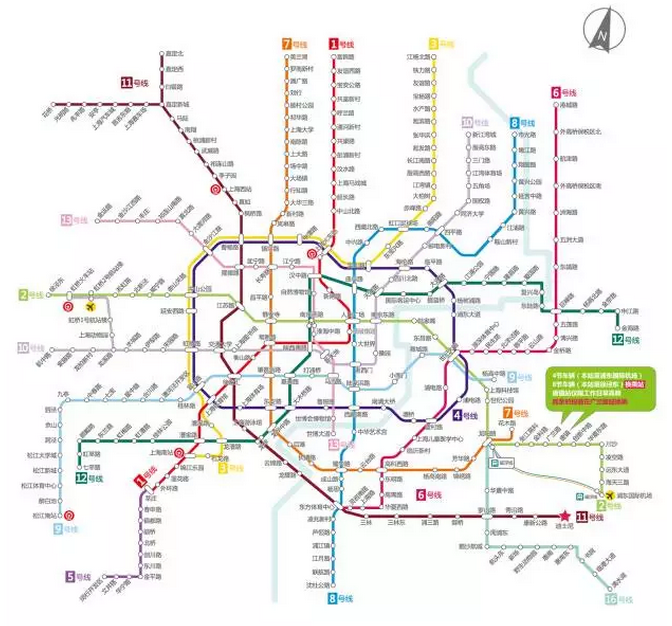
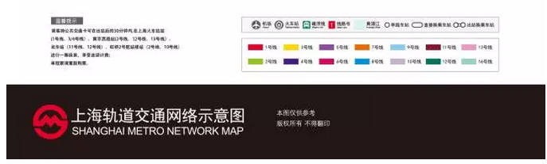

# 空置税可以降低房价么 \#1500

yevon\_ou [[水库论坛]](/) 2017-08-08

空置税可以降低房价么 ~\#1500~

 

无知，无良，无耻

 

 

 

一）前言

 

这二天没有题目可写。本想继续写《[[水库90后的故事]](http://mp.weixin.qq.com/s?__biz=MzAxNTMxMTc0MA==&mid=2651016073&idx=1&sn=820d3f3f05ae1ea5456bbe2fcf34b0e8&chksm=80721d9ab705948c3999a0d39de0952bb253f40316bcb440865b73a62d2477bb78ba3d8a79ec&scene=21#wechat_redirect)》，静流那个小猪扒一直没把发财秘籍+糗事段子传给我。所以也只能待机。

 

昨天刷朋友圈，无意中看见"光远看经济"写的《[[应对空置的住房征收"空置税"]](https://mp.weixin.qq.com/s?__biz=MzAwMDE3NjkxMg==&mid=2652539026&idx=1&sn=92a0ffce62d40206c2ed2cade428c506&chksm=8102ceedb67547fb365c3c292491e8e1adfe11c617dd46435c7faa21e9dded0cd267994a476d&mpshare=1&scene=1&srcid=0807DnPzNYaLXRHvErhRIP1w&pass_ticket=wmFVheNy%2BZ6F1%2FZMXq%2BMwlvCvJ9IPqo3fD73P3paguzdA4auMgL90rwI9SfDu05D#rd)》，掩卷叹息。

无知，无良，无耻！

 

 

哀民生之多艰，爱国贼弥生不绝。

科学尚未普及，真理仍需捍卫。

 

 

 

二）空置税

 

关于"空置税"，首先我们要讲一个故事。

 

如图，这是上海地铁线路图。

如果你专看深蓝色这条，南北通。这是地铁8号线。

 

尝试坐一下8号线，从沈杜公路出发。那么你会"怀疑人生"的。

空空荡荡，真心没什么人。

 

无论你是早上还是晚上，上班高峰还是下班期间。

沈杜高峰始发站（原航天博物馆），真心没人。三个人一节车厢。

 

 

庞巴迪的报价，地铁车厢一亿一节。

纳税人的金钱。你忍不住要怒吼了，"低效工程，为什么要造7节编组"。

 

7节编组，这么惨淡的人流量。那不是浪费么。6节不可以么，4节不可以么。民脂民膏的极大挥霍呃。

那怎么办。民科们要求征收"空置税"，遏制地铁公司的空置浪费行为。

地铁老总不懂运营，反倒要你上课来了。

 

 

且慢，且慢。

就在争吵争执的关头，M8地铁又开了几站。开过了江月路站芦桓路站，一直到了杨思站。

 

进了浦东中环以后，人流量一下子猛增。源源不断沙丁鱼般挤进来。貔貅有进无出。

而过了成山路，耀华路的摧残，加入大华锦绣华城的人流，你已经完全被挤得说不出话来了。

 

地球上有什么地方，人可以不借助外力，四肢离地腾空。一定是6号线和8号线地铁。

这是时候，你唯一会骂的"地铁公司为什么仅仅只有7节编组，为什么不是17节编组"。

太TMD挤了，呼吸里全是火元素。

 

我们知道，上海地铁M8，全程一共有30座站台。横跨南北，路径长达37公里。

在上海所有地铁线中，1,2,8,9，客流量有幸排在第三位。

 

M8是一定需要大编组的。而且紧锣密鼓地正在准备升8节。

请问，"沈杜公路站"征收空置税：合理么，当然不合理。

 

 

对于房地产，它的道理是一样的。

房地产是"耐用消费品"。对应的含义就是，房产的"使用期限"是非常非常长的，长达70年。

 

从2017\~2087，这么漫长的时间段里面。最初的二三站客流量稀少，要紧么。

不要紧。完全不要紧。

 

它只要在比较"核心"的区段。例如地铁成山路到翔殷路之间，房产在2030\~2060年之间，"客流量"比较旺就可以了。

就对得起观众了。

 

 

昔有富人，痴无所知。至余富家，见三重楼，高广严丽，轩（xuān）敞疏朗，心生渴仰，即作是念：我有财钱，不减于彼，云何顷来而不造作如是之楼？即唤木匠而问言曰："解作彼家端正舍不（fǒu）？"木匠答言："是我所作。"即便语言："今可为我造楼如彼。"

 

是时，木匠即便经地垒墼（jī）作楼。愚人见其垒墼作舍，犹怀疑惑，不能了知，而问之言："欲作何等？"木匠答言："作三层屋。"愚人复言："我不欲下二重之屋，可先为我作最上屋。"木匠答言："无有是事。何有不作最下屋而得造彼第二之屋？不造第二，云何得造第三重屋？"愚人固言："我今不用下二重屋，必可为我作最上者。"

时人闻已，便生怪笑，咸作是言："何有不造下第一屋而得上者？"

------《百喻经·三重楼喻》

 

古代有个富人，看见朋友的楼阁十分漂亮。便令仆人也照样修一个。

过了几天，他去视察工地。发现仆人们正在打地基。

 

大怒，说，"我只要三楼"。

"你们造一楼二楼干什么"。

 

 

 

关于房地产的逻辑，也是一样。

 

望京热的时候，租赁一房难求。可是十年之前，这里是一片荒地。

租给俺那个房东积了十年灰，当年阜通西大街荒得他心都伤了。

 

难道你可以说，"只要2015\~2035，望京需要有大量住宅"。

之前2000\~2015荒郊野岭。之后2035\~2085也荒郊野岭。

可能吗。

 

 

 

天底下本没有十全十美的东西，你何必苛求每一刻都效率最大化。

航空公司起飞，从来没有坐满的。难道要给你免费机票"空置税"。

大剧院看电影，从来没有满座的。难道要给你"空置税"。

飞机大炮军舰，很多直到退役，都没有发过一弹的。难道要征收"空置税"。

 

有些东西终其一生，一次都没有使用过。

但依然是共和国所必需的。

 

 

 

三）空置降房价

 

可能还会有人说，"我们知道，整个生命周期中，不可避免有空置现象"。

"我们不是否认你空置，我只想你租金降下来"。

"既然是空置，鼓励你降租可以么"。

 

在绝大多数SB的脑容量里，他们是把"空置税=降房租"直接划等号的。

我要告诉你的是： 

-   商人，是降低房价的。

-   空置，是降低房价的。

我们整个社会，应该[支持空置，鼓励空置，理解空置]。这样才能把房租降下来。

 

 

 

经济学是一门很玄妙的科学。在经济学里面，+A不是A，+B不是B。

你倡导A，往往会导致-A。

经济学里面，只有自由，才是真神。

 

我为什么要说马光远"学界耻辱，斯文败类"。

因为他所提的问题，根本就是经济学课本上有的。《宏观经济学》背后附的课后习题。

 

 

[习题：]

古典音乐或戏剧等文艺演出，一般很难达到满座。

为何不强制戏剧公司降价。既增加了剧组收入，又丰富了人民娱乐生活，岂不是一举二得。

 

 

经济学的题目，看似简单，其实极难。

越简单的题目，越难。

只有极高智商的人，才可以研究经济学。

 

当年哥哥在"课后习题"上卡了足足一年。

从马基雅弗利的角度看，是应该这样做。

但经济学本能，又告诉总有陷阱。到底应该怎样解释。

 

 

俗话说，当你经济学上有难题时，就去看看现实社会。

真实世界的答案，让人大吃一惊。

 

首先，"尾票打折"并不是通例。典型例子，诸如黄牛演唱会。

周杰伦演唱会，票价2000，开场15分钟后，黄牛票价直线下跌到1500.

因为黄牛知道，再不卖掉，他这个票就"过期"了。一旦唱完，票子就一文不值。

 

 

另一方面，也有一个反例，"航空公司"。

航空公司对于Last Minute的客户，不是打折。而是加收几倍的费用。

 

提前六个月买票，往往有各种折扣。飞美国三千多。

但如果你赶到机场，匆匆忙忙在机场柜台买"当天票"。

基本都是全价了。跨个省都要二千。

 

 

第三个例子，则是"雷达不动"。

真正的簪缨世家才知道，有钱人看戏，是从来不去VIP站台的。

如果你写"都市言情"小说，霸道总裁拉你去A区看球赛，那一定是Low逼。

 

真正的上流社会，都是在"中缝"看球的。

上层看台，下层看台之间，有一圈中缝。里面有几十个包厢。

包括直播室，演播室，明星更衣室，都在这衣带。

 

 

每个包厢都有冷气空调，贵宾服务员。座位在20人左右。

哪怕刮风下雨，包厢是不畏寒暑的。

 

而这些包厢，采取的是"卖断制"。分属于数十个公司大豪门。

要说"浪费"，这才是最浪费的。

 

每一场，无论再如何烫得发紫，一票难求的球赛。

"包厢"里的人数，从来都不到1/10.

绝大多数时间空空如也，一个人也没有。

 

大型体育馆采取"卖断"制度，一次性把包厢贴给豪门。这是对他们"空置"利用率最低的方式。为什么。

 

 

这许许多多的问题，困扰我很久。想得我头痛。

到最后得出结论，当然是：以上全错。

显然这三种模式，都违背了"管制原理"。你真想管制，指定了A规则，BC肯定不适用的。

 

 

真正的经济学解释，应该是"运营方拥有一切权利，随便他们采取何种收费模式"。

只要他们最终总收入最大化。

 

剧院如果打折，就会得罪"买正价票"的客户。最终总收入甚至会减少。

黄牛开场打折，航空公司急客加价。体育馆打包卖包厢，其实都是为了"收入最大化"。

不管业主采取哪种商业模式，他最终能收入最大化就可以了。

 

 

而"收入最大化"是什么。在经济学上叫做"消费者剩余"。

消费者剩余不仅仅是消费者剩余，同时也是生产者剩余。

意思就是，需求越大，供应越大。

 

 

航空公司有更多的销售额收入，他们才会去买更多的飞机。

体育馆运营公司有更高总收入，才会建更多体育馆。

歌剧团卖最多的营业额，才会有更多剧团。

-   你别盯着现有几架飞机利用率啊，你要想公司又买新飞机了。

-   凡是不涉及生产者的分析，统统都是耍流氓。

 

 

回到"空置税"的分析。房东有权采取他们认为合理的任何方式，去最大化他们的房租收益。

房租的收益越高，就会有更多的人去买房子，就会有更多的人去建房子。

 

 

-   什么叫做浪费，物资处于黄沙，水泥，钢筋的状态。才是[最大的浪费]。

-   建国前三十年，才是最大的浪费。

-   而造成房子，无论利用率多低。都比你黄沙水泥，更不浪费。

 

空置是降低房价的。

空置是降低房价的。

空置是降低房价的。

空置使得我们整个社会的财富更多。

 

 

 

四）哲学和正义

 

不知道"空置的必然性"，是无知。

不知道"空置降房价"，是无良。

而我们讲的第三个道理，则是无耻。 

 

-   "买不起房子，是因为房价太贵。KFS不肯降价卖给我"。

-   "租不起房子，是因为房租太贵。房东不肯降价租给我"。

-   "娶不起女子，是因为ZMN礼金太贵。女孩子都贪财爱富"。

-   "赚不起工资，是因为老板剥削黑心，不肯给我加工资"。

 

这一类论调，是不是看着很熟悉。

其核心论调是："我永远都是对的，错的都是你"。

 

 

在水库之前有篇文章《[[老虎吃人，专家更吃人]](http://mp.weixin.qq.com/s?__biz=MzAxNTMxMTc0MA==&mid=2651014875&idx=1&sn=b70540409c37a834ca762adb478d02b0&scene=21#wechat_redirect)》~\#F560~里，我们说道，其实这是一种思想，叫做"无限民权"。

 

无限民权的意思就是：我[永远]是对的，错的都是你。

屌丝从众，只要给自己戴上一顶"人民，大多数，政治正确"的帽子。就敢寡廉鲜耻地"永远正确"。

就敢扮演舆论上的铁金刚，刀枪不入，为非作歹。

这是极恶的行径。

 

 

事实上，稍微有一点生活常识的人。完全可以分辨，房东也可以反过来吐槽的。

-   "为什么我的房子一直卖不掉，屌丝不要脸，死活不肯加钱"

-   "为什么我的房子一直租不掉，屌丝不要脸，死活不肯加钱"

-   "为什么美女一直嫁不掉，屌丝不要脸，赚不出聘礼"。

-   "为什么从来不加工资，呸，我还想减他工资呢"。

 

 

解决方案呢，很简单：征收"不买房税"。

-   大学毕业，一年不买房。没收工资20%，口头警告，禁止提干。

-   大学毕业，二年不买房。没收工资50%，没收一切娱乐电子产品。限制旅游吃喝出境。

-   大学毕业，五年不买房。没收100%银行存款。流放青海搬砖。

您看，去库存"不买房税"不也一样能做到么。

 

 

屌丝的心里，从来没学会尊重人。

没学会把对方，摆在同样平等的位置。流氓土匪习气。

AB买卖不成，A有错，B也同样有错。

 

为马光远留言点赞的人，这辈子注定悲苦终身。

 

 

 

 

（yevon\_ou\@163.com，2017年8月8日暮）
