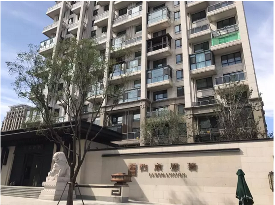
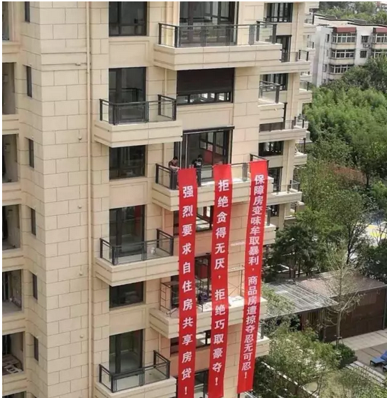
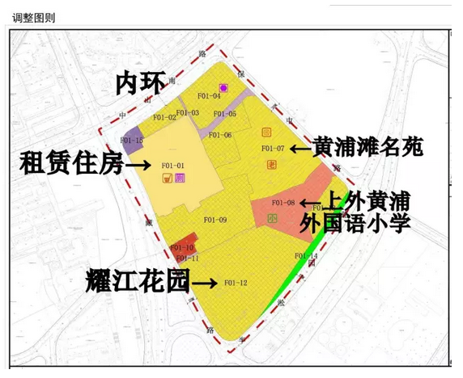
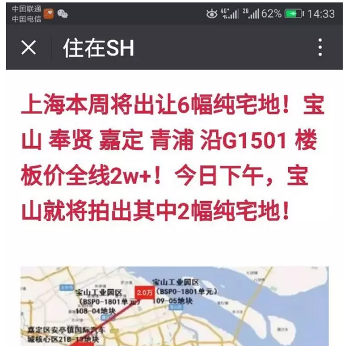
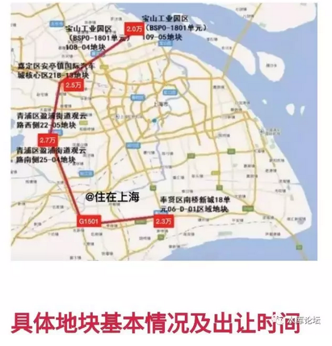

# 买卖贵，还是租赁贵 \#1510
-------------------------

原创： yevon\_ou [[水库论坛]](/) 2017-08-29

 } 买卖贵，还是租赁贵 ~\#1510~
========================================================================================================================

"十三五"期间，通过收购、租赁、改建等方式收储不低于100万套（间）村民自建房或村集体自有物业，经质量检测、消防验收等程序后，统一租赁经营、规范管理。

 

 

 

一）     隔离墙

 

近期，发生了很多事。

 

第一件事，是北京的西宸原著和玉璞家园。

 

（图片来源：二环十三套）

 

这二个小区，原本是同一个地块。

KFS拍下来了以后，在当中起了一堵墙。

一边是豪宅商品房，卖120000/m

一边是政府规定的限价回购房，卖22000/m

 

 

我们知道"白左"的一个特点，就是他特别能闹。

按闹分配，没事搞事情。

于是这帮人吃了政府的肉汁，还要给政府添乱。跑到妈妈那投诉；

"凭什么我付了3元物业费，享受不到隔壁10元物业费的花园绿化"。

 

 

这件事的是非对错，法律权责，不在我的讨论范围。

水库也不感兴趣。

 

我们想问的，是另外一回事。

 

假设，政府高官已有公论。墙非拆不可。

请问，会对楼市造成什么影响。

 

 

这个问题，很少有人真正想过。长篇累牍的分析，也没有人写到。

但是用经济学原理，dT\>0，却很容易解释。

 

 

你设想一下，如果你是一个"汽缸发动机"厂商。专为奔驰牌轿车，设计4L以上高容量高科技内燃机。

"发动机"向来是汽车行业的核心技术。欧美厂商拥有非常大的技术优势。每一点点功率的提升，都是迭代的技术难题。需要经过无数无数的风洞实验。

 

 

好了，现在来了一个"官僚"。他强制要求："你那个发动机啊，必须装一个隔板"。

分为2.5升和1.5升二个舱室。

设计师们大破眼镜。这样做的结果，"燃烧"效率肯定大大降低。热机性能跌一个数量级。汽车工业倒退十年。

 

 

这就是"dT\>0"

当一个工程师，拥有完全的自由，拥有完全的施展空间时。

他才能做出最好的产品。发挥最大的性能。

而每一层约束，每一个限制条件，每一块非猪油，都会减低发动机的功率。最终退回石器时代。

 

 

好了，现在来看"北京隔板"事件。

当KFS拥有"自由"，他才能设计出更符合"消费者"口味的产品。

因为"隔板"的存在，才有小桥流水，才有仙鹤花园。

 

如果"广场舞"大妈入侵"大观园"，则一切文明和礼遇都将不复存在。

满地都是痰渍。

 

强制拆除隔板，会降低社会的总财富。

 

以前KFS可以用100亿来拍一块地块，以后该地块就只值80亿了。

因为生产不出价值。

 

"水晶之夜"显示为[整个北京市政府的减收]。

生产力的损失，财富的损失，无中生有的成本。

 

当然，zz上的考虑，就是另外一个话题了。

 

 

 

二）     不可售

 

第二个故事，参见新闻《[[超级重磅：上海再推6幅黄金地段100%不可售住宅用地！距离黄浦江仅仅一个路口！]](https://mp.weixin.qq.com/s?__biz=MzAxNTE3MzY2OA==&mid=2651410408&idx=1&sn=8603e198195fdfed755cd7f0875abc5c&chksm=8075fea3b70277b5b17d268b4ae1b7e3a87c2d82262d8c3ad02879ff0ce93f73a2566c5e5ee7&mpshare=1&scene=21&srcid=0827ixMNXVYsHLlgJ5zmbVwr&pass_ticket=LwCJf#wechat_redirect)》

 

 

黄浦区是上海No.1的地段。绝对的大区领袖。

旁边的耀江花园，目前二手房在110000\~120000/m之间。这一个地块，若拿去拍卖，至少是百亿以上数量级。

 

 

这么大的一块土地，如今却拿去做了"租赁住房"。

租赁需要装修，装修需要折旧。

算上国营企业的低效率。整个装修折旧≈租金，几乎相互抵消。

上海市政府，净损失了100亿。

 

据说，这样做的原因，是为了"抑制房价，降低住房负担"。

算上上周拍的四块"只租不售"郊区地块，上海市政府，在土地市场的减收，已达到了600亿之巨。

 

 

国家政策如何，我们不予置评。万寿无疆万万岁。

俺们就从经济学上讲一讲；

 

只租不售，能否降低住房负担？

 

答案是否定的。房价将大涨。

 

 

 

三）     租赁贵，还是买房贵

 

逻辑十分简单，一个公式：dT\>0

生产的方式和组合，是否减少了。消费者的选择，是否减少了。

 

 

 

买房子贵，还是租房子贵？

关于这个问题，99.99%的人都回答错了。或者说，身体更诚实。

 

目前中国大城市的房租，已经跌得了惨不忍睹。

北京上海，大约在1.2%/年左右。

省会城市，在2\~3%左右。

四线城市，在4\~5%左右。

越超大的城市，租金回报%越低。

 

 

目前的"超大城市"房租，已经跌到了如此地步。以至于房产以70年计的话，不算复利，70年的总房租都不到100%

一些键盘傻空，知乎大V，立即得出了"租房更便宜"的结论。

 

你把钱存在银行，或者余额宝。卖了房子去做理财。

每月付完房租还有剩余。

岂不乐哉。

 

 

 

这99.99%的人，都没有受过正统的"经济学"素质训练。

经济学的精义，不要看一个人说什么，而要看一个人做什么。

如果大家嘴上都骂房价高，最终售楼处几千个人抢一套房子，售楼处挤塌掉，那房价就是不高。

 

真实的"市场"是怎么样的呢。

真实的市场，"买卖"占据绝对大头。人群份额在90%以上。

选择"租赁"的人群，连10%都不到。而且其中很大一块是买不起，在攒首付。

一旦攒够了，还是要毫不犹豫地冲去买的。

 

嘴上说不要，身体却是实诚的。

真相只有一个：

买房比租房更便宜！

 

 

市场经济是一场很玄妙的事。"市场"永不犯错。

如果市场错了，那多半是你的三观错了。

 

虽然大家都在喊，"房租回报率"只有1.2%，哪怕再涨几倍房租，都难以覆盖财务成本。

但事实的真相就是，"听其言观其行"，[所有人的内心深处，还是深深相信"买比租划算"。]

真正铁定了心肠和你死磕三十年的，一个都没有。

 

 

为什么，因为这里面不可测的，主要是一个"失控"风险。

你在房产上的头寸，是-1套（负一套）

你迟早要买的。看空的最大收益是100%。

而"踏空"风险10000%，上限是天空。

 

 

房租的确很低。

房租过去几年的增长率也很低。

房租未来几年的增长率也很低。

任何财务模型计算，租房都便宜。

可是，万一"失控"，万一房租涨10倍呢。

 

 

\[以下□□□□□违禁，删除200字\]

现代战争的支出，大概是每天1万亿。

打四天，就是四万亿。

打三个月呢？

 

 

"市场"是聪明的。市场永不犯错。

买房比租70年更便宜。

 

 

 

四）     租赁房

 

说回"只租不售"房源的话题。

 

从经济学上讲，存在三种档次的效率；

-   最高效率：KFS可以选择出售，出租，甚至干脆捂地。

-   中等效率：KFS建房出售

-   最低效率：KFS只出租

 

最高效率的时候，"房价"最低。

和一般人直觉的相反，经济学是支持"捂地"的。KFS可以自由捂地的时候，房价最低。

 

 

dT\>0，同样一块猪肉，又能做糖醋小排，又能做鱼香肉丝，则饭店的收入最高。食客也最幸福。

dT\>0，同样一块土地，KFS可以选择建房出售，可以选择建房出租，可以选择捂地。可以选择合作，合伙，拍卖，上市融资。则这时候"生产力"最高，社会最富裕，购房负担最轻。

 

 

如果政府限制了"只租不售"，其实是"效率和选择的损失"。

对消费者来说，租赁比买卖更贵。

你如果强制屌丝们，只能付70年的房租。则他们最终的总支出，会超过房价N倍。

 

 

 

五）     租赁狂潮

 

从一年前开始拐弯，中国目前总体的"房地产调控"思路，可以说是"租赁狂潮"。

 

 

自最初的"雄安新区"建设，所有不动产买卖一律停止。雄安所有房产只租不售，想建立一个"地上的天国"。

大力发展租赁，被视为一个杀手锏。调控破局的思路。

 

 

知乎的"工业党"工程师们，完全没有经济学，金融学的复利常识。

键盘打打，自以为"租金便宜"。因此想要大力发展租赁市场。

[[妄想以3000元的房租，解决800W元的学区房困难。]](http://mp.weixin.qq.com/s?__biz=MzAxNTMxMTc0MA==&mid=2651016047&idx=1&sn=408f81d688243b299961f255336ffdaa&chksm=80721d7cb705946a7723e948e77cf95d207f3027c07c805642961156c59e44e98bbaa3f5eed2&scene=21#wechat_redirect) 

 

 

被这些"工程师治国"鼓吹出来的"租赁狂潮"，其实是一场灾难。

你迟早会发现，租赁比买卖更贵。

 

当你心安理得，花3000元租了好几年之后。

房东（政府）会突然找到你，要求你付60000元/月的房租。

然后你会狠狠给自己一个耳括子，后悔当年哪怕800W买套房子，也比现在划算。

您还别嫌贵，难保一碗面600元呢。

 

从来没有任何人，保障你租金不会"失控"式上涨。

就象没有任何人，保证你的退休金，可以扛得过通货膨胀。通胀的倍数，一定是出乎意料的。

 

 

一块猪肉，既要做糖醋肉丝，又能做尖椒小炒肉，才算是物尽其用。

"租赁狂潮"这一场反智运动。我并没有怜悯。

反正说了你们也不信。最终报应还是屌丝们自己扛。

 

请记住：

 

70年房租的总支出，将远远超过房价！

 

 

 

（yevon\_ou\@163.com，2017年8月29日午）
