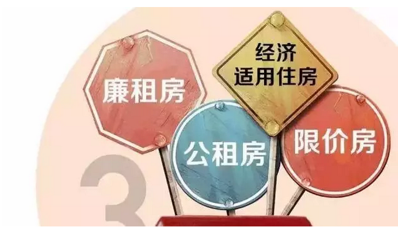
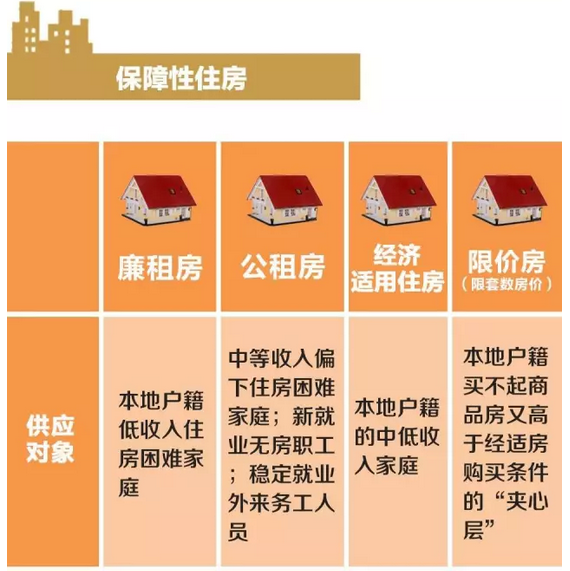
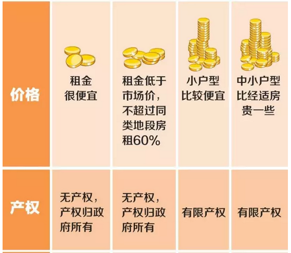
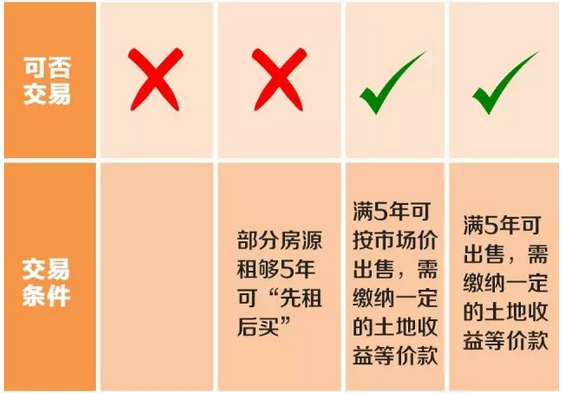
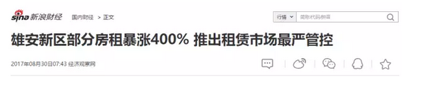
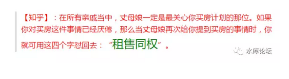

# 不再卖房的未来 \#1520
---------------------

原创： yevon\_ou [[水库论坛]](/) 2017-08-31

不再卖房的未来 ~\#1520~
===================================================================================================================

 

【ZT】1 商品房 市场价买进 拿到产证后 随时可以交易  2 自住房
市场价7折买进  五年内不允许交易   3 共有产权房
7折买进7成股份，五年不许交易 ，五年后只能市场价转让7折股份。
看懂的点赞吧！（史惟臣）

 

 

 

一）万世不易的财富

 

我想，关于"卖地"这种事，有关部门的某些人，悔得肠子都青了吧。

 

 

1992年之前，中国卖的是"永久"使用权。

中国最早的一批房产证，叫做"房改房"。对于房改房来说，是没有"使用期限"的。

 

你如果翻鞍山新村，杨浦新村一些老房子的产证。上面是没有"有效期至xx年"这项的。

这些房子，默许是无限年的。

 

 

因为众人众所周知的"70年使用期限"，并不是亘古有之的。

在1992年之前，中国所有的房子，默认都是"无限期"。

1992年之后，才开始拍地。才开始有市场化的土地供应，才搞出了"70年批租"。

 

对于工人阶级手里的"房改房"，你自然不好意思去再追上去，敲一个戳。

因此上海默认的潜规则，是这些房子"交易一次"。

只要你交易一次，出新产证了。就从新产证的日期算，重新给你70年时间。

 

 

 

想当年1992时，这个"70年土地批租"，不知道遭了多少口水，多少口诛笔伐。

老百姓出钱买的东西，居然还有年限。还不能天长地久。

习惯了"做主人"的工人阶级，不知道骂了多少次。

 

没想到时移世易，到了今天，连带着"70年使用"期限。

有关部门也悔得肠子青了。

 

 

为什么后悔，因为升值了。

最早的时候，上海拍卖闵行莘庄的地皮。要价不过150W一亩。

随着十几年来的沧海桑田，这些土地，早就千百倍升值。先是1000W一亩，再是5000W/亩。

现如今，连带着周浦地王这种垃圾地段，都能拍5000W/亩了。

 

 

和"土地升值"相对应的，则是房产的千百倍升值。

莘庄的房价，从3500元/m，涨到10000元/m，再涨到今天的约60000元/亩。

连带着房产升值，带动一大批人"发财"。

 

看见发财二个字，有关部门又坐不住了。

 

 

 

二）拍地

 

从新世纪初，就一直有砖家跳出来说："地卖贱了"。

经书卖得贱了，只收了三斗三升米粒黄金，让后代儿孙没钱使用。

 

 

地方政府卖地，按照标准的说法，是为了"筹措建设资金"。

每一个城市的发展，道桥路隧市政绿化，耗费的资金都是天文数字。

想要尽快地大发展，仅依靠工商业的税收，肯定是不够的。

通过一次性"预收"70年土地使用费用，显然是一种很好的方法。

 

但是地方政府很快地发现，"地卖贱了"。

地卖贱了？象周浦罗店这种鸟不拉稀的农田，卖到5000万/亩，保本价房价80000/平米，难道还是卖贱了？

 

答案是，还是卖贱了。

 

 

 

因为从1993年开始的各地"土地出让"市场。包括地方政府在内，都没有算计到"四万亿"。

他们没有想到，在未来的时代里，货币M2可以增长得这么快。

物价可以加一个零。

加二个零。

 

因此"土地拍卖"在当时，即算是一笔很好的买卖。可是把时间拉长到十年，二十年。Dfzf们惊讶地发现，他们把黄金卖了白菜价。

 

土地，是对抗通胀最好的利器！

 

 

 

三）贪心

 

从来没有干净的赌局，哪里有利益，哪里就有犯规。

 

赌输了，就要掀桌子。

古今中外，莫不如此。

 

 

巨大的利益面前，上万亿的利益面前，又怎会让它平白溜走。

"地卖贱了"，调整和对策，随之而来。

 

第一个做法，是急剧"缩紧土地口子"。卖地指标被严加控制，绝不允许把下任的地也卖了。

 

第二个做法，是"严打二级市场"。建立土地统一调配中心，禁止KFS之间私下土地买卖。

 

 

曾经有一段时间，政府内部有人提出"房产税"。

房产税就其字面本意，房产收益的12%归政府（哪怕自住）。

这意味着政府[平白没收]12%产权。

 

后来，政府内部的人都觉得，这事实在TMD太不要脸，太无耻。

把D的伟光正都塌光了。

因此也搞不下去。

 

有一个很简单的检测方法，你身边有哪个人念念不忘"房产税"。

分析问题动辄以房产税出发。

必属"人渣"无疑。

 

 

对于dfzf来说，他们的"诉求"很简单。

地卖贱了，哪怕现在卖的"天价"。五千万一亩，周浦八万。

从长远看，依然是亏了。

货币可以加二个零。

 

 

那么，应该这么办。

聪明人都想到了，"入股"。

 

 

 

四）入股

 

对于入股地产来说，第一个产品是"经济适用房"。

 

经济适用房在第一次出售时，必须交10%的房价给税务部门。

从会计上讲，这就是"入股"。

政府占了10%的股份。

 

 

比经济适用房更进一步的，北京之后又搞出了无数的新名目。

自住房，共有产权房，廉租房，限价房............

他们的共有特点是什么呢，是"有限产权"。

                             

如图，自住房的定义，是五年内不许交易。

共有产权房的定义，百姓仅占70%股份。还有30%是政府的。

 

我们完全可以想象，"共有产权房"再进一步，就是七折的七折，百姓占49%股份。

甚至七折的七折的七折。

 

 

 

五）租赁时代

 

事情的高潮，要从"雄安时代"开始。

雄安规划从一开始，就宣布"只租不售"。整个雄安新区，土地和产权完全捏在新区手里。一点都不会和你分享。

 

当然，我很不愿意贴这条新闻。和本文无关；

 

 

其实近期还有一条"热点"新闻。所谓的"农地小产权"租赁入市。被各大媒体爆炒：

 

《[[楼市最大杀招出炉？！以后房子或许能打到二至三折了！]](https://mp.weixin.qq.com/s?__biz=ODc5MTk1MjYx&mid=2658254299&idx=1&sn=422151b02118b17dbfe511be2cfc7374&chksm=07dd9ec930aa17dff859c277ccce3a4ea4168be7828835b86bd3642c34a18a5c4b22ffd47250&mpshare=1&scene=21&srcid=0829OnHavS5YZTKFspC1nwWO#wechat_redirect)》

《[[国家又发文了，调控思路发生重大转变！]](https://mp.weixin.qq.com/s?__biz=MzUyOTAwMzU0NQ==&mid=2247484479&idx=1&sn=6db1767598a3b0670ae1f95584d103bd&chksm=fa66e149cd11685ffecbafefbc174705605a782cb91a4c0020802aa5c740145ae02ea9ea1628&mpshare=1&scene=21&srcid=0831txRvc1ODbS9l4naIc7XK&pass_ticket=dDH5H#wechat_redirect)》

《[[楼市王炸！两部委联手放大招，关乎7亿人！]](https://mp.weixin.qq.com/s?__biz=MjM5NjQ3NTYwMg==&mid=2651937801&idx=1&sn=9956f423dd3784b59805034df855bb26&chksm=bd0d5bb48a7ad2a2f3941fc82626155e016d7c41cce7523cf4e528e7c07fb15c53869abd1a08&mpshare=1&scene=21&srcid=0829df9EC8SA9bdrKYfsWz4H&pass_ticket=dDH5H#wechat_redirect)》

 

我说你们啊，是图森破。

看问题只看表面，丝毫不体悟更深层次的道理。

 

"农地小产权"入市，会对房地产市场造成什么影响。

难道是从农村的交通距离，村长红包，建筑质量等因素来分析么。

身前一尺，鼠目寸光。

 

 

"农地小产权"租赁入市，意味着一个新的时代。

"租赁时代"的来临。

 

土地是抗通胀最好的利器。某些部门再也不想卖给你了。

在不遥远的未来，整个中国房地产市场。将再没有"出售"的产权。

 

卖给你的，从100%产权，到70%，到49%，到35%，最后到0%

您就去租吧。

 

而租金，是完全不能避抗通胀的。

租房70年的开支，将远远超过买房。《[[买卖贵，还是租赁贵]](http://mp.weixin.qq.com/s?__biz=MzAxNTMxMTc0MA==&mid=2651016182&idx=1&sn=d6e1d91e3ce5d9ac3b265adfccf4b4c6&chksm=80721de5b70594f328d38c5d6b2365fdeee358aa0f15af61c0ca14a1662e3521f5c5661bf984&scene=21#wechat_redirect)》。

 

傻空已陷入绝境。

 

 

 

六）通胀时代

 

中国的国家体制，和美利坚有很大区别。

美国是一个以"私有制"为主体的国家，农场，矿山，湖泊，甚至名山大川，多是从属于个人的。

 

而中国是一个"公有制"的国家。农田，矿山，鱼塘，绝大多数在政府手里。旅游景点，商厦寺庙，也从来没有承包给个人。

你捏在手里的，只有RMB。

 

这意味着什么，意味当通胀来临时，你无处可逃。

可供"销售"的，可供老百姓购买的，没有任何一件保值的东西。

 

 

长久以来，房地产/土地作为唯一的"逃命口子"。

在过去十几年，不动产完美地对冲了货币。持有不动产，使得"滥发纸币"无法[剥削到你]。

这么多人的逃命口子，就是因为地方政府为了"筹措建设资金"，而拍的几块地。

 

 

"租赁时代"，这个口子，正在逐渐地关闭。越来越小了。

大网已经撒开，围剿已经开始收拢。

 

你纵观近年来主推的政策，无论"租售同权""小产权租赁入市""只租不售""共有产权"......

这些事，指向同一个终点：把你往租赁里赶。

 

 

我们可以想象，未来的时代，是一个"不再卖房的时代"。

从限购开始，就已经不允许你使用"实物"，保护你的劳动积蓄了。

民无立锥之地，何苦。

 

"通货膨胀"是非常非常可怕的。大排面从5元/碗，到现在30元/碗。也不过用了几年。

未来大排面600円/碗，房租涨到60000/月，也是顺理成章的事。

 

租赁时代，屌丝真的是没生路了！

 

 

 

调控是选择的减少，dT\<0，表现为全社会净财富的减少。

网已经撒好，后路已经包围。

面对如此不利的局面，屌丝社区却是一片狂欢。动辄"租售同权""房价跌到二三折""七亿人大事件"。载歌载舞。

 

 

1840年，英军屯兵珠江口岸，鸦片战争一触即发。

在大战的前一夜，英国统帅和中国提督，同样的辗转难眠。

这是人类军事史上的奇事，因为双方指挥官，思考的是同一件事：

 

"对方，他怎么就不害怕呢！"

 

 

无药可救啊。

 

 

 

（yevon\_ou\@163.com，2017年8月31日午）
