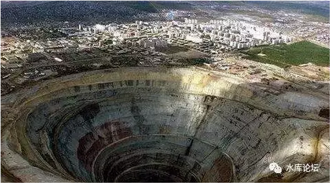
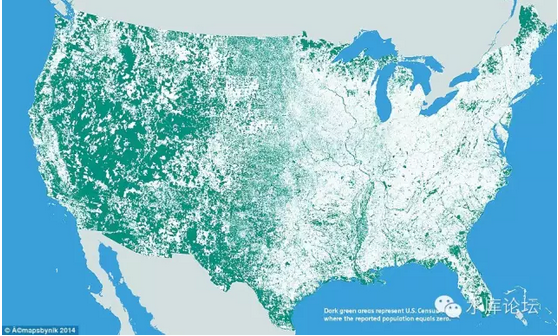
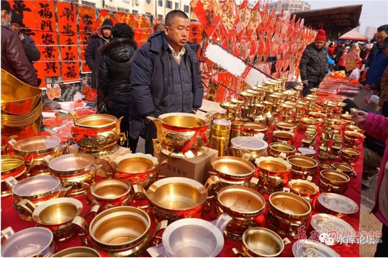
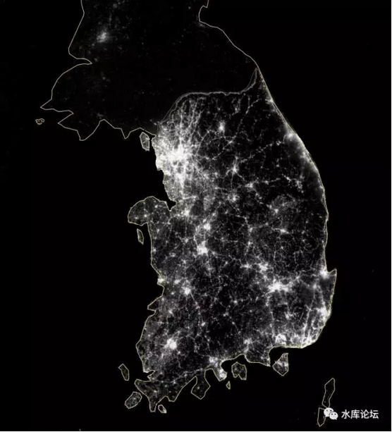
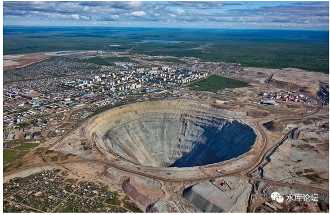

# 

地产这一行，究竟多少个城市可以活下来

 

 

 

一）农田

 

我们有三种最基础的资源：农田，矿藏，人力。

 

 

农田，有其天然的特性，即空间的分散性。

1979年，改革开放前，中国还是一个农业国。13亿人口，如果以浓度图来说，那是非常"均匀"地分布在神州大地的。

 

因为当时中国最主要的人口是："农民"。

最主要的职业，是农业，种植业。

 

而农业，是一种和"农田"紧密联系的职业。

可以说，农田在哪里，农业就在哪里。仅仅以人的双脚，活动区域是非常有限的。往往也就一二个村庄。十几公里顶天了。

 

 

1937年，日本侵略中国。兵精粮足，正面战场的火力，日本重炮是中国人的十倍。

按照《李宗仁回忆录》，当时日本"可以打下他们想打下的任何一个中国城市，包括重庆。可以守住他们想守住的任何一个中国城市"。

 

但是日军，陷入了深深的绝望之中。因为他们所面对的，不是"任1个"，而是1000个中国城市，10000个中国县城。

 

当时的中国，是一个彻底的农业国家。虽然有4万万同胞人口，但极其平均地分散在广袤的华夏大地之上。其毛细血管之深，甚至深入到了每一块梯田，每一块山丘。

 

中国的农业化特色，使得中国政权无力发挥四万万人的国力。

整个抗日战争，中国的人力动员率只有3%，位列七大国最末。

 

但是另一方面，日本人也找不到"中国力量"决战。

泥足深陷，宛如踏入了沼泽流沙。

 

 

（美国的人口图。如果每一个1KM的土地完全没有人居住，就标为绿色。大约47%的美国国土是无人区。参见《三代之治7\-\-\--番外篇民族性国家的形成》\#F129）

二）赶集

 

和农田，农民，农业国相联系的，第二步是"集市"。

 

所谓"赶集"，这是一个无比重要，却又逐渐被淡忘的词。

每一个农民都需要赶集，通常是每周一次。或者每月一二次庙会。

 

小农经济虽然自给自足，但毕竟还是有商贸需求的。

例如平原地带，粮食多而柴火少。山丘地带，柴火多而粮食少。

"柴米交易"，即使在最原始贫穷的地区，也是广泛存在的。如果再算一些土家织布，贸易就很丰富了。

 

 

如果我们仔细观察"赶集"的特征。会发现每一场赶集，步行最多二三十里地。脚程大约是二至三小时。

因为赶集需要考虑"经济性"。早上出发，晚上回来。单程二三个小时。已经是极限。

 

"赶集"的需求，商业的刺激，诞生了一批村镇。

譬如上海南汇，下辖宣桥镇，六灶镇，大团镇，万祥镇.........

每一个镇，都有自己的人口聚集。还有一定的商业，饭店供销社大卖场。

这些"镇"的兴起，就是因为附近农民需要赶集，交易和市集的需求。

平均每个镇50平方公里。

 

将这个思路，继续再外沿，外延，外延，我们一步步向前推算。

交通工具的发展，会不会使得中小村镇消失。

答案是，是的。

 

 

2000年后，中国进入工业化时代，其中之一标志，是汽车产量的突飞猛进。连续突破了100万辆，200万辆，1000万辆的大关。

随着汽车的遍地，路面急剧硬化。四通八达的高等级公路，连接四方。

 

居住在北京上海等大城市，熟悉地产的人，敏锐地感觉到：地段不值钱了。

因为以前上海郊区是真不值钱。你给员工分房，分一套张江或者莘庄的房子，人家宁可和领导闹翻。也死活不要这套。

不是不要，是真心没法要。

 

1990年代，上海平均上班通勤时间1.8小时。在这么巨大的牺牲之下，城区边界仅到内环线。

一种以Bus为核心的城市交通，他就是那么慢。

 

起早贪黑，住到10KM边缘也是极限了。

住到莘庄张江，每天上下班2.5小时。不是不想要，是没法活。

 

 

但是交通工具的技术发展，彻底颠覆了这一切。

首先是轨道交通，其实是城市高架桥。最后则是汽车的普及。

汽车普及以后，人们普遍发现，20\~30KM根本不算事嘛。

 

如果我们对"合理通勤"的定义，是每天1.5小时单程。

则汽车的1.5小时，往往可以开出去30\~40公里。"城市"的概念，因此极大延伸。

不到十几年的时间，中国十大城市，纷纷长到了30KM的边界。

 

 

庸人只看眼前，哲人举一反三。

在"汽车文明"颠覆了城市内部地段之后。也有有识之士想到，"高速公路"便利，会不会颠覆"省会---地级市---县镇"格局。

造成三四线城市的空心化呢。

 

 

 

三）进城

 

我们看隔壁的邻居：韩国

大韩民国面积10万平方公里，和浙江省等大。粗俗点说，类似于中国一个省。

 

 

韩国人口5100W，其中首尔+仁川+京畿道人口2600W

也就是说，全国50.2%的人口，生活在"首尔都市圈"。

 

如果看灯光图，则效果更为明显。

 

韩国的第二大城市釜山。人口400W。

第三大城市Daegu，因为举办世界杯而出名。但市区只有150W人，已经完全没存在感了。

 

甚至有人开玩笑说，所谓"韩国"，韩国就是一个城市："首尔"。

拿下了Seoul，就获得了韩国50%的人口和60%GDP，剩下也不用比了。

 

 

如果单举一个韩国，有点"孤证"的感觉。

则我们看看日本，日本1.1亿人口，其实日本=东京

英国6500W人口，英国=伦敦

法国6700W人口，法国=巴黎

俄国1.4亿人口，俄罗斯=莫斯科+圣彼得堡

 

这些世界第一流的强国，工业化国家，捷克斯洛伐克匈牙利葡萄牙，发展到最后。

整个英国法国，往往退化成一座城市。

 

这并不是特例，反而是世界普遍现象。

因此，我们要问：[中国发展到最后，还能剩下几座城市。]

 

 

简单计算一下，韩国面积10万平方公里。

南北长约500KM，东西宽约250KM。

 

工业化国家，高速公路已经是标配。

高速公路的数据，和一般人想的不同。不是"油门一脚"踩到底的奔速。

扣除各种损耗，目前中国小客车移动速度，大概能跑到70KM/小时。

货运重卡经过多次升级，目前移动约50KM/小时。

 

这个速度意味着，如果省会位于地理中心的话，平均3小时就可以把货物送到。

那么，我们干嘛还需要小城市呢。

全省只需要一个城市。所有的资源，统统送到"省会"进行集中，处置，岂不是更好。

 

 

 

四）服务业

 

我们具备三种最基本的资源：农田，矿藏，人力。

 

农田，具有其天然的地域分散性。在古代，以农民和"种植业"为主，天然就决定了人口的均匀分布和分散性。

但是，服务业和农业不同。服务业的需求，是非常渴望"人口集聚"的。

 

 

服务业分为高端服务业，和低端服务业。

对于高端服务业，主要是信息的处理。例如金融，广告，展会，律师。

 

-   要不要给客户贷款，客户是否诚实可信。

-   要不要推销债券和理财产品，PPT如何演示。天使轮。

-   锤子手机的发布会。

-   律师，和客户反反复复的会议。酒会和取得信任。

-   "跑部进班"拿取批文。

 

这种种"高级服务业"都严重依赖"肢体语言"。也就是你只能待在北京，只能"交朋友"。离开了圈子，你什么都干不了。

 

 

而对于低端服务业，例如电商，快递外卖，滴滴打车，美容按摩，家政宠物，餐厅日料。

你如果生活在北京的"边缘"，哪怕五环六环七环。京东和美团，都很容易把你"包进去"。

他们只需要让骑士多骑几公里。你便享受到北京便捷的电商服务。

 

有一次20:00我在"掌鱼生鲜"下了一个单；

我对那玩意一无所知。下完单继续写文章去了。

结果20:40有快递敲门，吓得我半死。赶忙把咖啡倒了。

 

 

对这样的"生鲜水果"服务，你若生活在吕梁，长治等山西乡镇。你是无论如何享受不到的。

"大城市化"以及聚集化，极大地提高了服务业的效率。使得每个人都可以享受高质量的生活。

 

"服务业"天生就是集聚的。

既然同一个省内，任何城市运送到省会，都只要3\~5个小时。 

那为什么我们还需要地级市，小城市，三四线城市呢。

发展到最后，每个省剩一个市，便能完成所有的人类功能。

 

 

 

五）矿藏

 

我们具备三种最基本的资源：农田，矿藏，人力。

 

就矿藏而言，它具备"密集""不可移动"的要素。

一个省内，会有几个资源型城市。他们是不可移动的。

 

譬如说，著名的"煤炭城市"。淮南，朔州，榆林，辽宁抚顺，阜新。

随随便便一个煤矿，大同，或者神华，至少就是40W煤矿工人。家属翻倍。

有了基础煤矿业，再加上衍生的餐饮，运输，卫生，教育等辅助娱乐。立刻就可以撑起一个二三百万的地级市。

 

也就是说，只要"矿藏"存在。地级市和人口集聚，是不会向省会移动的。

直到资源枯竭。

"资源型"城市不适合投资不动产，也是人尽皆知的。

 

 

更进一步讲，有了"矿藏"。还会进行"粗加工"。

例如有些水果黄桃，根本就没法往外运。因此诞生了"黄桃罐头"，果脯，葡萄干。

食品加工业，在当地留下了工人和人口。

 

河南省是养猪大省。河南省政府长期烦恼"第一产业"的链条太短，增殖太少。钱都被培根汉堡赚去了。

因此诞生了"双汇"火腿肠，500g的价格翻了好几倍。

山西大约每年生产10亿吨的煤炭，如此可怕的天文数字。铁路系统根本无法承受。山西长期受困于"煤运不出去"。

为此，山西提出了"煤从天上走"。直接在山西建设高压电厂，先把煤烧成火电。然后通过超超超高压线路，输送到北京和河北工业。

字面上是提供了双渠道，确保战略安全性。

小算盘则是增加了山西的GDP，本土的工业和就业。

 

 

值得注意的是，大型的江河湖海，水电站，也是一种"矿藏"。

例如三峡大坝，廉价的水电周边，集合了一大群"电解铝"企业。先把电力短距离烧掉。烧成高价值低体积的物质，再往外运输。

因此人口集聚，也形成了一个巨大的城镇。

 

另外，二河交汇，二条铁路线交汇等"交通枢纽"。

也是某种意义，有存在价值的"矿藏"。

 

 

 

六）结语

 

[总结一下思路：]

 

在农业时代，960万平方公里，人口是均匀分布，按照农田可耕种面积分配。

但是工业时代，尤其是汽车，火车等交通工具的改善。使得"集市"的概念，从方圆十里，变成了几百里。

 

在未来的时代，整个省，可能只有一个城市能活下来。大概率是省会。

除了省会，其他所有城市，都可能被"废弃"。

人们完全可以把一切货物，统统都运到省会去交易，去生产，以提高效率。所有的"复杂加工"企业，都可以放在省会周边。

人力是可以移动的。

 

唯一不能移动的，是"矿藏"。

以及矿藏衍生的周边再加工企业。

但是，我们不能被"矿藏"晃花了眼。不能因为矿藏型城市，而否认"人口集中"的大趋势和威力。

 

未来，除了不能移动的。所有能移的，都将移入省会。

赢家通吃。

 

 

 

（yevon\_ou\@163.com，2017年10月5日晚）
