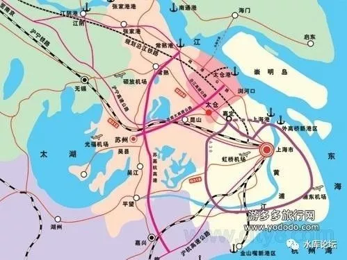
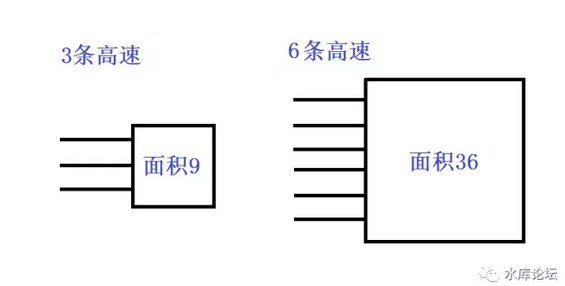
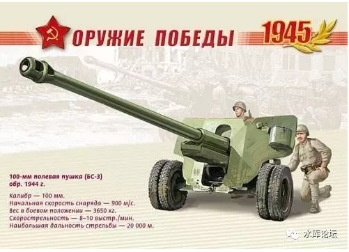
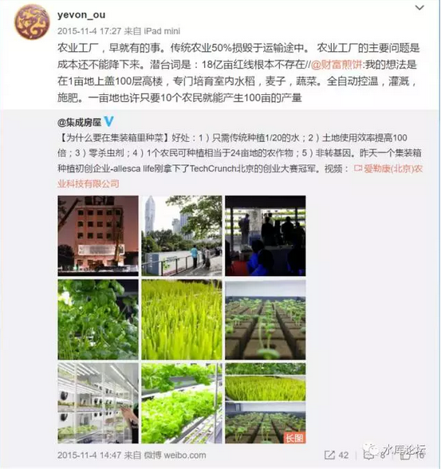
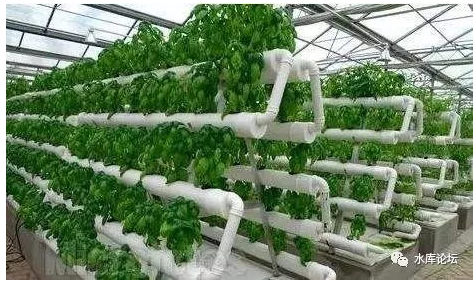
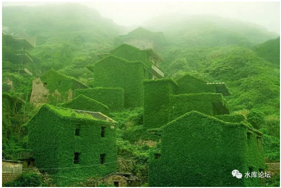
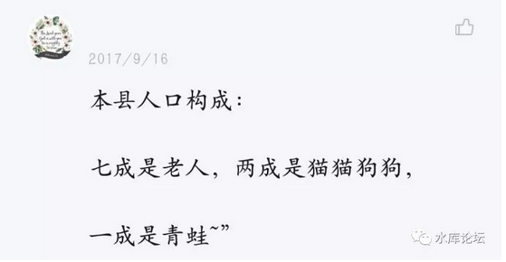
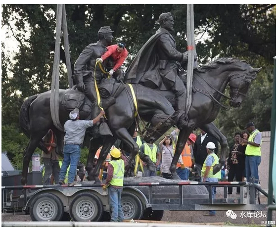

# 关于未来的畅想，很多都是脑洞，不构成投资建议

 

 

没有农村的未来

 

 

一）资源

 

我们有三种最基本的资源：农田，矿藏，人力。

其中，农田几乎是平均分布的，矿藏有几处。人力则是可以移动的。

 

 

我们设想一种极端情况，假设完全没有"历史"的包袱。

7000W人，要从头建设一个省份。按照今时今日的生产力，他们最有效率的模式，应该是：

-   每块土地一个农庄，粮食集中输送到省会

-   矿藏挖出来，集中输送到省会。

-   所有人住在省会。

  

在这个模式中，是不存在"地级市"，小城市，县，乡，镇的。

因为不需要。

整个生产模式，就象是一张巨大无比的"树叶"。

 

一块块毛细血管的农庄，把农作物集中起来。

输送到支线，再输送到干线。

最后全部集中到省会，再进行"进一步"处理。 

清代中国人，有一句老话，"货到汉口活"。

武汉作为九省通衢，是最大的交通枢纽。无论你任何一种冷门的货物，到了武汉，总能找到买家，总能找到用途。

不用担心滞销，积压在手里。 

 

这个道理，其实说"商贸"的好处。

猪鬃毛最有价值的用途，是刷枪管。二战时候，中国仗着地大物博，大量出口猪鬃毛，换取了大笔外汇。成为战略物资。

而如果在农村，那就是废物。

 

钾长石基本属于伴生矿，没有直接开采价值。可是拿到城里来，就可以广泛地用于陶瓷，玻璃行业。

哪怕不值钱的水晶，还能做成Swarovski.

 

这些事情告诉我们，如果"交通"允许，则把所有的原材料，统统集中到一个"市集"，然后再进行加工和分配。

要远远比分成N个地级市，小流通，直接低用途地用掉，更有效率得多。

 

 

在古代，交通效率十分糟糕。

例如关羽"千里走单骑"。许昌到新野。航空距离250KM。

可关羽走来，就是一千里路，好几个月的时间。带的猪肉脯早坏了。

因此才有了镇，村，城，每间隔百里的城市群。

 

但是，今天的交通工具，完全改变了一切。

如果从"省内"任何一个地方，到达省会，都可以控制在3\~5个小时。

则在原地进行初加工，把所有的初级产品，统统运输到省会，再进行"深加工"，才是效率最高的办法。 

中转站是不需要的

我们展望未来，一块土地，可能仅剩下一个农庄，几个食品加工厂。

一座矿山，剩下洗煤厂，铁路机器人。

把所有的"产出"，统统送到省会。在省会再进行复杂的，大规模制造和交易。

 

 

放眼全球，Peru这样的国家，事实上只剩下了一个首都利马。

首都圈之外，就是矿山。否则就无人居住。

 

如这篇文章《[[梦想与现实 \|
3年前这对夫妻卖掉北京房产到澳洲当农场主，如今却苦不堪言！]](https://mp.weixin.qq.com/s?__biz=MjM5NzUyMzU1NA==&mid=2650673748&idx=6&sn=0811027774559a27e9b73981a2a32125&chksm=bed20b5989a5824f8007fd9f3ab16ee7dae76df138a6f2c3b27222d70f54d38b74d21fd7a35b&mpshare=1&scene=21&srcid=1107DXk0BLPhug5uelB0twJR&pass_ticket=k0RGd#wechat_redirect)》

一对北京夫妇，买了澳洲300公顷的农场，满心雀跃，以为可以象中国一样玩房地产。

结果，最近的人类，在30KM开外。他们唯一要做的事，是每周一次把农产品送到集市。带几瓶啤酒回家。

 

人类的集中居住，已成定局。

 

 

 

二）威胁

 

经济学第一定律是：dT\>0，交易产生财富。

经济学第二定律是：市场产生一切，除了市场本身。

 

 

今天的大城市，可能处于人类一个非常奇特的转型关口。

也是"特大城市"最最脆弱的婴儿期。

 

几乎所有的经济学著作，也包括所有的务实实践，都清晰无比表明一个事实："城市化有利于GDP"。

减少户籍管制，放农民进城。增加人口流动。

 

 

想要拉GDP么。一些庸碌无谓的省份，哪怕只要简单地"赶人进城"。

把越来越多的人口堆积到省会城市。

这本身就会促进GDP增长。拉动生产力和需求的双增长。

 

假设城市的人均GDP，和农村差5倍。

每年城市化1%的人口。

换算成GDP，就有4%的增长。

想要堆政绩，再没有更好的办法了。

 

但是，我们看[现实]。现实情况是"超大城市"都在尽力地削减人口。尽量地把人口往外赶。北京，上海，甚至连续三年GDP增速全国垫底。

 

为什么

 

因为我们今天所获得的一切，都是基于"和平"红利。

而在战争时期，"超大城市"是高度高度高度脆弱的。

 

如图。"超大城市"在地图上，显示为一个圆。

随着直径的增加，整个城市的人口，是呈"平方"增加的。

直径增加一倍，人口增加4倍。

 

但是，另一方面，城市和外界的通道。

无论是沪宁，沪杭，沪渝高速公路。

交通线的增长，是呈"一次方"增长的。

一个3000W人口的城市，所需要的生存资源，是天量惊人的恐怖可怕数字。

上海本身粮田已经不多。目前光3000W人，每一天所消耗的粮食；

上海需要12根专用铁轨，日夜不停，专职为上海市输送粮食。

这还不包括上海所需要的其他各种大宗要素。煤炭能源，木材，蔬菜，钢铁，日用品，纺织品，垃圾处理......

 

在刘慈欣《超新星纪元》中，他曾经举了一个食盐的例子。

三个孩子，走了一个下午。走过了200节车皮，漫长得永远也看不到尽头。

那么多的食盐，只够全国人民，1天的消耗量。

 

庸人碌碌，他们对数量级没有概念。

 

 

 

目前的军事对抗，基本呈现一种"易\--难\--易"的格局。

在所有的交战地形中，"巷战"是最难对付的。几乎是所有大国的噩梦。

 

一座30W人口的中等规模城市，基本就可以认为是"不可征服"的。

哪怕强盛如俄罗斯帝国普京大帝，面对格罗兹尼也连打二次。损失惨重。

 

因为城市地形高度复杂，射手视野高度受限。冷枪防不胜防。

而且还有"反坦克炮"这种奇葩。

"反坦克炮"其实就是一辆坦克，使用坦克一样的火炮和弹药。

区别是，完全没有装甲，也没有移动力。

造价便宜到你想哭。

 

渣防御力为0。

一旦被发现，马上就是"一炮蚊"。连机枪手都格斗不过。

 
但是反坦克炮，野外往往躲在草丛里，灌木里。交通必经之路。

你没发现他的话，他一炮就是一辆坦克。

身处最侧翼的话，N炮N辆坦克。

 

我们看战争片，一辆坦克跟四五个步兵。往往有一个步兵，探头探脑走在最前面。

这样的"弃卒"，并不是长官不爱惜小兵性命。

而是探前，去检测有没有反坦克炮的。

一旦被反坦克炮偷袭，大家一起报销。

 

在城市"巷战"中，反坦克炮的威力非常巨大。高层住宅，任何一个废弃窗口，都有可能探出一管炮管。装甲部队轻易都不敢进城。

钢筋混凝土的建筑，也不是这么好摧毁的。炸几个洞容易，彻底打到没高楼，可费弹药。

更何况，还有奇葩的房地产，地下室天窗嘛。

 

 

俄军连续经历二次"车臣战争"，在格罗兹尼门口流尽了鲜血。

到后来各国军团都学乖了。

目前业内的共识是，城市战就"平推"。

 

找几百辆威力巨大的战车。遥遥地一字排开几公里。

开炮，把第一排的建筑全部都夷为平地。彻底炸成地平线。

前进50米，继续再开火。

 

如此反复。把整座城市炸成零海拔。

虽然缓慢，耗时。东西砸光，好处捞不到。但是陆军打"巷战"，那是万万不肯的了。

 

 

接着问，一座30W人的城市，就这么难打。堪比"斯大林格勒"战役。

那么300W人口城市呢。难度是不是要大10倍，还是100倍。

答案是一点都不难。

因为300W人口的大城市，其"维系本身"的开支，已大得吓死人。

 

 

参考阅读《如何评价台湾「用城市游击战吓阻解放军」的方法？》

曹丰泽的回答：

https://www.zhihu.com/question/64687954/answer/223944648

 

 

30W人口的城市，东南西北四条公路，一周通一天补给就够了。小分队都可以潜进去。

而300W人口的城市，需要至少50%的畅通率。日夜不停地补。

 

如果敌军围困300W人口城市，他们只要"切断"你的补给线。不出几天，城里就会闹了饥荒，药品短缺。

继而引发暴乱，秩序失控。

城市本身，就可以把自己饿死。

 

 

更进一步，如果你是3000W人口的城市。

那简直不需要"围困"，只需要"微扰"。整个大城市运输已到极限。只需要轻微地卡住你任何一条血管。

粮食，煤炭，水电，电管，任何一项维系生存的管道被切断，整个城市立即崩溃。

 

超大型城市，根本是不可守，不能守。

一般认为，人口超过150W，在军事上就没法防守。

 

 

 

三）未来城市

 

我们有三种最基本的资源：农田，矿藏，人力。

如果我们把事情想到极致。"未来的大城市"，一旦"对外交通"被切断。他真正缺乏的，导致"防御崩溃"的，是什么。

答案很简单：粮食，矿藏。外界补充的。

 

 

那么，我们继续脑洞大开一下。人类可不可以脱离"粮食"，"煤炭"，而让大城市的生存能力更强。

答案是：可以的。

 

城市的容量，是呈"平方"增加的。

城市与外界的联系，是按"一次方"增加的。

如何克服其中的矛盾？

 

最好的方法，釜底抽薪。"一切都在城市内部生产"。

 
如图，"农业工厂"是一件早已有之，非常成熟的事情。

 

人类一万年历史的"种植业"，在现代的物理化学分析下，如同庖丁解牛，渐渐卸去了外衣。

"农业"是什么。农业说到底，是一种细胞生产。经过特殊的DNA，利用了光能，土壤，最终合成出"蔬菜"。

 

但是，同样的流程，能不能在"实验室"里完成呢。

答案是可以的。

 

传统的"无土栽培"，纯靠营养液。种出来的蔬菜，又新鲜又好吃。每一个上海人都已经吃过。

而复杂一点的"有土栽培"。如果你参观过加拿大的农业机械展。几乎所有的辣椒，黄瓜，卷心菜，球生菜，小白菜，任何品种都可以在工厦中，生产出来。

 

 

美国加拿大有一个笑话，如果你看到某户居民住宅，"民用电"电费突然猛增。增加到一个月\$10000美金以上。

那警察赶快去抓他。多半在衣柜里面种"大麻"，没错的。

而且种大麻的房间，墙壁上会长霉菌斑。逃不掉，一抓就准。

你以为美国高中，那么多大麻哪来的。都是学生们，在自家卧室里，自己种的。

 

（大麻种植，是在"安妮宝贝"中看来的。正规出版。咖啡谢免）

 

 

大麻这种作物，需要"光合作用"。然后需要种子，和一点点泥土就可以生长。

不良学生们，拿几个大功率电灯泡，24H放在衣柜里照射。

放学回来，大麻就长得很高。

 

不过他们毕竟不是亚洲人，不懂得勤俭节约。

现在在卖的机器，都是LED灯泡。

因为植物仅仅对某几个频率的光谱特别敏感，特别能吸收。每种植物手册不同。

"专用灯泡"只发射这几个频度的光照，就大大节省了电费。

 

 

扯得远了。"都市农场"是一件早已有之的技术，培育起来，也没有太大的技术难题。

那么，为什么没有大规模推广，没有淘汰农民呢。

 

这其中主要的瓶颈，还在于"成本"。

太阳能是免费的！你有一块农田，每年享受3600度的阳光和辐射。

太阳赐予我们的温暖，是免费的。

 

而"都市农场"，你可以造一座30层高的大楼。

大楼中每一层都密密麻麻排布着"农场""蔬菜基地""养鸡场"。

可是成本呢，谁来给你的电费买单？

 

 

农业的真正"突破"，可能要等到21cn中叶，大约2060\~2070年以后。

因为在人类的科技树中，有一项已经是囊中之物，只待岁月和成熟了：

"可控核聚变"

 

 

目前以"核裂变"为主的第三第四代核电站，依然不是人类能源问题的最佳出路。

核聚变产生的能量，是裂变的10000倍。而且只有氢和氦气，没有任何的污染。

 

核聚变需要巨大的精度，巨大的点燃温度。

但在人类纳米飞速猛进的今天，"精度"已经越来越难以阻挡人类步伐。

 

目前，法国的核试验场，已经可以实现64个氢原子的0功率输出。

核聚变技术真正成熟，恐怕就在50年之内。

 

 

"核聚变"实现，意味着中东的石油土豪统统完蛋。地球实力大洗牌。印度或成最大赢家。

因为"亚寒带"大煤层在芝加哥，大同，莱比锡。不在印度。

 

印度半岛严重缺乏煤炭，这意味着印度在"第二波工业革命"，完全绕不过能源的瓶颈。

无论三哥怎样努力，也不可能成为大国。

 

 

又扯得远了，当"可控核聚变"实现之后，人类的能源力量，会比现在增加100倍以上。能源价格跌到几乎为零的位置。

当拥有几乎"无穷无尽"的能量之后，"都市农场"就会成为现实。

 

随便找一幢30层的大楼，从上到下，可以生产数万人口粮食物。

而且这样的"粮食基地"，在一座5000W人口的大城市中，可以拥有上万座，数万座。

要摧毁这些粮食工厂，空军的成本将会非常非常高昂。

 

 

都市农场还有很多好处，可以更快地拉近他们和"传统农业"之间的距离。

-   全球1/2的农产品，损耗于运输途中。发达国家也有近20%

-   至少10%的农产品，因为滞销，损毁于农田之中。

-   减少运输成本，减少长途电力成本。

-   完美的用水，温度控制。微滴灌

-   "工业化粮食"能更好地控制品质。

-   可以对粮种进行改良，使之更适合吸收频段光谱。潜力巨大。

-   可以只生产果实，放弃茎叶。

 

未来的人类，就是一排排灰暗如豆的小灯。

在大厦里，密密麻麻塞进去几百层的滴灌农业。

随着植物的生长周期，小灯会不停地调整亮度，光频。保证每一分的能量都不会浪费。

温度，湿度，病虫害，永远保持在最完美的状态。

粮食产量大到不可计数。

 

 

未来，如果农产能自给，则除了能提供"特殊矿藏"的矿区。

整个城市之外的土地，有可能完全放弃。

类似于青海茫茫戈壁滩一样，我们知道那里有山川，但就是没人去。

 

 

（浙江嵊山岛人类撤出后，迅速被植被吞噬）

四）水

 

和粮食相对应的，另一项重要资源是："水"。

在"人肉磨盘三两三"\#F880中，摧毁一座城市最好的办法，也是摧毁他的自来水厂。

 

水其实不是太大的技术问题，只不过整座城市必需完全改造。

因为水基本是一种"循环物资"。水资源是永远不会消失的，只不过自来水变成了污水。

 

如果要实现"分散化"水资源自给自足的话，整个污水排放和水获取的管道，必需重新设计。

 

设施并不大，每个街道只需要一个中型的"污水处理厂"，就可以把排放水重新净化成可食用的状态。

但是管道和进水口，必需全部都重新设计。以达到尽可能大的冗余度。

 

 

 

五）布里渊区

 

脑洞开得再大一点，超大城市，自带的能源电厂，自带的都市农场，对外界需求越发削弱。

 

这样的城市设定，其实为未来的"结界"留下了空间。

 

我们看这篇文章《一个猫片都加载不出来的城市，却能把导弹拦在外面 \|
刘洋专栏》

https://zhuanlan.zhihu.com/p/27146014

人类一直在设想"结界"。弄一个大罩子，把城市包起来。

在没有击溃你的"防护罩"之前，任何物理攻击，都不可能伤害到内体。

 

关于结界，科学家有很多设想。

如上文所说的，晶体晶格中的"布里渊区"现象。任何物体进入结界，速度都会被削弱到75KM/h以下。

这就为激光/导弹防御留下余地。

 

以人类今天的科技，对"结界"依然一无所知。

但我们唯一可以确定的，如果真的被发明出来。那一定是只笼罩城市。

 

 

 

六）大城市的未来

 

如果一切按照生产力的需求，则中国有可能"澳洲农场化"。

整个过程，需要漫长上百年的时间。

 

 

最早的时候，是乡，镇，村，完全消失。

方圆30KM内，除了农场主，一些简单的肉禽加工厂，不再有任何人类。

 

第二步，原有的小城镇，地级市逐渐消失。

原有的工厂，道路，不动产，虽然是巨大的固定投资。也不舍得炸掉。

但是"新增人口"全部往省会挤了。地级市只剩下老人，县委书记，四套班子。

也不会新添任何机器了。

大约经过三代人的时间。让老人死光。

原有固定资产自然折旧为零。地级市完全荒废。

 

可参见这篇文章《[[慢慢朽烂------俄罗斯西伯利亚、远东，在废弃！]](https://mp.weixin.qq.com/s?__biz=MzUxNTE0MTI3MQ==&mid=2247483862&idx=1&sn=435e905cb5088addb3db0f7ab98614e8&chksm=f9ba7a2ececdf338357be22e1726940429dd14ac6a1fcc7882fcd9bec702573dce2cbd1d30b8&mpshare=1&scene=21&srcid=10014TnOnyyT035AbPEfLNJA&pass_ticket=k0RGd#wechat_redirect)》

 

 

第三步，省一级的行政机构，省会城市，很难被废弃。

因为"行政权力"总是存在的。

例如说，一家马鞍山的企业，假如胆敢去南京大肆投资。

完全可以派安徽税务部门，帮他查查税么。

 

 

但是，随着"大城市化"。全国最终只剩下几十个"省会城市"。

百年之后，"省际划分"，必然提上议题。

 

如果"省"的单元被撤销。则"省会"也保不住。

全国可能就剩下五六个"大城市团"。

 

 

脑洞再大开一下，数百年，上千年之后，中国会不会只剩下一个城市呢。

（当然首都不一定是北京）。

 

以前写科幻小说，人类殖民"蓝星系"。总是写人类宛如蝗虫一样，布满了星球表面，从事种植业。

例如俺这二天在看的，60年代著名科幻《消失的殖民星球》

 

 

但其实，21CN再写科幻小说的话，应该是人类在星球上，就建立一个殖民点。

然后派出无数的甲壳机器人，把星系的每一寸都覆盖。

将一切的产出，矿藏，以极快的效率搬回总部，再进行进一步生产才对。

 

若交通工具，极其具有效率。

一颗行星，只需要一个城市。

 

 

 

七）大城市的瘟疫 

 

在我们完全废弃的戈壁滩上，有一群人。

异族的非法移民，象蝼蚁一样地活着。

盘踞了我们的土地。

 

 

限制大城市生长的，有几股力量。

 

一股是我们之前所说的，现有科技范围下，火药武器的威胁。

 

第二个威胁，是疫病。尤其是不可控的，大规模的传染病。足以吓得人民，逃离大都市生活。

但是他们又能逃到哪里去呢。无非住得更稀疏一点罢了。

 

第三个威胁，也是最大的威胁，是"精神疫病"。

对保存种族最可贵的，是多元竞争化。对种族生存最有害的，是"一致化发疯"。

 

 

一个城市，往往只会有一个思潮。

天然的分散，才能保护多元化。一个城市，[极其容易陷入同一股力量的控制之中]。

 

今天的美国，正在闹wenge.

一群狂热的"白左"，推翻了李将军雕像。

 
看到这则新闻，我们感到无比的焦虑。

如果我们的后代子孙，也被僵尸吃掉了大脑，怎么办。

 

集中意味着风险。"一个城市"，意味着一旦发生不测。

整个文明灭种亡国。

 

 

一个解决的办法，或许是"封国"。

那些荒无人烟的戈壁滩，废弃的土地。放一些中国人过去，允许他们自治，划地为国。允许保守党按照他们自己的方式生活。

 

帝国屏障，抵御绿教白教的侵袭。

文明最后的火种。

 

 

 

 

（yevon\_ou\@163.com，2017年10月8日晚）
