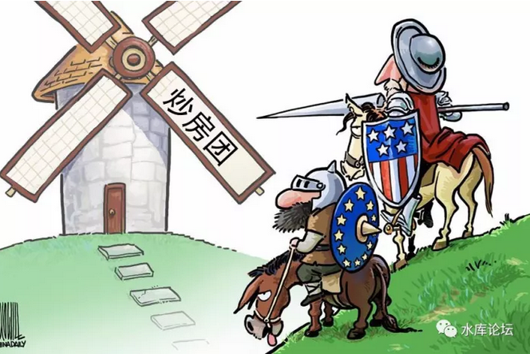
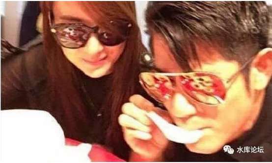
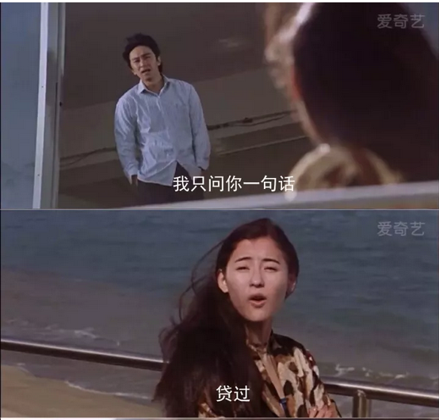
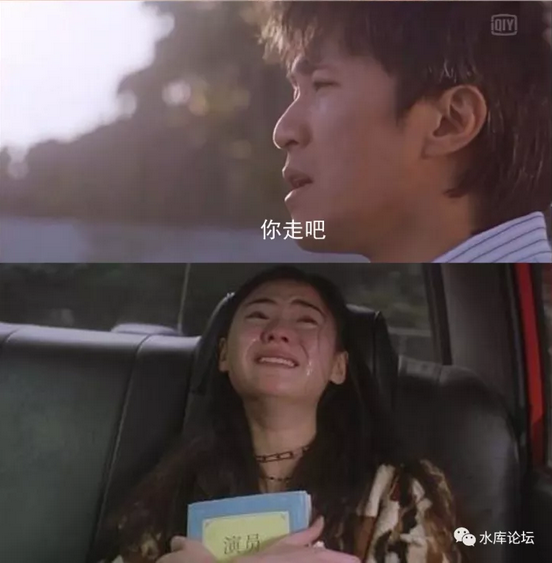
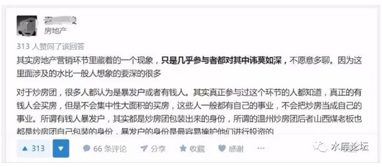
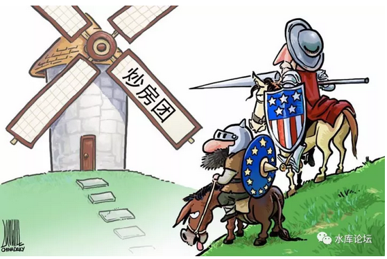

# 天下岂有此等炒房团 \#1560

原创： yevon\_ou [水库论坛](/) 2017-11-08

天下岂有此等炒房团 ~\#1560~

学界耻辱，斯文败类。

 

一）知乎贴

 

今天某地产类自媒体中V，在知乎发了一篇长帖。直接把我给看吐了。

来来回回，反反复复看了二三遍，只有八字评语：

 

学界耻辱，斯文败类

 

基于"同行不互撕"的原则，我就不点名了。

俺用最小最小号的字体，把链接放在注解：\[1\]

 

 

事情的起源，来自于知乎上一个帖子《炒房团是怎么炒房的？》

我们知道，知乎的定位，是低收入人群。社会中底层。

 

所以哥哥默默关注，但在知乎上，却是从来不发言的。

不是我不懂，是读者不懂。智商的巨大辗轧："下士闻道,大笑之,不笑不足以为道"

 

 

可是今天刷着刷着，莫名其妙就刷到地产圈某人的回帖了。

俺看了真心无语。

您如果确信是本人发的，没有盗号，也没有醉酒，也不是真心话大冒险。

 

您销号吧。

不用丢脸了。

 

 

 

二）炒房团

 

请各位先看完原帖，我们再来解释。

作者用他的原创笔锋，多处**加黑**，着重描述了"炒房团"的操作链。

 

1）KFS需要现金流，而不是涨价。

2）串谋炒房团，写高房价到120%，实际价格90%

3）炒房团首付6%，贷款84%

4）一年以后退房，获得120%全款

5）伪装成工程抵扣款，获取避税

 

 

作者说，整个楼盘中，51%的房源，是由"炒房团"控制的。

而且炒房团要把价格拉高到120%，剩下的慢慢卖。

说有500套房源，一次性的退房。

还说投资6万元，获利36万。

 

我只想问三句：

大哥，您干过KFS财务么

大哥，您写过玄幻小说么

大哥，您高考及格么

小说都不敢这样写啊！！您是不是被盗号了。

 

 

我们知道，在二手房市场，的确是存在"写高"现象的。

譬如一套100W的房子，你写成120W，贷款84W。

首付16%，实际就贷了八成五。

 

但是，在一手房市场，从来从来没有人写高的。

因为一手房市场，纳税金额，是按照成交金额交的。

写高的部分，税率高得难以承受。

 

 

一直有人问我，"KFS拍了一块地，楼面价3W，最终售价会到多少"。

我一般回答是"2.2\~2.4倍。"

 

这个数字怎么来的，土建又没那么多钱。为什么要翻2.2倍。

其实主要是"重复计税"。

 

 

譬如说，假设你房屋售价是100%，二点二倍，则土地成本占45%。

而KFS卖掉一套房子，到手的只有85%。

 

-   营业税5%

-   营业税附加1%

-   预征所得税5%

-   预征土地增值税3%

-   预征个人所得税1%

以上合计15%。房地产业的税务，是全中国最特别的。他各种税都是"预征"的。而不是按标准会计准则，留到几年以后清算。

潘石屹对此有专门的吐槽长文，有兴趣可以自己去搜。

 

 

85%-45%=40%

在这40%里面，你要含二年（1.5年）的资金成本。资金成本和地价成正比。

购买土地时契税3%

销售费用3%

土建成本，￥3000\~4000，这是唯一以RMB而不是%计价的。

捐给政府的保障性住房

精装修成本

剩下的是利润。

 

可见，KFS的腾挪空间是很有限的。

指望"团购""砍价师"狠狠砍个八折是不现实的。

 

 

KFS每卖100W的房子，到手只有85W。

如果KFS把价格Mark Up到120W，那么他就要付18W的税。

这钱谁给，你来给啊 

 

而且这还是没有触发LVAT的情况下。

一般情况，写高20%，肯定触发第一档LVAT。那更是要哭晕在厮所了。

 

 

我们知道，"写高"这种事，一般都发生在三四线管理不完善的小城市。

北京，上海，从来只有写低，没有写高的。

为什么，因为不划算！

 

北京上海，5.55%的营业税基本逃不掉。外加3%契税+2%所得税。

写高100W，只能多借65W贷款。但是却要付11W的前置税。

业内行话，叫做"借五还六"。所以完全不会有人去做。

 

 

您这个例子里，"写高"的代价是"借三还四"。

啧啧，体育老师都不敢教您数学了。得医务室老师。

 

 

 

三）限购

 

第二个bug，是限购。

 

银行可以发放"消费者个人购房按揭贷款"的前提，是你要签订网签合同。

网签合同的前提，是你要符合"限购""限贷"的国家政策。

 

在作者的笔下，500个山西人，跑到上海，旅行社戴帽子挥挥手，哗全部都有"购房资格"了。

限购啊，大哥，你懂不懂。

您这辈子亲身买过房么。

六十三个月社保不用交啦。

 

 

上海的限购，是全世界最严格的。外地人单身还不能买房。还需要63个月几乎不间断的社保。

您500个山西人，打飞的，噗嗤嗤飞到上海，买了500套房。飞到北京，买了500套房。飞到深圳，又买了500套房。

你以为京沪深是临汾啊。

 

 

京沪深，是国际性大都市。

规格很高的，您懂不懂啊。

 

上次有个香港人，牛皮烘烘到上海来见丈母娘。丈母娘一问，上海没房子，直接赶出去。

香港人感到不服气，扔出2000W港币。丈母娘问他，"上海房票有伐，一年社保记录有么"。香港人瞠目结舌，照样赶出去。

这个香港人，名叫郭富城。\[2\]

 

 

更糟糕的是，作者还提什么"一年之后退房，原款退回"。

我都懒得想要提醒你，"现房销售"您知道么。

"期房贷款合同"，俺都已经很多年没有见到了。

您还指望拖啊。

 

 

上海市从2006年开始，就严格关注"网签撤销"数字。任何一个大型楼盘，只要"撤销率"超过2%，立刻会受到建委严厉批评。甚至要写说明书。

 

这样的做法，主要是为了抑制"KFS内部更名"。

防止有人买了一手房，加价更名，过二个月抛售转让套利。

 

可是作者嘴巴一张，51%的"退房率"。

汗，汗，汗，玄幻小说也不敢这样写啊。您起点看多了吧。

你倒是告诉我，全上海哪一个楼盘，有51%的山西购买身份证，有51%的退房率。

侬当全上海的媒体监督吃素嘎。

 

更何况，我还要告诉你，"处女贷"是一件极其珍贵的东西。目前这个市场上，"处女贷"甚至比张柏芝还值钱。

 

上海北京深圳都是"认房又认贷"的城市，只要你用过一次贷款。你就永远也无法享受高杠杆的优惠。

 

"处女贷"您这样500个，500个的大批量生产，快赶上某教徒了。

 

 

 

四）工程抵扣款

 

作者的第三个问题是，逻辑和数量级混乱。

生编捏造的故事，编到最后逻辑不通了。

搞了一个什么"工程抵扣款"避税的事情。

 

 

首先，施工都要二级，三级资质的。

搞个建筑施工公司，闻所未闻。光牌照敲章就恁死你了。

 

其次，大哥，"工程抵扣款"是要审计的。

"土地增值税"以及所有的KFS应缴税款，都是要经过审计的。

你以为想避就避啊。

 

 

的确，目前在KFS财务的实操中，各方都尽量取上限。塞进成本。

但是上限，也就卡到4500元/平米的土建成本。

 

难道您还能写成8000元土建，10000元土建。

哪家财务敢让你过?

 

 

目前上海的内环线房价，马马虎虎算是90000元/平米吧。

4500元占多少呢，5%

 

这5%的黄沙水泥款，你能变出多少花样来。

4300和4500又有什么区别。

 

 

至于说"工程抵扣款"就更为搞笑了。什么年代了，您生活在上世纪90年代么。

香港建筑界，从来没有"烂尾楼"的说法，您知道为什么么。\[3\]

因为"地价"和"土建"费用实在不成比例。一家公司只要付得起土地款，他就一定付得起建筑承包费。

 

同样道理，一个小区，算500套房子。

全部的"建设工程款"，一共才多少呢，500\*5%=25套。

你施工队分文不取，只要房子，也就拿二三十套。\[4\]

 

您一张口51%。

您以为工商税务局的审计署，是吃干饭的。

您以为施工费用，占房价多少百分比。

您自己到马路上看看，是不是满大街51%的"工程抵扣房"？

 

 

 

五）虚幻的敌人

 

那位不成器的地产自媒体中V，其他的错误还有很多。例如；

-   "完全没有销售，整个模型，从头到尾没有卖出过一套房子"。

-   "KFS需要资金，不到国际市场上发债。7%的永续债，许首富都嫌心疼。却花600%回报，向炒家融资"。

-   "银行评估，内控根本通不过"。

 

真正令我感到震惊的，是这样的一篇垃圾回复，居然有313个赞，66个评论。

而且下面的评论里面，清一色的叫好，跺脚，鼓掌。

 

这是怎么了，我们的社会到底怎么了，我们的大学教育出了什么问题。

 

怎么会教出这样一批学生！

全体国民，如果都象知乎er一样素质，中国就完蛋了。

 

 

我们知道，"宏观调控"已经持续了十几年，房价也因此上涨了十几年。

随着房价越来越高，人民群众生活压力越来越大，负担越来越苦。

 

为什么宏观调控持续得不到效果。

因为你在和一个虚幻的目标做斗争。

 

 

整个"山西炒房团""温州炒房团"，就是由这样[不负责任，谎话连篇的V，]

[闭门造车，自说自话]，纯粹凭借自己的幻想和想象，虚构出来的。

 

知乎er素质低下，不问是非。没有一丝一毫判断产业的能力。

你听信这样的西贝货，义愤填膺，奋力呐喊。

 

挺刺着长矛，冲向空气中不存在的巨人。

 

你可能打倒"炒房团"么。自然是永远也打不倒的。

 

 

 

最后，不要问我真正的炒房团，长什么样子的。

 

 

 

（yevon\_ou\@163.com，2017年11月8日子夜）

 

 

\[1\] 《炒房团是怎么炒房的？》

https://www.zhihu.com/question/20497059/answer/256254205

\[2\]郭天王和丈母娘的段子。https://www.douban.com/group/topic/81912325

\[3\]全香港60年房地产开发历史，一共只发生过一次烂尾事件。是2003年新界。

\[4\]在目前上海市场，"工程抵扣款"房源不会超过0.1%，重庆大概不超过1%
