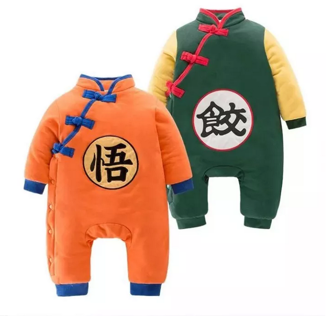
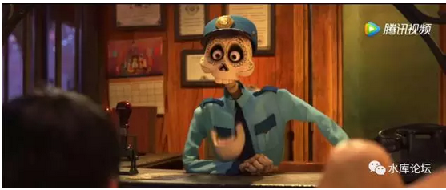
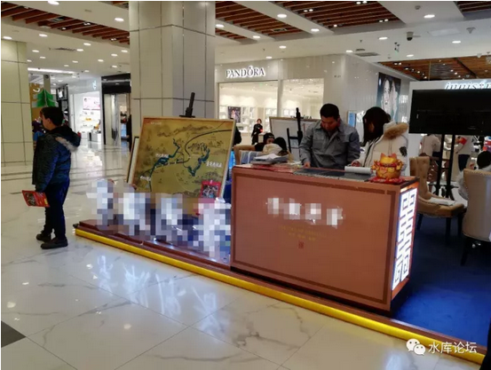
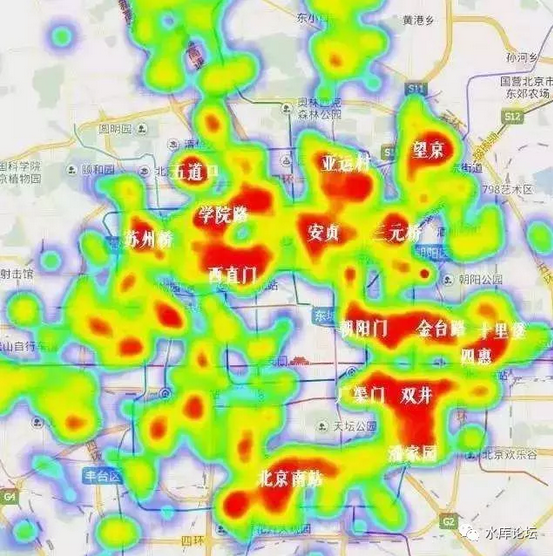
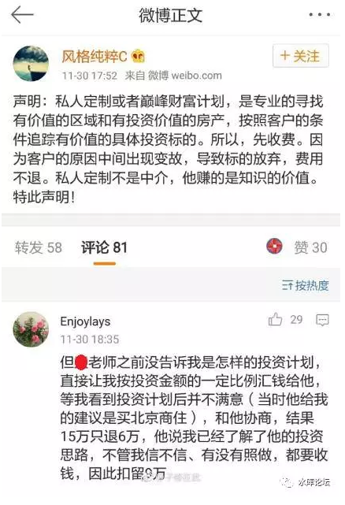

# 被遗弃，被抛弃的B2C \#1600

原创： yevon\_ou [水库论坛](/) 2017-12-08

被遗弃，被抛弃的B2C ~\#1600~
=======================================================================================================================

V2C

 

 

一）新浪微博

 

本周没有更新，因为大家都知道，俺被拉去参加"新浪微博2017影响力大会"了。

承业内朋友盛情，拉我坐了主桌。

 

 

通常，水库论坛以微信为主。微信是一个很封闭体系。

因为行业的"特殊性"。微博我很少玩。

 

微博实在太Open了，容易"转转转转转"，很多言论，一旦被转发太多，转失控了，就不太好。weibo.com/yevon1ou

 

 

因此这次聚会，见到了许多微博上的大V，也很令人高兴。例如孟祥远老师，"阿拉上海人"的卢湾伯爵，帅得一台糊涂的南京"阳光"，雅房的顾洪波，黄芳则是早就认识的。

 

中国古代的数学，在明末有了[突飞猛进]般的发展。主要是因为"西学东渐"，有了利玛窦，汤若望等传教士。带来了欧洲天文历法，几何学，微分等多种学科。刺激了独立的中国体系，打开了新的视野。

 

嗯，这次聚会，让我知道了很多新的捞钱手法。

 

 

 

二）捞钱手法

 

捞钱手法。这次新浪开了三天会，"来去之间"CEO滔滔不绝，峰会鼓吹新浪的大V们，"一个绚丽美好的前景"。

只要你坚持跟着新浪混，"钱景"是大大地良好的。

https://weibo.com/1853047530/FtqgexEVg 

 

一直以来，我对新浪小有抵触。

为什么抵触，我觉得他崇洋媚外。

 

譬如说，新浪的"付费问答"收费体制，是唯一的"抽三"体制。

客户花666元，提问一个问题。

得看客户用什么手机。

如果是苹果手机，大V到手就只有七成。666\*70%=466

只有用Android手机，大V到手才是666.

 

这就让我非常地不爽。苹果是什么东西，排不上号的2G RAM低端手机。

苹果有什么贡献，凭什么分掉30%

俺好不容易新浪也加了一个V，乐得小脚丫子乱蹬。干嘛要分30%给APPLE。

客户用什么手机，关我屁事。

 

但是新浪非常非常地弱，在和美国公司的谈判中，处于绝对的弱势。

哥哥很不爽，当然出于Marketing管培生的职业习惯，文案是绝不能这样写的。

如果让我写文案，我会写成：

 

-   提问原价1000。

-   外国手机不打折（苹果）

-   国产手机打7折，爱护国货（华为，小米，锤子，OPPO...）

 

哥哥心里这个小九九打得开心顺畅，自以为掌握了"中华数学"的精髓。

然后我拿去了"新浪大V"们交流，俺的表情是这样的。 

代差啊，代差啊！同志们。

掩面啊，掩面啊！同志们。

大家都是想赚点奶粉钱，为什么档次就差那么多呢。

 

 

"微博V"关心的是什么。

-   消费者的城市分布

-   消费者的收入分布

-   消费者的口味细分

-   消费者对于299,599,3000元产品的承受能力

-   消费者中，"首套房"和"二套房"的购买比重。

-   水库咨询客户，复购率多少

-   美誉度，口碑传播有几重

-   每天几点发文，阅读量最高？

同志们啊，妥妥的上述分析，以上全错。

 

 

北京V关心，且只关心一个问题。

今天张老板去哪里吃饭。

 

 

 

三）B端

 

我知道业态不佳，世风日下。

人心不古，韭蒜韭黄。

可是我真心不知道，整个业态，已经败坏成如此地步了。

 

对于西半球的"数学"来说，他们只关心"李老板去哪里吃饭了"。

因为V们变现的渠道高度受压，他们基本上只有二三条路。

 

1）广告

2）讲座

3）开发商返佣

 

 

其中，"讲座"不是每个人都可以搞的。最好是有一个"官方"体制内的身份。例如某大学某教授。天生就在"讲座"方面，具有巨大的优势。

 

在整个"微博房产"生态中，最大的大号是"财上海"。大约有91W微博粉丝。

可是业界讲起"菜菜"来，却是不屑一顾。

因为菜菜属于"隐身号"，出于种种原因，财上海永远不肯走到台前。永远是菜场买汰烧。

 

这在保护"京沪永远涨"咖啡御免的同时，也造成非常糟的结果。

财上海永远不可能靠"讲座"赚钱。

 

譬如以菜菜的知名度，讲一场定价999元，应该能卖几百张场。

扣除成本，一场也有几十万的收入。

可是他执意做"隐身人"，四个菜就失去了这最大头的一块收入。

 

 

其次是"广告"。

微博广告的"阅读数"，水分远远超过微信。大约是1:10的关系。

广告因人而异，视流量大小。此处略过不提。

 

 

而大V们最大的一块收入，则是"返佣"。

介绍你去的任何一个楼盘，都是有返佣的。KFS雇佣了你大V站台，就一定有利益分成。

 

譬如说，今天中午，哥哥在望京某Mall吃饭。它摆在商场大堂里的售楼。

象这样的"远郊"楼盘，他就是有返点的。

一般以35000的单价，120平米，420W一套。

返点可以给到3%

 

你"拉过去"一个客户，返佣可以给到15W。

象哥哥这种北京40000读者的KOL，登高一呼，动辄拉过去就是几十人啊。

算算钱，好几百万啊！！

 

 

昨天接了一篇青浦"[玉兰花园](http://mp.weixin.qq.com/s?__biz=MzAxNTMxMTc0MA==&mid=2651016570&idx=2&sn=8e0c92bf59b2aae7713e9d6aff528994&chksm=80721b69b705927fa5bf8a2e37e8cf29c53cdf88f72fd97ff48fa0784787a90f97d977d6dc6b&scene=21#wechat_redirect)"的广告，他们问我，收了多少钱。

哥哥老老实实地回答说3W，而且后台留言，被骂成翔。

哈哈哈哈哈哈哈

哈哈哈

哥哥的良心，受到了10000点的伤害。

 

然后我再看看，随便推荐一个"环京"的项目。

提成动辄300W。

不行了，俺的良心又受到了20000点的伤害。

不行了，赶快给我瓶82年的雪碧，冰冻俺这纯洁无比的真心伤痕。

 

以后接广告，各位可真别骂了。俺快成业界良心化石了。

-   你只要肯背书，分分钟赚提成几百万，一个楼盘。

-   你死硬不背书，赚3W

水库概不背书！

 

 

 

目前这个业态，已经恶化到什么程度了呢。

在这次的新浪"影响力"大会上，有人贴了这样一张图。

这张图，不是"北京板块分析"。

这张图，是北京"KFS分析"。

 

就是说，业内的分析，已经不去想"怎样给消费者提供最好的房子"。哪儿板块涨得更好一点，哪里的房子是洼地，涨幅更有潜力。

 

他们的思路，完全是倒过来的。"哪里有KFS"。

然后我去找KFS，我来帮你倒过来写文案。

你房子造在门口沟，你想卖5W，6W，还是7W。

没问题啊，我来帮你凑"推荐词"。反正优点总是可以发掘出来的。

北京那么大，用力吆喝，总有傻瓜上钩的。

 

我觉得这样做是不对的

 

 

前一阵子，发生了著名的"风格纯粹"事件。

鉴于"同行不互撕"的传统智慧，我就不披露这个号的背后，具体是哪位赫赫有名的网络大佬了。

 

具体的事件，大概是这样的。他的一个学员，砸锅卖铁卖掉了全部的身家。四线城市小地方，拼凑了50W元祖传资产。然后向他"咨询"该如何投资。

 

结果某老师开口一说，就推荐一个天价北京超贵的"CEO商住"。

某学员左思右想觉得不对。虽然没进过紫禁城，但也知道"北京商住"目前正是调控的风口浪尖，KFS想要卖房子，恐怕是千难万难。

 

于是学员说不想做了，想把咨询费讨回来。

 

没想到某老师一开口，"15W只能退6W"。

舆论哗然。

理由是"知识付费是一种秘密"，秘密说出了就要收9W。哪怕没执行。

唉，知识付费没你这种同行。

 

 

重点不是这个，重点是晚上饭局时。俺这"中国数学"纯洁的小心灵，还没有看懂里面的沟沟。

经高人指点，才知道，为什么要推荐"北京商住"呢。

 

因为北京四环之内，基本上没有新盘了。就算有寥寥二三个新盘，那也是万众瞩目，千万宠爱，根本不愁卖。

 

但是整个房产"大V"意见领袖的收入，高度集中在B端。

他们主要靠返点，暴利为生。

 

如果四环内房子不愁卖，那还有哪里的KFS愿意给费用呢。

1）远郊

2）环京

3）商住

 

某人推荐商住，纯粹是一种"职业习惯"。吃二头。

吃完了咨询客户，再去吃KFS的返点。

 

只不过吃相实在太难看了点，搞得客户都毛了。小地方人也知道"CEO商住"买不得。

于是被捅了篓子。

 

 

 

四）C端

 

哥哥总结了一下，水库属于"叫花子流"。

他们问我收多少钱。俺老老实实地回答，"分答付费社群"收399，回答屌丝无限长的问题，老客户还有八折。

 

哈哈哈哈哈哈哈

哈哈哈

叫花子流痛苦地扭向一边去。穿白袜子也是人权嘛，只要保暖就好。

 

 

不管怎么说，我始终认为这套体系是不对的。

在整个系统中，唯一没有的，就是对消费者的保护。

 

所有人都是为KFS说话的。"KFS返佣"，成了意见领袖最大，甚至唯一的收入。

再也没有人研究板块轮动。

再也没有人研究购房洼地。

再也没有人研究信贷技巧。

再也没有人帮消费者税务筹划。

所有人，都排队等在大KFS门口。等着大老板翻你的牌子。

 

KFS是唯一的付费源头，所有人都围绕着KFS说话

 

 

然而这是不对的。整个市场上，需要C2C的关怀。

每一个消费者，都是小小的个体。需要服务和帮助。

虽然消费者可能只出399元，3000元，来咨询你一些很琐碎的问题。

虽然无数的，大量的，细水长磨的工作，折磨得你疲惫不堪。

 

但是这个市场，需要有人服务于消费者。你需要一个买方经纪人。

 

不可以把消费者当小老鼠一样卖弄，不可以买卖流量

 

需要有人站在消费者的立场，告诉消费者的利益。

需要有人为"砸锅卖铁"的小镇青年，增加一道防护。

需要有人低买高卖，纠正价格的不合理错配。

需要有人克制邪恶的远郊精装一手贵妇流CEO盘。

 

 

俺还是赚俺老老实实的"不背书"3W元吧。

我始终相信一点：

在这个市场想要走得远，"信誉"才是你真正的立身之本。

 

 

（yevon\_ou\@163.com，2017年12月8日子）

 

 

此处应有水库"知识星球"二维码。

有效期到2018.04.19，因此只收5/12的费用。4.20需要续费。
