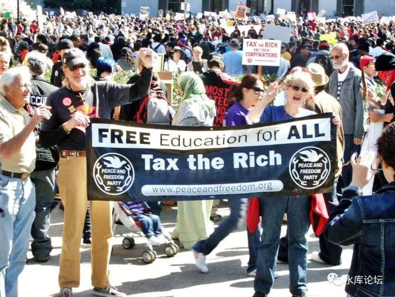
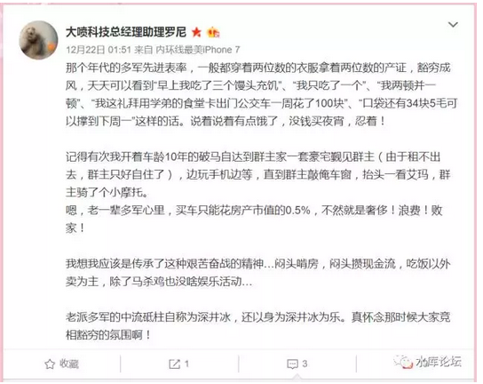
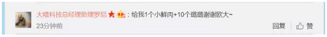
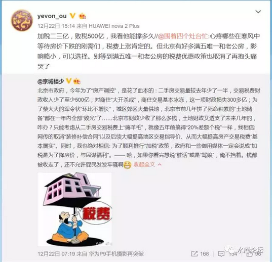

# 你想要怎样的圣诞礼物 \#1630

原创： yevon\_ou [水库论坛](/) 2017-12-25

你想要怎样的圣诞礼物 ~\#1630~
========================================================================================================================

 

本篇为纯房产

 

逢到年底，照例总要讲一讲：

-   2017年总结

-   2018年目标

 

以前每逢阳历年底，水库BBS热闹非凡。各路大神纷纷炫耀今年41N，新增贷款五千万，娃2N，一天赚1.5E，搞得哥哥落荒而逃。

 

今年，因为全面的微信化。所以只能小圈子秀了。

对于大圈子来说，我想问一个问题，假如给你一次许愿，12.25耶诞节你想要什么。

 

 

 

一）一辆跑车

 

昨天晚上，我在新浪微博贴出了问题："你想要怎样的圣诞礼物"\[1\]，短短半天，获得了近100个回答。

 

我们观察这些回答，第一重的答案，是"我想要辆法拉利"。

"坚果Pro2"

"一双Gaziano&Girling Burnham"

"凌晨2点的海鲜"

 

对于这种物质财富，应该是最容易满足的。

水库多军，通常都不是很在意物质财富。例如前天罗尼一篇微博：\[2\]

多军一般都很"节俭"的。

节俭的原因，不是因为法拉利太贵。而是因为法拉利太便宜。

 

再贵的法拉利，也不如上海一套老破小。

对于一年买七八套老破小，平均每1.5个月啃一套老破小的人群来说，"法拉利"实在不算什么欲望。

 

没买的主要原因，是因为"刺激"太浅。小孩子的玩具。成年人不会炫耀。

 

罗尼本身没有买车。

不过前一阵子，她助理璐璐，哭哭啼啼说没有交通工具，于是就买了辆Tesla。给六个助理小妹，员工福利随便开。

（对的，姐姐还招人的）

 

哥哥闲了问她，特斯拉推背感怎么样。她说不知道啊，半年没洗过车了。 

 
二）一套房子

 

比"跑车"更进一步的，是需要一套房子。

 

-   "10斤北上广的房产证"

-   "银行10亿信贷资源。随借随还，按天算利息。"

-   "银行赐你500万额度的信用卡"

-   "1亿信贷额度30年按月付息，到期还本"

 

这样的回复，就更接近"力量的本源"。

因为我们知道，跑车，珠宝，名牌包包，卡地亚手表，这些都是"不保值"的。

 

尘世间的财富，往往只能保持二三年。

看似风光无二的跑车，开三年就落伍了。开五年，就可以换代了。

时代变迁很快。

倾注青春的代价，换取二三年的肆意风光，是很无谓的事情。

 

 

多军往往追求一些"更永恒"的价值。我们不仅仅希望有钱，我们还希望长时间地有钱。

 

为此，我们可以省吃俭用。可以削减自己的开支。

当许多人，赚了第一个A8，就开始花天酒地的时候。

我们沉默地把A8投入了再扩张，奔向A8.3\~8.5，而且这条漫长的路，似乎永远也看不到尽头。

 

 

第二层回答的人，逐渐明白了"构建以房贷为基础的资产组合包"。

房子是保值的。

但是更保值的，是房贷。

尤其是回答"1亿元长期信贷""低息资金""500W黑金信用卡"，这些都是触摸到了规则的边缘。

 

能做出这一类回答的人，有生之年，都有希望看到A9.

 

 

 

三）一条政策

 

第三类的回答，我一直在等，可惜没有看到。

我希望有人回答："政策面的宽松"。

 

-   放松限购政策

-   放松5.55%增值税政策

-   彻底取消不合理的LVAT

到了下一个层面，你就会了解，"生态"是远远比"资源"更重要的东西。

 

 

我们长期反对"宏观调控"政策。对民间有害无益。

自从宏观调控之后，房价就长期上涨。

 

许多人一个误解，以为"多军"是最指望房价飚高，越高越好。

其实这是很大一个误会。

多军未必喜欢房价涨。

 

 

最简单一个例子，你"五年限售"。供应减少，房价肯定飙涨。

但是多军不能抛，你要这样的涨价干什么呢。

多跑几个轮次，我赚得更多。

周转率和杠杆，比涨幅更重要。

  

同样道理，类似于5.55%增值税重税，加税促使了房价上涨，对于买家卖家都不利。

交易成本超过3%之后，会使得"交易量"断崖式下跌。政府提高了税率，税收收入反而是减少的。

营业税政策，对所有人都不利。

 

 

目前的"限价"政策，相当于对KFS的一次抢劫。

你本来卖800W的房子，政府强行规定，只能卖600W。

卖一套房子，KFS少赚200W。

卖300套房子，KFS少赚6亿。

 

这6亿不是钱么，不是真金白银的挖肉了么。

俗话说，投资不过山海关

为什么，因为东北的政府，法制精神淡薄。无法无天，象黑社会一样。

企业家投资在东北，很容易受政府抢劫，很容易拿不到"预算中的利润"。

 

那么，今天的限价算什么。

你是不是要把全中国，都搞得象山海关一样。

 

 

如果你可以"限价"，你相当于"明抢"。

限价的意思，就是KFS被你抢了这一轮，KFS涨了心眼，他再也不肯被抢下一轮。

 

下一轮的拍地，民营KFS就不肯来了。

政府如果还想卖百亿地王，地就卖不动了。

"卖地财源"一条腿被打瘸了。

对于这种新一轮的"打土豪，分田地"。

你可以说，"政绩一时爽，祸害遗子孙"。

 

短期看，你明抢了KFS六亿。分给关系户一部分，老百姓也能拿几套低价房。

可是长期看，"打土豪，分田地"的结局，就是整个产业的崩溃。

 

 

"投资不过山海关"，从今以后，投资也不过土地关了。

你再要拍地，就拍不到100亿。可能只能拍60亿。

 

目前的"拍地"政策，甚至沦落到了，要找几个国企马甲，小弟来托盘。才能百亿成交。

但问题是，这些"小弟"本身又贪腐竞争力又弱。"产品"在他们手里，卖不出高品质，卖不出价钱。

 

如果"小弟"按照100亿接盘的话，造的房子丑，只能卖60亿。

就产生了40亿的亏空。

财政亏空，最终还是要靠印钞来填补的。

 

 

我们几乎是眼睁睁地看着，政府把自己的"支柱"一条条都敲掉。

-   先是交易税费

-   再是土地收入

-   然后是环保，工业，实业

 

工商调控"肆意妄为"的结果，就是财政收入的减少。

缺的几百几千亿，最终还是要靠印钞。

 

 

对于第三重的愿望，我们希望的是：

-   蠢事少干一点。"限购限贷限价限售"择一取消。

 

 

 

四）奥派科学

 

第四重的愿望，是我自己的愿望。

 

我的愿望是，普及奥派经济学

 

一切的政策，都来自于信仰。

人的所有行为，归根到底，都来自于人心。

 

 

为什么会有错误的政策，因为他们有错误的信仰。

为什么有错误的信仰，因为科技尚未普及。

怎样从源头上，拯救我们这个国家。传播正确的科学。

 

长期以来，铸件部的政策出发点，是"抑制炒作，打击炒楼"。

"炒房客"这个从未被历史证明过的现象，堂而皇之地成了显学。

 

好比鑫胖对北朝鲜人民说，"你们一定要喊我爸爸，否则美国人就会入侵"。

USA是否真的对北朝人民怀有敌意，

鑫胖是不是民族大英雄，

这些都没有证明，而是直接灌输给你脑子里。

 

 

 

在房地产市场，也是一样。

铸件部一口咬定，从2002年开始的房价上涨，是因为有"炒作"。

 

虽然这完全不符合事实。根本没有人频繁在房地产市场买进卖出。没有做庄和哄抬价格。

穷山沟沟里的房价上涨，也绝赖不到温州人头上。

 

可是这都不能影响"信仰的腐败"。

铸件部一口咬定，房价上涨，是因为炒作。想要抑制房价上涨，就一定要抑制买卖。

 

在此后的15年，"宏观调控"连续持续十五年。房价连续涨了十五年。

有效么，肯定无效。

 

房价连涨十五年，民生苦不堪言。

如此大规模，大范围，大强度的民间疾苦，有人出来承担错误没有，没有。

有没有人向国民承担责任，没有。

 

 

时至今日，铸件部依然在和一个"看不见"的敌人做搏斗。

依然象唐吉坷德，挥舞着战马，冲向风车。

 

你如果持续以"反炒卖"进行地产调控，房价依然只会涨。未来，也看不到缓和的可能。

 

长太息以掩涕兮,哀民生之多艰。

 

 

 

你有什么样的信仰，你才会有什么样的举动。

首先是对"世界观"科学的认识，然后才是你行为的准则。

 

如果你受的教育，罔顾了"实事求是"。闭门造车鸵鸟塞地，自以为是"炒作"托高了十几年十几倍的房价。

则你自然会"限购限贷限售限价"害民政策层出不穷。

 

信仰决定路线

 

 

对于我们这个国家。

-   我不奢求二三年的挥霍享受。

-   我不奢求二三十年的长线投资

-   我不奢求对政策的呼吁松绑

-   我奢求的是，民智的开启，科学的普及。

 

你只有先告诉人民，"什么是对，什么是错"。

地产到底是怎么回事。

经济学正道科学原理。奥派的方法论。

只有把原理撸清了，人民醒悟了，才不会做出错误的决策。

 

 

因此我在12.25的心愿，就是普及"奥派经济学"。

正义比黄金更宝贵。

 

 

 

（yevon\_ou\@163.com，2017年12月25日午）

 

 

 

 

分答续费。各位抓紧续2018全年，谢谢。 

\[1\]你想要怎样的圣诞礼物https://weibo.com/1853047530/FBc8riTxv

\[2\]罗尼微博：https://weibo.com/1893056300/FAKaQo820
