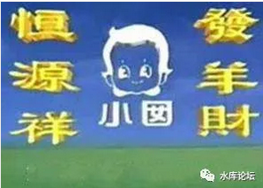

# 广告学入门（中） \#1641

原创： yevon1ou [水库论坛](/) 2018-09-07

广告学入门（二） ~\#1641~
=========================

一）镂空法

 

我们来看这个表格；

 

这是一张典型的"广告投放图"。

意思是，1\~31日，每天都投放广告。

这也是最实诚，最没心眼，乡下孩子刚到大城市的老实企业家做法。

 

几乎任何一个"专业"人员，看到了这张表。他都给你撕了。

毫不费力，换成了下表。

这个表格的意思，是每周"只放"三天。例如周一二三。

另外的四天，省钱，喝粥。

 

 

如果你是一个土豪，是一个实诚的企业家，你会问"哎哟哟不行"

"我是真心诚意，想把企业办好"

"广告不嫌多"。

 

这时候，媒体经理会告诉你，这种"镂空法"广告投放，是有"心理学"依据的。

每一种动物，大脑结构不同。

人类这种动物，就是"延续性"记忆特别强。

 

一件事情，你不用反复刷。你妈提醒你买火车票，不用每天强调十几遍。

等有空了，你自然会去阿里飞猪。

反复刷"提醒"，令人陡生厌恶，效果也不好。

 

知道了广告投放，分析基于"心理学"。

聪明的人，马上想出了Ver 2.0的版本。

 

这是一种更巧妙的方法。从123号"狂轰滥炸"开始。

到7号开始提醒。

9号（隔2天），再提醒。

12号（隔3天），再提醒。

然后16（隔4天）,21,27号再提醒。

 

 

因为人类的大脑，有一种非常奇异的"功能"。

有一件事，发生在1月。你在9月提醒他，许多人都已经忘记，难以记起。

 

但是，如果你在4月，"不经意"提到过一次。则到9月的时候，会有很大概率的人记得。

若你在4月，7月，各"提醒"一次。则年初的事情，记忆甚至可以延到圣诞。

 

社会热点，需要不断地被提醒。才能被长久记忆

 

 

广告学学到最后，全部都是心理大师。

媒体经理每天盯着表格看，左思右想，能不能再抽掉一格。每一格就是几百万啊。

尽可能地调动人类大脑"提醒"功能。节约投放。

 

 

你以为这样就完了么，不，还有Ver 3.0版本。

 

聪明的读者，肯定记得我们之前贴过一张上海电视台"广告报价"。

电视广告的产品，主要分为15秒，30秒二种。

价格，15秒≈30秒\*60%

 

电视媒体，已经约定俗成。几乎只有四种"标准时长"。

15秒，30秒，27+3秒，5秒\*3

 

 

其中，30秒广告，是给你讲"一个完整的故事"的。

譬如说，这二天俺小区电梯里，天天都在放。

AngelaBaby大花痴，又要法国旅游，又要每天吃三顿大餐，又要便宜不贵。

偷偷摸出一个黑影，手里拿块板砖。

30秒视频在这里：

http://www.iqiyi.com/v\_19rr8wma44.html

而15秒广告，是给你一个"精简过的故事"。

同样杨颖美团，15秒广告在这里：

前文说过，人的大脑，具有"记忆\-\--提醒"功能。

既然这样，你干嘛要用30秒的广告去提醒呢。

用15秒，岂不是更省钱。

我们再看回原表：

 

在这个表格中，其实分为4个阶段。

1）公示期，第123日，通过密集大量的广告，推广品牌形象。

2）Pulse1，第4\~20天，形成余波荡漾。

3）复苏期，第21天，再投30秒。

4）Pulse2，第22\~31天

 

 

一般企业年度"媒体计划"中，这个表格不一定是31期，很可能是365期的。

企业大致有一个计划，每年的3\~4月，例如新产品推广时，举行一波大型的广告攻势。

然后"余波荡漾"，都是用15秒的广告，节省成本。荡啊荡啊，冬眠四五个月。

 

到Sep\~Oct金秋，再拿1/3的广告预算出来。投30秒一波小的"复苏"。

然后再荡啊\~荡啊，一直荡到明年。 

 

媒体经理，要对着这个表格，看啊看啊，看无数遍。

把绿色的柱子，"削减"到少得不能再少。

毕竟每一笔Media支出，都是数百万元的大数字。

 

广告学的精髓，在于少投广告。

 

 

 

二）整体驱动

 

假如你销售额1亿，你拿2000W去投广告，那就是营业额的20%。不可想象，不可承受。

假设你销售额5亿，同样还是2000W去投广告。那就是4%，完全可以承受了。

 

广告实在太贵，1秒钟一万。

为了捡回这个成本，第二个办法，是"整体驱动"。

 

也就是说，广告带动的生意，要尽可能多。

广告带动的产品线，要尽可能多。

 

 

譬如说，xiaomi小米的主打产品是手机。但其实小米也做空气净化器，平衡车，路由器，加湿器，甚至油烟机。

为[小产品线]单独打广告，推广平衡车，是一件很得不偿失的事。

 

如果你的销售额不到一定程度。

许多产品，可能一辈子也没有广告机会。

 

 

小米公司，投放的是"小米"手机广告。

给消费者塑造一种"价廉物美，性价比很高"的感觉。

 

只要消费者记住你这个"产品形象"，他们自然会被"公司整体品牌"带动。

也会购买你的其他产品。

因此"小米手机"的广告费，其实是由所有产品线均摊的。

 

 

另外还有一种技巧，则是27+3.

譬如你卖手机的，你把广告抽掉几帧。变成27秒。

最后多出来3秒，你可以再吼一句：

 

"小米笔记本，全新上市"

"小米互联网电视，精彩新视界"

"第二代VR眼镜，全新上市"

 

 

 

三）广告的制作

 

广告的制作，大致经过了三个阶段；

1）宣扬产品的性能

2）营造一种情怀

3）消费者能记得你就不错了

 

最早，最正统的概念，广告是用于"宣扬产品的优质"

我家的洗发水，可以去屑。

我家的洗衣机，可以变频，低电压也能启动。

我家的冰箱，超级省电，一天只用一度电。

 

 

但是，随着商业竞争的急剧，产品上的"技术隔代"越来越困难。

譬如说，今天在机场习以为常的拉杆箱，其实是1991年才发明的。四个轮子的，甚至晚到2005年才发明。

而今天已经全球普及几亿只，覆盖每一个国家。

技术的传播，比我们想象更快。\[2\]

 

 

广告是一笔巨大的投资，一家公司2亿广告预算，往往是"单一最大宗采购"。

为了尽可能优化广告效果，公司退而求其次，"营造氛围"。

譬如Nescafe当年家喻户晓"味道好极了"。一下子打开了1980年中国人渴望中产生活的心。

 

DHL的广告，是一架倒飞的飞机。

UPS的广告，永远都是二个驾驶司机，在密林里迷路。然后"我们比你更了解当地市场"。

Lux的广告，永远都是当红的女明星。甩来甩去"国际巨星的头发"。

Durex永远在蹭热点，古惑和鬼马

 

这些在产品上并没有"特别优势"。

他们贩卖给你的，其实是一种"亲切感"。

 

广告可以换版本，但是框架套路永远不变。

每一版新的广告，可以借助消费者原有记忆，"重复记忆"降低成本。

甚至消费者只要听到叮叮当几个音符，就会下意识回想起这个品牌。 

以"播放二周后消费者印象率"指标来考核，"系列片"的效果非常好。

 

 

第三个层次，有时候"卖情怀"都不太好用了。

例如美国四大快递公司，UPS，DHL，FedEx，TnT，谁能说得出他们的细微区别。

如果你要卖情怀，家家户户都在卖情怀。

 

这样情况下，CEO们更加退而求其次，我们不要求你记得"我们的好"。

不要求你记得"我们的雅"。

在信息泛滥的今天，你能记得"我"就不错了。

 

 

或许人们还记得，几年前的"恒源祥"事件。

恒源祥包揽了电视版面，然后播"猴猴猴，恒源祥"

"羊羊羊，恒源祥"

"狗狗狗，恒源祥"

这是典型的5秒\*3广告类型，反反复复轰炸般来回播。搞得你不厌其烦。

 

有许多的人，甚至打电话去电视台投诉。连新闻办都惊动了。

而且这个广告，绝对没有半点"正面影响"的意思，毁誉如潮。

 

但是在"广告学"上，这个例子却是完全正确的。

因为羊绒衫厂家已经如此之多，你再也不奢望能做出任何的优胜。

你只冀望消费者能记住"恒源祥"这个牌子。有万分之一的印象。

以后买衣服的时候，有印象的大品牌，本身就胜了一大半。

能被消费者记住，就是硬实力。

 

相似的例子，美国曾经发生过一次登峰造极的。

一家互联网宽带ISP公司，他们的广告，是一只猴子在尖叫

极高的120分贝，从头到尾，尖叫30秒。响得你恨不得劈了电视机。

人们至今仍在传颂。

 

 

讲完了"广告制作"三部曲，有心人会意识到，这里面并没有牵涉到"明星代言"。

而明星代言，是中国商家最最最关心的。数百万，上千万广告费，屡见不鲜。

 

事实上，在整个广告市场中，"明星代言"的份额是非常非常小的。可能连1%的片子都没有。

广告界的霸主，是绝对的"BBC"，Beauty，Baby，Cat。

 

"女人，小孩，宠物"这是绝对的政治正确。

只要一出现萌萌哒，萌萌哒的baby，许多人心就化了，谁也不会说半个不好。

 

 

广告的制作成本，和播放成本，有一定的比例，一般在1/5左右。

 

 

（未完待续）

 

（yevon\_ou\@163.com，2018年1月22日午）
