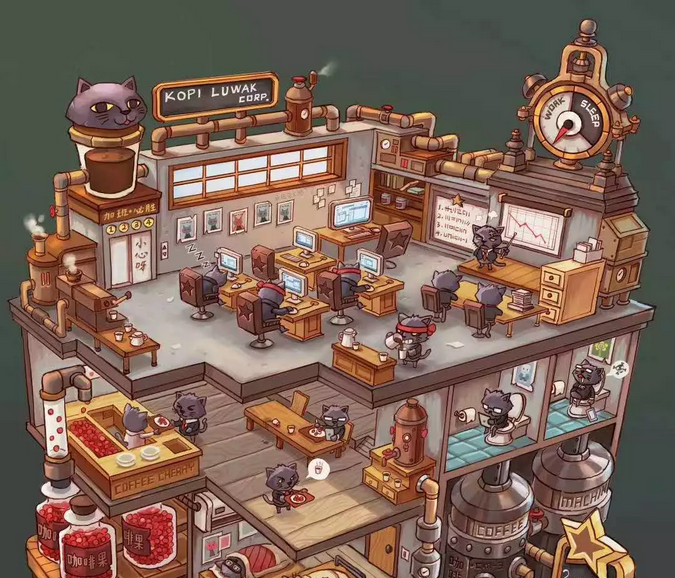

# 广告学入门（下） \#1642

原创： yevon1ou [水库论坛](/) 2018-09-08

广告学入门（下） ~\#1642~

写在前面的话：

 

《[广告学入门2](http://mp.weixin.qq.com/s?__biz=MzAxNTMxMTc0MA==&mid=2651018767&idx=1&sn=9513296754b30f9709a59f0d83882234&chksm=8072001cb705890a07a7c0ce84d5a206280b84f219b5624749455fc26943ef86b8fdebc1e50b&scene=21#wechat_redirect)》发出了以后，有[缠中禅]，[Chaos]等网友留言，大意是"现代的精准投放，不再需要广告业精算"。

这种留言，除了揭示"理工男"狂傲无知，素质低下，知乎一群SB，永世不得翻身。也告诉了人们，什么样的SB会"失败"，为什么有些渣滓一辈子一事无成。华夏"工业"党，马哲处于鄙视链的底层。

 

因为我们谈论的是"体用"，他说的是"术"。

对于广告业，广告业的核心思路，就是"投放尽可能少"的广告。这其中的算法思路，和桥梁力学，用最轻的材料建筑最坚固的大桥，其实是差不多的。

拱形结构和空心砖，才是真正的智慧。

 

 

无论科技怎样进步，无论钢材怎样演化，这个"节约"的思路，是不会改变的。

节约，是战略级的。是全局性的。是指挥官思考的问题。即所谓"套路"。

然后，数字媒体，长尾理论，实时摄像头反馈，只不过"术"的外围。无非投放渠道的一种。

外部的力量，不能帮助你的企业成功。

 

 

中国有超过10000家洗发水，但是最终能上广告的，不会超过50家。

这是一种"竞争"的关系。最能付费的50家上广告。

 

假设"数字媒体"，"精准定位"。则广告的价格就会上升，"精准"会是"不精准"的三到五倍价格。

最终还是50家洗发水，才能上广告。消费者和消费者竞争。

 

[只有广告Schedule的内部精算，才是你公司的"核心竞争力"。才是核心算法。]

妄想数字媒体业革命，靠外部力量，你是打不败竞争对手的。宝洁不可能取胜夏士莲。

 

通透一点的人更知道，"精准投放"有利的是"流量主"。而不是"广告主"。它相当于流量主的产能翻倍了。

 

好比"水库论坛"，曾经接过好几次"贷款中介"的广告。但是这种广告是不精准的。

水库有50W粉丝，但是上海9W，广东8W，北京6W。

如果你刊登一个"北京贷款中介""北京管家公司"的广告。他的有效受众是"6/50"，是非常非常不划算的。

 

 

我们也一直很希望，微信后台推送时，能给我们切分"省份"。

好比同样一篇文章，可以分成"北京版""上海版""广深版""内陆版"。

主文部分是一样的。广告部分是不同的。

 

这样的话，一次推文，我就可以收4次广告费。

可见，"精准推送"其实有利于流量主。这也是互联网公司估值高过电视台的地方。

但是对于买广告的人，北京有三五家贷款中介竞争。最终的广告报价，还是以他们中最贵的为准。

 

 

最后说一句，透视"事物背后的规则"，是一种强大的力量。也是技术型员工，和中层干部的分界岭。

看文章，要直接看到精华，吃透规则。凡是我骂SB的那几个人，这辈子注定也就是LowB了。

 

 

 

广告学第一定律："购买尽可能少的广告"！

 

 

一）镂空与重叠

 

广告学的核心原则，是"保证大致效果的情况下，尽可能削减广告预算"。

而采取的技巧，主要是"镂空法"。

镂空法，也可以称为精准投放。

 

前文，我们讲了一个时间上的"镂空"。你不需要每一天都烧预算。

而是靠人类大脑的"记忆延迟"功能，一遍又一遍地刷新提醒。

最后给出的广告计划书，是这样一个表格：

这篇，我们要讲"空间"上的镂空。 

 

首先，我们要问一下，什么样的人，会在CCAV投放广告。

譬如这里有一家"长隆水上乐园"，又或者是"王宝和大酒店"。

请问，这样的商家，会在CCAV投广告么。

 

答案是不会。

哪怕企业有这个资金实力，也不会。

不是不能，而是不值。

 

 

因为"水上乐园"和"大酒店"，都是地域性非常强的企业。

水上乐园，可能仅仅就覆盖一个城市。

大酒店，甚至只覆盖一个区。地铁交通的前后几站路。

 

但是CCAV1，是一个"全国性"的媒体。覆盖了中国几亿人口。

CCAV一旦发布广告，顿时就是"全国性"的影响。

 

 

外行们或许会以为，"出名"没什么不好啊。

让一个青海人，西藏人，也知道你珠三角水上乐园的名声。

正应了以前中国企业的老话，"誉满中华，走向世界"。

 

但是，在内行人眼里，广告学整个逻辑是倒过来的。

出名是很好，免费的出名很好。

但是付费的出名，就很不好了。

 

 

CCAV1可以覆盖到全国市场，因此他的收费，也是全国级的。

CCAV可以覆盖到几亿观众，因此CCAV的收费，也是以"亿"为数量级的。

上海电视台CBN的15秒，是10万数量级。

CCAV的15秒，就是100W数量级。

 

但是对于商家来说，他的利益并非重叠。

远方的客人，并没有太大价值。哪怕一个新疆人听到了你的广告，他也没什么兴趣，买张机票飞过来，就为了吃你一碗30元的干炒牛河。

 

商家讲究"精准"。对面小区的夫妇，出10元/人的广告费都愿意。

隔了几百公里的消费者，出0.1元/人的广告费都不愿意。

与其上CCAV投放广告，还不如买路口二个灯箱，5000元/月就够了。

 

 

因此我们看CCAV，CCAV这种史前怪兽，既庞大可怕，也不堪一击。

CCAV虽然有几亿用户，有最庞大的收视率。

但是"适合"CCAV的品牌商家并不多。

前几年是白酒，洗发水，洗护类消费品牌。这二年汽车，保健品，金融类增加。

 

但总而言之，"商家面"还是狭窄的。

你挑商家，商家也挑你。

 

 

"广告学"，他的整个逻辑是倒过来的。

"广告"并不是购买得越多越好，而是购买得越少越好。

 

因为"媒体公司"一般是按照流量收费的。越大的渠道越贵。

现代广告学的要求，是"精准"。也可以称为"重叠"。

最好我的消费群，和你的读者群，高度重合。

 

 

譬如说，我一个卖摄像机镜头的，最理想的投放杂志是《摄影之友》。

这种"小众"杂志，根本没什么人看。相应的插页报价，也不会很贵。

而和我的产品，完全精准匹配。才能卖干货高价。

 

同样道理，你一家卖帐篷的，卖冲锋衣的，最适合的杂志是《驴客之友》《户外生存指南》

如果去《国家地理杂志》投放广告，效果也不错，但终究有一点偏了。

 

每一位媒体经理，都要高度勾勒自己公司的"消费者"众生相。

然后拿去和各家媒体一一对比。

找出"重合度"最高的一家。

饭店就买下街口二个灯箱。

 

这样一项算筹，业内称之为TARPS，即"精准客户到达率"。

你投放任何一个媒体渠道，都要打折的。客户"重叠率"永远不会是100%

tarps到80%，就已经非常高了。

 

 

 

二）媒体业的水分

 

和tarps相关联的，还有一个数据，外行人绝难以理解掉坑，斑斑学费血泪。

"媒体业的谎报"。

 

 

学院派和实战派一个区别，学院派往往搞出来一个很漂亮的报告，PPT闪亮。

说："我们公司的产品，和《汽车大户》杂志最为匹配。tarps重叠率高达90%，建议购买该杂志扉页广告"。

 

而实战派老总拿过来一看，几万元预算，总觉得不对。

这份杂志听也没有听说过，真的有这么好效果么？

 

如果你完全遵循"学院派"白面书生的指引，他们会精心编制一个"媒体播放计划"。选择好几个投放渠道。

但中国是一个很神奇的国度，中国有很多游戏规则，和西方完全不同，和理论不同。

 

主要表现在；

1）几乎所有的媒体，都在谎报流量

2）算法过时

 

 

目前，最大的重灾区，是"报纸广告"。

业内懂行人的笑话，叫"最大的废纸回收站"，砍掉一个零。

一些宣称四五十万发行量的大刊，实际能到流通阅读者手中的，连4\~5W都不到。

 

大量的报纸，经过发行站中转一下，连书报亭都进不了。

带着油墨香，直接扔给了废纸公司。

 

同理，目前上海的杂志市场，一本周刊的存活线，大概是5000册发行量。

但是对外宣称，全都是20000\~30000册。

如果你看某杂志快撑活不下去了，那它的发行就是5000.

你再拿"业内"宣称的发行量来对比，就知道水分有多大了。

 

 

第二个问题，是"算法"过时。

目前媒体界"沿袭"的算法，基本还处于1980年代水平。

以报纸为例，报社堂而皇之的口径，是1.2\*2.3

 

意思是说，一张报纸，到了百姓的手中，读者会反复看。平均每篇文章，阅读1.2遍。

同时，一份报纸，会被二三个人抢着看，抢着传播，平均是2.3人设。

然后报社，理直气壮地按照：发行量\*1.2\*2.3来收钱。

 

 

我们可以发现，这个公式是极其不靠谱的。

或许曾存在过，但一定是1930年代，"无问东西"的新青年时代。

今时今日，谁还把一份报纸看1.2遍啊。

什么报纸，还会有2.3人抢着看啊。

 

以俺做自媒体的实际体验，"纸媒业"的掺水量，大概在10倍左右吧。

 

 

市场并不愚蠢。你通过各大"媒体中介"购买广告，都有很深的折扣。

"广告采购"，从来都是水深水深，专业性极强的一个领域。

不要迷信报价，狠狠砍价。"乱拳打死老师傅"或许比学院派更强。

 

 

 

三）精准投放

 

中国的广电系统，花费了大量的力气，终于把广播电视，全部都改造成为了IPTV，也就是所谓的数字电视。

数字电视在广告学上，是一场彻底的革命。

 

 

一方面，有电视以来第一次，电视台有了"精确"的收视率数字。甚至可以精确到每一分钟，电视剧中女主角每一个镜头表情。

足球射门，进攻，围攻时的收视率变化。

 

而传统的"盖洛普"收视率调查，依靠3000个人上门填表，很不精确，成本很高，也不细化。

 

 

另一方面，更革命的，则是终于可以"差异性"投放广告了。

前文说到，CCAV1这种恐龙，属于史前怪兽。

看似庞大无比，其实不堪一击。

 

因为CCAV虽然流量很大，但却是"铁板一块"的。

只有一些全国性的品牌，例如酒类，洗发水，脑白金，才需要在全国台投放"一模一样的广告"。

这二年招商银行网点多了点，否则CMB也不会接6:59:55的五秒广告。

 

 

但是，在电视"数字化"之后，媒体公司，第一次可以在同一时间，投放不同的广告内容。

例如19:30，放完了"新闻联播"正文，连续剧尚未开始。

30秒的黄金时段，上海观众是"老庙黄金"

北京观众是"五棵松足球赛"预售票

广州观众是"长隆水上乐园"

深圳观众是"华润银行最新基金"

 

你哪怕看同一个电视频道，收听到的广告内容却是不同的。

我们常说，"广告预算中有1/2是被浪费掉的"。

有了数字化定制，大型媒体就可以获得更好的收益。

 

 

 

"定制广告"是多赢之举。

以"水库论坛"为例，截止到发稿之日，水库大约362000微信订阅粉。其中：

-   上海77000

-   北京45000

-   深圳28000

-   广州16000

 

前二天有一位"北京专业贷款"代理**宋**先生，第二次投放我的广告。

我虽然收了他的广告费，但是心里很不安。

 

因为我知道，他的广告费，只有45000/360000=12%是真正有用的。

其他的，上海深圳广州客户，谁看你啊。

 

 

如果腾讯的微信后台支持，我宁可换一种模式。

一篇文章发出，末尾略有不同。

分别搭载北京，上海，广州，深圳，四个不同的广告主。

 

每人哪怕我给他们50%折扣，我的总收入还是200%翻倍。 

 

\*
目前淘宝，京东，头条等视频网站，算法更为复杂。甚至可以根据你的消费习惯，实时调整广告出现。"大数据"是一个深入的话题。

 

 

 

四）账号连接

 

大号依然比小号更有价值。

 

如果看"微信广告"市场。目前基本有四段。

-   阅读量5000以下，1000元/篇

-   阅读量5000\~10000，每个阅读0.5元

-   阅读量10000\~100000，每个阅读1元

-   阅读量篇篇100000+，每个阅读2元

从这个报价，和市场区间，我们可以明显地看出，"账号越大越值钱"。

 

为什么会发生这种情况，还是和广告学原理有关。

二个小号，是拼不成一个大号的。

 

 

好比说，你想投放一个广告，想达到10万人的阅读量。

你有二个选择；

1）10W粉的大号

2）二个5W粉的中号

而事实结果是，二个5W粉，并不能达到10W的散播。最终可能仅仅是7.5W。

 

因为粉丝之间是会交叉的，会重叠的，会无效的。

对广告公司而言，这往往就意味着"浪费"。

同一个消费者被重复告知二次，意义不大。

 

 

更糟糕的是，随着"传播点"的增加，20个5000粉的小V叠加，他们的效果就更更差了。

因为你没法计算，20个V之间的粉丝交叉情况怎样，客户深度怎样，广度怎样，再提醒怎样。

 

到最后简直一笔糊涂账，即使你想补救，追加广告预算，也很难有针对性地，精确执行计算。

 

1995年"秦池"央视标王之后，有志之士眼红，于是搞了"地方台联盟"。

把全国31个省台，串成一个套餐。观众人数也有几亿。

购买相同时段广告，同步播出。

然并卵，最后是无声无息，暗淡收场。

 

 

一个100000+大V，其广告效果，是远远好于20个5000的

他提供了一个平坦而干净的市场。

有助于进一步的商业计划和开拓。

 

但是V也不能太大。太大了，就缺乏了"重叠"。

找不到和你完美匹配的广告商。

控制规模，精选粉丝，都是生意。

 

根据会投广告的厂商，反推，你需要设计怎样的粉丝部落。

 

 

 

五）结语

 

广告这一行，浩瀚如烟海。班门弄虎，实在汗颜。

任何一个业内人士来写，一定比我更好。

 

只能说，我给了各位一个"框架"。

在辽远的黑暗中，给你一支烛光，照亮了铁轨。并告诉你几条支路科技树。

 

 

中国人，是极其聪明的民族。

框架搭好了，剩下的路，您自己探寻吧。

 

 

 

（yevon\_ou\@163.com，2018年1月22日暮）

 

 

 

\[1\]资料来自百度：http://www.allchina.cn/Adpage/Shanghai/Html/2004-12-14/20041214175832.html

通过媒体中介批发，一般都会有很大折扣

\[2\]《拉杆箱何时发明？又是何时进入中国的呢？》https://www.zhihu.com/question/28896277

新一轮正在开发蓝牙定位，AI自动跟随主人的拉杆箱。

\[3\]
封面图片说明：在鱼生的竞赛中，失败者被杀头，做成生鱼片。但是在猪的拳击赛，胜者半夜被杀，做生瘦肉面。当然还有第三张图，不输不赢什么事也没错。照样被绞成血肉。

