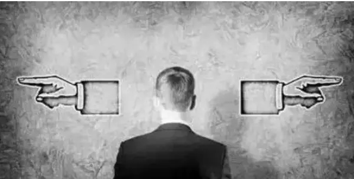
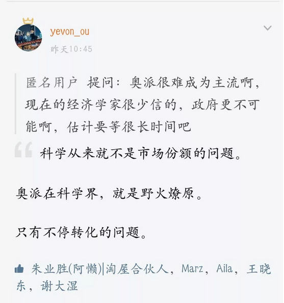
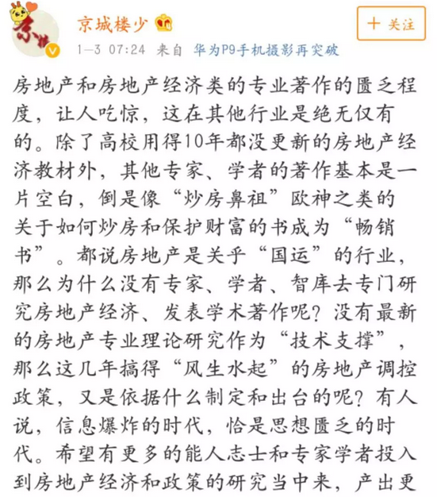
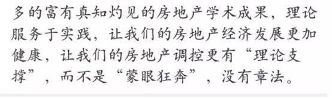

# 粉耳朵 \#1650

原创： yevon\_ou [水库论坛](/) 2018-01-04

粉耳朵 ~\#1650~

根据水库论坛2014.06.06旧文《粉耳朵》改写 \[1\]

 

只和法师吟唱的时间有关

 

一）粉耳朵

 

我真的烦透了某些人。

在我看来，某些人的立场，当且仅当法师在他耳边吟唱的时间有关。

 

 

不知道各位有没有玩过《帝国时代》，很老的游戏。

在帝国时代里面，有一个特殊的兵种：巫法师。

巫法师本身并没有太强的战斗力。但是他可以"吟唱"。

 

洗脑歌曲，唱啊唱着，

对方阵营一台投石车，突然由红变蓝。亲友变成敌人。然后开始攻击身边友军。

旁边的剑士们一看不对，三下五除二，把投石车给砍了。

老头继续"吟唱"。剑士中又有一个人"叛变"。肤色由红变蓝，剑士开始攻击剑士。

 

如果放在房地产市场，则是这样的一群人，我们可以称之为"粉耳朵"。

你要说他们是空头，还是多头呢。

看空吧，还是看多吧。

咳咳，这事纯粹只和他们听了多少次"讲座"有关。 

 

譬如说，你拉着他，连听十场"大空头"。

杨红旭，郎咸平，大白的讲座。听着听着，他变得义愤填膺。

挥舞手臂，铁杆死空。房价马上就要崩盘，腰斩膝斩跌到脚趾头。

 

然后你，再把他拉回来。听十场"水库论坛"。

他痴迷入迷，开口闭口"买买买"。一刀流半刀流。

"构建以房贷为核心的资产包""2N""贷到就是赚到"。

 

再听十场"空头论坛"，又叛变了。

 

这其中的转变，行云流水，比IOS还流畅。

以至于你根本不知道变色龙本来的肤色，是什么颜色的。

"Yes，Majesty"他本人，是没有任何立场的。

 

这一类人群，我们称为"粉耳朵"

 

 

 

二）真理

 

昨天水库知识星球，有人问了这样一个问题。

科学，必然是一元的。

π，必然是3.1415926535897......，这个数字是精确的。绝对不会有任何歧义。

 

科学不是民主投票。

科学不是粉耳朵。不是说一会甲方影响你，一会乙方影响你。看影响力的大小，立场不断摇摆。

 

水库论坛，致力于传播科学。

在真理普照之下，对就是对，错就是错。

如果你一会对，一会错，那只能说明你还"没入门"。

 

为此，我们需要解释一下，为什么会出现"粉耳朵"，为什么会有这样的现象，为什么会有这样的人。

粉耳朵现象的本质，是只懂"定性分析"，不懂"定量分析"。

 

好比我外公以前炒股票。每次我见到他，永远都是紧缩眉头，愁眉不展。

他说的最多一句话，永远都是"不确定因素太多"。

 

你跟他说中国经济长远看好，企业盈利增长迅速，居民收入每过十年加零。

他永远说"这些事情都很好，可是也有乌云啊"。

 

例如某些机构说，中国产业结构不合理，环保清查，损害了生产力。国际油价上涨，能源价格高昂。美联储加息，印度发生了地震，南太平洋香蕉欠收。

 

如果美联储加一次息，或者小川龙王表示收紧水龙头。

那简直就要吓破了他的命。他永远生活在"惶惶"迟疑之中，没过过一天好日子。

 

 

粉耳朵的症状，其本质是只懂"定性分析"，不懂"定量分析"。

"定性分析"的结果，就是只能比大小，不能相加。

譬如说，100件利好，那是毫无疑问的利好，赶快买入。

可是哪怕99件利好，1件利空，因为没有定量分析，顿是宕机死机了。

 

 

水库论坛，致力于科学的普及。

你看全中国所有的"地产公众号"，只有水库论坛，是告诉你"加息对地产的定量"。

 

几乎所有的人，都知道"加息对地产是不利的"。不利，可是有多少不利呢。是不是如谢国忠唱的"上海下跌50%，北京下跌30%"。

 

对于某些只懂粗浅"定量"的粉耳朵。加一次息，他的心理就崩溃了。你和他说再多的"宏观经济分析"都没用。

 

 

可是水库论坛，可以告诉你，大约是1:5的关系。加一次息，房价下跌5倍。

加息0.50%，房价大约下跌2.5%

只有二点五，四十分之一哦。皮毛不痒。一涨就涨三四成。

具体的算法，见《[利率与房价的精算法](http://mp.weixin.qq.com/s?__biz=MzAxNTMxMTc0MA==&mid=2651014882&idx=1&sn=c6e6949ad3dabaa5d2ad1d8648875041&scene=21#wechat_redirect)》\#2270.

 

 

 

三）尚舒房

 

近期，深圳有一个机构，怼了水库几句话。

链接在这里《[众生喧哗，听大白如何先声夺人？](https://mp.weixin.qq.com/s?__biz=MzA3OTk4NTkwMw==&mid=2652110577&idx=1&sn=1b1054bbe4ddfeb2896c47cb73e08132&chksm=844c7371b33bfa67a1e41da529a329b73f193b096a34ab45c9af7ec25e4b6f2b4203f9472956&mpshare=1&scene=21&srcid=0102MU7VPCty5JEh05cth2Ur&pass_ticket=Ypua%25#wechat_redirect25)》

 

他提出二个观点；

1）并不存在洼地

2）房贷创造通胀

然后，就有一堆的"粉耳朵"被他忽悠去了。

 

哥哥一听就乐了，就跳舞了，就差挥舞拍手了。

你说这是什么。这不就是水库精神么。

 

水库开篇，总是号召小白去"看房200套"。

为什么要看房200套。200套就是为了让你"构建"世界观，构建对这个市场的基本理解，构建内心的框架。

 

有些人，你哪怕把他仍在盆地里，他还会问你"哪里是洼地"。

因为他们无从分辨，内心没有比较的基础。

见识太少，就无从分辨。

 

他们总是说"便宜总有便宜的道理"，"现在有利空消息"

"2KM外有高压电线，会不会折价"

"小区门口有中国移动基站，要不要打八折"。

要不要八折，要不要八折，你倒是说呀 

 

 

但是，如果你"看房200套"，你心里就有谱了。

千奇百怪，千人千面，所有的人群你都看过了。

然后你就知道，临近高架不折价，临近大马路不折价，临近高压线不折价，视野有遮挡不折价，中移动不折价，18层楼不折价。

你以为"小心肝哎哟哟"的事情，全部都只有2\~3%的影响力。

 

你要是因为加息了，去找房东砍价。

房东直接大扫把把你砸出去。

 

洼地是存在的。只有踏实实干的人，才能分辨洼地。

"粉耳朵"心中没有一杆秤，他们永远分辨不了笋盘。

 

 

 

四）房贷

 

有一种论调，认为"通货膨胀是房贷造成的"。

他们振振有词地说，因为房贷，市场上的钱变多了。

钱多了，通胀了。

所以"房价上涨"，是通胀的因，而不是通胀的果。

 

 

说这种话的人，缺乏最基本的金融常识。

房贷是怎么产生的，房贷占用的是"工商业贷款"。

 

当基础货币产生之后，"货币供应量"总是恒定的，M2的倍数，一般是基础3.0\~3.5倍左右。

这个数字，是"存款准备金率"的倒数。

 

 

银行拿到存款之后，总是要千方百计地把贷款放出去。

不管以任何名义，但总之最后银行手里是"不捏"现金的。钱总是要尽量地放出去，买国债，同业存款，创造贷款利润。

 

在最初的时候，银行只有"工商类"企业，这一种贷款。

众所周知，放贷给工商业的风险是很大的。中国的银行系统，从1990年到2000年，二次因为坏账而崩溃。

 

而到了2000年之后，银行也开始发放"个人住房贷款"，"信用卡消费类贷款"。

你分36期，买一个iPhone X手机，其实也是银行贷款。

 

而这些针对"个人"的贷款，性价比要好得多。给银行贡献了大量的利润。坏账却几乎为零。

房贷，事实上是拯救了整个的银行系统。

 

 

"货币供应量"只和基础货币有关，大致是3.0\~3.5倍，是"存款准备金率"的一个倒数。

无论有没有房贷，"滥发纸币"之后，通胀都会随之而来。

 

认为房贷促进通胀的人。

缺乏最基本的金融常识。

 

 

 

五）严谨的楼学

 

今天，我看到这样一条微博。

我们一直看到有一种评论，认为楼市是"蒙"的。

以为你能猜中前十几次的对错，连续十七年，把把押多，纯粹是因为"运气"。

 

我们知道，肤浅来自于无知。

有些人，坐在盆里里，却不知道"洼地"。

坐在一触即发的火药桶里，却妄谈"没有行情"。

这些事情的原因，是因为他们没有"看房200套"。

 

 

粉耳朵，是因为小白的知识太少。越是无知的人，越容易摇摆观点。

而深入深刻了解水库的人，就会知道"楼市学"是一棵复杂的科技树。

浩瀚，芜杂，庞大，各种知识闪光点，无穷无尽。

 

你了解水库越深。越会赞叹，"这是科学"。

楼市，靠的是科学。计算出来的，而不是蒙的。

 

有些兵种，是不受"巫法师"吟唱影响的。例如圣堂骑士。

  

 

最后，也是最重要的一句话。

水库小密圈，每天仅需15元。才是真正的物超所值。

链接在菜单---最新---小密圈中。

 

当然，真正的"粉耳朵"。一定翻来覆去付二边的费。

那我也不反对，哈哈哈。

 

 

 

（yevon\_ou\@163.com，2018年1月3日）

 

 

 

[\[1\]]【炒楼秘籍】节选 \-\-\-- 粉耳朵，http://shuiku.net/forum.php?mod=viewthread&tid=22880
