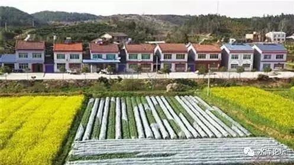

# 农村土地有投资价值么 \#1660

原创： yevon\_ou [水库论坛](/) 2018-01-22

农村土地有投资价值么 ~\#1660~

 

开始干活了，开始写正文

 

 

 

一）多渠道供应

 

这二天，地产新闻，基本被国土资源部长这段话刷屏了。

知识星球内，大约一共有11次，读者提问问我，"这事对地产有影响么"。

"楼市会不会崩溃"

"大转折近在眼前吗"。

 

 

"折你妹！"这么多年来，多军老人，早已经被无数次"重磅突发"折磨到神经衰弱。你说有影响么。

新人1000次希望有影响，每一次楼市"新政"，新人都希望迅速变天。

新人的耐心很短，煎熬往往只能承受十二个月。

 

但是"老牌多军"从业经历太过悠长。

悠长到什么事情都经历过了。悠长到可以给每一项政策打分。

 

 

这样一条政策，其实归根到底，是"小产权可以租赁了"。

咦，小产权不是早就可以租赁么。旧事重提何解。

 

一个大方向，大前提，

目前国家对于"调控房价"渐渐灰心和失望了，也认为是不可完成的任务。

因此调整方向，"调控租赁"，希望把租赁搞上去，也算是对广大无房户的一个交代。

 

租赁，怎样扩大租赁市场，怎样扩大租赁资源，怎样扩大各方助力，齐心建设租赁供给。

因此本次政策的题眼是："小产权租赁入市"。

 

"小产权房"古已有之。不说深圳，广州，哪怕在华东，华北，也有大量的农村集体用地。

北京著名的798艺术社区，宋庄，本质就是小产权房。

 

 

本次政策的特色，是鼓励"企业化大规模入驻"。

也就是说，以前的"小产权房"，是小打小闹，由村民们自己兴建，自己出租，分散管理。

 

这导致几个缺点；

1）房屋品质没有保证。达不到现在高档住所要求，很多没有现代卫浴和现代厨房。

2）租赁品质无法保证。村民违约，加价，反悔现象，层出不穷。常常有艺术家花巨资装修之后，村民要求收回。消费者体验很差。

3）缺乏中介和对接渠道。因为"散，乱，差"，因此第三方中介服务也做得很差。

 

 

而这次政策的题眼，关键是"企业化"三个字。

也就是全国性，百亿级的巨无霸企业，也要入驻到村委会。再过几个月，你很可能发现恒大，万达，首富满脸笑容[和村书记握手]签约的照片。

企业化，大规模生产，高品质入驻，可以在不突破村宅基地容积率的情况下，做到；

1）成片大型高档社区开发

2）企业化租赁，现代配套服务

3）全国联网，网上预订

 

你设想一下，当你跑到"李家村牛家寨"的时候，脚下踩的不是泥泞土路。

-   而是一尘不染的停车场。

-   密码锁和声纹门禁。

-   小区内有网球场，健身房，瑜伽室，甚至锻炼后淋浴。

-   洗衣店，永和豆浆

-   高科技WiFi和智能家居

 

请问这样的农村民宿，您有没有兴趣住呢。

 

 

 

二）真实的小产权

 

理想很美好，现实很骨感。

当描绘了"小产权，大企业"美好未来之后，我们要反过来问一个问题。

某首富，某首富，难道是傻子么。

这么好的事情，为什么之前不做。

 

答案是，这整套思路，其实是违反"经济学原理"的。

非不为也，乃不能也。

 

 

农村的土地，通常都离开市区很远。

798已成绝响。"水贝村"也渐渐拆迁了。

目前的大城市中心，并没有太多的"城中村"。尤其没有"未开发"的城中村。

如果深圳有小产权房，也早已不便宜。

 

 

目前仍然可以说"成片"，"待开发"，"有用地指标"的农村宅基地。一般都要远到30KM以上。上海的奉贤新城附近，还有一些。
您自己数数地图。

 

在这么遥远的"远郊"基础上，对于"小白领"的租赁需求，就不会很大。

或许您也可以亲自去"奉贤新城"附近的小产权房看看。

并没有你希望中的"健身美男"。

绝大多数的租客，都是身上带泥，脚上带灰，卖建材，卖五金，开小餐馆，运活鸡活鸭现杀，做附近工地生意的。

 

打开二家租客的房门，人家根本不爱惜"租赁装修"。

尖锐的铁器工具，随手放在地上。戳坏地板。

拉过一条板凳，踞在上面吃饭。丝绒的沙发，三个月就露出海绵。

 

 

这种"远郊"的租赁市场，注定是底层和低价的。

毛坯出租，农民式装修，才是最适合的生存方式。

 

就算某首富满脸笑容地和村支书握手，投资兴建几个样板工程。

心里面哭得伤心，肚明这项目是赔钱的。

 

 

 

三）不切实际的长租

 

另一方面，"长线收租"这个概念，本身也是错误的。

我们知道，欧美国家的"房屋自有率"非常低，美国平均63%，曼哈顿甚至不到50%。

也就是有近一半的美国人，是居住在租来的房子里的。

 

有人归咎于美国的"汽车文化"，也有人总结美国人职业变动自由，迁徙市场化程度高。

但其实在这些事的背后，还有一个重要原因，"金融支持"。

 

 

一个最简单的问题，美国最大的"房东"是谁。

那些长租公寓，那些co-op背后的持有人是谁。

是超级大富翁么，还是个人炒家。

答案都不是，绝大多数的房东，都是"共同基金"。

 

而基金投资者是哪些人，Reits最重要的投资人，主要是"养老基金""教育基金""行业协会基金"。

"低风险，低成本"资金，对回报率%要求非常低。

低息债券，才撑起了美国的租金市场。

 

 

当一家KFS造完了房子，KFS可以长租，可以长期持有，不散卖。

但是KFS一定是把房子打包成了ABS，以"资产组合包"的形式，转手卖给基金公司。

KFS最多保留一些物业管理，维护的任务。赚取微薄手续费。

 

而养老资金，保险资金，可以承受非常低的资金利率。

这些资金才是"物业"长持最后一棒。

 

 

在目前的中国，并没有类似土壤。

"诸神围剿绿城"那一年，绿城集团的融资成本是28%，掘地三尺，都挖不出资金来。

市面上的大量信托，理财计划，KFS也是主要宿主。这些资金按8\~9%的成本募集而来，再加上银行的抽头，最终贷款给KFS的时候，利率都超过了15%

KFS的资金成本这么高，你搞什么"长租长持"么。

 

 

住建部一提出"租售并举"，下面掌声一片。

然后实际执行下去，很快就发现不对了。任何一个KFS项目，长持都是亏本。

吓得住建部赶快搞"租房贷款"。定向补贴低息资金。

但也是治标不治本之举。

 

 

金融业没有发达，所谓"多主体供应，多渠道保障"无非是一句空话。

除非能嫁接到低成本资金，

否则，是不会有人去开发"乡村租赁"这块贫瘠的肉骨头的。

 

 

 

四）农村土地价值

 

第三个话题，"农村土地有价值么"。

我们的回答，至为清晰："没有"。

 

大约只有某些大城市的边缘，"集体小产权"土地是有价值的。有拆迁概念。

或者南方广深，城中村土地，有租赁价值。

 

 

目前有一种非常不好的风气，经过秀相一朝，不断地倾斜和洗脑。

渐渐有人认为，"农村户口比城镇户口更值钱"。

 

简单的例子，水贝村拆迁，每个男丁，人均赔了上千万。

工作再好，也不如投胎好。村口保安胜过清华苦读。

 

 

但是，这是一个"孤例"。

孤例的危害，就象炒数字货币能赚钱一样，祸害更大。

 

就全国的范围内，农村土地一文不值。

虽然也有各种各样的文件利好，"小产权租赁"也搞起来，首富下乡和村长县长握手。

 

但是就总体而言，中国所有的农业土地，除了靠近大城市那一批，其他都是没有价值的。

 

 

中国人恋乡重土，怀念当年老地主，"家有良田百亩"何等的风光体面。

买土地的梦想，根植到了每一个中国人的血脉中。

 

本朝以土地革命起家，"土地"一事，关联太大。牵涉利益太重，zz太敏感。

各方利益纠缠，想要变革，几乎毫无可能。

 

因此，不要把你的"痴恋"和梦想，变成一种桎梏。

不要因为贪恋土地，进而错估了土地的价值。一听到"土地"就很激动，影响做出了错误的判断。

 

 

如果你真的喜欢土地，其实，去东南亚买吧。

不限购，不限贷，更不需要花费流血的代价，还被千夫所指。

上等的水稻良田，100亩，也才一千多万RMB。

在国际市场上，土地，并不是一种很稀缺的产品。

 

 

 

（yevon\_ou\@163.com，2018年1月21日午）
