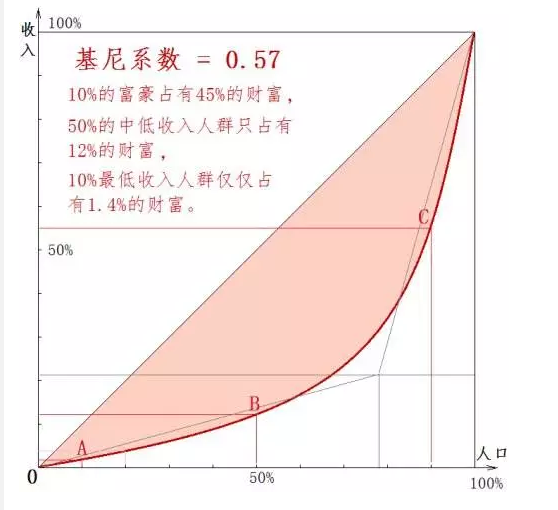
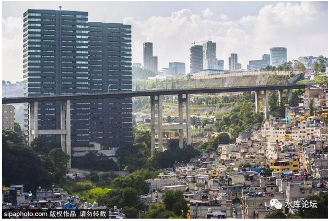
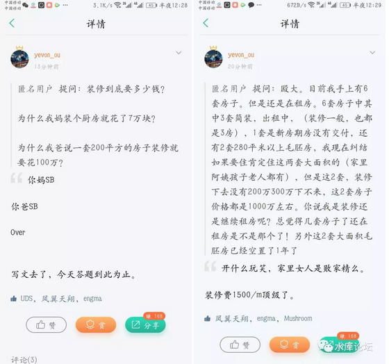
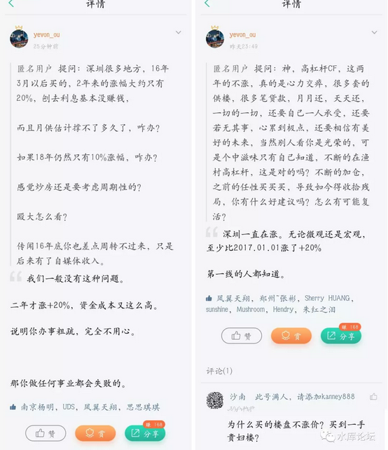
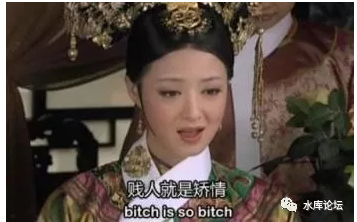

# 尾部效应 \#1690
---------------

原创： yevon\_ou [[水库论坛]](/) 2018-02-22

尾部效应 ~\#1690~
============================================================================================================

 

徒子徒孙

 

 

一）       罪恶之城

 

大城市是否特别地"不平等"。大城市是否都是"贫富分化"的温床。

象纽约，上海，北京这样的城市，常常被人诟病为"社会不公"。

 

你想，一方面是高耸入云的摩天大楼。亿万富豪聚集着不可想象的财富，一餐一著的费用，可以吃掉中产人家一年的家用。

而另一方面，则是"大城市下的贫民窟"。

 

可能就在摩天大楼的阴影下，相距不到几公里，就是大规模成片的"贫民窟"。

公园里，桥洞下，满是买不起房的穷人。

当富人的跑车都生锈时，穷人们或许还在为三餐发愁，甚至吃一些无营养的淀粉食品。

 

前二天，一篇《[[农村儿媳眼中的乡村图景]](https://mp.weixin.qq.com/s?__biz=MjM5NzAzMDU4MA==&mid=2651139161&idx=1&sn=39c619b679b9c39c8c0ce7c2582805bc&chksm=bd11b3828a663a94801346b59f5169cc35f83ab6f4c1bba456f3b78f5c0ad54cfbb6997e0d3a&scene=21&pass_ticket=i7CxR5GmaaCI7R8k32FPII3xoAgtO%20dJjlrxnavI5ryj#wechat_redirect)》刷爆了朋友圈。

 

 

 

如果你秉持了以上观点，那我告诉你，"以上全错"。

大城市的"贫富分化"，恰恰是因为它[最公平，最人道，最符合经济学。]

 

让我们设想一下，假设有一个城市。不管是哪个国家，总之总会有人"成功"，总会有人冒出头来。

很多很多"成功人士"，很多很多成功的大企业，当他们聚集在一起，他们所汇聚的，就是一个"大城市"。

这个大城市，必然拥有更多的财富，更多的就业岗位，以及更高的工资。

 

 

现在，到了关键性的一步，假设"国界是敞开的"。

北京，上海，是没有边境线的。任何人只要买一张火车票，就可以来北京打工。对于全体中国人来说，都是属于Domestic的。

 

如果"京沪"拥有更高的工资，更多的发财机会，会发生什么事呢。

全国人民源源不断地涌入。

 

而这个"源源不断"一直到什么时候"截止"呢。

最基本的经济学原理告诉我们：边际效益相等。

一直到你江西老表，在北京找不到工作，工资竞争被压低，物价沸腾，生活惨不可言。

待在北京的工作收益，和江西山区相等。则内陆人不再涌入京沪。

 

这个时候，回到关键性的经济学第二步："人口停止涌入时，北京工资是多少"。

答案是2500元。和江西鹰潭一样。

 

 

因此，我们可以看见一个[二元悖论]。

如果我们给北京画一张"贫富分化"图表的话， 

-   上限=无限

-   下限=2500元，人数=很大

 

杨幂，王俊凯，邓超，他们拍一部戏，就可以拿几千万元的片酬。年收入上亿。

北京一些PE/VC圈子，如果投中"独角兽"企业，收益更是惊人。互联网创业，不知道诞生多少英豪。

总之收入的"上限"，几千万是很正常的。

 

而收入的下限呢，下限是锁死的。

下限永远是2500元。也就是全国人民"平均收入水平"。

你不要看大城市的贫民窟。这些人如果留在山沟沟里，更穷。

边际效益相等。扣除春运火车票，老家还不如2500。

靠着这套"上限精英，下限锁死"的理论，你去观察全世界。

全世界任何一个大城市，它都是"贫富高度分化"的。

 

这句话的反面，绝对不是"剥削，压迫，歧视"。

相反，显是"仁慈，正义，公平"。

因为，只有"开放边界"的城市，才会遭此骂名。

 

地球上，如果能做到"贫富差距不大""没有明显的穷人"。一般都是岛国，或城邦制地区。

这些地方，无一例外，都采取了非常严格的"边境制度"。

其他贫困地区的人口想要漂流过去，那是千难万难。

例如日本，香港，瑞士。 

正是因为心存怜悯，给穷人一条活路。允许他们进入"大城市"。

大城市才会一端有高耸入云的摩天大楼，挥金如土的巨型富翁。

另一端又有着穷无立锥的赤贫，三餐不济的桥洞。

不是我的错呀！

 

下限锁死2500元。这个现象，我们可以称之为"尾部效应"。

 

 

 

二）       水库之尾

 

突然想起写这个话题，是因为今天看到一个帖子。

气得我宕机，直接关电脑。连"知识星球"都不刷了。

水库知识星球：t.zsxq.com/2nMFMfY

如果你觉得这个帖子还不够爆血管，别急，五分钟之前，还有另一个帖子。

坦白说，我对"水库论坛"这块金字招牌，实在是有一点担心。

虽然水库也开小密圈，分答社区，这些都是收费项目。

因为收费，因此对金主们负有一定"责任"。

可是我看着金主们的肆意无惮。怎么看怎么不放心呀

 

在水库系列文章中，开门见山第一卷《[[职业炒家]](http://mp.weixin.qq.com/s?__biz=MzAxNTMxMTc0MA==&mid=207954111&idx=1&sn=3aaa3c5acc718aa78dfdef9a7f2e678a&scene=21#wechat_redirect)》卷就写道：

-   你凭什么赚钱。

-   任何一个行业，有利润就有人加入，其最终结果，必然是社会平均回报。

-   你想赚大钱，靠的赚超额利润。关键是专业，专业，专业！

 

在《[[Marketing]](https://mp.weixin.qq.com/s?__biz=MzAxNTMxMTc0MA==&mid=2651015895&idx=1&sn=c1f49cfc5b12c2485464542a59115029&chksm=80721cc4b70595d29d8d61900171de79d19fa419ab40231a32dfa088f95027c11854ac585d31&scene=21#wechat_redirect)》系列卷宗中，我们进一步地提出：

-   每一个环节做好1%，累计就是做好20%，远远碾杀普通人。

 

赚钱的核心，是"专业化"。业精于勤，荒于嬉。

诚心诚意，克勤克俭，绝情绝欲。

 

 

可是现在的一些"外围"人员呢。他们不知道上了哪个讲座*速成班*。

手里拿了几本破书，秘籍天下我有。

 

做起事来毛毛躁躁。就简单地记得水库几条原则：买了就对了，贷到就赚了，钱不够可以去融资。

然后，然后，他们就搞出来15%的融资成本！

 

 

你问他呀，你优化了没有啊。你尽心了没有啊。你事情做足了没有啊。

他们一概是回答：没有

 

你跟他说，水库的入门基础功是："看房200套"。

不管你去哪一个城市，在你下场扫货之前，先要看房200套。耗时数百小时。

你要比当地土著更了解这个城市，你要比房产中介更精通价格体系。

 

那你们"看房200套"了没有呢。

没有啊！绝大多数的人，连50套都看不满，甚至连30套都看不满。

"马马虎虎，差不多了"，他们这样安慰自己。匆匆忙忙看了五六套，就急着下定。

这样做事风格，能把钱赚到尽么。

你买入时不能笋到极致，赚钱少了可别怨水库。

 

 

接下来呢，有多少人精心地"呵护"着自己的资金成本。

哥哥每周驻守"分答社区"。每次看那群屌丝提问题，我就恨不得砸电脑。

 

水库科技树写得很清楚，"资金的分层"，资金成本最低的，是信用卡，年率不到4.5%，其次是亲友内圈借款。

可是"分答社区"向我提问的，有多少人问信用卡。

 

没有，很少。大概是10：90%的关系。

其中90%的人，问的都是信用贷。而外面接触的，几乎所有"水库山寨"流派，统统全部是走信用贷。

 

 

信用贷有什么好处呢。申请简单，金额庞大，懒人最爱。

信用卡搞到五六十张卡以后，光每个月的空当接龙，就是一件细心而有毅力的活。能滴水不漏地做完的人，将来前途，至少是个高级经理。

 

而信用贷多简单啊。只要你去银行申请，分分钟批你30W。

缺点呢，缺点就是贵。

信用贷的正规利率是13%，只有部分"体制内"，以及农行建行，偶尔会开恩大赦，批你一笔20W的只要6%

 

如果你用"信用贷"构建初始资金池，则你的资金成本，必然是很贵的。

加权动辄超过10%。

 

然后你TNND跑到我这里来哭诉，说不赚钱。说辛辛苦苦为银行打工。说借了18%的高利贷现在连利息都填不满。

到底是你有病，还是我有病

生病能怨水库嘛。我都还不舍得用信用贷13%资金呢。

 

自古"贫家出败儿"，你都已经够穷了。偏偏还懒得要命。

越是穷的人，上手都是问信用贷的。气得我高血压。

 

 

然后是第三步。我真心不能忍受，为什么越是穷的人，穷得揭不开锅的人，却肯花100W去装修房子。

就得选最好的金丝楠木，家具清一色黄花梨的，电视机不能低于85寸，买一把椅子都是9W元，否则有气味啊，小朋友闻着不健康怎么行。

你越是贫穷，你越是应该用勤奋补足贫穷。

克勤克俭，货比三家。克制自己的欲望，习惯损失，忍受损失。

按我看，装修1500元都嫌太奢侈，888元/m就够了。你今日省下一分，他日才可以多赚一分。谁的钱都不是从天上掉下来的。

 

 

 

三）       结语

 

我夜观天象，就看到一根线，从大地直通天际。

一头是月薪2500元，一头直通天际，是富贵的分界岭。

我毫不怀疑，水库的故事，最终会以"新会员不赚钱""加入也不赚钱"结尾。

那些脾气暴躁，毛毛糙糙的人，大手大脚挥霍。

哪怕"地产"整个行业再赚钱，心法再赚钱，也经不起他无效率地这般滥花。

 

然后，外界包括那帮微博大V们，又要开始冷嘲热讽"房子也不赚钱""水库也不赚钱"。

 

他们只看见了泥塘，却看不到天际。

尾部效应，向来如此。

 

 

 

（yevon\_ou\@163.com，2018年2月22日丑）
