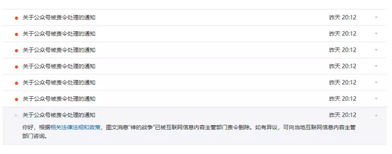

# 管家行业的商业原理 \#1710（欧大公众号上编号有误）

yevon\_ou [水库论坛](/) 2018-03-26

管家行业的商业原理 ~\#F1710~
============================

 

 

一）       前言

 

我说你们呀，就别整天瞎BB，好好珍惜吧。

俺还是继续写人畜无害的"管家公司"系列去 

 

 

二）       链家

 

我有个朋友，有一次"手拉手"了一套一千万的房子。

然后他还是不放心，于是想找链家，帮他走走流程。问收多少钱。

链家一开口，2.7%

朋友顿时就火了。"我只不过缺二个小工跑跑腿，你好意思收我30Ｗ"。

 

链家一脸的倨傲样，2.7%是公司的统一规定。我们既然出了规定，你就要遵守。

少一分钱都不行，还不打折。规矩比人大。

 

 

这事最后怎么解决的呢。水库网友找到了哥哥。

我说行，"手拉手"收你6000元吧。一等良民，六千元全程办完按单收。

 

哥哥的成本呢，《房地产买卖合同》是可以去交易中心买的，5元/本（淘宝更便宜：3元）

我买了六本，30元。

再找了一个小妹，跑腿跟进。大概花了20个小时工时吧。

 

 

 

这其实牵涉到了"商业"的一条重要原则：你是做服务的。

为什么消费者要掏钱，消费者掏钱，是因为他们购买了你的服务。

绝不是你竖了一块牌子，写明2.7%，就想闭着眼睛，按照这个费率收费的。

 

消费者肯付给你\$1，前提是你提供了服务。帮金主节约了时间和精力。

金主自己跑，20个小时可能价值20000元。还得研究流程。

他分你6000，轻车熟路。大家都省心省力。

 

 

"链家"出了北京市场，基本就做成渣。

无论上海，广州，链家有得是"钱"。谁也不知道他的钱是从哪里来的。

 

链家进入上海，就斥巨资把上海最好的中介公司"德佑"地产买下来。

进入广州，就把"满堂红"买下来。

出的价格无法拒绝。

 

而链家自己呢，纯"渣"。360度全方位无死角的垃圾。

南方任何一家收0.5%佣金的公司，都做得比他好，都可以横扫。

链家就是个大国企。腐朽官僚拖沓无能。

 

 

随着"德佑""满堂红"的人不停离职，链家的无形资产不断流失。

市场份额越做越小，口碑越来越差，几乎毫无生意，目前处于每个月亏1亿的状态。

他不怕，链家有得是钱。

 

同样道理，也绝不会有人有兴趣，进入北京市场"挑战"绿皮的。

谁知道少爷的背后，站着哪个老虎呢。

 

 

 

三）       产品线

 

言归正传，"商业"存在的前提，是你提供了服务。

"管家公司"存在的前提，是你提供了服务。解决了消费者的痛点。

绝不是你想收哪笔钱，就剥削消费者的。

 

 

目前京沪深汉泉渝的"管家公司"，主要提供的功能有： 

  咨询   限购咨询   装修
  ------ ---------- --------------
  代购   限贷咨询   出租（民宿）
  代售   垫资       其他

也就是我们所谓的"九条产品线"

让我们来逐一解释。

 

1）咨询：家庭整体财务方案规划

 

这个不是针对"买一套房"的客户。而是针对2N要买五到十套的客户。

买一套房子，客户最喜欢问的是推荐笋盘，最好一枪搁倒。

买五到十套房子，就需要配置的概念了。

 

如[\#1700](http://mp.weixin.qq.com/s?__biz=MzAxNTMxMTc0MA==&mid=2651017111&idx=1&sn=7b5db4b60c1991d8d316b48f19c4a48e&chksm=80721984b70590922a882301b983bf880ccf1073327505f26c60e92da05c09adfbf6c34acded&scene=21#wechat_redirect)所说的，这需要一个"整体"的规划。

根据你的人生，职场，家庭背景，风险偏好。做一个完整的"终身理财"。

 

 

更麻烦的是，按照"水库"的手法，并不是扔给你二套豪宅CEO，韭菜让你去买。割完了佣金，拍拍屁股就走掉的。

 

水库的做法，是要"截断和再抵押"。逐步建仓和加按揭的。

因此"财务规划"咨询，往往是长达三年，五年的持续跟进。回头客要拜访的。

 

 

这一类的收费，以"咨询报告"为主。

中国人并没有养成为"咨询"付费的习惯。收费也始终艰难，量上不去。

国外
"财富管理"，每年可以收东家1%。而在中国，"管家公司"五年的跟进报告，才能收0.1%。

 

大致是：

-   5000W现金，"配置报告"收费68000.

-   2000W现金，"配置报告"收费38000.

 

 

2）代购

 

代购是需求最大的一项业务。简单说，就是"笋盘"。

例如很多管家公司，都有"笋盘群"。平时风平浪静，往往一二天都没有人发言。

 

但是某一刻，管家会突然跑进来，扔出一套信息"xxx花园，xxx户型，xxx万"。

然后群里象炸锅一样，蜂巢涌动。如果是真笋盘，20分钟之内就可以敲定下来。

钟意者找管家联系，管家收1%

 

 

在"笋盘群"的基础上，又演化出了二个新的玩法。

一种是"处置资产流"。一种是"资产包"。

 

a\) 处置资产流

因为事实上，你是找不到那么多"笋盘"的。

笋盘的发掘，概率上叫做"看房200套"。

但看无数无数的房源，时刻觅食在市场第一线，也是一笔巨大的人力成本。

 

一般看房200套，你至少需要消耗600个小时。

按照每个小时200元的人力成本计算，仅此一项，就是RMB
120000，收1%佣金都未必够本。

 

 

而且这还仅仅是理论值。更麻烦的是，你没有这么多合格的人手。

管家公司，是一个新兴事物。基本各家公司发展都非常快。

公司一快，你就缺"人才"。

 

看房200套，虽然说是一个体力密集型的行业。但也要看房的人，拥有基本的逻辑，审美判断能力。

我们这个时代，大学生很多，"靠谱"不偷懒的人却很少。真正能有敬业，把马桶擦七遍的人，少之又少。

"笋盘群"人力跟不上。他们就想到一个做法："处置资产流"。

 

逾期\--银行处置资产\--法院判决\--法拍流

 

 

大家都说"法拍流"黑。法拍黑，主要是因为fayuan黑。

一套房子，如果进入了"法拍"流程，基本没什么好货。真的好货，早在法院内部消化完毕了。

 

这句话，其实还可以再"前置"一下。

真正的"好货"，根本就不会拿去给法院，银行也不是傻子。真正的好房子，"银行"内部就消化掉了。

 

从"逾期"到"法院强制执行"，当中还有一个阶段，叫"银行处置阶段"。

这个阶段，银行会对接逾期业主。并劝说业主，"能卖就好好卖掉"。

如果业主放弃权利，产权也会转入银行，转到银行"资产处置小组"手中。

 

"银主盘"办事人员，也没那么多钱。即使是好货，也不能每月买十套。

他们还是冀望"商业化"处理。最好拿到市场上去抛，拿点返佣。

最后的鸡头鸡脚，才是交给法院拍卖。

 

"处置资产流"就是和银行关系好。直接在"处置逾期资产"这一关拦下来。

拿到"笋盘群"里一看，哇，二十几套都是好房子。 

\* 近年p2p横行，小贷公司往往也有房源

 

 

b\) 第二个方法，叫做"处置资产包"。

很多大型国有银行，内堂衙门天阶太高。六七百万经手的买卖，他们都懒得做。

因此他们放出来的，是"2亿包"。

 

具体做法，是15\~20套房子，直接打成一个"处置资产包"。找财团来接。

单套买卖，不做的。懒得不要不要的。

价格一般是1.8亿，九折。

 

"管家公司"可以把整个包谈下来。拆散了拿到"笋盘群"里卖，也有折扣。

化批发为零售，赚取些许差价。

 

 

 

四）       限购和限贷

 

  咨询   限购咨询   装修
  ------ ---------- --------------
  代购   限贷咨询   出租（民宿）
  代售   垫资       其他

 

第四项业务，是"限购咨询"。

限购的破解方法，绝大多数人都知道。这一块脑力服务，也早已包含在了"咨询"大套餐中。

 

"限购咨询"的真正重头戏，其实是专业"结婚服务"。管家公司抽介绍费。

你懂的。俺就不展开了。

 

 

第五项业务，是"限贷咨询"。其实就是"贷款中介"。 

这一栏分为二项：

1）按揭

如果你有正正经经的"按揭"资格。那自然是最好。按揭国家支持，鼓励自住。按揭向来是不收费的。

目前有一些无良中介，搞价格联盟，搞1.5%按揭服务费，大家一定要擦亮眼睛。

 

 

"一等良民"办按揭是没有费用的。例如前文所述，"手拉手"六千元够，就不用中介了。

 

如果您不幸不是"一等良民"。以下情况，你可能需要"贷款中介"的帮助。

-   有逾期，或者严重逾期

-   自由职业，收入不稳定。

-   年纪和收入不匹配。例如太老\>60，或者太小\<20

-   需要房租等补充收入来源

-   离婚析产，去除参贷人

-   补交社保和四金

 

贷款中介可以帮你做的是：

-   精选银行。根据你的材料，精选一家最容易pass的银行。

-   推荐更多的金融产品。例如接力贷，5+2

-   争取更好的评估价，利率

-   辅助整理申请资料

 

可见，贷款中介做的事，是完全合情合法的。

贷款中介收点钱，也是合理的。

 

 

2）抵押

"抵押"和"按揭"类似，服务和收费项目也类似。

但"抵押"天生就是有费用的。目前市场上都知道"抵押贷款收2%"。

 

实际这个费率是1.8%，管家公司顺手沾猪油，还是可以赚0.2%的。

 

银行家的儿子问爸爸："爸爸，银行里的钱都是客户和储户的。那你是怎样赚来房子、奔驰车和游艇的呢？"

银行家："儿子，冰箱里有一块肥肉，你把它拿来。"

儿子拿来了。"再放回去吧。"

 

儿子问："什么意思？"

银行家说："你看你的手指上是不是有油啊？"

 

 

 

五）       装修和出租

 

  咨询   限购咨询   装修
  ------ ---------- --------------
  代购   限贷咨询   出租（民宿）
  代售   垫资       其他

 

装修是单独的一条线。

随着水库"大面积，低单价"的延伸，以及异地购房二江四岸。

"装修和打理"也成了一件烦心事。

 

在整个系统中，专门有一批人做批量装修，做"凤变冰"。

专门有一批人做"民宿托管"，airbnb

 

这些属于非核心业务。和主干联系不是很紧密。

 

 

 

六）       垫资和其他

 

垫资主要用于"过桥"。

譬如上家欠了600W，你要帮上家赎楼，才可以交易。

又如北京常常要做全款抵押。上千万的资金，垫资借二三个月。

 

"管家公司"一般都是轻资产的人力组员。

"垫资"这种事，绝大多数都是外包给外面的专业公司。

 

目前北京垫资成本在1.9%/月左右。

 

 

除了"垫资"还有些其他业务。

例如专门研究怎么办信用卡的卡研社，撸羊毛的积分流。

专门搞信用卡，信用贷"团办"的线下。做POS机的茶茶。验房师，设计师，软装师。

 

山东房产观澜，甚至还有一条"砍价师"产品线。

 

 

 

七）       结语

 

商业的价值，在于为消费者提供服务。

每一项功能，都是"你需要"了，管家公司才提供，并收取一定的费用。

 

水库和传统的"股票债券理财"很不相同。因此我们的"九大条线"也很不相同。

市场有需求，就有真空。

只有管家公司，才能服务新型理财需求。

 

 

最近二年，市场上雨后春笋般地冒出十几家"管家公司"。散步在全国各个城市。

-   他们中的有一些，已经月入百万。

-   有一些，却接近分崩离析。

 

知道"九大产品线"，不一定客户上门财源滚滚。这里面还有诀窍。

见下一篇《管家的生死》。

 

 （未完待续）

 

（yevon\_ou\@163.com，2018年3月25日暮）
