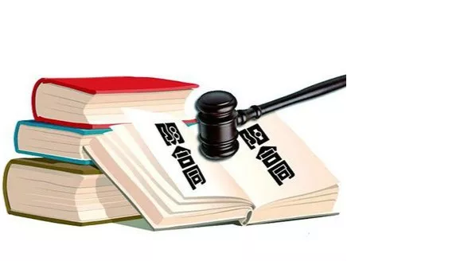
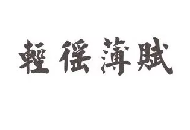

# 三价合一的前后 \#1740

yevon\_ou [[水库论坛]](/) 2018-03-30

三价合一的前后 ~\#1740~

 

这篇还是口水文

 

"三价合一"之后，知识星球的问题铺天盖地。

实在不厌其烦。统一回答一下。

 

 

一）       三价合一

 

深圳的"三价合一"政策，是从2017.12开始传的。

当时，中介不顾"传谣"鸡腿饭的危险，拼命在微信群里群发。吓得客户二眼放光，掏钱赶末班车落定。

于是深圳2017.12当月的销售量，足足比11月翻了一倍。

 

过年之后，又炒作了二波。临到2017.03.28正式宣布，算是尘埃落定。

"狼来了"，反反复复喊了三次。没想到第三次，狼真的来了。

 

 

什么叫做"三价合一"呢。就是成交价，银行贷款价，交易中心核税价，这三个价必须一致。

上海网友问，难道还可以不一致的。

北京网友问，难道还可以不一致的？

 

这三个价格，其实可以不一致的。譬如上海2007年推行"全面网签"之前，这三个价格就可以不同。

 

-   真实成交价

-   银行贷款价：尽可能高。以获取更多的贷款

-   交易中心价：尽可能低。以节省税费

 

以一套"真实成交"1000W的房子为例，他的"银行贷款价"可能是1200W。

按照首房首贷贷款70%，他就可以贷款840W。

相当于首付16：贷款84%

 

另一方面，交易中心"备案价"。他可能是600W。

以每一次交易5.55%增值税+3%契税+2%个人所得税，我们假设为10%

本来要交100W税，现在只要交60W。

 

轻徭薄赋

 

现在3.28推行的"三价合一"，其实是"二价合一"。

真实成交价=？，银行贷款价=交易中心价。

 

譬如以北京为例，北京是全中国调控"管控"最严的城市。也是少数还在严格征收20%"差额所得税"的城市。

在北京买卖一套1000W的住宅，搞到"总税费"250W{心碎}{心碎}，这是非常正常的事。

 

如此重压之下，北京的房产交易，普遍都是"做低"的。

1000W的房子交易，"写低"至600W成交。剩下的400W，您给我现金。

哪怕你管控再严，最多也就"二价合一"。

 

 

 

二）       数学计算

 

我们来看。原方案A：

-   真实房价=1000W

-   银行贷款价写高，至1200W，贷款840W

-   交易中心价写低，至600W。交税60W

 

（三价合一）方案B：

-   真实房价=1000W

-   银行贷款价写低，至600W，贷款420W

-   交易中心价写低，至600W。交税60W

 

（三价合一）方案C：

真实房价=1200W

银行贷款价写低，至1200W，贷款840W

交易中心价写高，至1200W。交税120W

 

          贷款   税费
  ------- ------ ------
  方案A   840    -60
  方案B   420    -60
  方案C   840    -120

 

"三价合一"的结果，相当于少贷42%款，或者多付6%税

或者二者之间。

 

深圳这个城市，大家都不愿意减少贷款。

那你就认为，每一次交易，多付6%的税好了。

 

三）       疗效

 

是不是很熟悉的味道，很熟悉的配方。

2005.06.01，上海骤然增加5.55%的营业税，美其名曰"调控房价"。

 

之前的一天，上海楼市井喷，所有人都在签单房子。

之后整整一个月，交易中心空旷如零。

媒体小编一片欢呼，"房价要跌了，加5.55%税房价要猛跌了"。

 

 

十几年过去了，5.55%营业税的后果，我们也看得很清楚了。

房价跌了没有，没有。

比2005年整整又高了一个数量级。

 

交易税收，从来只能延缓市场的步伐，而不能改变市场的方向

 

房价的估值，是受货币供应量，土地基建量，人口涌入量等一系列因素决定的。

加税只会让房价更高。

 

从一个长周期而言，税收都会转嫁给购房者。

而且因为"轻徭薄赋"的环境被打断，市场换手很不充分，会更容易被炒高，更容易大起大落。

 

重型交易障碍，有百害而无一利。

 

 

 

四）       流派手法

 

不同的流派，适应不同的外部环境。

低税费环境，有低税费环境的玩法。

高税费环境，有高税费环境的玩法。

 

如《[重压之下，生存之道](http://mp.weixin.qq.com/s?__biz=MzAxNTMxMTc0MA==&mid=403352106&idx=1&sn=9cfd3ddd4c5c53aff91c6e066572a7c9&scene=21#wechat_redirect)》一文所说的，当交易税费升高到一定程度，绝大多数流派无法生存。

 

如果深圳严格地执行"三价合一"，则深圳的交易费率，会上升到接近上海的程度。

-   原本深圳和上海是二个市场，各有天差地远的玩法。

-   现在深圳和上海变成同类市场，因而也剩有同类的玩法。

 

目前受损，消失的流派有：

-   凤冰流。短期美化出售的流派。

-   零首付流。极度追求杠杆，重点在于"动用现金"最少的流派。

-   一刀流

-   收租流

单次交易，约12%的税费，是完全不可能忍受的。也是丧心病狂的。

 

依然活下来的流派有：

-   Abc单，xyz单

-   大面积低单价，长持流派。

-   二房东包租民宿流

-   法拍流

-   拆迁流

-   土豪全款单

 

 

尤其值得一提的，是"一刀流"。

一刀流是深圳的特色，也是赚钱利器。

 

长期以来，写《一刀流心法》的呼声都很高。

只不过在水库内部，反对"写出来"的呼声更高。群众纷纷表示，教会了徒弟，洞就塌了，因此不可以大规模展示。

 

正好这次"一刀流"阵亡，我们简单概况一下。

 

 

"一刀流"指的是，深圳独有特色的"三价不统一"。

在"三价不统一"的情况下，1000W的交易，你可以写高到1200W，贷款840W。实际首付16%

 

六倍杠杆。六倍杠杆当然是非常诱人的。

尤其是在一个地产牛市之中，很容易就赚到钱，进而暴富。

为了追求极致杠杆，伴催生了一个流派："一刀流"，喻意薄如快刀。

 

 

现在问题来了，当3.28深圳"三价合一"之后，"一刀流"还能不能做。

这里面牵涉到二个因素；

1）           评估价能评多高

2）           代价合理性

 

首先是"评估价"。

1000的房子，银行最终接受你什么价位抵押，并不是空口白话的。

银行也是要看评估公司报告，看历史平均成交价的。

 

深圳的评估公司，管得比京沪"稍微"松一点，但也不是无限松。

我们举例，一般举到120%，已算极限。

 

这次"三价合一"，对"评估"是没有任何调控的。

也就是说，如果你真有心Mark Up，你还是可以做的。

 

 

问题的真正麻烦，出在"代价"。

以前深圳三价不合一，意味着你可以尽量地拉高"评估价"。而你的代价，几乎为零。

 

现在"银行贷款价格"和"交易中心计税"价格是同一个了。

你Mark Up，你就要交税。按照现行税制，税率大约是10%

而即使首房首贷，你贷款比例不过70%

 

-   写高交易价格100W

-   交税10W

-   获得贷款70W，税费前置，实际到手仅60W。

借60W还70W，这就是业内所谓的"借六还七"。

  

所有的税费，都是赚出来的。如果你在办贷款时，多花了20W成本。

你就必须在房价里，把这20W赚出来。

相对于1000W的房子，20W多么，算很多，也算不多。

 

五）       三价合一的对策和漏洞

 

本节删

 

 

六）       棚改

 

从大的层面，近期还有一条消息，是被朋友圈忽略的。

《[关于加强棚户区改造工作的实施意见（征求意见稿）](https://mp.weixin.qq.com/s?__biz=MzAxNzk2MDQyOA==&mid=2247487181&idx=1&sn=8f677115de90b1a34bc82d04e197f42c&scene=21#wechat_redirect)》

 

深圳的旧区改造，是一直在推行的。而且力度还很大。

最近几年，整个深圳市几乎没有土地在拍卖。也没有新增一手房供应。

几乎所有的供应，都来自于棚改。

 

然而被人遗忘的，是文章中划蓝一句话：

棚户区改造项目住宅部分除用于搬迁安置住房外，全部用作人才住房和保障性住房

 

结合这次"三价合一"强行推进，我们大致可以摸出一个轮廓。

"一切为了推进租赁"。

"这是要把房产买卖，往死里赶啊"。

 

任何一项政策，肯定是先有大的宏观思路。再有各执行层面的细节展开。

一直有人问我，"近期银根有没有可能放松"。

"2019会不会取消限购限贷"。

 

我们的回复，一般是四个大字："政治正确"。

 

 

从大的宏观层面，高层似乎已经对"调控房价"失去了信心。

"限购限贷限价限售"，几乎所有的猛药都试过了。

下面的谗佞小臣，不知多少次报告"从一个胜利，走向另一个胜利"。

 

可是你仔细看看，"跌价如抽丝，涨价如山倒"。

花了三五年，无数猛药打下去-15%，真的遇到牛市，就是一个月的涨幅。

 

 

因此高层转换思路，搞"租售并举"。

1000W的房子，无论再怎么帮愤青门打折，900W总是要的。

900W你也买不起啊。

 

幸好是房租还不贵，京沪就1.x%出头的样子。

那我大力提倡"租赁"吧。花你1/3的工资租房子，还是租得起的。

 

 

目前宏观层面一个大方向，是"鼓吹租赁"。

在这个大环境下，深圳出台"三价合一"，粗鲁打压买卖市场，也就容易理解了。

 

 

 

七）       结语

 

我们依然看好深圳。"三价合一"是一个利空，会短暂冰冻市场，但深圳基本面依然强劲，依然是中国最有希望的城市。

 

目前的情况是，深圳是"市场经济的最后堡垒"。

可有一帮堕落的小兄弟，在拼命拉着他的底裤。

"你不能这么优秀"

"你要象我们一样堕落"

"要烂大家一起烂"。

 

我们依然看好深圳。即使她蒙尘"三价合一"，逼良为娼。

但是和那些计划经济的妖艳贱货，还是不同的。

 

 

 

（yevon\_ou\@163.com，2018年3月28日晚）
