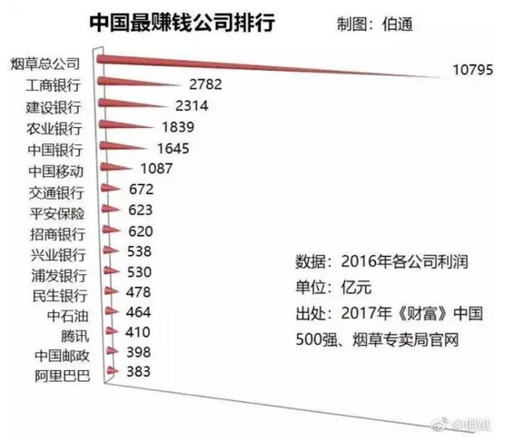

# 金融业的折旧　\#1780

原创： yevon\_ou [水库论坛](/) 2018-05-11

金融业的折旧　~\#1780~
======================

我们的国民账户核算体系，可能有很大的问题。

 

 

一）       GDP

 

-   一家公司的利润=营业收入－营业支出－税收

-   一个公司的GDP=利润＋政府税收＋员工薪酬

-   金融业的GDP=利润＋政府税收＋员工薪酬

 

这一些基础的公式，是印在教科书上的。 

譬如说，你找一家"证券公司"。小型的证券公司，主要工作：撮合散户成交。

有一个几百平米的证券大厅，大屏幕。阿姨爷叔在那里啃玉米，打麻将。

闲时看看K线图，红绿杠。拍腿下单买1000股，赚30元买菜钱回家。

 

对于证券公司，他的盈利模式很清楚。

-   收入：手续费佣金

-   支出：场地房租水电

一年盘点下来，每个门店赚几百万元。这样的业务模式，简直就是一个"棋牌室"。

 

 

从微观上讲，"证券大厅"有贡献么，有GDP么。

有的。他属于服务业，最简单的跑腿，端茶，磕瓜子花生。

无差别人类体力劳动。

 

 

但是，我们从一个更大的"宏观"而言，"证券"行业本身，有价值么，有增值么，有贡献么。对国民经济，对国力有帮助么。

这是一个巨大的问号。甚至从直觉上讲，经济学家可以直接Say No的。

 

-   中国的证券市场，股市还不如关掉更好。

-   关掉对国民经济更有益。

 

 

 

二）       股市的负增加值

 

按照标准的现代经济学，"股份"在无数的人手中买卖。你有一个苹果，我有一个梨。

苹果换梨子，"物质"财富并没有增加。聚拢100%股份，公司还是这家公司。

 

"证券业"对于实体经济的促进，增长作用何在。几乎每一本《证券分析入门》，开卷名义都会写：

 

证券业的建设，使得急需资金的企业，获得了融资渠道。

企业获得融资，促进了实体经济发展。

 

 

1999年11月，香港创业板HKex，趁着美国"科网股"泡沫创立。并诞生了PCCW，Tom.com等一系列"网红"公司。小超人李泽楷成了明星。

此后，美国互联网泡沫破灭。香港HKex急剧跌落，股价最多跌去－90%，投资人极为不满，围攻港交所主席。

 

港交所的回答，令人寻味："证券市场设立的初衷，是帮助有希望的企业，快速获得融资"。

"既然企业已获得融资，HKex就圆满地完成了使命。此后二级市场股价表现，和交易所无关"。

 

 

我们抹去"股神""股霸""天才恶庄"之类神话，从"原汁原味"的本意出发，证券交易所允许存在的原因：

证券交易所在各国大义的名分，股市可以优化资源配置。

 

 

但是我们看回中国股市。中国股市，其实并不符合"优化资源配置"的。

对于中国股市而言，最能够获得"融资"，最能够获得"增发配股"的。从来不是最有竞争活力的民营企业。

 

中国股市，基本定位，就是为国企融资，输血，解困。

历年来，股市象一个吸钱的黑洞，吞噬了无数股民资金。股民们，也并没有获得NYSE"传说中的回报"，十股九亏。

 

 

从"优化资源配置"而言，股市对于全中国的GDP贡献率是一个负数。

如果你彻底关掉股市，国力增长，可能还会更快些。

 

-   证券公司GDP贡献为正

-   整体股市GDP贡献为负

怎么回事。

 

 

 

三）       银行业

 

对于银行业，问题一样严重。

我们有时候看看银行业的GDP，简直不相信，"银行"对于国力的帮助，居然有这么大？ 

银行也分二种。

第一种银行，办的是苦哈哈的"柜台事务"。例如帮你办笔外汇汇款，代交水电煤，代售保险，买卖贵金属，存钱，取钱，接待小额储户，整天忙得象狗。

 

第二种银行，办理的是"高大上"的神仙业务。他们坐在人均100平米的办公室里，宽敞得足以打垒球。

动辄交易数亿的国债，讨论隔夜拆息和SLF。打包数万亿的资产买卖CDO和CDS。

 

 

按照GDP的算法，银行业GDP增加值＝利润＋政府税费＋员工工资。

事到临头我们计算一下，突然发现"金融业"的增加值，大得简直吓死人。 

早在1995年代，也就是美国"IT神话"兴起的前几年。

当时全美所有的"银行业"利润，就已经超过了"全美制造业"。

 

把资金划拨来，划拨去的利润，就已经超过了钢铁，石油，煤炭，汽车所有的大型企业。

把钱借给你的利润，比你辛辛苦苦开公司，赚得还要多。

所谓美国"空心化"的开始。

 

 

"通用汽车金融公司"利润，比"通用汽车"公司还要高。

当时美国人惊呼，"我们还要不要造汽车"。

GE Capital，利润占据GE集团的60%

 

 

但是这整件事，又和我们的直觉不符。

我们隐隐觉得，"金融业"的增加值，其实没那么多。

我们隐隐觉得，"金融业"对国民经济的贡献，应该没那么多。

 

很简单一个问题，假设给你"二选一"。

在金融业，和"全美制造业"中，只让你选一个。

你觉得放弃哪个，会对国家的国力实力，损害更大。

 

假设一颗原子弹掉下来，全美国的银行家，统统死光了。

国家缺乏了银行继续运行，还是缺乏了钢铁，煤炭，石油，汽车等等行业，继续运行。损失更大？

 

 

我觉得哪怕所有的人，嘴里不服气。但心里还是明镜般地知道的。

"实业救国"。金融业都是虚的。哪怕没有银行，或者只剩最基础的存取款功能，我们的生活，不见得有多糟糕。

 

那么，问题出在了哪里？

 

 

 

四）       金融业的折旧

 

整个"证券业"，我认为是根本没有"产出"的。证券业对GDP的贡献是负值。

证券市场，目前是把资金"错配置"。拿去给了效率最低的国企。

把股市关掉，国家或许更强大。

但是在账面上 ，"证券业GDP"却是一个上万亿的产业。

 

 

整个"银行业"，我同样认为是没有"产出"的。

银行有一些业务，例如存取款，汇款，代交水电费，很好，的确是利民。作为"棋牌室"有资格继续活下来。

但是"银行业"整体，绝对是Low/None value-added.

 

"银行业"同样不符合"资源配置"的原则。

银行并不是依照风险定价。并不是最急需资金的企业，最能够获得资金。这完全是和古典经济学理论相悖的。

银行业的运行，是"最有权力"的企业，最先获得资金。最最亏损的铁公基项目，反而获得了无限的资金。最腐朽无效率的国企，拿到了海量资金。

 

从直觉上讲，中国整个"银行业"对于GDP的贡献，也应该是负数，无增值的。

 

目前，中国"金融业"对GDP的贡献率，高达8.5%

全球大国中最高。金融业比重，甚至超过了美国。

 

哪里出了问题？

我认为问题出在，"金融业"没有提折旧。

 

 

-   金融业的GDP=利润＋政府税收＋员工薪酬－折旧

 

问题出在了最后一行："金融业的折旧"。

 

按照标准GDP的算法，所有的行业，都需要提"折旧"的。无论机器，公路，无形资产，人力资源......

在所有的"会计准则"中，唯一不需要提折旧的，只有现金。

 

但是这是不对的！！

今年的1000W，和明年的1000W，购买力能相比么。它们还是同一样东西么。

 

 

我经营一家银行，今年股本金1000亿，买卖国债赚了很多钱，到了年底有1100亿。

从"GDP增加值"来说，标准会计准则，认为我"产生了"100亿的"增加值"。

 

其实现金要提"折旧"的。明年的1100亿，和今年的1000亿，购买力完全没有不同。

如果我对全体的金融行业，现金和类现金资产，套上一个-10%的折旧，金融业还有增值么？

 

 

金融业对GDP的贡献，是8.5%

如果套上一个-10%的通胀率，则金融业"实际贡献率"是-1.5%，这样才比较符合常识呀。

 

 

 

五）       国际金融中心

 

世界上有二种"金融立国"的国家。一种是类似于卢森堡，摩洛哥之类的。

 

卢森堡本身的国土狭小，产业匮乏。但却是欧洲的"金融中心"。存在大量的离岸银行，离岸金融。

卢森堡人民通过"抽佣"，提供"棋牌室"茶水费，赚得不亦乐乎，人均GDP
12W美金。

 

 

而另外一种，所谓"大陆国家"，例如法国，德国，意大利。

他们的金融业，虽然名义"附加值"也很高。但却是不赚钱的。

如果你帮客人炒股票，买基金，100W炒了十年涨成120W，这并不是"增值"，连通胀都不够。

 

如果我们考虑到"金融业的折旧"，则全世界几乎所有的报表，都需要重写。

很多国家，并没有这么富。很多产业，并没有那么赚钱。

很多生意，根本不值得做。

 

 

各个省份之间，往往因为"金融折旧"，而混淆了真实实力。

例如，一些"金融中心"省份，会显示出高得多的GDP。

而一些制造业中心，真实实力被低估。呻吟在被抽血的存款贬值中。

 

California极度看不起隔壁的红州。觉得红脖佬又老土，又不赚钱。

其实California高度依赖金融收入，如果没有厚实本土的"存款吃亏者"做后盾，加州的实体经济，是很虚弱的。

 

 

现在的大学毕业生，都流行去"Nasdaq和金融"。

金融行业，一个很普通的intern，就可以拿到5W英镑。而在大学教授教书，资深的电气工程师，往往也才能拿到5W英镑。

 

金融行业的"高薪"，并不是建立在金融行业的高附加值，也不是金融人才有多犀利精英。

问题的所在，还是"核算"。目前的金融体系，完全没有提到"现金の折旧"，使得金融业账面上，都赚了好几百亿。自然分红拿到手软。

 

光靠买卖国债，就可以赚几千亿。

你不知道这些财富，都是无中生有的么。都是印钞机印的么。

简直令"空气币"都自愧不如。

 

 

现金，也需要提折旧的。

金融业对GDP贡献，并没有那么大。很可能是负数。

 

 

 

（yevon\_ou\@163.com，2018年5月10日晚）
