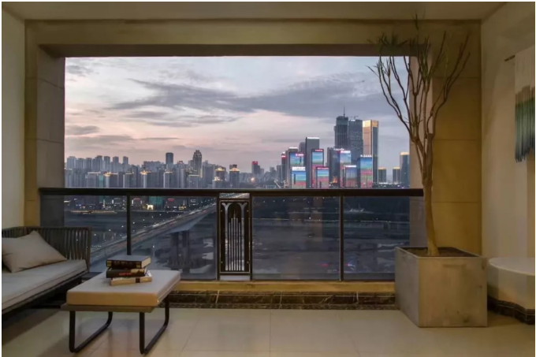
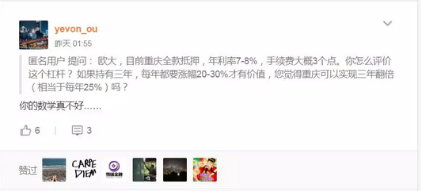
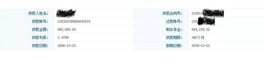

# 高利率时代 \#1790

原创： yevon\_ou [水库论坛](/) 2018-05-09

**高利率时代** **~\#1790~**
=======================================================================================================================

 

比较浅的科普。根据4.18海狸家[研讨会](https://mp.weixin.qq.com/s?__biz=MzUzMTY4ODMzMg==&mid=2247487820&idx=1&sn=e05bb17362d74af07112806eb5185342&chksm=fabfefafcdc866b9efd635d950cba63cfed92a3abbbc445bb3b85ef9c0a07d87ce8c2abafe7f&scene=21&pass_ticket=g7qyQWTd0%206rQQWPMKBAebzOjnmRlOqnIpNTl5EljF7I2Y42N3Wgombj7uQJXwdA#wechat_redirect)整理

 

一） 加息

  

2017年，在整个房地产市场，发生了一场剧烈改变，也是很少有人提及的生态："加息了"。

         2017年初      2017年末
  ------ ------------- -------------
  按揭   九折4.41%     十一折5.39%
  抵押   十一折5.39%   十四折6.86%

仔细想想，2017年的房地产市场，居然能"扛得下来"，真心不容易。

 

 

在地产界，从来媒体的G点，都是"加息"。

2005年第一次加息，用"举国欢腾，奔走相告"来形容，都不为过。

傻空见面就说，要加息了，"北京要跌三成，上海要跌五成"。

 

如果你看一些十八流，野鸡研究所的文献，地产股一般都是把"加息"当作是原子弹的。

央行如果有一次加息新闻，足够CCAV连续报导三天。余波荡漾三个月。

加多少呢，0.25%

 

 

而我真心感到哭笑不得的，2017年整年，房地产市场"隐性加息"多少呢。

我们的媒体，一句都没有报导。凸显了整个"房地产"研究，严重地不靠谱。

 

2017年一共加了1.50%，相当于六次加息的幅度。

 

2017年，其实已经"隐性"加息了六次，合计1.50%的幅度。

这样的加息模式，地产都扛过来了。很多个城市，还创出了新高。

 

 

这个"加息"是怎么操作的呢。和传统模式不一样，他并不是通过央行调整"基准贷款利率"，P=4.9%，逐步变成P=6.86%的。

这次的加息，是通过一种我们最恐惧，最害怕的模式，也就是所谓的"定向加息"。

 

 

中国文字，博大精深。

从字面上来说，金融政策从来没有调整过，"最优惠利率"P还是等于4.9%

 

但是你跑到银行去，你永远别想拿到4.9%的房贷。

哪怕你问了三家，五家，十家八家银行，众口一词，"85折"贷款，是再也不见踪影了。

银监会实行了"总额控制"。浦发银行2017年的放款额度是：0

 

 

数以千计，蝼蚁般的散户。每个月，每个散户归还进来"月供"3500元。

收回了一个"本金3000"，银行才可以"新放贷3000元"，总额变动0.

"一千个散户"拼起来，才可以发放一笔300W元的房贷。

 

想当年，1980年"蜂皇浆口服液"刚上市时，民间传说，蜂皇浆是用蜂后的口水调配的。你说珍贵不珍贵。

 

一千笔散户还月供，才能拼凑出一笔"房贷额度"。

在总额控制的情况下，您就别嫌贵了。蜂后口水调配千年人参，才收您P=110%倍，您说不算贵吧。

您傲娇，后面几百个客户排队等着呢。

 

 

这就叫做"定向加息"。定向加息的结果，是P没有改动。"铁公基"国企亲儿子，能拿到的利率，并没有改变。

而"民营"民间的利率急剧拉升。买房子的人，事实已经"加"了六次息，总利率升了1.50%

 

 

二） 鹰派

 

为什么要"定向"加息。因为之前房地产的人，太好赚了。

 

众所周知，中国其实处于一个"通胀"的大环境中。

纸币的供应，永远是快于实体经济的。

-   政府赤字，政府开支远远大于收入

-   国债是最大的负债者

这二个核心因素不改变，"通胀诱因"是永远停不下来的。

 

 

但是，"通货膨胀"不代表你可以褥通胀的羊毛。

喜羊羊灰太狼。口子开太大了，羊都逃走了，岂不是没羊可吃。

因此"鹰派"必然上台。

 

鹰派的做法，首先是"限购限贷"。任何一个人，名下只能有"二套房贷"。

-   第一套是优惠的，终身一次福利。

-   第二套上浮就很厉害了，而且成数极小。

 

在这样的情况下，再通过种种手段"定向加息"，其实是一种打击。

你小子前二年赚钱太容易了，要多吐一些出来。

 

 

有人算过一笔账。因为三价合一高评高贷等等成本，"信贷"的加权资金利率，已经到了8%

假设你三年卖出，而一轮房产交易，还有10%左右的税费。

 

8%\*3+10%=34%

你的房子，要涨+34%才可以覆盖～打平成本。

 

象北京上海这样高价地区，三年还可以涨+34%么。楼市这一行，还能赚钱么？

 
三） 高息时代

 

按照水库的观点，"高息时代"当然是一个坏消息。

只是糟糕，不是灾难。

 

基本也属于"赚得太多，分点出去"。

要说生存，自然还能生存得下去的。中国人便宛如石缝里的野草，只要有一丝雨露，便可以顽强很久。

 

 

对策总体来说，有以下几种：

> 1） 发展房票贷票，享受首套优惠
>
> 2） 挖掘笋盘，弥补收益
>
> 3） 觅食低成本资金
>
> 4） 等待洪水期

 

 

有二个技巧；

其一，[持续地使用低成本资金，替换掉高成本资金。]

 

很多人对"楼市"这一行，有所误解。当平凡人看见用12%的资金，筹款融资时，往往会害怕得大叫。

 

十五年前"蜗居"刚刚开始播放时，有一个情节。郝平买房还缺2万元，他就去借了"高利贷"。

在六六的笔下，高利贷利率是多少呢：12%，引发全场哄堂大笑。

 

顺便吐槽一下，十五年前"蜗居"播放时，里面的房价只有3000元/㎡，40万元一套。

这样便宜的房价，真不明白他们为什么还要嫉恶如仇嫌贵，苦死苦活看空。

 

但其实楼市使用"高成本资金"，纯粹是为了过桥。

高息资金只是暂时的，伤害很小。

 

 

有一套很笋的房子在你面前，有一城很便宜的房子，正在暴涨前夜。

那你的任务，就是不惜一切先把房子"啃"下来。菜先揽到碗里。

至于优化的事情，可以以后慢慢做嘛。

 

同样道理，当我们做"单子"的时候，1000W的房子，首付350W

你筹了270W，还缺80W，

难道就为了这八十万缺口，单子就不做了。到手的肥肉就飞了？

那肯定先借钱周转一下嘛。

 

 

中国是一个神奇的国度。中国这个国度的特色，"家家有余粮"。

你的父亲母亲，岳父母亲，表姑表舅，当你买房子时"袖手旁观"，一点不想卷进来麻烦事。

可你产证办下来以后，他们会变魔法一样"又翻出压箱底钱"。拼拼凑凑一年又有几十万。

房子涨幅时，解锁更快。

 

 

因此所有的"高息资本"，其实都是暂时的。

哪怕老人们乐衷的"提前还款"，难道就不是"低息资金替换高息资本"么。

 

你家里人存定期的回报，只有3.25%，为了一项超过4%"余额宝"的无风险收益，可以绞尽脑汁。

 

鹰派是搞了"定向加息"，定向加息的结果，是你不得不支付了8%的利率。

可是这句话反过来说，也是你，你全家，你周围所有人，有了一个8%的"投资回报机会"。

非常简单，提前还款即可。

 

你父母袖手旁观，最多旁观半年，就会心疼"钱都被银行赚了"。

然后全家一起发动找钱。

 

 

四） 放水期

 

第二个技巧，中国不会永远是"鹰派"当道。鹰鸽轮换。

 

全球所有OECD国家，"房贷"利率都在3\~4%之间。

在英美澳加新，只要你付到30%首付，银行就认为你是VVVIP客户，信用好得不能再好，给你最优惠的利率。

 

国际通行"有风险"的标准，是首付5%，而不是首付70%

 

某些蠢货居然能算出中国家庭平均负债率65%，智商真的要充值了。

你连借钱的地方都没有。

 

 

在中国的历史上，有过二次"房贷"大幅度调整优惠的时刻。

-   最早，在2000\~2006年，所有的房贷都是基准P

-   2007年，房贷一律调整为P=85%

-   2009年，房贷一律调整为P=70%折

 

这个"调整"，十分简单。银行发短信邀请，你去，带上身份证，签个补充协议就行。

高高兴兴，柜面大堂，五分钟就办完了。

 

因为这属于"银行内部收费调整"。

只要在银行签字就可以了。

 

 

而银行可不可以反过来，"7折调成95折"呢。

答案是不可以。

因为商业契约，需要双方签字，你不签就行了。

 

 

房贷的生命周期，非常漫长。在30年时间内，你是一定会再遇见"四万亿"机会的。

鹰鸽轮换，信贷松松紧紧。总是会遇见洪水期。

 

在洪水期，你要赶紧办手续，把各项房贷尽量优化。

象上海2009年时，甚至还有"平转转按揭"。工行不肯给你降息，闭着眼睛转到建行7折。

 

 

 

五） 结语

 

"高息时代"是一个麻烦，但不是灾难。

你赚了那么多的钱，鹰派让你吐一点出来，也是应当。

 

而且你仔细想想，6.86%和4.9%，其实也就差2%

再怎么高息，不就2%么。

持有三四年，成本+7%，而你三四年的房价可以多涨多少。

 

 

台下扔了一块板砖上来，"你们都是老用户，平均才三点几的资金成本"。

"站着说话不腰疼"。

 

 

 

（[yevon\_ou\@163.com]，2018年5月8日晚）
