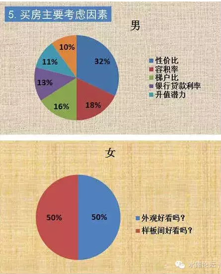

# 温州炒房团 \#180

yevon\_ou [水库论坛](/) 2015-05-29

温州炒房团 ~\#180~

[\[1\]] 所谓的CEO盘，就是跪着求你买房子。

CEO盘+师奶团=温州炒房团 

一）贵妇

当一套房子，各项附加值做到了极致，他就成了CEO盘。

CEO盘，主要是跪着求你买的意思。

在我的圈子里，我认识很多名媛阔太。她们许多都是官太太，年龄在45\~55岁之间。珠光宝气，闲得发慌。

官太太有几个特点，其主要是；

-   她们都很有钱

-   他们都很有闲

-   她们都超级骄傲

从某些角度而言，（中国）官太太可能是这个星球上最幸福的人群。因为她们充分满足了几个需求，数之不尽的金钱，数之不尽的休闲，唯一的工作是玩。

官太太并不一定是精英。这是很重要的一个大前提，影响到以后的结论。

许多阔太，她们只是运气好。或许当年生产插队的时候，搭班了同队的一个小年青。结果人家就当上了部长，厅长，局长。或者是几十亿大公司的董事长。

一个巨有钱，巨有闲，巨有自信心，巨快乐无比的群体。

这构成了"名媛阔太"的主体。然后深刻地影响到了投资圈。

名媛阔太是一个超有钱的团体，而且她们的[自我感觉]非常非常非常地好。

现象导致一个结果，阔太手里通常都有一笔钱，阔太们想要"投资"。

金融圈经常有些瞠目结舌的事情发生。譬如某人饭桌上听推荐，一下子就买了1000W人民币的贵金属基金。

汇丰银行高级私人理财部门，金砖基金一笔卖个八佰万一千万。几乎整个私营理财业，就靠贵妇们撑起来了。

在房地产市场，同样有贵妇的故事。

二）CEO盘

贵妇们的钱实在太多了，在买了鞋子，包包，珠宝，基金，开美容院，私募股权融资之后，还是没把她们的资金消耗完。

和所有人一样，贵妇也想买房子。

贵妇买房子，一方面是出于对房产本身的喜爱。几乎每一个女人都喜欢房子。

另一方面，房地产大火，身为女主人，为家里理财分忧，也是应有之意。何况还能赚钱呢。

贵妇买房子，有几个要求。

首先，贵妇绝对不排队。几百号人冲击售楼处，排三天三夜队伍抢个号筹，这一类的事情，贵妇是绝对不会参与的想也不用要想。

其次，贵妇不惹麻烦。凡是有产权纠纷手尾药单清场雷锋，凡是和"药单"概念有关的。贵妇碰也不碰。事实上，贵妇几乎不买二手盘。

第三，贵妇是视觉动物。微信上有一篇《男人和女人买房的区别》\[2\]，其中有一张图是非常正确的。

女人买房，基本只看装修。完全完全彻底不考虑性价比，反正是男人付钱！

对于女人买房，关键是样板房漂亮。哪怕所有的样板房都没有门，她也不会察觉到。

第四，贵妇买房，是买着玩的。

对于穷人屌丝，一套房就是一套命。需要几代人拼搏所有的积蓄凑起来生死纠关的大事。对于职业炒家来说，买房是工作。需要谨慎严肃认真避免所有赘肉溢价。

可是对于贵妇来说，买房是因为今天下午做头发的师傅没有来。所以就顺路去隔壁售楼处看看。反正她对自己的投资眼光自信得紧。

这些因素拼凑起来是什么呢。是CEO盘。

三）CEO盘的含义

CEO盘的特征是什么呢。譬如附近普遍的地段均价是30000/m，你卖40000/m，那不叫CEO盘。只能叫高品质溢价盘。

CEO盘，你要卖80000.

在八万的基础上，普通人基本不会关心了，当笑话看了。那你售楼处也不会拥挤。大可以高档香薰泡二杯金骏眉，请贵妇慢慢赏鉴。

当一个楼盘达到了"市场价二倍"以后，他最紧需的是IB格。性价比可以很低，但是B格一定要高。

这里我们再贴一个链接给各位；如图中他所说的所有小玩意，加在一起花不了2000元/㎡，可对女性购买者来说就是毒药。

《万科发布陆家嘴江景房最新顶配精装，好多新鲜玩意儿，你绝对没见过......》\[3\]

当一个楼盘达到了别人200\~250%价格以后，他的销售就很长滞很困难。至少他不能在Mass
Market，不能在大众市场上卖。因为根本卖不动。

这个时候，这些"豪宅"就要有针对性的，专门针对这些"细分高端市场"推送广告。

譬如说，在一些贵妇才看的杂志，在Club，或者和Vertu手机售后交换名单。

当贵妇接到开盘的消息，只要你感兴趣，就会有西装领带的一男一女销售精英，跪着捧着楼书，送到您家里去。

你没看错，是送到你家里去。是跪着求你买楼。

贵妇买楼不用排队。你只要签个字就可以了。也不用去交易中心受热气蒸臭气熏，公证委托即可。所有的手续我们全都帮你办完，要多贴心有多贴心，要多方便有多方便。

你想参观我们楼盘，奔驰车全程接送。不买不要紧，请下月来参加佘山高尔夫的酒会。1997年香港何文田看楼时，钟镇涛是坐着直升机去浏览的。然后二个月后楼市就崩溃了。

有时候我不无讽刺地想着，贵妇们如果知道仅仅她们的电话号码，就能卖5000元/个。不知会怎么想。

四）CEO盘的升值

CEO盘怎么升值呢。CEO盘就是把"各项附加值"全都做到极致的。把用户体验做到极致的，把品质规格做到极致的。同时也把价格做到极致的。

CEO盘不升值。

贵妇们啊，你们要知道。在整个生态链上，你们是处于最末一环的。

我们这个世界，黑暗血腥宛如永夜森林，而不是纯洁的白雪公主小白兔。

厮杀与争夺，阴谋和轨迹，才是我们这个社会的主旋律。

买房是一场战争，是各方利益的角斗场。政府费尽心机将土地卖最高价，开发商费尽心机，榨尽最后一滴黑油。

屌丝们则上演着打砸售楼处的闹剧，小编一手构造了CCAV2的假新闻。

这是战场，是屠戮场。不是童话王国呵。

每一个人都在交棒，在玩击鼓传花。生产者交给批发者，批发着交给零售者，零售者卖给消费者，消费者卖给收藏者。

好比你脖子里戴的珠宝，到你的手中，这就是最后一棒。再也找不出任何出价更高的其他买家了。

贵妇们做什么投资，无论做什么投资，你都是最后一棒。

股票基金到了你手里，就是最后一棒。贵金属、金银币到你手里，是最后一棒。

当贵妇们仪态优雅地翻阅着订购杂志时，你的智商还不如一只猫。

珠宝首饰，艺术品收藏，你是最后一棒。你是最后最高一个出价，不会再有下一个买家。

CEO盘到你手里，也是最后一棒。

阿姨啊，你知不知道店家为了找到你，为了将商品卖给你，他们花费了多大的力气。

你手里的货色，至少1/3是广告费。

五)异地销售

CEO盘的特征，是跪着求着卖给你。

一般而言，我们对那些"异地销售"的楼盘，都心存疑虑。

一个楼盘，你要CEO成什么样子，才能使本地消费者完全不卖账呢。

走在马路上，你经常可以看见"澳洲房产销售""美国房产销售""加拿大房产销售"之类的广告。

通常会有一些代理公司，将异地或者外国的房产，拿到中国来卖。据我所知的行规，大约是贵30%

55W美金的房子，他一般要卖到你70W美金左右。这也是很符合商业原理的。

楼盘在本地销售，你只需要很少量的广告费就可以了。

消费者可以在附近活动，走过来就能看到你的广告，进而看到你的商品。

而海外销售，涉及到大量的成本。仅仅是老板飞二次美国，达成协议框架，机票就能用去上万美金。

一般来说，只有该项目在当地完全卖不动。或者是他要加一个可观的溢价30%左右，才会有异地销售之类的行动力。

跪着卖的都不是好货。

五）温州炒房团

异地销售，加上CEO盘，二者合体，就造成了温州炒房团。

99.9%的人对温州炒房团有误解。你以为"温州炒房团"是炒房么，是职业炒家么。哈哈哈哈，别开玩笑了。

2000年时，上海房地产市场低迷。有一些盘本地根本卖不动，KFS又很懂营销。于是那怎么办。

他开了几辆大卡车，到温州去拉人。开进温商"企业家协会"，条幅一拉，blablabla我们这是超一流品质的顶级豪宅，豪华精装修。中国加入WTO，未来升值潜力无限。国际学校英式管家，高层住所黄浦江景观。

温州的特产是什么，是企业家协会"贵妇们"啊！

贵妇们一激动，大卡车就几厢几厢地拉回来了。"温州贵妇们"给你看印刷最精美的楼书，帮您代办一切手续。销售说得天花乱坠，保证忽悠升值潜力无限。您还等什么，您只要刷卡就行了。出门财务室左转啊。

"CEO盘+异地销售"，共同构成了温州炒房团。

这哪是什么炒房团，这是送财童子团啊。是雷锋团，是菩萨团啊。

2002年时，大卡车集装箱一般，载了几车皮的"温州贵妇"去到童话中的城堡\[4\]，当时我去看"童话中的城堡"，然后专车开到了黄浦江另一边对称的轴线。

我指着城堡说，"喏喏，浦东滨江目前卖20000/m，浦西滨江目前卖5200/m"。

"未来他们的价差，肯定达不到1：4，浦东涨幅肯定跑输浦西"。

目前大约是1：1

六）温州人的下场

在我浸润楼市漫长的岁月里，我从未见过任何一个温州籍的"职业"炒家。相反的，99.99%几乎全都是贵妇。而且常住在温州，一二年才来一次上海。

温州人是一个很奇葩的团体。他们买进时是最贵的，卖出时是最便宜的。

好比2002年时，他们就大量买入CEO盘。平均每一套的沉入成本高达600\~700W元。而且基本上是全现金。

这是2002年啊！资本贵如油的年代。

这六七百万元，放到十三年后的今天，无论你投什么项目。迄今都有六七倍的回报。四五千万了。而温州人几乎只赚皮毛。

真正得意的，是卖房给温州人的房东。他们在极早的年代，就可以获得极珍贵的数百万资本。从而获得火箭助推。

2002年时，你和温州企业主几乎是上百倍的财富差距，而今天已不足十倍。"温州炒房团"是在送钱给你。

另一方面，温州人在"卖房"这件事上，虽然不如买房声名卓著，可是更为奇葩。

典型的例如2014年，政府紧缩银根。钢贸互联互保贸易爆煲，商人大量破产。

好友R就在那时候买的温州人抛盘。品质绝佳，如果按照我们估值，二手市场应该可以值得卖120000/㎡左右。

可是温州人卖给他的价格是：40000/m。

温州人是一个儒雅的老先生。没办法，卖了一千多万，拿回去救厂。

我们和他聊了起来。

"没办法，十年前就23000/m买的"。

-   *我能和你说，这期间上海楼市涨了12倍么？*

"这些年，也没赚什么钱。反正不亏就行"

"我们平时也不来上海，最近二年都没来过。反正看报纸上说，政府打压房价，那房价一定是跌了"。

-   *中介踢踢脚尖，"哥，我帮你赚了一辆超跑"。*

-   *我回踢中介脚尖，"是五辆超跑"。*

"我们都订人民日报的，也上搜房网，Anjuke查查。四万这个价格，很合理了。"

R实在听不过去了，摘下了手上的佛珠给老先生戴上。

"给您祈福了，先生。我都快给您说哭了"。

就我本人所接触的几笔单子，温州人买进时，一般是市场价的130%至少。卖出时，顶天是市场价的70%最多。

而他们平均五年买卖一次。上海楼市涨了五倍多，对温州人来说也就是50%的涨幅。

温州人最奇葩的，是他们几乎不来上海。然后纯粹看新闻联播上的报导，来确信房价的走势。每一次即使来，也就是待二三天，匆匆忙忙完成了交易就走。

所以温州人在业界，具有至高无上的口碑与地位。每一个人都知道，找到温州人，那就是找到财神爷了。何止是财神，简直就是无主金元宝，人形提款机啊。

我提议，将沿海高速改名为"沪温友好大道"。再找几个小朋友挥舞着丝巾，高喊"欢迎，欢迎，热烈欢迎"。非如此，实在不能表达我们对温州雷锋的喜爱与崇拜之情。

当然，每月再进口点"温州特产"就更好了。

温州人的购买高潮，大致在2002\~2003年达到顶峰。此后固然有山西煤矿的分流作用，但主要还是因为"温州"本身的衰弱。

上届，连续清洗温州的开明官僚。塞了几个新的地委书记去"整顿经济"。于是就把温州经济给活生生搞垮了。

作为上海房地产从业人员，大伙纷纷表示极大的悲痛。并且给菩萨加上一炷香。

另一方面，当年温州人买入的"抛盘"却持续存在，细水长流。构成了今时今日上海市场笋盘的主流。也将某些楼盘的价格，压制得始终抬不起头来。

温州人从来不是职业炒家，她们只是师奶群。

真正的职业炒家赚钱很容易:和温州人做生意，赚温州人的钱。

每当经济动荡银根紧缩，你去守在上海几个钢材贸易城门口就行了。

（yevon\_ou\@163.com，2015年5月29日午）

\[1\] 本文上接《职业炒家五\-\--升值》

\[2\]《男人和女人买房的区别》http://mp.weixin.qq.com/s?\_\_biz=MzA4NjQ5NjMxMw==&mid=206040763&idx=1&sn=1b23b7e42481b8d1994b0c267c53ab0a&scene=1&key=c468684b929d2be20b6208cf15fdb71395ae25bdb01f481e82c38b262bf7a77a6ac17f81c6b478bdab570749e6656ac2&ascene=1&uin=NDkyMjg2OTM1&devicetype=webwx&version=70000001&pass\_ticket=Fwo3VPNkGuO%2BUOWvlq6BQ0x8hOqXnUTUfOxU5P7d3OwunpQn3dLap%2FLPe0H%2FqWyF

\[3\]《万科发布陆家嘴江景房最新顶配精装，好多新鲜玩意儿，你绝对没见过\...\...》http://mp.weixin.qq.com/s?\_\_biz=MjM5OTI2MjM4Mw==&mid=213036673&idx=2&sn=76eeca19d319e7073d484a5122bb87f2&scene=1&key=c468684b929d2be2064df4d62a5ac78b6e2bdbf96d688e056e153665d2275d6178a42e7f7442b50e11d58167a0dbcd42&ascene=1&uin=NDkyMjg2OTM1&devicetype=webwx&version=70000001&pass\_ticket=Fwo3VPNkGuO%2BUOWvlq6BQ0x8hOqXnUTUfOxU5P7d3OwunpQn3dLap%2FLPe0H%2FqWyF

\[4\] 知名不具
