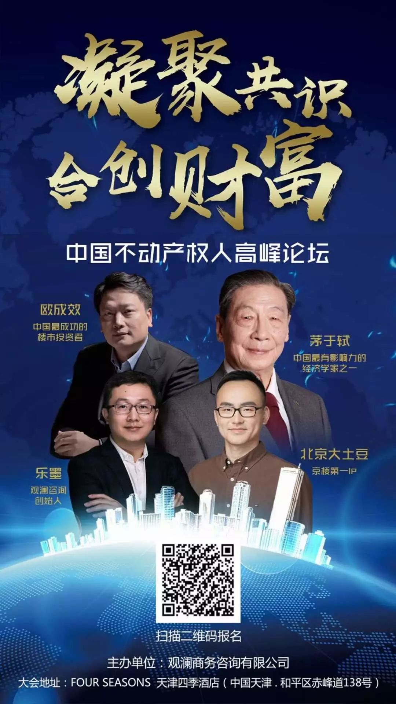
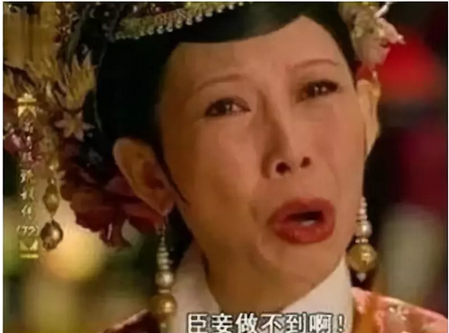

# 世上再无商品房 \#1830

原创： yevon1ou [水库论坛](/) 2018-06-11

 世上再无商品房 ~\#1830~
=============================================================================================================================================================================================================

根据6月9日观澜天津的演讲稿整理。因讲座与公众号尺度不同，有大量删减。

原讲座分为"补贴"和"商品"二个部分。本文仅包含"补贴"。

 

 

各位朋友，大家好：

 

非常感谢大家今天到天津，来参加我们的讲座。

大概仅仅十天之前。4.27我在《[功夫财经](http://mp.weixin.qq.com/s?__biz=MzAxNTMxMTc0MA==&mid=2651017855&idx=1&sn=9f9aa277e3c3fb7d2706c686a928d5b8&chksm=8072046cb7058d7aae78d6db660d368fbcc621f647e6586e1313f777a15b1c5a3d962df119e1&scene=21#wechat_redirect)》刚做了一场演讲。俺这个人，比较良心，所以俺每一次演讲的内容，都是现场原创的。每讲不同，保证值回票价。

但缺点就是，ppt做得比较丑，来不及优化，各位请原谅。

 

今天茅老是第一讲，他开了一个头。

茅老是学界前辈，江湖地位崇高。他也比较敢讲。既然茅老把基调定高了，今天我们就可以多讲一些。脱出大纲。

 

 

 

一)  可售公房

 

许许多多年以后，我们再回过头来看。我们会发现，"商品房"这真的是一件了不起得事啊！

为什么这么说呢，众所周知，在1995年代，中国经历了一次重要的改革。即我们所谓的"房改"。将大量的住房：商品化。

 

 

在1995年前，整个中国大地上，也是有几亿套房子的。

只不过这些房子，很"怪"。

 

按照中国宪法的规定，土地首先分为国有土地/农村集体土地。

其中国有土地，是不可以买卖的。只能够批租，这就是70年租赁权的来由。

农村土地，只能在本村之间买卖。你脱离了农村户口，你也不能买了。这就是"小产权"的来由。

 

 

在国有土地的名义下，1995年的房地产市场，他又是支离破碎的。

譬如说，绝大多数的房产，它是属于"单位"的。而不是属于"个人"的。

 

当时我们所谓的"工厂大院"。辽宁典型的一个矿站。可能在山沟野外，有个煤矿。

一个煤矿，就是一个城市。几十万人。整座城市，都是属于这个煤炭集团公司的。

 

 

而"职工宿舍"，都不能叫"成套住宅"。他是由工矿企业建设，分配给职工居住。

职工在煤矿上班，他可以住。如果你哪天换工作，调离辽宁了。你这套房子，要还给组织上的。

如果不幸矿难了，家属亲人能不能继续住呢。可以，也不可以。配偶是可以继续住的，但传给子孙侄子，就有困难。

 

 

同样道理，1995年，如果看回上海房地产市场。上海的房地产市场，也是完全没有"市场化"的。

企业里的人，他们的房子是"职工宿舍"。而市区街道里的人，他们的房子是"白卡"。或者说，今天称呼为"使用权房"。

 

使用权房的性质更为奇怪。名义上，你是租户，你可以使用。

但实际上，你可以将这房子继承遗产给亲人，转租出去。甚至还可以买卖。

 

可售公房不可售

不可售公房可售。

 

这句话的意思，能懂的人就更少了。

这是指1995年市场上，政府搞了一批"可售公房"想要商业化买卖，可是被左派阻扰，迟迟割不掉资本主义的尾巴。

 

而另一批，市场上本来是"不可售公房"，却已经暗箱交易，几千几万套。拦都拦不住。

春雨欲来，黎明已在眼前。

 

 

 

二)  房改

 

在这样局面下，1995年，发生了开天辟地的政策"房改"。

在房改之前，市场上有廉租房，经租房，保障房，经济适用房，政策性住房，共有产权房，限价房，可售公房，使用权房，非成套住宅.........

在房改之后，市场上只剩一种房产：商品房。

 

 

这是一个改天划地的举措。1995年房改的总思路，就是不管你之前"性质"有多残缺，补一点钱，[就把你洗成100%的产权。]\
用经济学术语，叫做"确权化"。

 

"房改"之后，住房就成为了一种商品。

而商品的唯一尺度，是货币。

dT \>0，交易产生财富。

 

很多人的父母，或许还有印象，1995年的某一天，父母回家脸色凝重。

商量着凑出1万多元钱，把"产权"给转了。虽然以前都算职工宿舍，心照不宣一辈子给你住。"房产证"这玩意，也不知道办了什么用。

但是犹豫纠结再三，最后还是花了一万多元，办了这个"没什么用"的房产证。

 

亲，有了产证，才能买卖。

（合法买卖，才能贷款呀）

 

一般认为，在1995年，一套"老公房"价值在8\~9W元之间（97年二手价倒猜）

政府卖给市民的，每套只收了1.5\~2W。是亏钱的。

这当然是一种福利。其背后是你父母的30年工龄。一次性国家送钱给你。

 

1995\~2018年，"房改"之后的事。也不用我赘述了。

 

 

 

三)  计划经济

 

+-------------------------+-------------------------+
| 他改变了美国            | 他又改了回来            |
|                         |                         |
| Obama                   | Trump                   |
+=========================+=========================+
| 2015.12.12 巴黎气候协定 | 2017.6 退出巴黎气候协定 |
+-------------------------+-------------------------+
| 2010 Obama Care全民医保 | 2017.5.4 废除Obama Care |
+-------------------------+-------------------------+
| 2015 签订伊朗核问题协议 | 2018.5.7 单方面撕毁     |
+-------------------------+-------------------------+
| 2015 奥巴马加入TPP      | 2017.1.23 正式退出TPP   |
+-------------------------+-------------------------+

 

历史，总是在一次又一次地循环中。

"房改"之后20年，我们渐渐地发现，"房改"又改回去了。

 

曾几何时，我们的房地产市场，是非常纯净的"商品房"。市场上只有一种产证。

房子象彩电一样敞开供应，拿了钱就可以买"商品"。

 

而现在呢，以北京为例。我们有；

+------------+----------------+----------------+
| 廉租房     | 公有产权房     | 商品房         |
|            |                |                |
|            |                | （普通／非普） |
+============+================+================+
| 公租房     | 限价房         | 小产权房       |
+------------+----------------+----------------+
| 经济适用房 | 限房价限地价房 | 只租不售房     |
+------------+----------------+----------------+
| 人才住房   |                |                |
+------------+----------------+----------------+

名目繁多，不胜列举。我们有所有的类型，唯独没有"商品房"。

 

商品房去哪里了？

 

既然有限购限贷限价限售，房产不再是一件商品。

那么，我们就要想，政策改了半天，又改回去了。

回到了1980年房改之前。

 

1980年是不是乾坤盛世，万寿无疆呢。

 

 

 

四)  思潮

 

我们知道，在目前社会上，的确是存在着一股"思潮"。

 

-   这股思潮，凡是老的，旧的，都是好的。

-   凡是改革开放，都是不好的。

 

这股思潮，罔顾人民群众的幸福生活，罔顾生产力的百倍提高，中国跻身世界大国之列。

这股思潮，只顾自己的小九九。因为自己的懒惰和愚蠢，而拼命鼓吹大锅饭。

 

 

在一群"吃福利"份子的眼里，1980年的社会，简直就是"天堂"。

-   房子是免费的，你不用自己花钱买房子。光这一点，就足够屌丝跪舔。

-   教育是免费的，只要考上清华，就没有学费。

-   医疗是免费的。人参杜冷丁是免费的。

-   工作是包分配的。绝不会有失业烦恼。

-   物价是受监控的，绝不会有生存压力。

 

在LOSER的眼里，1980年代简直就是"天堂"。

在他们幻想出来的这个世界里，一切都不要钱。

唯一的缺点是，他们从未在1980年代生活过。

 

 

相应的这股思潮呢，就是想要废除"房改"。

住房，是肯定不能"商品化"的。商品化了以后，北京的房子就要1000W一套了，那还怎么得了。

90%的城市有产阶级，阶层中流砥柱他们看不见。

地球仪应该围绕着，10%买不起房的屌丝转。

 

 

因为屌丝买不起房，所以房产就要"去商品化"。

-   一开始，是"经济适用房"，试图降低质量。

-   其后，是"共有产权反"，试图降低份额。

-   再其次，是"限价房"，试图刮低KFS油水

-   然后，是"租售并举"。买房您这辈子也别指望了。

-   再最后，是兜底"廉租房"。

 

 

如果我们看近期政策的总思路，总思路就是"去商品化"。

世上再无商品房。

通过各种杂七杂八的政策属性，剥离房产中的商品因素。补贴屌丝，让屌丝们别嚷。

 

那么，搞得下去么 ？？？

 

 

 

五)  为什么要房改

 

"如果天底下真有不干活而掉馅饼，那我一定拥护这个制度"

\-\-\-\--yevon\_ou

 

成年人和巨婴的区别，是成年人得为国与家负责。

这个世界真正的勇气，是看清了世界的真相，依然热爱地活下去。

 

 

如果真的能"住房不要钱""教育不要钱""医疗不要钱"。那我一定拥护这个制度，绝对是利国利民的大好事。问题是；

-   精英清楚地知道，这一套玩不下去的。

-   屌丝们愚蠢地巨婴，以为有人会守护他们。

1995年为什么要房改。1997年大学为什么要"收费"。

这么得罪人的活，哪个铁血宰相，不想博个"影帝"的好名声。

改革，是因为真的做不下去了。

 

 

中国人搞了四十年的"计划经济"，政府包办生老病死。

到最后，有没有造出丰衣足食？

 

你去问问你的父母，他们为工厂工作40年，苦苦等待"经济适用房"，苦苦等待"摇号选房"。最后占到了多少便宜。

三代同堂，四代同堂，五代同堂。

 

在工厂里，小组长让你扫厮所，你就得扫厮所。

小组长让你学狗叫，你就得唾面自干。

委曲求全，勾心斗角。跪一辈子的奴才，最终获得的利益，也就是8\~9W元。

 

你想撸政府的福利。

最终，你既撸不到福利，也得不到自由。

 

 

从"财政学"角度讲，如果政府完全不干预任何价格，仅仅收税，则政府每年都会有一笔收入。

理论上，政府可以将任何一项民生价格，压低到零。

但是会消耗"行动点数"。

 

举个例子，苏联的粮食出了名的便宜。极限时，农民去商店里买面包，用面包喂牛比用小麦更便宜。

因为苏联的口号是"工农联盟"，社会主义吃饭不要钱。因此苏联需要讨好人民，拼命地压低零售粮食价格。

 

但是，"社会主义优越性"意味着巨大的财政压力。

1970年代，苏联财政收入的1/3，用于"粮食补贴"。

这一部分支出，不仅超过了苏联政府自身开支，甚至超过了USSR的全部军费。超过了所有的航母，潜艇，战略轰炸机和数百万红军。

 

 

同样道理，整个1949\~1995，"百姓住房"对于政府来说，是一个巨大的"财政包袱"。

百姓从来不为住房掏钱，或者掏一点点钱，等待政府白送。

试问，哪一个政府，能承受得起呢。

（每人每天多吃一顿肯德基，就足以吃光政府）

 

 

1995年房改，房改一共有二个核心功能：

1）补贴。取消补贴，您掏钱吧。

2）市场。dT\>0，交易产生财富

 

"房改"之后，房地产市场由无底深坑，一跃成为现金红牛。

迄今仍是地方政府最主要的财政收入，拍地占花钱1/2以上。

 

如果我们取消"房改"，退回1980年之前，百姓不掏钱，或者掏几分钱。

-   这意味着数万亿的财政收入，化为乌有。

-   房地产重新成为无底黑洞。

-   资源配置，极大浪费。

 

你想象一下，一块价值300亿的土地。

-   拍卖商品房，获得300亿。

-   拍卖经济适用房，获得150亿。

-   拍卖"只租不售"房，获得0亿。

 

你看到屌丝在欢呼，在狂欢。

屌丝的脑容量比较低，他们只是要改变，要"掀桌子"。反正是弱势，任何天下大乱都欢迎的。

 

而地方政府，心里在滴血。足足少了300亿收入，国家政务还怎么推行。

你来补，你来补，你来补啊！

房地产行业的民粹逆行，全国减收数万亿，亏不起。

而目前推行"回到过去"那群人呢。崽卖爷田。

他们正在摧毁共和国的财政基础。

 

 

 

六)  结语

 

我们的财政支柱，正一条条被敲断。

你犯一个错误不要紧，你犯二个错误不要紧。你犯N个错误，就要紧。

 

-   中国的股市，本来是很有希望的。可是因为太多的管制，目前正奄奄一息，打吊滴。

-   广播电视，把几亿观众逼离了屏幕。

-   网络金融受限

-   出生率不足

 

有些事，你看不惯它。便不要这个行业。

美国人追求"白左"，为了圣母心中的正义，搞得差点亡了国。

 

励精图治，克勤克俭。干嘛把腿打断呢。民粹误国。

 

 

 

 

 

（yevon\_ou\@163.com，2018年6月11日寅）

中国不动产权人高峰论坛欧成效演讲文字版\#F60

虎哥

6月9号，我们的茅于轼老师和欧绅欧成效及北京大土豆在天津四季酒店做了一场分享，活动叫中国不动产权人高峰论坛，由房产观澜主办。音频如下：

昨天俗务缠身，简单发了音频版文章。我粗略听了一下欧老师的音频，感觉还是有不少可以学习研究的地方，终于连夜抽时间整理了一下文字稿。总结了欧老师的观点，供大家参考吧。

使用说明：根据上面公开的音频内容整理，下面的文字稿我尽可能地贴合原文意思，音频质量这个情况我只能说尽力了，真的......一切内容以原公开音频为准，有看完文字后对某一部分特别兴趣的朋友可以找音频对比来听。（括号里的是个人注解）

欧成效：

我做最后一个发言的，他说叫我压场，因为时间比较久，大家听了昏昏欲睡。我这个人呢比较良心，十天前刚刚在北京搞了一场功夫财经的合作。我这次来呢讲的是一个新的话题，就是说我的每一次的演讲话题都是不一样的，每一次都是原创，每一次都是新的资料，一定是会对得起各位的票价。但是呢有一个副作用，有一个缺点就是那个PPT做得比较丑，实在是没有时间打磨了，这个大家都原谅一点。这个论PPT的话肯定是要比大土豆都要差一截的。

今天我讲的内容呢大家非常非常关心的，大概在一个月之前，深圳搞了一个新政，60%的保障性住房。那么这个呢不是一个孤立的事件，它其实是一系列的事件中的一环。那就一直有人在说说，那你分析一下，分析一下深圳这个新政到底意味着什么？对房地产市场有影响，是不是深圳的事情？我说那其实不是的，它不是深圳一个城市的问题。它其实是全国房地产北京天津所有的城市的一个缩影。我们从这个政策里面微言大义，我们可以分析出很多的门道。那么提早做准备的话，就可以从里面赚一点点钱。

我们首先来看一下深圳的这个6月5号的新政，它讲的是什么？他讲的呢60%的保障房，其中20、20、20是廉租房，租赁型住房，人才住房，真正的商品房呢它剩百分之40，当然这个40%呢还不是完全的商品房。里面还有东西，比如说像限价，规定你这个房子双玺，二手房14万，它规定一手房只能卖8万。那么限价其实也不是纯粹的商品，就是真正的这个商品房啊它只占了百分之40都不到。

那么深圳并不是一个孤立。我们现在在天津，北京天津很通的，大家都是北京过来的，那么北京这个名词就更多了。最早的经济适用房，共有产权房，限价房竞房价竞地价，还有那个什么人才住房、定向住房、机关大院房，北京几十个名我都分不清楚了。这些事情连在一起，我要提一个问题：商品房去哪里？这个字体不对，应该是标号大号。最大的字体从从屏幕左边道右边到调一下，它是最大的字体，红色，标红。大家如果有发照片发朋友圈发微博的话，我会发一些。

商品房去哪里？我们回想一下，从1990年代开始，中国呢进入了一个叫做商品房的改革。这件事情30年前，当时我们没有意识到它有多么多么的珍贵，我们也没有意识到商品房这三个字有多么的伟大！我们今天回过头来想这件事情，我们会觉得不可思议。

为什么？住房竟然是一种商品。商品的意思，只要钱，只要有钱就能卖。没有第二个元素；没有限购的；没有房票的；没有任何一个规定说你只能买一套：北京人不能买，天津，天津人不得来北京，深圳人能不能买上海，没有这个说法；
也没有说经济适用房必须限价，必须说只能卖8万，不能卖10万；必须买了以后三年不许卖，我们也不去买。没有这种说法。

当年，不知道是哪一位伟人（邓deng小平-xiaoping），他提出了商品房。商品房说什么呢？就像以前很多人学DOS，学那个计算机，它有640K内存，后面还有两兆三兆的高端内存，后面还有十几兆的附加内存，那边编程序编变得很烦。但是你到了windows以后啊，就只有一个内存，不管你三个G，5个G都是一个内存。

房地产市场也是一样的。1990年之前，中国的国土上面有十几种，20种，各种各样产权的房子。有单位分给你的，有级别职称，做官分给你的房子，你当官就能住这个房子，你哪天不当官了，你的子女就会被赶出机关大院。当年这个产权是非常复杂，但是到了一个伟人的手里，他做了件什么事情呢？他把所有的房子全部都改成了商品房。从1990年开始，我们进入了商品房的时代，那么后面的事情大家都知道，后面30年都知道。

那么我们就要说一下，现在在我们这个国家，在我们的国土上面，有一种思维，有一类人群，有一种声音。什么声音呢？屌丝的声音。屌丝一百个不愿意，一百个不好。他说你市场经济不好，九二南巡不好，改革开放不好。屌丝说什么？屌丝说以前最好。最好是回到1976年，国家分配房子，住房、医疗、教育、公交，所有的东西全部是免费的，国家包干，屌丝说这个时代是最好的。

屌丝期望的是什么？只要我在公司里面工作，工作了20年、30年，你给我评一个职称，然后论资排辈，公司送你一套住房。现在有一股势力，有一股言论，有一股思潮，他们希望回到1980年以前。

那么我们就可以看到最近几年，包括深圳的这个6月5号的新政，包括北京、天津一些政策，其实我们是什么呢？我们是回到过去，回到1980年之前的房产。如果这些政策向深圳三个20%，彻底执行到家的话，就是1980年；就是房改之前的事情；就是否定了这个30年里面的所有改革。

那么我们不是说这个思想正确与否，说了太多要喝咖啡的。我们就评论一下，为什么1986年，当年这么好的事情，免费住房啊，天大的好事，为什么执行不下去？为什么1980年，这个系统到最后是崩溃了，被迫要改革，被迫要开放了？

1980年是什么局面？大家有没有是年纪比较大一点，像我这么老的，经历过这个当年的时代。像个几十岁的人，他都知道：1980年的时候分配一套房子，你要等30年。在单位里面你要扯皮，然后呢，党委书记他可以卡你，嫡系的人就可以早点分房子。你那一个刺头，你不听领导的话，你就排在最后面。分一套房子，要打破头、抢破头，勾心斗角，无数的小人，这些我都忍了。问题是什么呢？分来的房子还非常差，一室一厅，30个平米，40个平米，砖混的房子，有时候还是漏风的，朝北的，只要你有地方住，他什么都不管的。
要是你家里有两个住所的话，一定是资产阶级自由化的。那我可能一个住所我就能用了，那说两个干什么？

那么在1980年的时候，我们的住房是非常非常糟糕的，这些政府统包统筹计划经济。计划经济的时候是没有房地产的，房子是免费的，但是非常的差。这个也不是重点，这个你真的差也就忍了。

导致1980年真正不可持续的是什么？是财政。就商品房和政府免费分房子，真正的分水岭还不是质量，是财政。财政做了什么事儿？

1990年，不止90年，90年代，朱镕基，他后来做央行行长，后来做总理的，考察了一圈全国，按他说，我估计下一个经济增长点要靠房地产，这句话应该就是五年说。后来是什么，就是商品房改革、商品房市场化、商品房商品化。这个房子，这个东西不是一个特殊物品，是件商品。跟自行车一样，是花钱就能买的。

商品房改革以后，中国发生了翻天覆地的变化，最主要一点是什么？亏个几万亿变成了赚几万亿。本来是一个亏损大户，一下子变成了一个精油、财神、财神精油。就是我们说什么土地财政，说什么卖土地财政，其实你问一下地方政府，没有房地产，北三县没有房地产，燕郊大厂没有房地产，他们活得下去吗？他们活不下去。就没有房地产就没有道桥。道桥入税，高铁大桥航空航天海军陆军全部都没有没有钱的。

房地产市场化的改革，它是使得一个巨大的财政包袱变成了巨大的财政盈余。那么我们今天讲这个讲座，我绝对不是为了批评什么什么政策，这个事情不能做，要喝咖啡的。我们讲的是利弊。我们把这个利弊摊开了，放在桌子上讲清楚，应该怎么选，这个事不归我说。这个事情归领导说。我就跟你讲一下，按照目前的道路再走下去，6月5号深圳出一个深圳新政，未来18年到1170万平方米，按照这个道路走下去，如果我们在座的五年、十年会导致什么情况？

财政崩溃。

就是我们整个国家的财政会不堪负担。如果你要回到房子不要钱屌丝免费住房的话，那么我们的财政是不可覆盖的。这个不是一个观点，这个是科学。有了这个科学的基础，我在接下来做分析，你应该怎么样因势利导，怎么样从里面套点利，赚点小钱。

我们还要参一节，讲一讲外国的经验，外国的经验，就是说这个计划经济的想法。当年在国外也执行过，结局也是非常非常的惨。可以举一下当年英国。英国呢，是二战以后，二战以后它执行了一个租金管制，就跟我们现在的限价是一样的。但是英国的限价，限价时间非常久，差不多限了30年的时间。从1945年到1976年，执行了30年，导致的结果是什么，你知道吧？

导致的结果是英国的房产质量特别差，他的政府说明不能卖高价，而且呢不能偷税漏税，而且不能钻洞，都堵住了。最后呢房东就不愿意维修，就房子不管再破再旧就不会维修，不投钱。所以英国的租金管制最后的结果是，房屋质量非常差，英国的老伦敦老城区就是没法住人地感觉，这是英国的一个结果。

加州的一个结果。就是加州它管制房屋，不让你造新房子，然后导致了加州的房地产特别贵。它同样的两房的房子，在德州这10万美金，加州就100万美金。加州的导致结果呢，就是房价暴涨，它并不需要调控的房子涨价。

香港呢，有一个廉租房，也是1945年二战结束以后，因为当时的人口涌入，房租急涨。这个故事呢，张五常讲过的，香港的结局是拖鞋特别贵，就房东把房子租给你，只能租二十块钱一个月，但是呢我要卖一双拖鞋。那个拖鞋里边加钱。这个房东香港是强制性卖一个拖鞋给你，这个也就绕过了管制。

还有一个例子是日本，日本1988年房子特别特别贵。当时日本政府是采取了一个完全相反的措施，它是规定老百姓的私人土地也能造，私人的地产也能造房子，结果是什么呢？结果是暴跌。

前面三个是涨，最后一个是跌。就因为日本放松了管制，所以导致的结果是暴跌。

坦白说呢，它也是鼓励邪恶，因为以后你想要一个资产，你就不需要自己去劳动了，也不需要自己去创造了，也不需要加班了，而是去闹，去强抢，抢劫，或者说是去争取福利。就像我们一些西方的国家，他们后来没有人生产，没有企业家了，所有的人都在议会里打架，去争取对自己更有利的福利，这个也是不正义的。

商品房这个事情啊，它不仅仅是一个钱的问题，他还跟整个社会的伦理道德联系在一起的。为什么人类追求正义而获得了富裕？往往是因为这件事情有道理。那如果我们现在废除的商品房退回到计划经济时代的话，不仅仅是财政上的问题，而且就是对于卖方不道德，对于买家也不道德。这个道德和商业是完全紧密在一起的。

商品房取消了。大家回到1980年，回到以前的计划经济的时代，会发生什么情况？一般会发现三个步骤。

第一个步骤就是政策刚刚取消的时候，会是一场狂欢。

狂欢是什么呢？只有好处，没有坏处！第一批买经济适用房，第一批买什么限价房，包括今天这个买双玺，政府限价14万的房子，卖给你8万，我去摇号抽奖，只要你抽到了，会很兴奋，觉得我白捡了一个皮夹子。这个道理啊就跟那个什么1956年公司合营，1967年是吧，人民公社一样，一年是很开心的。公司吃饭不要钱，大家免费吃。第一年狂欢，一定是狂欢的。

深圳这个政策出现以后，包括北京的什么共有产权房，大家看看网络舆论，屌丝很开心的。网络舆论绝对是正面，绝对是觉得哎呀发财了，这个捡到一些便宜。

第二步就是说当我们商品房市场逐渐被关闭，逐渐被取代，从市场经济回到计划经济的过程中，第二步呢慢慢的财政枯竭。

就以前你卖地可卖很多钱，但是造经济适用房，土地就不能卖价钱。如果你造租赁住房的话，土地就0了，一分钱拿不到。那么你收入也就产不了。现在很多人搞租售并举。租售并举，搞得很嗨啊，屌丝也在狂欢。他们没有想过租售并举的结果，就是土地出让金为零。这个都会最多就是3到5年的时间，我们会进入第二个阶段，第二个阶段呢就是财政慢慢的难以维持。

然后第三个阶段是什么？第三个阶段，就是像毛主席当年也是搞免费住房、免费医疗，搞了几十年搞不下去了，大家没有钱建设了。到了70年代末期的时候，服务缩水。就你第一批的屌丝，给你一个三房两厅的经济适用房，第二批分两室一厅，第三批分一室一厅的。这个事情是一个非常连续、自然的一个流程。而且我们如果是关注奥地利学派经济学的话，大家都知道教课书上都有，这个就是标准流程。只不过呢很多人没有想清楚，没有把这件事情跟我们这个商品房不再商品，联系在一起。大家都没有想清楚，这个商品房如果离开了，我们如果变成政策分房、福利分房了，这些事情都会来的。5-10年的时间全部都会来。

那么有没有希望回到市场经济的，我觉得挺难的，概率不大。因为目前呢就是有政治正确，或者说舆论，或者说思想界有这样一股思潮。思潮的力量是挺强大的。中国人已经有一句老话叫做不撞南墙不回头。计划经济我们搞了几十年，而且到现在还是有人行动，计划经济，还是有人觉得1980年的福利分房的话是最好的政策。这个事情啊一定要吃点苦头，他才会停下来的。不吃苦不会停的。所以我对这个年限呢，这个是非常远，这是2025年2030年。就短期之内大家就不要想短期之内的话，这个政策就肯定是越收越紧，越来越回到计划经济的这样一个一个过程。这是一个非常非常看得见的结局。

如果有变数的话，变数是什么？就是金融危机。其实如果我们回到十年前，2007，2008年的时候，也是在搞计划经济，是搞经济适用房，也是搞收紧贷款的、交易之类的。但是2009年不是遇到美国次贷危机的嘛，四大危机，有4万亿拿到手，就看一下子就把房地产拿出来作为支柱产业了。提振经济的。那么经济危机度过，今年会发生的话呢，会打乱这个进程，否则的话就是计划经济是不可避免。

那我们可以做什么呢？我们可以做的就是宣传科学，科学尚未普及，我们是不能改变历史，也不能改变政策，不能改变，这个时候，我们的力量是非常非常有限的。一可以做的就是告诉大家，这个科学真相，以及对未来的路径的预测。我的预测就是在目前的这个思潮下面，重回计划经济。

这一章呢，我们叫做套利行为。套利行为，就是说如果计划经济是不可阻挡，那么我们能不能在这个过程中，在这个流程当中不能赚到这个小钱，或者为个人谋一点点福利，我们的判断是基于这样一个基础。

首先呢最近几年的思潮这个重新回到福利分房，去除房屋的商品买卖属性，只保留居住属性。这个思潮在短期之内是不可避免的。那么到了2025年、2030年左右，它会因为财政崩溃，原先的金牛变成了一个窟窿。天天亏年年亏，亏到哪一天财政受不了了，他STOP了，重新转头重新市场化。

那么我们看90年的时候，市场化的时候做什么呢？买断。有很多人的父母有经验，他说我一套房子算工龄，算职称，算我的级别，一万块钱就卖给你了。还有说的这个房子涨了1万倍1000万。这个是不对的，这个其实是个福利，就是你父母的房子是工厂的，是国家的，其实是一个房子，但是他正好值10万，他不可能一万卖给你。如果我们顺着这个思路，到了2025年2030年的时候，重新的把十几种全限价产权，经济适用房，各种各样的产权，重新的商品化的过程中，会发生一个买断。就是现在政府按照经济适用房很便宜卖给你的，到时候你再贴个一万块钱就可以转成商品房，会有这样一个商机。

第二个是什么呢？就是份额。像北京现在搞这个公有产权房，购房的只有50%的60%的份额，国家要占四成。
现在很多北京的小伙子他说了，说我亏了，商品房1000万，共有产权800万，我才占六成。他觉得我亏了不肯卖。其实这里面也是有套利的机会，就等到2025年二030年，重新了市场化。国家的这个两层产权卖给你，也是他便宜。他不可能按照市场价卖给你的。肯定就是很便宜。3000不止2000卖给你。这是一个商机。

然后目前市场上少数的商品房，就是我毕竟还是有一些商品房，那么会怎么样呢？会高端化，精品化。就是经济适用房都是穷人住的，面积也很小，品质也很糟。最后还剩一点点商品房，就是给有钱人住的。那么有钱人的房子呢，可能会非常非常的贵，会高端化，这里面会有一定的商机，就或者大家能够互动，北京的房价会涨还会跌，啊那我肯定是回答会涨。商品房都没了，估计都没了。会涨。

然后还有一个最最最最简单的，最大的最直观的套利机会，是什么呢？通货膨胀。目前中国的这个经济形势啊，可以说所有在赚钱的行业一条一条跨掉，所有人都给政府带来巨额财政收入的行业，现金游戏金矿，一个一个的被你打断腿。但是政府的支出是没有减少，支出极有可能增加。那么会导致什么结果呢？就是如果房地产这个夜壶永远不提起来的话，一定会滥发纸币、通货膨胀。就通胀是一个大概率的事件，然后可以做通胀里面可以赚一点点的商机。
这个通胀的手法呢大家都懂了，掌握很多次了，我就不上再重复。

今天呢我们受天津观澜的邀请来这里做个讲座。既然是商业出演，肯定是有的商业部分的东西。我们课程主演再讲一小段关于天津的问题，天津天津天津有没有前途？天津呢有商机，能不能再做？天津的定位是什么呢？

天津是一个直辖市，是中国第三个直辖市，但是呢，没有什么人把天津当成老三，那他一般是排名，然后最近经济又下滑第九。天津就是空有一个直辖市的名字，但是跟这个梗都不是很匹配。然后呢天津的楼市呢，已经经历了两年的下行期，从两年前就开始每个月1%的这样一个跌幅，零零碎碎已经跌了两成左右。可以说当年16年的高峰都已经还给他泡沫压得比较紧了。

但是地产也是有年份，有周期的。我们可以认为天津已经处于一个比较压紧的一个低谷期。低谷其实不是坏事。后来天津政府也很清楚，他也是希望改革图强，希望可以把天津重新戴上去，搞了这样一个改革计划。关于海河计划呢，水库写过分析文章（天津楼市看淡
\#1810），认为他这个属于卖家档，日子不好过。那么天津的后市应该怎么看呢？我昨天晚上跟这个天津团队开了一个会，大家好好地吃着小龙虾，剥着大龙虾研究了两个小时，最后得出了一个一致结论呢是四个字，小赌怡情。我们对天津的一个主旋律主轴调是小赌怡情，或者说呢落个钩子。

因为天津这个海豚计划能不能成功，最后能找到多少的人或者说多少的人才进入天津，大家估算这个效果。天津可以出来一点点政策，所以我们对天津的一个总的结论呢叫做小赌怡情，供大家参考。对于天津这个城市，未来还是很多变数的。今天就讲到这里，谢谢大家。

（演讲完）
