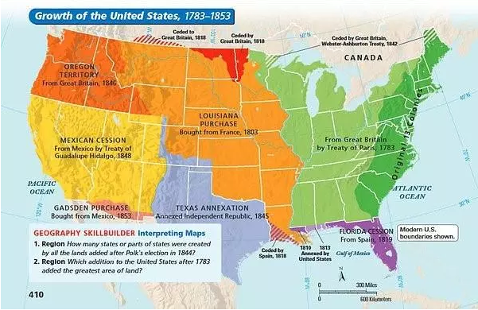

# 商品化和强国之路 \#1840

原创： yevon\_ou [水库论坛](/) 2018-06-14

商品化和强国之路 ~\#1840~

 

我实在太累了，下面休息几天。

 

 

一）       商品化

 

在美利坚合众国的《宪法》中，宪法赋予"联邦政府"的唯一合法权力，是"协调各州之间的贸易"

这个功能是如此之重要，以至于美国的"国父"们，为此不惜搞出了一个联邦政府。

 

当然，在1783年之际，谁也不曾想到"联邦政府"居然会占据GDP的20%，拥有全世界最庞大的官僚机构，以及全世界权力最大的人---美国总统。

不管怎么说，至少有一点是清晰无比的。"州际"贸易，无比重要，远远比总统宰相更重要。

 

 

1851年，金田起义爆发。短短半年时间，太平军打下南京，席卷东南半壁江山。

咸丰帝主要的收入来源，来自于江南的财富。天京陷落后，皇城连锅都揭不开。更谈不上调动百万大军围剿。

 

窘迫之下，咸丰帝只能下了一条命令。允许各地"团练"，自行募兵抗击长毛。而为了给"团练"们融资，巡抚总督获得了一项特权，可以征收"厘金"。

 

所谓"厘金"，指的是省际贸易。湖南的货物，卖给安徽。

而当货物离开边界时，可以征收一笔"关税"。金额通常是1\~2%

 

就靠着这笔厘金，养活了湘军，淮军。湘军八营十万大军，靠湖南的农税，肯定是撑不起的。

没有关税和商税，就没有曾胡李左。

 

 

听起来是不是很美妙的一个主意。可是1949新中国成立了以后，第一件事情，就是全国取消"厘金"。

哦，说错了。应该是全国取消"收费站"。

 

从广州运一车货去到北京，那是一分钱也不用收的。

唯一的"关税"，仅存在于国际贸易。而国内贸易的一切货物流动，分文不收。

 

 

"厘金"是一笔巨大的利益。甚至可以养活十万湘军，地方武装。

不收厘金，全国范围，货物无障碍流通。是不是少赚了许多钱。

不是的。

因为在中央政府眼里，他算的是另外一笔大账："全国统一市场"。

 

dT\>0

 

 

二）       地方保护主义

 

最早的时候，我们的商业，称为"地方保护主义"。

鄂货，皖货，晋货，每一个地方，画地为牢

自己的品牌，百般呵护。外地的品牌，则设置重重关卡。最严重之时，甚至地级市，县，镇，都有自己的"地方保护主义"。外来商品，万难进入。

 

这样的秩序，是不是好事呢。不是。

人们渐渐地发现，生产力是一个"平方"关系。贸易连线，是一个"平方关系"。

 

-   1+1+1+1=4

-   4\*4=16

 

如表。四个1万人的市场，绝对比不过一个4W人的市场。

因为随着市场越来越大，它会产生"规模效应"。使得价格急剧下降。

而且"统一市场"后，意味着每个城市，都能享受到最先进No.1的服务。

邓丽君出了碟片，就可以全国播放，而不用听乡村歌手。

 

微信出台以后，可以用一个软件，覆盖全国9亿人口。

而不是每一个省，都设计一个IM软件。大家彼此之间还不能沟通。今天欧盟有十几种平台。

 

 

"统一市场"的好处，是如此之大。

以至于人类不满足于"国内"的无关卡贸易。还要把"自由贸易区"的概念，扩展到国际。

 

WTO，TPP，欧盟欧共体，这些都是"国际贸易"的典范。

欧盟十二国，拆除了国与国之间贸易的障碍。连"关税"都不收了 。

人类如果是共同体的话，不收关税更有利。

 

这些都是老生常谈了。好了，我们再谈下去。

 

 

 

三）       贫富

 

"自由贸易"会不会导致贫富分化，会不会让穷人，过上非常悲惨的日子。

答案是：不会

正好相反，自由贸易，是对穷人最有利的制度。

 

 

dT\>0，在真正的经济学上，如果有一个"大资本家"想要购买你的农田土地。

你卖不卖，生活会不会变得更悲惨。

 

真正的经济学家会问你：如果农田对你来说，如此重要。

那他用什么东西，拿来交换呢。

 

我们是商人，不是土匪。

商人的意思是，等价交换。而且更是"有益"交换，有得赚才换。

 

 

你如果"放眼看世界"，稍微接触一点美国的历史。

你会发现，中国教科书炒得火热的"土地兼并"，在美国历史上，根本就是一个笑话。狗屁。SB。

 

美国从来都是"不抑兼并"。什么防土地兼并，黄宗羲周期，统统TMD都是伪科学，不存在的。

西方经济学，根本没有任何课程，认为土地兼并错误。历史上的实践，也证实不需要注视土地兼并。

恰恰因为"不抑兼并"，美国才成为了全世界最强大的国家。

 

 

因为对于美国人来说，逻辑是非常清晰的。

万物皆有价。土地不过是一种寻常商品，为什么不能买卖呢。

如果你想卖了农地，你拿了钱去干嘛呢。

 

美国从19世纪开始工业化。"卖了农田"的人，绝大多数是要涌入城市。成为了一名工人，又或者做个小企业作坊主。

"买下农田"的人，则成为更大的地主。

 

 

从美国的现状看，没有任何理由，认为"工人"过得比"农民"差。

事实是，城市居民的收入，远远超过农场主。而人类的财富与幸福，也全部都集中在城市。

 

20万年前，人类把全部的香蕉，留给了非洲的兼并猩猩。

 

那些最大的地主，哪怕囤积了几百公顷。

难道农场主，便是美国的大亨或者富豪了么。

 

 

"全国统一市场"的结果，原本遍布各村各镇的啤酒厂，小磨坊。

当"工业化"大生产涌入时，小城镇的产品，根本没有竞争力，纷纷破产。

乡镇企业，无以为继。

 

但是地是死的，人是活的。

随着"乡镇企业"纷纷破产同时，伴随着是剧烈的"城市化"。

数千万人口，涌入到城市居住，并最终把"城镇化率"维系在95%的水准。

 

这些涌入城市的人口，成了"产业工人"。成了白领，会计师，码农，电信工程师，售后客服，VC投资者，网络文学作家......

 

大公司摧毁乡镇企业的同时，大企业本身，又提供了数以百万计的岗位。

城市触发了更多的"新兴行业"。

烘培店，网红店，甚至比以前更缺人手。

 

 

"全国性统一市场"的形成，使得原本平坦化，村落密布的国家图景。

变成了少数十几个"核心大城市"。以及城市周围，广袤的农场主，工矿基地。见《[大城市的生生死死](https://mp.weixin.qq.com/s?__biz=MzAxNTMxMTc0MA==&mid=2651016294&idx=1&sn=88ce816361e870250a585bef0346436b&chksm=80721a75b70593636c44f51b4006ae267274fa2406bc7dde49eed6a84be7634f3fe19ff01d59&scene=21#wechat_redirect)》

 

贫困并没有发生。

财富和生活品质，比农业时代，有千百倍提升。

 

写到这里，你依然懒洋洋地说，"老生常谈，这些事我都知道"。

 

 

 

四）       商品房

 

好了，我们继续。1995年时，有一个伟人。当时的市场上，有：

 

在房改之前，市场上有廉租房，经租房，保障房，经济适用房，政策性住房，共有产权房，限价房，可售公房，使用权房，非成套住宅.........

在房改之后，市场上只剩一种房产：商品房。

 

 

很多人或许不明白，"房改"包括二个层面。

-   一个是"取消补贴"。

-   一个是"商品化"。

 

当时市场上，存在着十几种"不同属性"的房屋产权。

你何必，何苦，费力，非要把十几种属性，统统"格式化"成商品房。

 

房子还是那个房子。并没有多一寸面积。

如此吃力不讨好的事情。大费周章，"苦口婆心"有什么意义。

小规模流通不好么。

 

 

经过我们的层层铺垫，你应该就可以看懂了。

廉租房，经租房，保障房，经济适用房，政策性住房，共有产权房，限价房，可售公房，使用权房，非成套住宅......这些就好比"北美十三州"。

可是离一个统一的"USA"还是有巨大距离的。

 

如果使用权房，只能在使用权房系统内交易。

如果北京人的房子，只能卖给北京人。河北人的房子，只能卖给河北人。

经济适用房，只能满五年之后交易。类似于"不得离开产地50KM"，那么统一化的"大市场"，还能形成么。

 

为商品加上重重限制，规定产地，销售半径，准入门槛。

这和"地方保护主义"还有什么区别。

河北的优质人才，难道便不可以在北京创业扎根了么。

 

 

在伟人的心目中，他是看得极其清楚的。

他不惜大费周章，打破牢笼。把十几种"不同产权"的欧盟商品，统一格式化，扔到一个"单一市场"中去。

民不加赋而国用足。物资虽然没有增加，通过"市场化"改革。可以让所有人获得更多，更好的选择。

 

站在20年后的今天，我们回过头来看，不禁会赞叹感慨。

商品房，实在是一件再伟大不过的创举。

这是何等的胸襟气度。

 

 

\* 衔接上篇《[世上再无商品房](https://mp.weixin.qq.com/s?__biz=MzAxNTMxMTc0MA==&mid=2651018036&idx=1&sn=b5df4e98534c606bf026ef3dc973cd00&chksm=80720527b7058c31ba27de8f8f9a2120319a74b345aea758a800739e5479de07f9331762c7b4&scene=21#wechat_redirect)》

 

 

（yevon\_ou\@163.com，2018年6月13日晚）
