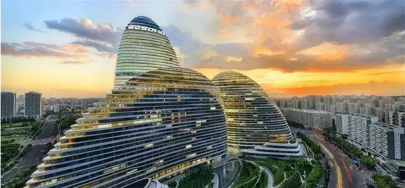
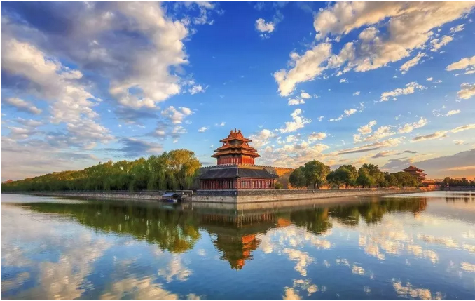
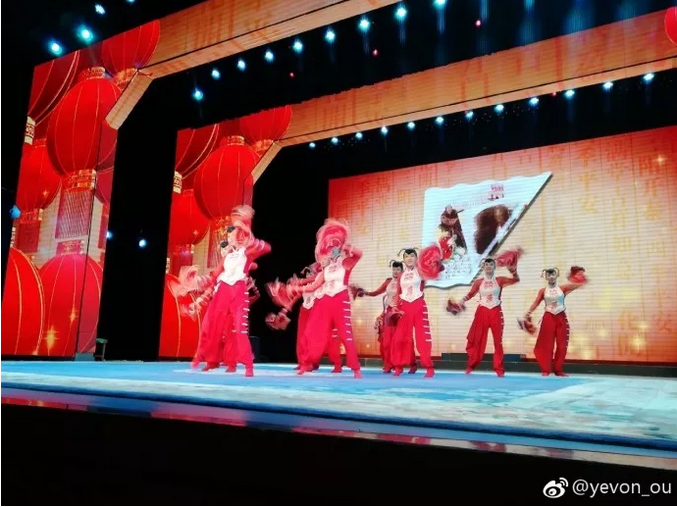

# 一个月睡醒来 \#1860

原创： yevon1ou [水库论坛](/) 2018-07-19

一个月睡醒来 ~\#1860~

 

越过树木，森林没变

 

一）       浮云

 

林允演过一部大烂片，叫《当王子睡醒来》。俺现在的感觉，也象是被人钉进棺材板里，终于放出来了。

 

6.18\~7.18水库因为一篇渣广告，莫名其妙被禁言一个月。在这一个月内，读者固然少了很多yevon\_ou文章可以看。俺也少了很多收入。

 

几个徒弟持续更新。如果你想看这一个月内遗漏文章的话，可以关注备份号。

因排版+外链等原因，知识星球的内容更全一点。

  ---------- ------------------
  官方镜像   永久免费知识星球
  ---------- ------------------

 

自从做了自媒体，我有近三年没有休过假了。

这次被强制 "放假"一个月。走南闯北，正好去看看名山大川，浮云苍狗。

 

一个月的时间，足以发生很多事。

因此当助理ZM找到我的时候，他的手都是发抖的。

"老板老板，你看，发生了那么多的新闻，该怎么办啊"。

 

 

在过去一个月内，至少有：

-   A股股崩

-   p2p爆雷

-   毛衣占

-   棚改取消

-   七部委会议

-   个税改革

-   长沙调控

-   药神，动物世界，邪不压正，阿修罗，影评无数。

-   法国夺冠世界杯

 

 

我指着筒子河边的白云对他说，"你看，天空蓝不蓝"。他点点头。

我再拿了二串羊肉串，一盒臭豆腐。味道好不好，他又点点头。

 

你有没有觉得，生命中被抽走一个月。楼市一切都没有发生过。宛如昨天。

噗地一声，zm吓得把腰子扔了。

 

 

二）       浮云苍狗

 

有些事重要么，如果你陷在其中，是很重要。

有些事不重要么，如果你跳开去，一点都不重要。

 

 

我们的财经，每天都给我们推送Breaking
News，无非是特朗普又被弹劾了，大豆船赶时间扑港口。

 

当你是当事人，一惊一乍。每一天都觉得要地震了地陷了。

-   房地产登记联网，就是开征房产税前兆

-   股市，外贸，p2p连环炸雷。

-   "棚改叫停"房地产要崩盘了。

 

 

可是有时候你得"跳"出去，你看不是7天前的新闻，而是30天前的新闻，甚至更早。

然后你去北京的皇城根下，喝上一碗豆汁。

你突然发现，太阳照常升起，一切都没有改变。

 

当天下午觉得手发抖的新闻，一个星期之后居然完全没有人讨论。

 

太阳改变了么，一个月之前，北京的房价100000+，

一个月之后，北京的房价还是100000+

 

一个月之前，北京市场既没有恐慌，也没有抢购。

一个月之后，北京市场既没有恐慌，也没有抢购。

 

有的时候，你会产生一种幻觉。以为皇城根千年不变。

这一个月就这样平空蒸发了。你从地堡中醒来，毫无障碍，把日历改一下就可以继续生活。

 

棚改货币化安置的意思，是给你现金。否则就是给房子。

给你现金，让你去市场上买。这是"去库存"。

给你房子，一般经济适用房都是额外建造的。这是"增库存"。

 

棚改货币化叫停之后，相当于流入房地产市场的Cash减少了，对房价不利。

也反映高层认为"去库存"已略告段落了。

 

以"棚改安置化"议题为例。水库封号这一个月内，网上讨论几乎传疯掉了。

诸大V众口一词："利空"，房价要崩盘。

 

利空没有问题。我只想问一句话。大约二三年前，"货币安置化"刚刚起来的时候，

怎么没有大V上串下跳，以同等的力度大力吆喝，"利多"，房价要暴涨！

 

 

不变的预测，才是真正的预测。自洽的逻辑，才是理性的逻辑。

你当年不说它"特大利好"，今天急不可待跳出来说它"重大利空"。

 

中国每年的房地产销售，超过13万亿元。

棚改十年1万亿，又多在三四线小城。哪掀得起什么风浪了。

 

夸夸其谈的背后，因为你的粉丝都是"傻空"群体。

他们并不需要理性的分析，他们只喜欢唱跌的论调，只喜欢情感发泄，便如同喝醉酒一般。

 

 

同样道理，股市，p2p，还有其他一些资产市场，虽然产生了波动。

可是放到历史的长河之中，A股3500到2700的跌幅，

真心P也不是。

都排不进前10.

 

你要说海南限购，长沙限购，严查茶水费的事。那我送你一碗豆汁。

你喝完豆汁，递给对面铺的老大爷。

他满脸笑容，"承惠，连您同伴，一共6元"。

 

"礼失求诸野"你如果放下心去，看看千千万万市民。

太平盛世啊！每个人都幸福快乐，什刹海遍地都是抖音音乐。 

答案杨坤;郭采洁 - 今夜二十岁
 

"可是，可是，老板你平时也写很多篇啊"。

"五月也没大事，四月也没大事。你看你也洋洋洒洒，坚持周更，上串下跳可勤呢"。

 

俺大怒，你说我这么热心工作，是为了什么 

  A.对自媒体事业的热爱   B.对房地产的热爱
  ---------------------- ----------------------
  C.对腾讯的热爱         D.对祖国和人民的热爱

zm毫不犹豫地竖起了一根中指：E.那当然是对广告爷爷，"对金主的热爱"。

 

Bingo，全中。

日更的文章，绝大多数是垃圾。揾食罢了。

 

 

 

三）       快速彩票

 

北京的天真蓝，云真白。

我有时候在想，不同的文体，真的对应不同的受众。你看他想问题的方法，就知道他的档次了。

 

凡是"速胜论""阴谋论"，做人做事以日为计算，恨不得出一个政策就掀桌子Reboot的，这种人有一个统称：

穷人

 

 

穷人是"反转理论"的坚实受众。

穷人最喜欢，一个延绵十几年的大行情，到你手里，突然就"反转"了。

你抛，就要抛在万年珠峰位。

你买，就要买在马里亚纳海沟位。

 

人家霸道总裁的父母，辛辛苦苦鱼翅养了二十几年。

一下被你拗歪了口味，喜欢杂酱面小妹了。

 

 

房地产从3000元，涨到100000/m，用了十八年。

对于房地产的分析，一直有二个流派。

一派是速胜论，就盼什么政策，最快不用这个月底，房价腰斩膝盖斩。

一派是"永恒论"。无论出任何政策，中医药慢慢调理，药效总是缓慢的。

 

无论涨跌，穷人总是坚定地站在"速胜派"的。好像延续十八年的行情，到了这个月就会"急闪"，而且是断崖式闪退。

 

 

而富人，一般都是"永恒派"。我真心地觉得，哪怕时光机抽掉一个月，也是无所谓的。

哪怕你把八月、九月再抽掉，未来二个月，我不需要知道任何新闻，无论你出什么政策。历史，依然会按照原有的轨道走下去。

世界潮流，浩浩荡荡，川流不息，无可阻挡。

 

 

众人都知道，巴菲特的办公室里，没有终端机。股神老爷爷，不看K线图。

他甚至可能有好几个月，都不知道股价走势。所谓华尔街的Breaking
News，对他更是毫不絮怀。

 

高手投资，更类似于一种"配置"的概念。更象是围棋，圈地占势。谋而定算。

而不像乒乓球，精神高度紧张。数板之间决定胜负。输了就再来一把。

 

 

 

四）       冬眠

 

讲了这么久，讲一点干货吧。

如果我真的"冬眠"了，被钉到德古拉棺材里。几年都不能苏醒。

又或者哪一天水库真的"失联"了。读者们再也找不到分析和指引。

（失联是不可能失联的，请多关注镜像小号）

 

落子无悔，做哪些事，可以使得我在未来的岁月里，既不能修正，也不能干预，但依然可以取得不错的回报？

 

在我看来，有一些力量如同山岳般，亘古恒久。不受短期或者长期政策调控。 

+-----------------------------------+-----------------------------------+
| 现象                              | 寓意                              |
+===================================+===================================+
| 1）中国国力持续上升，有可能进入一个为期50年的全盛期。 | 选择中国，而非外国 |
|                                   |                                   |
|                                   |                                   |
| 欧美国家，深陷白左民珠泥潭        |                                   |
+-----------------------------------+-----------------------------------+
| 2）纸币时代，赤字通胀永恒         | 持有资产，累积债务                |
+-----------------------------------+-----------------------------------+
| 3）生产力利于大城市化             | 聚焦1000W以上人口城市             |
+-----------------------------------+-----------------------------------+
| 4）目前调控，侧重于增加交易成本，而非增加供应 | 大盘不会崩溃          |
+-----------------------------------+-----------------------------------+
| 5）管家公司深化                   | 工具得心应手                      |
+-----------------------------------+-----------------------------------+
| 6）产业老化                       | 政府管制，抽水越来越重            |
+-----------------------------------+-----------------------------------+
| 7）年轻人掀桌子                   | 保持研究，预埋伏下一个路口        |
+-----------------------------------+-----------------------------------+

 

有一句谚语说，一个人的境遇和际遇，绝大部分是由他三年前的"举动"所决定的。

昔日有什么因，今日就有什么果。

 

对于房地产市场，原理也是一样。16N以后很类似于"围棋"，讲究的是圈子，占地。

你今日种下的小树，栽上几颗幼苗，要等时间岁月，浮云苍狗，才能成长成参天大树。

我们一般的期望值是三年。在部分极端情况下，一年多也可以见到效果了。贪心是一种罪。

 

但是，正正经经，符合自然规律的，至少也需要一年。

不可以再少了，再少都是投机。都不可能是价值投资。

 

 

当我栽下小树，不管他蓝天白云，晴空万里，还是暴风雨。

一个月岁月可以抽走。我不需要日惊夜惊。

（照片摄于沈阳刘老根，活动可关注小号：[[\#G20]](http://mp.weixin.qq.com/s?__biz=MzI2MzAyMjAxMQ==&mid=2462106657&idx=1&sn=b67aa29296285c7b100bb6bbc4a97b6e&chksm=fd7650f5ca01d9e3b8aca34eb9e1bdb9b81413afec719348f1b8a8b1fa254190433817a59b04&scene=21#wechat_redirect)）

 

 

（yevon\_ou\@163.com，2018年7月17日晚）
