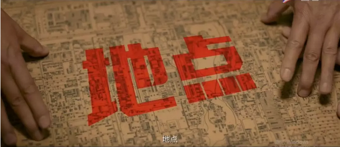
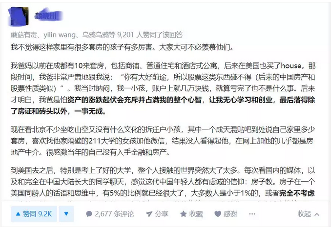
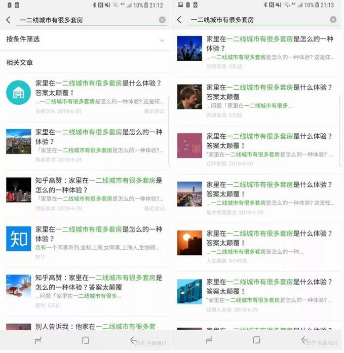

# 家里在一二线城市有很多套房是怎么的一种体验？ \#1870

原创： yevon\_ou [水库论坛](/) 2018-07-20

家里在一二线城市有很多套房是怎么的一种体验？ ~\#1870~
================================================================================================================================================

 

这个标题不是我起的。是知乎一篇大热的帖子。

足足有520 9832次阅读。

www.zhihu.com/question/32315601/answer/419896928

 

  ----------------------------------------------------------------------------------------------------------------------------------------------------------------------------------------------------------------------------------------------------------------------------- --
  上一篇[\#1860](http://mp.weixin.qq.com/s?__biz=MzAxNTMxMTc0MA==&mid=2651018242&idx=1&sn=9851c697b84754ab33bb19882935c498&chksm=80720211b7058b07d59de31c82be29547c9e29b47c8dec1aba11cddcf607dc1ef034132e7d4a&scene=21#wechat_redirect)中，水库永久免费知识星球二维码放错了。   
  ----------------------------------------------------------------------------------------------------------------------------------------------------------------------------------------------------------------------------------------------------------------------------- --

 

 

一）       制谣

 

在《邪不压正》中，姜文说，办成一个计划，关键是"时间，地点，人物"。

有时候我在想，如果你想撒一个"弥天大谎"。你需要怎样的"时间，地点，人物"事情。

 

首先，我们定义一下，什么叫做"弥天大谎"。

弥天大谎的意思，当然不是100000+，

那怎么说，也得上百万阅读了吧。最好是三百万阅读，哦，五百万次阅读。

 从Marketing"市场营销"的角度，如果一件产品，你想卖50万份，500万份，5000万份，那么它的逻辑，是很大不同的。

 

-   卖50万份，你可以只在精英群体中卖。深邃而精致。

-   卖500万份，你必须深入到"屌丝白领"阶层。说他们喜欢的热点话题。

-   卖5000万份，你就一定要迎合农民。

 

中国其实从2010年开始，就没什么好电影了。因为那一年，中国市场，发生了一件大事：全国电影票房市场超过100亿元人民币。

 

叫好叫座的电影，开始冲击10亿票房。

以20元一张票估算，差不多就需要5000万观众人次。

 

如果你为都市上层的500W人口精英拍部电影，你可以拍《肖申克的救赎》。

但如果你想卖5000万张票，那么流行的，就一定是《港囧》《泰囧》。

当一个导演开始追求票房，他就会失去初心。

 

 

同样道理，在房地产市场，我认为俺再怎么写，也刷不出5000000+的阅读。因为我写的是"房价要涨"。

"商人降低房价"。

"背负30年的房贷去买房"。

这些都是反人性的。反人性的东西，别人耐着性子看完，已经很给面子了。

 

而你要刷出500 0000+阅读，你就一定要"唱跌"。

反正屌丝都是没房的。房价大跌，工资飞涨，富家女爱上穷小子，才更符合穷人口味。

 

 

 

二）       屌丝

 

"制造500W级阅读谣言"计划的第一步，是确定了目标受众："无房屌丝"。得屌丝者得天下。

计划的第二步，是"卖怎样的产品"。屌丝喜欢怎样的心灵鸡汤。

 

 

什么样的人可以看空房地产：首先，你要有房子。

-   只有清华学子，才可以看不起清华北大。

-   只有学霸，才可以蔑视学历无用论。

-   罗玉凤不可以说范冰冰美貌无用。

-   没房子的人，没资格鼓吹"房子无用，诗和远方"。

 

因此如果你想喂一篇500W+阅读的文章，你首先要表示的是：我有很多套房子。

-   我有很多房子，可我还偏偏不稀罕。

-   我有很多房子，可爷还看不起房地产。

-   房子这玩意太Low，欧美的高等人种，都在追求诗和远方。

 

我们看回原文。原帖在：

www.zhihu.com/question/32315601/answer/419896928 

原文作者大约写了5000字。其中真正涉及他背景资料的，就只有第一段："我爸妈以前在成都有10来套房，包括商铺、普通住宅和酒店式公寓，后来在美国也买了house"。

 

这段文字，一共只有39个字。

但是就仅仅这39个字，构成了他整篇文章的[立论基础]。包括后面的指点江山，损褒贬铭，9.2K个点赞。

下面一堆的人叩拜，"大神，富人。膜拜，真房豪......"

 

但你真的看下去，这段文字是很有问题的。逻辑很糟的。作者的真实身份，可能并不是一线城市十几套房子，追求"精神生活"富二代。

反而是纽约桥洞下，吃盒饭，买将过期食品的生物男。

 

 

因为，他介绍的方法不对。

一般正常人，介绍自己有十几套房子。总是说："一套我妈住，一套我姥姥住，一套我妈和我姥姥一起住"。

"还有二套家里的老房子，当年分配下的。樱色的爬山藤，已经涨了十几年，回忆起童年生活，可美呢"。 

人对于自己的物业，总是有感情的。如果你家富贵很早，N套物业伴随你从小一起长大，那定然如数家珍。说得出很多情感故事。

如果这些房子，都是近年买的。则你参与了"家族资产"的构建过程，每一套房产证的获取，皆堪称斑斑血泪。

 

水库的朋友都知道，斗房东，跪银行，撕中介，一惊三乍。尤其限购的环境中，更是肝肠寸断，说线做泪。每一N的建设，简直就是一本惊险小说。

 

 

但是这些东西，在这位跳大神的嘴里，全部都没有。他嘴巴轻飘飘"有一些商铺，住宅，酒店式公寓，加起来十几套"。

如果真有，你怎么会印象如此浅薄呢。

按照我们的估算，贴主的实力，恐怕也就仅仅是"有"。数量最多不超过3+2+1套。嘴皮一翻，轻松吹牛数目翻翻。

 

然后你再想想，他的Base是在成都。

别人讨论"一二线城市十几套房"，您成都CHENGDUER凑什么热闹呢。瓜娃子不知道天多高，地多厚。

你成都3套住宅，2套商铺，1套酒店式公寓加起来，可能都没有北京1套三房贵。

 

而且你还要把这些物业抛掉，才能力换回美国一套House。

美国的House，以最贵的加州和新泽西为例，也不过80W美金一套。

假设你卖一半身家，你的净资产都不会超过A8.1

就你那小丑样，"一二线十几套什么体验"，您也敢出来教训人。真是恬不知丑。

 

 

你如果往下细翻，该贴主还有很多不入流之处。例如：

-   股票账户3万元，父亲特意指导如何操作。

-   想找个211的女朋友。

这些都是中底层社会生态的象征。

 

 

更糟糕的是，这个帖子发出来以后，在知乎上刷出了520W阅读，成为了当季热帖。

此后，被微信公众号不断转发。累计转发了437个公众号。

 

作者感到十分愤怒，因此他贴了72张图片，花了几十页屏幕，把这些"侵权转载"的账号，全部都贴在了下面。 

这种贱到爆的"二商"（智商，情商），如果你还看不出他是一个底层LOSER二本狗，眼光真是差到衰了。

 

好了，现在问题来了，为什么会有437家机构，转载这个帖子，并在互联网上，形成一浪又一浪热潮？

连哥哥的朋友圈，都被刷屏了。

 

 

 

三）       抉择

 

有人问，如果你可以穿越回1888年，最想做什么。

答案是找到阿道夫·希特勒他爸爸，塞给他一个套子。

 

但其实，如果你稍微有历史正史经验，你就会知道，以上纯属胡说。小儿呓语。

是第三帝国选择了希特勒。

而不是希特勒缔造了第三帝国。

抖音上冒出来一个温婉小姐姐，一夜斩获了1200W粉丝。成为超级大V，创造人类所有社交媒体奇迹。

后来抖音把"温婉"给封了。但马上又冒出了一个"嘟嘟姐"，一夜之间又是500W粉丝。

平台又把"嘟嘟姐"给封了。

  

你以为这事就天下太平了么。全错。

告诉你，用不了多久，马上又会再冒出来"xx姐"，又再是几百万公粉影响力。

 

决定气候的，是这片土壤。

而不是网红。

 

 

在《一二线城市有很多套房是怎么的一种体验？》这个事件中，为什么会有437家媒体普遍转发。

难道你以为各家媒体的编辑，小编，全部都是文盲。

这么明显的骗局，这么明显的穷鬼，这么明显的LOSER瞎编捏故事。小编会看不出来？

 

你错了。如果你从文学思考问题，就流于肤浅了。

没看到问题的实质。

人们只会转，人们想要表达的意见。

和是否事实真相无关。

 

人们只会转，那些他们想要转的帖子。人民只会转"喜闻乐见"的帖子。

借别人的口，表达自己的意思。

 

不是作者写出了答案。

而是人民找到了作者。

 

有一个说法，自从文宣禁掉了韩式韩风韩流小鲜肉天团。

吴亦凡就开始爆红。

 

 

 

四）       结语

 

有些人只看见了树木，却没有看见森林。

有些人只看见了以日计算的起起伏伏，却没有看见以月计算的浮云苍狗。

 

如果有人写出了一篇爆款，抖音刹那几百万粉丝。

你要不要去签下他。

不一定。有可能爆红的，并不是"才华"，而是"题材"。

 

因为群众喜欢这一类题材，喜欢这个话题，喜欢往这方面演绎，喜欢这样的解释看跌。

所以易宪容可以成为网红。所以谢国忠的文章，没有打开，就先点赞。

（写得象狗屎）

 

而人民又是永远不可能被打倒的。这才是"无可匹敌的力量"。

相关议题，在《[即将到来的中产阶级社会
\#F1390](https://mp.weixin.qq.com/s?__biz=MzAxNTMxMTc0MA==&mid=2651016523&idx=1&sn=c26df495ad9b236519d969ba9496e07c&chksm=80721b58b705924e76f3a216b9fb90d713650175e8bdec54e6d8a54083aece3df0d44c11fd2e&scene=21#wechat_redirect)》一文已经写过。今日不过旧事重提。  

我们写这么多，其实想表达的是：

"真的不要再封自媒体号了。

真正会爆红，会形成焦点型传播的文章。

不是作者写的，而是读者选的"。

 

 

 

（yevon\_ou\@163.com，2018年7月19日子）
