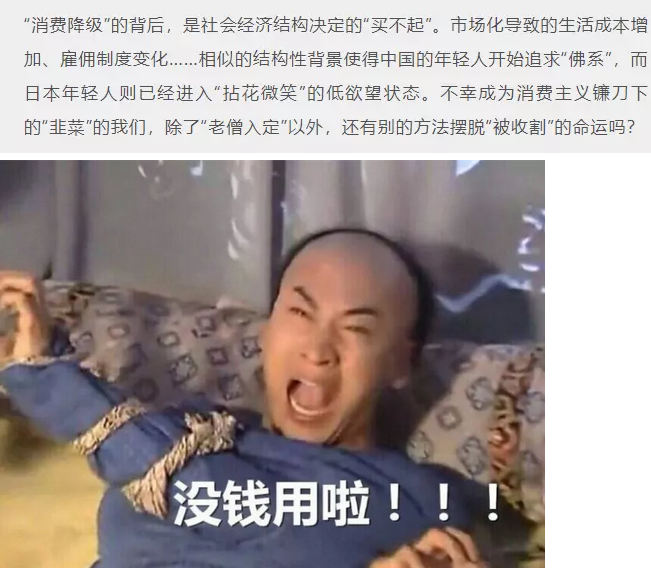
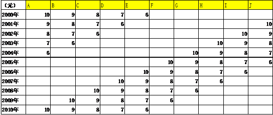
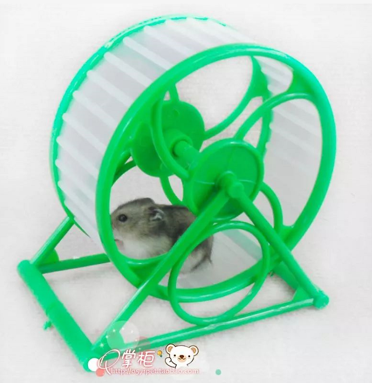

# 买房子是消费降级么 \#1880

原创： yevon\_ou [水库论坛](/) 2018-07-24

买房子是消费降级么 ~\#1880~

玩不过商家

 

 

一）       消费降级

 

在水库封号的一个月里，一个所谓的"消费降级"概念，红遍大江南北。

 

《[[还没来得及消费升级，中国青年就已经开始降级了]](https://mp.weixin.qq.com/s?__biz=MjM5MjMwODcxNg==&mid=2650107667&idx=1&sn=2f143e941846db1055ecb54646fbc02c&scene=21#wechat_redirect)》

 

据说中国"白领"的人生，惨不忍睹。

买衣服只能买Uniqlo.

吃午餐只能呷哺呷哺。

三亿人民拼多多，拼多多。

 

老百姓已经勒紧裤腰带啦

你说是不是，翠花

 

哥哥一边看，一边冷笑。

心痒难熬，小脚丫子乱颤。

此中老道，正是marketing的操刀。话痨憋了整整一个月，终于有机会让我说出来。

 

正品不买，全国人民一起拼多多，是消费降级么？

 

 

 

二）       消费降级

 

媒体所谈论的"消费降级"，其实是消费升级 \-\-\-\-\-- yevon\_ou

 

Porsche最近出了乞丐版Macan，最最便宜的裸配，提车价还不到60W。

这无疑让很多躺在车盖上抱怨冷气的女孩子，感到了一定的失望。

 

请问，从Porsche到Macan，是"消费降级"了么。答案绝不是。

100%的商家，削尖了脑袋搞"粉丝升级"，他怎么舍得让你少掏钱。

 

VW集团肯定经过了精心的研究。在Macan的购买者群体中，原Porsche业主一定少之又少。

若替代率超过了25%，整个项目就可以说失败。

 

那么Macan的目标客户是谁呢。是原先的BBA车主。

在中国，BBA的主流车型，大约是40W元RMB。

现在您只要再加20W，宝马就可以换成保时捷！

请问您动心么，请问您眼晕么。

 

Macan哪怕是打折品，哪怕是乞丐版。

可是他抢的是BBA的客户。请问这是消费降级，还是升级。

 

你不要看一件商品的价格。

还要看他的销售数量，销售数量更重要。

 

 

优衣库日本，一年可以卖出10亿件，许多人哀叹，一亿人民10亿优衣。简直成了国民服装，泯灭性格。

 

日本人狂买优衣库，是降低了"个性张扬"么。不见得啊。日本依然是LVMH最大的奢侈品市场。日本女孩子买起包包，眼睛不眨。

 

事情的真相，你要去问日本的年轻人，"优衣库是你最好的一件衣服，还是最差的一件衣服"。

如果他们回答"最好的衣服"，则说明他们以前是农民，或者是肥前山中小村庄里出来的。

 

 

任何一项产品，譬如知乎，刚出现时，一定是大咖云集。水平也是很高的。

但随着他的客户群，从50W人，到500W人，再到5000W人口。

客户"平均素质"降低不可避免。

 

看上去人群和产品的劣质化，不代表"消费降级"。

有可能是泥腿子上岸，以前山区里混得更惨。

 

 

以三亿人口的"拼多多"为例。难道这些人，以前是国贸、陆家嘴的精英人群么。

拼多多绝大多数用户，集中在四五线城市。

"拼多多"出现之前，他们对这么洋气小资的产品，甚至从未接触过。

 

 

 

三）       消费平级

 

消费者以为的"消费升级"，其实是消费平级。

 

如果我们只看第二节，那也无非老生常谈。朱红之泪写《[从不存在的消费降级\#S390](https://mp.weixin.qq.com/s?__biz=MzU1MTAxODc4OA==&mid=2247485138&idx=1&sn=80bf71522d29c74f776b577d9bbf6bc8&scene=21#wechat_redirect)》《[零储蓄时代\#S380](https://mp.weixin.qq.com/s?__biz=MzU1MTAxODc4OA==&mid=2247485116&idx=1&sn=db61379f83958ded95be870a3f00e9f2&scene=21#wechat_redirect)》珠玉在前。

 

但我要告诉你，骗术是套中带套，坑外带坑。

想得更深一层，才是marketing玩法。

 

 

在朱红的文章里，他举了一个"奶茶类"的例子。从最早的街边3元奶茶，到8元的快乐柠檬，再到15元的Coco，再到30元的喜茶贡茶。

白领小资女，持之以恒地提升着她们的生活品质。努力让自己拥有更优质的生活，模仿上流社会的消费痕迹。 

请问，你从Coco，到"四云奶盖贡茶"，再到Lady M，你的消费升级了么。

正确答案是：没有

 

 

"水库论坛"有一些早期文章。部分因为太早期了，甚至没多少阅读。

2005年，为了引入marketing概念，我们最早时写了四篇：

 

-   [市场营销入门 \#210](http://mp.weixin.qq.com/s?__biz=MzAxNTMxMTc0MA==&mid=208571927&idx=1&sn=532a563f3c6b835bd9b949d8b41d0a5d&scene=21#wechat_redirect)

-   [Re-Sale为什么这么难
    > \#220](http://mp.weixin.qq.com/s?__biz=MzAxNTMxMTc0MA==&mid=208796137&idx=1&sn=1d714898a771193cb19e4c8ed9abee13&scene=21#wechat_redirect)

-   [如何运营一家企业
    > \#230](http://mp.weixin.qq.com/s?__biz=MzAxNTMxMTc0MA==&mid=211491245&idx=1&sn=256db1fe70fd145ebcbe70b71748b9fb&scene=21#wechat_redirect)

-   [无中生有的高阶
    > \#240](http://mp.weixin.qq.com/s?__biz=MzAxNTMxMTc0MA==&mid=211504453&idx=1&sn=ae38f511e21d91b7936b16407b8e5240&scene=21#wechat_redirect)

 

在《[无中生有的高阶](https://mp.weixin.qq.com/s?__biz=MzAxNTMxMTc0MA==&mid=211504453&idx=1&sn=ae38f511e21d91b7936b16407b8e5240&scene=21#wechat_redirect)》\#240一文中，我们画了一张图。

 

假设我手里有ABCDEFGHIJ十种产品。

-   每年除夕，所有产品降价1元。

-   如果价格低于5元，则自动出清。停止销售。

-   再引入一个新产品J，定价10元。

 

我们看第一年2000，市场上在售的，是ABCDE五种产品。标价是10，9，8，7，6元。

 

第二年2001，所有商品降价1元，消费者觉得赚到了大便宜。市场上掀起了促销狂潮。

国家也挺满意，统计局无论从任何一个指标，CPI都是下降的。切实符合降低民负。

 

2001年，在售ABCD四件产品，售价9，8，7，6元。

再引入一件新产品J，定价10元。

J销售少没关系，先当标杆放着。

 

 

然后第三年，2002年，ABCD+J这五件商品，再同时降价1元。

D低于5元，退出销售。

新引入品种I，定价10元。

 

 

你看懂这个"循环滚轴"的奥秘了么。

A=B=C=D=E=F=G=H=I=J，这十个品牌，其实是完全相同的商品，完全没有差异的。

（只要广告堆上去，任何商品J，我都可以让它定价卖10元）

我永远都在降价，却在螺旋涨价。

 

品牌商把你玩弄在鼓掌之间。消费者觉得自己每次都占了便宜，物价每年下跌10%。

可是兜兜转转十几年，你还是在原地。你只不过笼子中的小白鼠。

回到"奶茶"这个行业。其实精明的Marketing，早就竖立一个标杆，一个贵得吓死人的品牌，例如Cova，例如Godiva，遥遥地等在那里。

 

他店铺并不多，也不在乎亏损。他只是要告诉你一个信息：

"这个品牌，就是卖50元一粒巧克力"。

您买不起，买不起不要紧啊，您可以Windows Shopping，站在门口流口水看看。

 

 

然后他等你收入一点点上来，等着你"消费升级"。

等你不满足E，想买D，想买C，想买B，想升级A。

 

升级这条路，类似于打"网游"，是永远没有尽头的。

哪怕你可以把Cova巧克力当饭吃了，品牌商一定会迅速地研究出一款Avoc巧克力。定价2000元/粒。

 

您买不起不要紧，您可以先在橱窗看着。

我可以慢慢地静等你收入上来。

 

 

什么，您说品质和口感。

你以为那些买喜茶，贡茶，Lady M的女士们，她们真的吃得出口感？

她们只是在负担得起范围内，买她们最贵的一款茶点罢了。

 

 

目前媒体所谈论的"消费升级"，目前小资白领女得意洋洋的"消费升级"，姐姐每天变更高贵一点。

其实是一场巨大的骗局。

 

事情的真相是，白领到手的工资，扣除杂七杂八的房租，衣食住行，教育医疗，已经不剩多少了。

白领根本没有能力，进行"消费升级"的大件购买。

 

 

她们每月留出工资的2%预算，作为奶茶的消费。

因为这钱太少，不足以撬动房子，再怎么也是"绝望性消费"。

 

因此这2%就不用省了。全部扔到奶茶上。

但为了显示小资的"细节高人一等"。买最贵，最高品牌的奢侈品。

其本质，和前台女背一个LV，没有什么不同。

都属于无法再升阶。

 

 

而这2%的预算，注定是要被品牌marketing剥削和没收掉的。

品牌经理，永远会设计一个"轻奢"，正好达到你购买力的上限。

你以为你光彩照人，其实不过笼子里受人摆弄的小白鼠。

 

 

 

四）       真正的消费升级

 

真正的消费升级是什么呢。真正的消费升级是：

-   可以触摸更高档次的一个大类。而不是同类打转。

-   获得切实的物资回报

-   自己掌握喜好

 

 

就好比有同事甲乙二个人。

甲：每天买最高档的奶茶。可是从来不奢求能攒出京沪首付

乙：不是很在意奶茶的品牌，但是可以攒出京沪首付

 

很显然，乙的收入，远远高于甲。

而且社会地位，也远远高于甲。房产证的炫耀，才是真炫耀。

 

 

对于真正的消费升级，它一定涉及到一些硬指标的变化。例如人均卡路里摄入，人均钢消耗量，人均电消耗量。

当你进入一个全新的大类。以前喝奶茶的，现在买摩托。

以前玩摩托的，现在买房子。

以前有房子的，现在买游艇。

那我们才叫这是"消费升级"。

 

 

如果你以前没房子的，现在买房子。顺便把奶茶和衬衫，换回最便宜的牌子。

那我们当然理直气壮地说："这是消费升级"。

 

 

（yevon\_ou\@163.com，2018年7月24日子）
