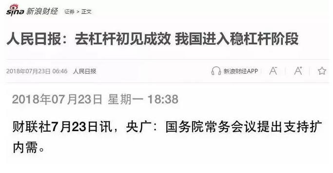
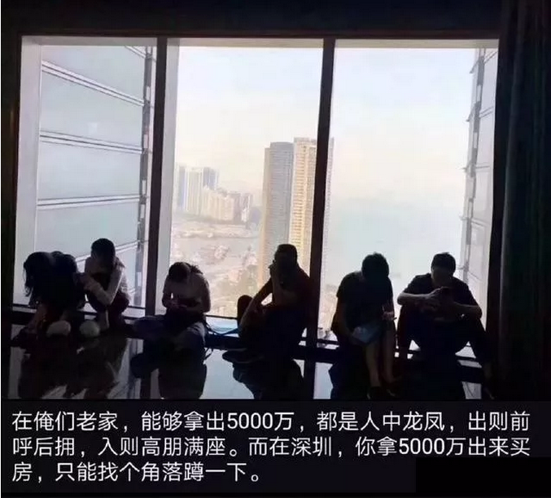
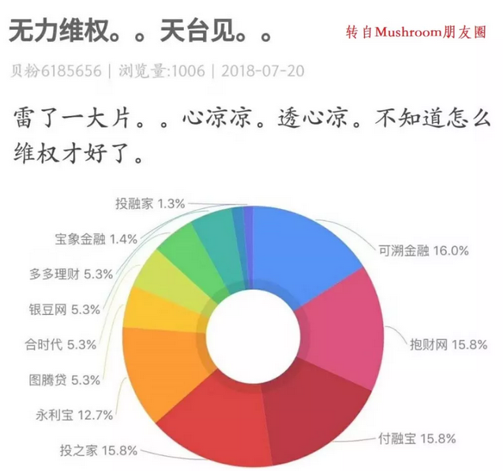
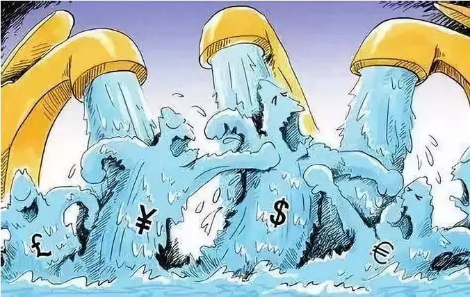
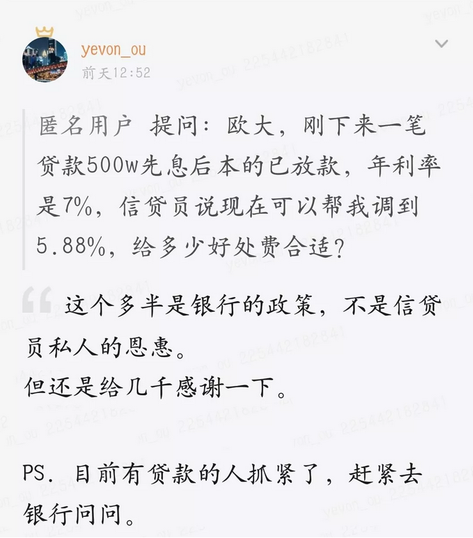

# 鹰鸽转换 \#1890

原创： yevon\_ou [水库论坛](/) 2018-07-26

鹰鸽转换 \#1890

RMRB和GWY

 

一）       什么是鹰派，什么是鸽派

 

鉴于众所周知的原因，本文将呈现跳跃式，破裂式，以及没头没尾式。

凡是看不懂的读者，请自行脑补缺失的环节。祥瑞御免。

 

在真正的经济学中，那些致使企业破产，全民下岗的政策，并非是坏事。

甚至可以说，那些戮力于制造"下岗潮"，拉下脸做恶人的，才是真正的大政治家。全心全意为人民服务的。

 

因为绝大部分人只知道"经济萧条"，不知道"经济过热"的危害。

 

好比你妈是卖地瓜的。农田0.1元/个，拿到了北京街头，变成烤红薯，就是5元/个。毛利五十倍。

你妈高兴坏了，回家就进了十万斤红薯，一千个烤炉。

 

你可被吓傻掉了，一整个集装箱的红薯，肯定得砸手里。

"母亲啊，这生意可不能做"。

 

但你母亲是一个固执的人。你要怎么劝她呢。你要在1000斤红薯的时候，就让她破产一次。

她吃过亏了，有了教训。就断然不会把错误犯到100000斤这么大，拖累了家里村里，不好收场。

 

 

近期有很多p2p雷潮，一个好的p2p应该具备怎样的特质呢。一个好的p2p，应该是平时"小雷"不断。

不断地有旗下理财计划无法兑付，但平台仅仅是撮合作用，概不背书。

如果你观察一个p2p，该p2p的信用"极度"良好。每年都可以提供10%的回报，而且从未坏账。

则这个p2p，多半是庞氏骗局了。因为他的风险始终无法释放，最终只能总爆炸。

 

 

说回国民经济，国民经济也存在这种"定期出清"的机制。

 

一家公司，如果亏损10个亿，就一定要让它破产。

千万不可以让财政给它输血，腐朽垂死到亏损100亿，财政一起也会被它拖死。

 

 

凡是这种干"脏活"的，统统称之为鹰派。

鹰派希望加息，加准备金率，严格监管，让混蛋们去死一批。

 

 

 

二）       笼中之鹰

 

在中国现代史上，从未发生过真正的"鹰派到底"。

因为鹰派的所作所为，在经济上虽然100%符合良心，但在政治上，却是完全推行不下去的。

 

 

你设想一下，某个地区合计1.3亿人口。但却有2000W下岗的。这是什么概念。

整个社会架构，都快要崩裂了。

 

所谓"政治经济学"，不仅有经济，而且还有政治。

政治的本质，就是抢劫。当没有饭吃的时候，就会发出政治上的呼声，要大锅。

 

所以我们常常发现，搞了半天，又会闹出"振兴计划"。

彻底严格的紧缩计划，是执行不下去的。只要发生了最初一批倒霉蛋，搞几轮下岗，搞几个吞炭自灭，搞几场人伦惨剧。

于是社会舆论哗然。作为"执证"的本质，也会使得紧缩政策中止。

 

 

 

三）       房地产

 

众所周知，过去的二年多，对于房地产而言，是一段颇不友善的岁月。

 

作为"去杠杆，去产能"的重点关照对象，鹰派人士，早就对房地产的造金能力心怀不满了。

房价有没有泡沫啊，身家有没有过高啊。

正好借"1000斤红薯"试验，捶打一遍。你捱得过去，才说明生命力强。

 

 

所谓"铁打的泡沫"。本轮鹰派三年，有不少政策是直接冲着房地产来的。

例如限购限贷限价限售，高得吓死人的交易税费，加息和定向加息，还有奇怪的驱赶租客。

 

房地产，就象是白雪公主她妈养大的孩子，天天喂吃毒苹果。

虐待了二年半，凭借着自身优秀的毅力，交出了满意答卷：

-   四小虎，底价区板块，获得理想回报

-   京沪深，也没跌。继续扛住。

 

市场不缺资金，从100000+的楼盘热销即可看出。

市场阴跌，仅仅是因为强制限制，有钱人都不许买罢了。

对于这种bid price，人心不服。那大家就僵着好了。 

大家讨论的，是哪天限购限贷竟可以放松，人民可以拿到Fair price.

讨论的，是横有多长，竖有多高。购买力一直都在积蓄，现在到哪一级了。

 

然后大家抬起头一看，我擦，安泰西亚和崔西里亚撑不住了 

 
四）       鹰鸽转换

 

历史上历次的房地产调控，从来不是因为房地产泡沫。而是灰姑娘的二个姐姐，撑不住了而告终。

 

天天喊"泡沫"的房地产，被打压十七八次，依然顽强的购买踊跃。

而被誉为"价值投资，无限低估"的股市，却先撑不住了。

 

 

七月份的金融形势，先由股市大跌-20%拉开序幕，其次是上百家p2p，按照每天2.6家的速度在暴雷。宛如一场小型的"金融风暴"。 

于是，才发生了篇首的新闻。

（跳跃式，破裂式，没头没尾式省略数百字）

 

 

鹰鸽转换最重要一个特点是，它是一个"分水岭"。

意味着"紧缩"政策，到此为止。再也不会层层加码了。

逆风变顺风了，利空变利多了。

 

对于投资的影响和选择，不言而喻。

 

 

 

五）       微观

 

如果仅仅写到这里，本文还仅仅是一篇科普文，口水文，对不起水库的水准。

我们要说的是："等等，看埋伏"！ 

在投资界的风水中，有"逢８必灾"的说法。

大家可以回想一下，2008美国次贷危机，1998亚洲金融危机，再之前也不提了。

 

我们必需看到，2018年的金融环境，和前二场，还是有很大不同的。

迄今为止，仍然没有决定性的"超级大灾难"。

没有舆论媒体，海内海外，广泛报导的"美帝家又出事了"。

 

因此，本次的"鸽派抬头"是不稳固的。

 

你固然可以说倒闭了很多工厂，经济下滑，股崩，p2p接近连锁反应。

但是这些，仍然不是"实锤"。

去杠杆，当然是要付出代价的。而你，就是那个"代价"。

 

 

我们看待"鹰鸽转换"这件事，就好比远方的水管，咕隆隆地传来水响声。但是手里的水盆，还没有接到。

为了防止系统忽悠你，以及真正做到精确和量化。水库需要更多微观上的迹象。

 

1）银行签发的产品，实际利率的变化

2）信贷员有没有主动联系你，告知有更多的业务

3）银行各类新贷款产品的变化

4）金融合规性。流水，接力贷，实际控制人，收入鉴定的要求。

 

5）虽然市场价格没有波动，可是笋盘明显消失

6）市场流动性恢复，《压价效应》轻微

7）开始出现小幅跳价，追价的行为

8）市内地王，一手盘开出热点行情

 

9）限购限贷限价限售等政策，出现实质性松动。

10）舆论口开始对房地产有利

11）朋友圈开始对房地产有利

12）开始赚钱效应

 

魔鬼在细节！

 

你不要和我讲什么"鹰鸽转换"的大道理。这些都是没用的，都是以上全错。

我们关心的，仅仅是现实这个水喉。看看自来水管里，有没有洪水来。

 

换言之，你不需要关心宏观经济。

宏观经济的"转化率"落地，也完全不可测。

九重天到人间，有太多的打折。宏观分析都是在跳大神。

 

 

你所要做的，仅仅是关注"微观"。学会微观说话，才是实锤，才是真正的实战家。

你只需要关注那水管，有一丝丝的泥躁味。你就知道，山上的管道接通了，这是温泉的味道。

别人还在懵懂懵懂，木知木觉。你以快打慢，行动快上几个月，足够盆满钵满。

象我们举例的这12条微观例子。前8条，房价都没有"改变"。

至少在统计数据上，是没有任何变化的。

你的傻空老爸，也依然信誓旦旦说你套牢。

 

但在内行专业人士眼里，尤其是第一线Frontline，天天厮杀搏击的人眼里，信号是非常明显的。 

其中的123条，若有确认，则说明"拉动内需"切实执行。鸽派抬头信号确认。

4若能确认，是大放水的信号。

 

很多业内都知道，567是楼市"即将启动"，牛苏醒时的微观信号。

而8则是牛奔，一下子跑起来的导火索。

 

 

如果仅仅只有1\~8，那还仅仅是一场小级别的，吃饭行情的复苏。

这也是我对本轮"小鸽子"的判断。

 

因为美帝没有发生大型金融危机，因此鸽派的翅膀，也不会太大。

 

真正"波澜壮阔"的大行情，还需要9，10的配合。所谓"天时地利人和"。

而到了11，12，事实上牛市已经启动，拦也拦不住了。

 

 

房地产行情不是靠猜的。

而是靠前线无数的微观征兆，计算推演的。

 

 

 

（yevon\_ou\@163.com，2018年7月26日寅）
