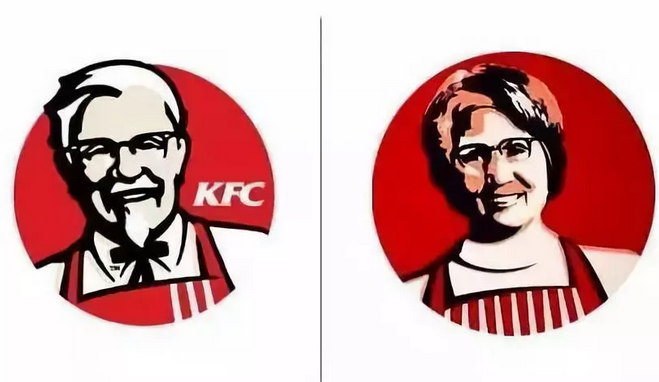
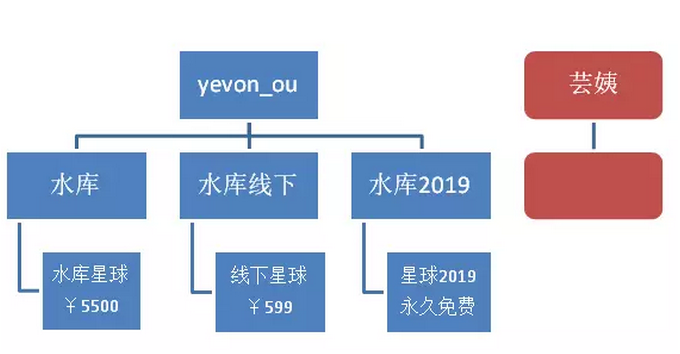
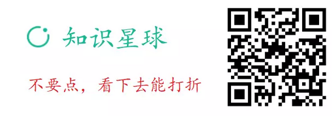
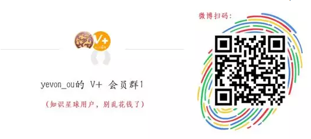
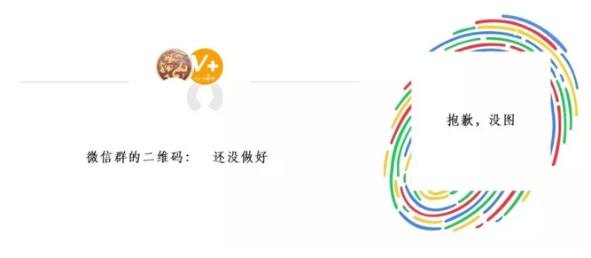

# 当营销遇上山寨 \#1900

原创： yevon1ou [水库论坛](/) 2018-07-30

当营销遇上山寨 ~\#1900~

 

参考阅读：《[拼夕夕的上市让历史倒退了二十年](https://mp.weixin.qq.com/s?__biz=MzU2MzExNDI5OA==&mid=2247483813&idx=1&sn=6f5409fb59760daa5481245a0148f0b7&scene=21#wechat_redirect)》

《[谁买走了拼多多的山寨电器？](https://mp.weixin.qq.com/s?__biz=MzA4MzM2ODc5Mg==&mid=2650686482&idx=1&sn=4990271d97ca938c412a0b9ab608a695&scene=21#wechat_redirect)》

《[拼多多的隐秘后院](https://mp.weixin.qq.com/s?__biz=MzIxOTIyOTA4MA==&mid=2656783459&idx=1&sn=4eaf2f8f0e6f4ba7abe8def4dfddab88&scene=21#wechat_redirect)》

 

在正统的Marketing学说中，是怎样看待"山寨"盗版。

前方预警，本文是广告。

 

 

一）       山寨

 

市场上出现了大量的假冒仿造商品，肯塔基，七匹狠，小米新品。

这些伪造山寨品，不但损害了正品的口碑和商誉，而且很容易有质量隐患。甚至是陷阱和骗局，使不明群众损失了金钱。

 

在正统的Marketing中，企业是怎样"斗山寨"的？

中国的脑残伪大学生们，一般诉诸于"知识产权"。上一例《我不是药神》吸引无数眼球。

品德更下贱者，则要求"政府管一管"。希望无所不在的警察，以后就没有假货了。

 

首先警察做不到，其次警权过度扩张，只能导致25%股权是警察局长的。

 

在真正的Marketing中，显然是"以上全错"。

持有商标的大企业，哪怕挥舞着"知识产权""打假剿假"，八成也是心不在焉的。

有什么样的土壤，就有什么样的山寨。

土壤没有剿灭，野草怎么拔得光。

 

 

 

二）       往事

 

我以前就职的外企，大约于1990年进入中国市场。并在当年同期，推出第一款同名产品。

 

但是那一支牙膏，卖得非常差。非常非常差。

公司砸了海量的广告费下去，也就只在"广州\~珠三角"地区，有约5%的市场份额。

离公司的野心勃勃，还差得很远。

在最初的岁月，中国区成立的最初三年之中，三年换了9任销售总监。

 

 

第四年，在销售惨淡的状态下，屋漏又逢连夜雨。

珠三角凭借其强大的山寨能力，市场上出现了一款"高仿"品。

 

当时，外资企业凭借其一贯的傲娇，以及国际市场的相对定价。

在中国本土牙膏，中华，美加净，都仅仅只卖1.2元的情况下。

这款外资牙膏，定价高达10元。

相当于1990年代中国人，一天的工资。

 

即使经过了各种乱七八糟的折扣和促销，最后实际零售价，还要高达6\~7元。

而"高仿"山寨牙膏呢，售价：0.8元

 

这个时候，是否应该发动"知识产权"，倚重法律部。

敦促中国警力，去乡下"拉网式"排查，打掉制假窝点呢？

 

 

就在这一个关键转折时刻，公司换上了第10位销售总监。

销售总监盯着"0.8元山寨"看了很久，说了一句镌刻入史册的话。

"他们卖这0.8元，可以赚钱么"。

 

销售总监叹了一口气说，"我不是很懂你们生产部的工作，也不知道市场部的想法"。

"但别人既然可以卖0.8元依然赚钱，我们卖8元，显然是过了"。

 

如果别人可以卖0.8元，依然赚钱。那不就是一条他赚钱之道么。 

-   为什么我们不可以自己卖0.8元。

-   我们有更先进的生产线。

-   我们有更先进的生产工艺，管理流程。科技遥遥领先。

-   我们是正品，我们可以在电视媒体投广告。"山寨品"永远不能见光。

-   我们可以对接Carrefour，Walmart等大型超市。"山寨"永远进不了主流分销渠道。

-   我们可以用法律武器，对付对手。

 

 

事实情况是，虽然各国际大牌，对于"山寨"高仿都喊得很响。

但任何快消品，"山寨"的份额，随便哪一个时期，都不可能超过2%

 

因为现代商品社会，重要的并不是"产品"，而是"分销"。

重要的不是价格，而是广告+流量+货架。

 

这是一个"合法"与"非法"的区别。

任何山寨品，就注定了它不可能进入一切"主流"散播渠道。无论是电视，灯箱，平面广告。

而且也不能进入"主流批发"和"主流卖场"。

 

越是有价值的市场，越是"依赖渠道"。

好比北京、上海这样富得流油的市场。在上海Kiosk/Grocery，俗称的"胭脂店"。数以千万计的游离监管之外的杂货小店，已经荡然无存了。

 

现在北京上海，买东西就是大型的超市，大卖场。要不就是网店，京东，一号店。

对于这些"现代渠道"。都是没有假货的生存空间的。

没有渠道，你就是2%

 

 

正品相对于"假货"，拥有无可比拟的竞争优势。

我们具有规模优势。

我们可以切入现代渠道，有广告，超市。

我们可以让工商打掉它。任何一个节点，只要销量高到一定程度，必然不复存在。

 

因此销售总监极其"专业"地说了一句：

"别人卖0.8元都可以赚钱，凭什么我们不能自己卖0.8元"。

凭什么我们不能自己仿自己！

 

 

 

三）       自仿

 

会议的结果，最终公司管理层决定，出一支自产的"高仿品"。

出于外资无可救药的腐败，最终这支"低端产品"的定价，定在了3元。而不是0.8元。内部代号LPP。

 

LPP一经出现，立刻获得了炫目的，无可争议的巨大胜利。

大概仅仅花了一年的时间，它的销量，就超过了它的父亲：卖8元那支。

此后再过了十年，翻到了1000%的数量级。

 

整个公司，就凭借这一支"拳头产品"，销售额从1亿，3亿，5亿，10亿，15亿。最终占据了全中国三成份额，而光LPP一款，全国份额22%

 

 

几乎每一个LPP的消费者，都觉得自己赚了便宜。

不乏有老乡说，"这款高档牙膏啊，我在城里见过的，要卖8元呢"。

现在打折促销，只要2.99元。

放在任何组合包里，都让人皆大欢喜。

 

而对于商家，他无所谓的。

买3元LPP的人，反正也不会来买8元的。我这是"消费升级"，抢的是中华，美加净，蓝天六必治的客源。

而且8元，3元，包装还是有细微差异的。仔细看还是不同的。这就符合了"高端客户"追求尊崇的选择。

 

 

尤其值得一提的，自从3元LPP出台之后，市场上的"山寨版"就绝迹了。

你要知道，山寨版的存在，并不是因为商人造假货。而是因为消费者需要假货。

 

消费者需要一款1\~3元的，能够预防蛀牙，坚固牙齿，清新口气的多功能牙膏。

他们负担不起，花1天的工资，8元来买一支"高档"牙膏。

 

 

这个需求是坚实存在的。不以"打假"而转移的。

打掉了一个山寨厂商，很快又会冒出来另一个假货厂商。春风吹又生。

 

灭绝山寨的唯一方法，是"满足需求"。

出一款1\~2元，廉价低质的，能满足消费者的基本需求。

当然穷人可以舍弃一些华丽花哨的功能，"简易版"即可。

 

而且因为公司强大的营销能力，最终的定价，并不是1元，而是3元。

毛利率依然高得晃眼。

 

 

 

四）       知识付费

 

水库是一个"知识产出"的地方。目前互联网上问房产，头牌就是水库，别无第二家大咖。

 

水库体系分二条线：

-   微信公众号

-   问答

 

其中微信公众号是"文章"。一篇又一篇3000字的文章，前前后后近200w字著作。

把房地产"体，用，术"整个体系和大厦，基本都介绍清楚了。

 

"水库论坛"是免费的。

哪怕贫家之子，也可以无偿获得水库所有科技树。

 

 

熟悉教育的朋友都知道。"牛顿三力学"是免费的，牛顿力学经过三百年千锤百炼，讲述的方法，已经尽可能简单易懂。至少比中世纪Issac
Newton的英文手稿，容易懂多了。

 

神州大地，不乏有靠"自学"。看书一遍，就能掌握初中物理的孩子。

但是，你家孩子，难道不上补习班的？

 

 

能够完全靠"自学"的孩子，毕竟还是少的。

普通人看一遍"水库"，总还是有一点不够通透理解，存疑新鲜见解的。

 

如果你在"课堂"上，你会怎么做。你会举手提问。

"老师"这种角色，每家学校都请了很多个。

"老师"干嘛用的，难道是站在讲台上念课文？

老师是给你"传道、授业、解惑"的。课本中有不够融会贯通之处，你可以咨询老师。

 

 

对于水库体系，"问答"也起到了一样的效果。

知识是免费的，服务是收费的！

 

随着"水库科技树"的散播，"问答"的需求随之而来。体系再详尽，多多少少大家总有一些边角料的问题。"水库星球"目前已经累计九万多条问题，还在不断增加。

问得完么，问不完的。

这就构成了"水库"的主要收入来源：问答。

就"问答"这项功能，我们目前主要有二个产品。

 

1）           知识星球

 

水库知识星球：https://t.zsxq.com/eEUFqFU

水库知识星球，目前收费为5500/期。

采取固定年费制，截至至2019-04-18。也就是说，你现在加入，还有九个月有效期。费用也是5500.

 

但是，我们提供几个折扣：

a）问助理ZM要个折扣，85折：4675元

b）老用户续费，额外再85折：3973元。

 

助理ZM微信：ZM19654321

加助理微信，转账现金，享受85折优惠。 

２）分答付费社群

 

分答相当于一个"低配"版的知识星球。

 

分答目前规矩是，我每周驻场半天（周六），仅限于周六12:00\~24:00接受提问。

其他时段，问题将由朱业胜，朱红之泪，水原十口等一众小V回答。鉴别自负。

 

"分答付费社区"目前有效期还剩四个月，截至到2018.12.31，定价是249元。

目前几乎可以确定，分答不会再续期。

因此2018.12.31之后，各位就再找不到这么廉价的渠道，可以询问房产类问题了。

 

 

初步的设想，我们会设计一条新的产品线，来取代"分答付费社区"。

这就是酝酿中的"水库小V"。

 

水库小V也是一个"知识星球"，定价估计在399元左右。等到分答结束，设想在2018.12.01上线。其规则如下：

 

1）星主yevon\_ou，但不接受免费提问。提问请付费+288元以上。

2）会邀请各个城市，约十几位小V作为嘉宾。

3）向小V提问，不用付费。

 

我会按照每一个问题 xx元，和小V结算佣金。

如果某个问题太复杂，小V也可能拒绝回答。

因此整个生态，还是很自洽的。

 

 

 

五）       水库围观

 

我们知道，长期以来，存在二股"李鬼"组织。通过山寨和盗版水库资料，牟取利益，赚取粉丝金钱。

 

对此，我们采取了一定反制方法。

例如"知识星球"中，提问数明显虚高，会被警告为"代问"客户。并导致拉黑。

 

我们也附加了"水印"。如果谁整天贩卖"欧神小密圈"，通过水印，就可以查出盗版源头。

 

但是这些"打假"举措。依然有局限性。

就好比我们在第一段所写的。为什么有人付费订阅"欧神小密圈"，是因为有这个需求。

 

5500的定价，依然不是一笔很低的数字。很可能是某些三四线城市，一个月的工资。

同时，某些人未必有提问的刚需。他只是想看看，却不想付太高费用。

 

这些需求合在一起，就构成了"水库围观"。

最初的时候，我想让知识星球增加这样一种功能：

-   卖围观票。在星球中，只能看，不能发言。

-   卖短期发言票。包括3条提问，3条回复。

-   提供"围观"到"正票"的升级套餐。

（老板太会撸钱了，膜拜）

 

但是知识星球，依然是一个产品开发很慢的公司。尤其这种"体系"级别的迭代，慎之又慎。短期之内开发不出来。

 

而这个时候，微博伸过来了橄榄枝。

我在微博上有130000粉丝。已经赶入了第二梯队。

微博希望我去那，开一个"V+社区"。

 

"V+社区"的定位，就是山寨版知识星球，就是"水库围观"。

每一天，都会有助理，定期把"欧神小密圈"的问题，整理过滤，精选筛查。

然后打包，做成微博格式，扔在微博"V+社区"。

 

如果你不想花5500进知识星球，你只要花少得多的钱，就可以围观到"每日更新"。

内容更全，图片更齐。而且有更广的宣传渠道。

给消费者提供"替代品"，才是杀死山寨的最好方法。

weibo.com/yevon1ou（微博扫码）

六）       微信群

 

除此之外，另一个"山寨"李鬼的重灾区，是微信群。

 

众所周知，市场上一直有"李鬼"微信群。入群收30元，A8群，A8.5群收费更高不等。

这些山寨群，打着水库的旗号。又不能提供给粉丝有价值的信息。纯属诈骗，导致了很大的纠纷。

 

因此水库开始提供官方的微信群了。

等一位新同事：ZM1，到位就可以开张。

 

1）所有官方\#Q群，永久免费。凡是要收费的\#Q群都是骗子。望互相告知。

2）水库不负责群的内容。纯免费，纯给大家一个玩的地方。

3）不定期会往群里扔一些废稿。

 

 
七）       菜单栏

 

最后一个产品线，是水库的"菜单栏"。

随着微信改版的事尘埃落定，菜单栏暂获死缓。我们也希望更多发挥菜单栏的作用。

 

大家都知道，水库是讲房地产的。

可是你们讲了这么多科技树，一旦遇上"实操"；

-   我想办抵押贷款，哪里去找靠谱的贷款中介。有什么优惠产品。

-   哪里有9%以下利率信用贷。

-   信用卡大白金，只接受邀请。跪银行门在哪里。

-   婚票和户籍，找谁？

 

在"菜单---金融超市"中，水库打造了"抵押，信用贷，信用卡，户籍"四大板块。

这个菜单最大的价值是："水库是轻微背书的"。

 

凡是在"金融超市"合作的机构，都是和水库有长期来往，互相了解的。

这些机构，可能存在收费贵，办事能力弱等问题。

但他绝不会坑你。

 

对于这些机构的人品方面，水库是比较信任的。

 

 

 

（yevon\_ou\@163.com，2018年7月27日晚）

 

这篇居然还要贴广告，我被自己的铜臭无耻惊呆了

