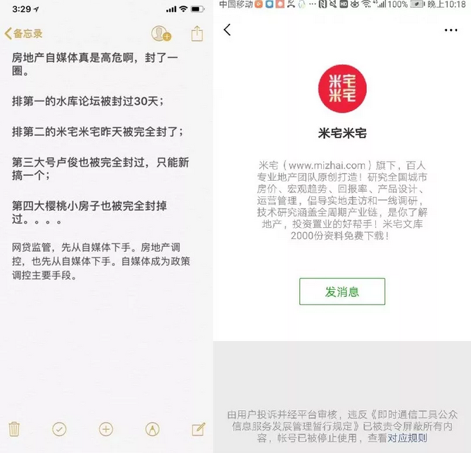
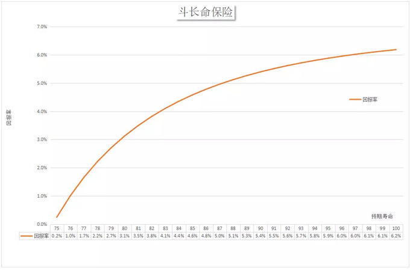

# 以房养老设计手册 \#1910

原创： yevon\_ou [水库论坛](/) 2018-08-13

**以房养老设计手册 ~\#1910~**

 

 

 

一）心痒痒

 

今天想写的话题，是"以房养老"。

 

但是这个话题，端到嘴边，犹豫万分。愁肠百结，想想又放下了。

我拿起了小妹妹写的"八卦"话题。存稿还有二篇，八卦好，情感类文章就是好。

 

可是啊，俺这个地产号，心头宛如有一万只蚂蚁在爬。

我是真想写一些"正经"文章的。

写正经文章封号啊。

 

 

前二天，地产界排名第二的"米宅米宅"被永久封禁了。

紧接着，哥哥就接到这么一封私信。

  

吓得我心心胆胆俱俱裂裂裂

你说，我要是写一篇文章，说现行的"以房养老"保险，是彻底的混蛋，剥削，吸血鬼，保险公司的阴谋.........

哥哥会不会跳过喝咖啡的阶段，直接被送进粉碎机？

 

 

我拎起了小妹妹写的"八卦情感"文章。八卦好啊。

你们可以骂"这都写的什么玩意"。你们可以取关。

 

可是取关，最多取关几百个人。哥哥照样广告费收入囊中。

写一篇大型地产文章，说不定就"永久封禁"了。那可是几十万粉啊！

 

苍天啊，朗朗乾坤。我到底要不要说真话呢。

心头几万只蚂蚁在爬。

 

  -- ---
      
  -- ---

 

 

 

二）以房养老

 

以房养老，我们大致可以参照这篇官方的介绍说法；

 

《[["以房养老"推向全国，你愿意用房子换养老金吗？]](https://mp.weixin.qq.com/s?__biz=MjM5NzI3NDg4MA==&mid=2658518155&idx=2&sn=fb9807120fb4376b568e9abe22c60710&scene=21#wechat_redirect)》

 

-   按照官方的文案，一些孤寡老太，可以生前把住宅"倒按揭"给银行。房子产权归属银行。

-   银行每个月给老太2082元。

-   老太继续居住，身故后，房子被银行收走。

 

就是房屋所有人把房子抵押给保险公司，然后每个月从保险公司领一笔养老金，待所有人去世后，保险公司再处置房子，并扣除相关费用，房子抵押并不影响居住。

 

这种模式下，那些收入较低，但名下住房价值较高的老人每月都能获得一笔养老金，从而改善老年生活。

 

听起来是不是棒棒哒。解决了人民的又一需求。达到了孤寡老人，子女，银行的三赢。制度创新，金融创新。

 

 

 

但实际情况呢，全中国第一例"以房养老"，早在2007年上海就发生过了。当年也是大肆宣传。

 

但是上海2007年，就"试点"完成了一例。

此后就再也推行不下去了。整整十一年，效果还是一例。

 

为什么，因此此类产品极度不公平。

吝啬苛刻，风险收益绝对不对称。

 

不公平到什么程度呢。按照目前产品，孤寡老太持有一套价值100W元的房产。

你把100万元房子交给银行。

每个月只能领取2514元。

 

你今年60岁，预期寿命86岁。

你把100万元交给一个骗子。

骗子每年给你3万元。

等你死的时候，才不过领取了26\*3=78万元。

 

本金都没有拿回来

本金+利息，全部都被骗走了。

 

 

 

三）金融骗术

 

"以房养老"为什么搞不下去。为什么2007年，仅仅试了一个"孤例"，此后就没有下文了。

因为你实在太不公平了！

 

老百姓不是傻子，你别以为老百姓智商低。

老太太已经够可怜了。孤寡老人仅有的资产，就只剩下安身立命一套房子。

借100W，每年分3W，不还本。

你良心不痛吗！

 

 

而这件事情，银行也是满肚子苦水。银行甚至都"不想做"。

银行的估值，以及逻辑体系是这样的。

 

-   你这房子100W，但是要26年以后才能拿到。

-   假设每年贬值-2%，则26年后的旧房子，残值最多只有59万。

-   但是我今天就要给你现金，现金是有"利息"的。

-   按照现金的"贴现率"，我的确只能给你每年3W。

 

在实际操作中，因为保险公司还有行政成本，而且房子通常是"估不足"的，保险公司需要留出很大的空间，保障自己的风险。这样孤寡老太的"回报"就更低。

 

该类业务长期执行，将会有大量的"不动产"持留在银行保险手里。

也容易积聚金融风险。

 

看见没有。这里面最重要的分歧，是2040年时，房子值多少钱。

59万还是590万

 

如果你相信"传统教科书"金融理论。房子不断贬值，股票不断升值。

相信中国股市，会大大跑赢中国楼市。

则你账面计算出来，是是只值59W。一股茅台换一套别墅。

 

 

问题是，老百姓不卖帐啊。

老百姓知道朴素而真实的道理。2040年，房子绝对不可能才仅59W一套。

多少孝子贤孙，眼巴巴地凑着老太太的房产。

谁要是敢把房子"每年3W"地交给保险公司，岂不是要被亲戚们的唾沫淹死。

 

 

老百姓的期望呢。

租金忽略为零。

廿六年后，房子好歹值几百万。你想要骗老太太房子，拿几百万来。

 

 

 

四）斗长命的精算

 

那么，"以房养老"把房子押给银行，究竟可以拿多少钱，应该拿多少钱呢。

我们可以换个算法。

 

"假设你有100W元现金，保险公司每月给你分红。死亡则终止。

请问，你每个月可以领多少钱"

幸运的是，这个问题，是严格地有数学上解的。

 

 

2003年我在香港，巧遇几个长辈在买保险。当时他们买的，是一种叫做"斗长命"的保险。

 

60岁老人，一次性付100W给保险公司。

保险公司每年分红，死亡则终止。

若不满75岁死亡，则付到75岁。给子女。

 

这个产品，香港当时的价格，是5666元/月左右。年率6.8%

 

 

香港老人戏言说，这种保险，业内俗称"斗长命"。

按照6.8%的回佣率，前面十六年，活到75岁，拿回100W本金。

获得80岁，大约有3%的回报。

活到90岁，大约有5.4%的回报。

 

如果你寿命无限延长，甚至活个300岁。能不能把保险公司吃垮呢。

也不行。

因为这张图表，最终是收敛的。收益率的上限，就是6.8%，这个在数学上是严格证明的。

 

保险公司根据当期投资利率，再根据香港"人均寿命"加权平均。

最终定出了5666元的回报费率。

  

 

这一系列的数学，我们不必深研。我们只需要知道一点： 

"一名60岁的男性，将100W元交出去，领钱到死。

合理的回报应该是5666元/月左右"。

显然，现有的中国"以房养老"只给2514元，实在是给得太低了。

被剥削了一半都不止。

哪怕算上了房租都不止。

在有生之年，孤寡老人甚至连本金都收不回。

 

 

 

五）以房养老的设计

 

那么，正确的"以房养老"应该是怎么回事呢。

中国之所以出那么大的偏差，因为他的"产品设计"不对。

这种完全漠视"地产价值"，必然被贪官疍吏压低老人房值，吸孤寡老人的血。

 

 

正确的"以房养老"。不应该是目前中国大陆的"二方模式"：

A：老人，卖出房子，每月获得2500元，获得租赁权

B：银行，买入房子，每月付出2500元，没有租赁权

 

           现金流     身后房产   身前使用
  -------- ---------- ---------- ----------
  A.老人   +2500/月              获得
  B.银行   -2500/月   获得       

 

 

正确的模式，应该是ABC三方：

A.老人，卖出房子，每月获得4000元，获得租赁权

B.银行，获得100W元，每月支出5666元

C.投资者，付出100W元，每月获得1666元，获得房产

 

             现金       现金流     身后房产   身前使用
  ---------- ---------- ---------- ---------- ----------
  A.老人                +4000/月              获得
  B.银行     +1000000   -5666/月              
  C.投资者   -1000000   +1666/月   获得       

 

我们来看B。

B是银行。它相当于承接了一笔"100W元斗长命"金融产品。因此B逻辑是很清晰的。

B不涉足任何不动产。也没有金融风险。

 

 

我们来看C

C相当于花了100W元买了一套老公房。此后"长线出租"。

C也是完全常规而合理的。更复杂的设计，还能租金递增。

 

 

最后来看A

孤寡老人应该每月获得4000元，这个才是真相！！！

 

 

（备注：不满75岁死亡，则领钱到75岁。以免差异太大。）

 

 

 

六）遗产权的算法

 

ABC的表格，事实上也揭示了另一条"金融创新"之道路。

即："遗产权交易"。

 

 

我们常常听说傻空吐槽，"自己住的房子，哪怕升值了也是账面财富，你又不可能卖掉"。

你隐隐约约觉得这句话是错的。逻辑是有问题的。但是又说不出谬误在哪里。

 

你想，房子可以传给小辈子辈。你儿子可清楚着呢。

房子价值100W，价值1000W，这待遇能一样么。

 

 

 

真正的算法，即在于"遗产权"交易。

只要知道利率，年龄，就可以算出"身后房产"的价值。

 

一套房子多年产权，分为：

-   老人活着一直使用

-   老人死后归你

请问，这个"继承权"价值多少。

 

 

算法十分简单。

既然老人活着，每个月可以领4000元"年金"。

换算进"斗长命"产品。这份年金的价值，就是4000/5666\*100W=70.59W 

-   老人生前使用，价值：29.41W

-   老人死后归你，价值：70.59W

 

 

在未来的金融市场，完全可以存在"遗产权"交易。

-   房价涨了，自己还要住。你可以把"遗产权"卖掉。

-   房价太贵，真买不起房。你可以购买没有"遗产权"的房子。

 

北京既然大搞"共有产权房"，为什么不搞"无遗产权"房呢。

当你活着的时候，房子无限使用。

当你死了以后，房子被政府收回。无法继承。

这样的话，北京的房价完全可以打个五折六折。

 

屌丝一方面吐槽房价贵，一方面又要100%产权。您这是啥意思呢。

经济适用房，还想传给子孙。

不嫌太过分了么。

 

 

 

七）结语

 

我认罪，我忏悔。

俺已经许愿绝不再发出任何批评声音了。

可是看到"孤寡老人付出100W，每个月领取2514元"，依然忍不住歇斯底里地愤怒。

交套房子出去，连本金都领不回来。

 

 

跪求网监高抬贵手，我真不是故意的。

我真的是绝对绝对没有批评的意思，一等良民。

纯粹是喝醉了酒，几万只蚂蚁在爬。不吐不快。

跪求哭晕，千万别封我的号。

 

 

俺继续去写八卦情感调好了，我很乖的。

 

（yevon\_ou\@163.com,2018年8月11日暮）

 

按照水库系内部的测算，拿走100W元房产，你大概要给我每个月15000，才值得和你换。
