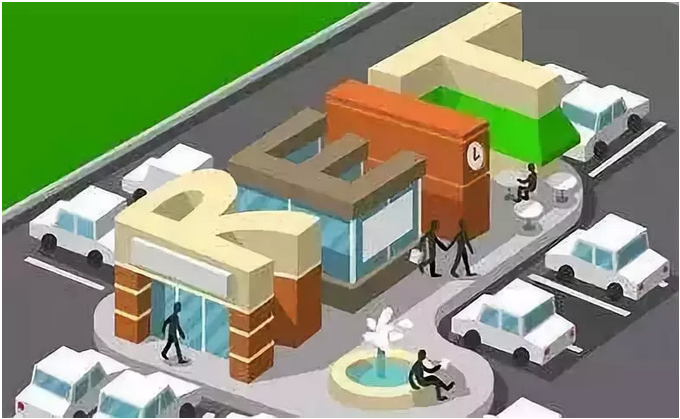

# 储蓄平方米 \#1920

原创： yevon\_ou [水库论坛](/) 2018-08-31

**储蓄平方米 ~\#1920~**

 

\* 根据天涯旧贴改写

 

 

一）提问

 

8.26我作为嘉宾，参加《[功夫财经·炼金之夜](http://mp.weixin.qq.com/s?__biz=MzIzOTA3NTA5Mg==&mid=2652458934&idx=2&sn=4e776bd32a87c41879ed3f56ead19cd4&chksm=f2c245cdc5b5ccdb0f1c6f0a76679bfd3ba55e6e76eb5ddf7df14154a221e7ceac75e8f20fce&scene=21#wechat_redirect)》活动。

下午彩排的时候，来了二个财经媒体的小妹，向我提问了一些采访稿。

 

其中有一个问题，很有意思（大意）：

现今北上深的房价越来越贵，未来是否会出现年轻人无法上车。从而造成阶级固化？

 

 

哥哥瞄了她一眼。水库，从来都不会给她期望中的答案的。

水库最常见的答案，是"以上全错"。

 

因此哥哥给她的回答是：

"不会啊，我觉得任何人都可以买得起北上深的房子。年轻人只要努力一点，30岁左右都可以供楼的"。

 

 

呵呵，呵呵呵。小姑娘脸上，泛起了一个鄙视和不信的脸色。

你如果换一个傻一点的论坛，例如知乎，集思录，在那种社区，你问"30岁能不能买北上深的房子"。

那肯定说不能啦。

 

参考阅读：jisilu.cn/question/267547

 

 

北上深这种城市，一套像样的二房要700W，像样的三房要1000W。

而且首付还特别地高，加税费都要40%左右。

 

30岁的年轻人，不吃不喝，也攒不出400W首付。

付完首付，也供不起月供啊。

 

 

那个鄙夷的眼神深深地刺痛了我，于是哥哥又再加码说"他们可能都是985，211的优秀大学生"。

"只可惜他们的财商不足。不懂得理财。光靠智商，是买不起一线的房子"。

"至于财商，就要购买《[功夫财经App·地产的秘密](http://mp.weixin.qq.com/s?__biz=MzAxNTMxMTc0MA==&mid=2651018682&idx=1&sn=ba905bf22cf18446ed6a3c03eb6c0554&chksm=807203a9b7058abf14a4c02c8b447de7aa924cb4904028b29de322a4f73e6929ad1eb7aab636&scene=21#wechat_redirect)》我的课程啦......"

 

小妹妹狠狠地竖起了一支圆珠笔，顶着我的领带说：

"别玩虚的，你说，要怎样才能买得起北京的房子"。

 

 

很简单，小白领上班，假设男方25Ｗ+女方15Ｗ，国贸白领合年四十万不差吧。

-   你存一半20W，买一套沈阳的房子。用房租部分抵扣月供。

-   第二年，你再存一笔钱，再买一套。以租养贷，稍微贴点。

-   第三年，再买一套

-   .........

-   第八年，买第八套。

 

你从22岁开始，一直到30岁。坚持每年"贷款买楼"一套房子。

八年积攒八套房子。

等到第八年，你把八套都抛了。你认为八套沈阳，能不能换回一套北京？

 

 

财经小妹若信若疑，半信半疑。

女人的数学，向来不好。挖坑是容易的，卖猪仔也是容易的。

且不说"限购限贷代持"等技术性难点。我们就问一句，这样的模型，理论上可不可行？

 

 

 

二）追逐

 

和大多数人印象相反。这个模型，理论上是可行的。

这并不是一句戏言，反而是欧美常见的金融范式。

它另有一个名字，叫做：REITS

 

 

我们来解释一下。

假设一对年轻人，从22岁开始，平均后收入在40W/年左右。

那么，等到30岁，他是无论如何买不起房子的。

 

这么多年，历届调控，类似的悲剧屡见不鲜。

"年初不买房，一年又白忙"，收入的积蓄，是无论如何赶不上房价涨幅的。 

 

绝大多数的年轻人，都有这样的记忆。

不敢买衣服，不敢买单反，几乎砍掉所有生活开销。一年赚40W，储蓄率60%，已经接近极限。毕竟人还要吃饭。

也就是省25W左右。

 

但是一年下来，房价的涨幅，绝对不止25W。1000W的房子，大概率是1100W。

+25W VS +100W，距离反而越来越远。永远也追不上。

 

 

而且人类还有一个"口是心非"的习惯。"八年之后"房价价多少。

-   所有人嘴上都喊泡沫，泡沫腰斩500W。

-   所有人心里都想会涨，说不定价格1500W。

-   真要对赌，可能是2000W。

 

大家嘴上都喜欢喊"房地产泡沫"。

房地产泡沫，那你腰斩啊。给你八年的时间，看你"铁打的泡沫"破不破。

一旦破灭，跌到500W，岂不是买起来毫无压力。

 

真金白银，落子无悔。

你让它"真枪"时，一个个都露出本色了。大伙共识也都知道，八年后远不止1000W。

 

小夫妻追1000W，已经追不上了。

你让他追1500W，怒值卧槽满槽。

 

 

这样一种"追赶问题"

真正的bug，在于它的算法是错误的！

 

你用"货币"去追逐"房产"，注定是追逐不到的。

真正的财商，真正的数学。[应该是"房产"追逐"房产"]。

 

-   这个月工资，攒了1.2平米。

-   下个月奖金，攒了1.3平米。

-   发季度奖了，攒了2.4平米。

 

这样一点点"攒砖头"，才能渐渐攒出100平米。

 

 

 

三）攒砖头

 

那么，怎样才可以"攒砖头"呢。

在中国，我们依然采取一种极其低效而且繁琐的方法："个人投资者"。

 

众所周知，水库的精神，可谓"和时间赛跑"。

在《[焚城烈火征粮队](http://mp.weixin.qq.com/s?__biz=MzAxNTMxMTc0MA==&mid=2651014705&idx=1&sn=20fe7e982eeca19e1f517412b2489278&scene=21#wechat_redirect)》一文中，我们说，赚钱的主要方法，是和通胀"套利"。

 

 

货币的贬值，是永恒的趋势。明天的物价，一定比今天的贵。

你想要赚钱，就一定要把今天的钱，换成明天的物。

而且时间越紧凑越好。

 

在"知识星球"问答中，整天有人问。某一项计划，等一年户口迁入可好，等一年资金到位可好，等一年公积金符合资格可好。

我们的回答总是："楼市不能等一年"。

 

 

楼市的行情，是以"季度"计算的。在一个踩准节拍的城市，差一年或许就差20%

存五六年定期，再去买房子，这简直是不可想象的事情。

 

因此我们奉行"2N"理论，每六个月，就要把手中的现金全部打光。换成筹码。

流派的总体手法，也决定了我们没有长时间蓄水。

六个月蓄力有限，以"低单价，低端城市，低端楼盘"为主。

 

用更学术点的语言说，我们的"颗粒化"是六个月。

六个月当然比五年有效，也比三年有效，也比一年有效。

但是"尽快建仓"，能不能把资金空转更压缩一点。例如压缩到：

1天？

 

 

 

在知乎上，有一个很热的帖子《为什么中国人喜欢炒房、购房。而欧美，日等发达国家的人主要选择租房？》

[zhihu.com/question/62708450/answer/202983394]

 

研究到最后的结果，却反而是：

谁说美国人没人炒房。美国人全民炒房。

商业的基因，已经深入到骨髓之中。

 

因为美国人主要的金融工具，其实是REITS。

所有的人，都在疯狂地买卖REITS，起伏涨跌。

玩得太开心了。以至于不需要个人成团。

 

 

所谓的REITS，指拿出一整个社区。

例如600套房子，70000平米。然后分割成100W分。则每一份就是0.07平米。

他们以"手"为单位。只要一点点钱，就可以买卖几手。

 

-   REITS相当于ETF

-   当房地产市场上涨时，REITS也会涨。

-   当房地产市场下跌时，REITS也会跌。

一般来说，抛掉100平米REITS，也可以换回100平米同地段住宅了。

 

 

REITS出现以后，整个"地产"的游戏规则就不同了。

因为你可以锁死"平方米㎡"存款。

 

价格是在波动的。价格的涨跌，无法预测。看你是"纸本位"还是"砖本位"。

-   传统的"定存"。锁死的是RMB数量。以RMB计价不会亏。但换成砖头，可能买不了厕所。

-   REITS的"定存"。锁死的是㎡数量。以㎡计量永远在增长。但换成RMB，有可能跌价。

 

 

但问题是，傻空不是整天在喊"自住刚需"，不是整天喊"民生"问题，居者有其屋么。

那我就满足你"自助刚需"啊。为什么你都住到房子，再阴险地透露其实你想要升值"赚钱"？

 

金融的创新，并不能无中生有变出财富。

但是可以满足"大义"的名分。堵住你的嘴。

 

 

 

四）购房券

 

象恒大，万达，万科，保利之类的大发展商。完全可以发行自己的"购房券"。

 

券面分为A，B，C，D，E，F，G等各种等级。

好比你持有100张D，就可以在二线省会城市，中环线附近，兑换恒大集团的100平米房款。

 

这样做的好处，KFS可以ICO，提前回笼、聚集资金。

购房者可以分享几年楼价上涨的红利。

证券化交易，有利于价格发现，评估套利，分散风险。

 

 

更何况，一项资产只要可以"证券化"，你就可以"融资融券"。

你完全可以只付30%的首付，加三倍杠杆，然后银行借你6%利息。

 

何苦要"破限购，破限贷"。美国人就是全面买卖REITS。也是说全民炒楼，天塌不下来。

如果动动手指就可以"押多"。又是何等美好的时代。

 

 

 

五）结语

 

泰国是一个十分贫穷落后的国家，泰国有大量的REITS。

越南是一个远逊于中等收入的国家，越南更有大量的REITS。

 

全世界，只有中国把"房产价值买卖"视为洪水猛兽，严追死打。

其实房产的频繁交易，真心天塌不下来。

 

某些种种的私心杂欲，反而阻挡了中国的现代化进程。

 

 

 

（yevon\_ou\@163.com，2018年8月31日丑）

最近广告少，请多点捧捧场。
