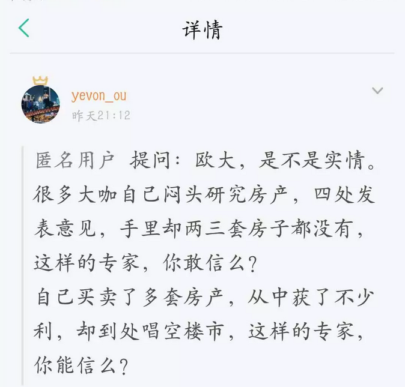
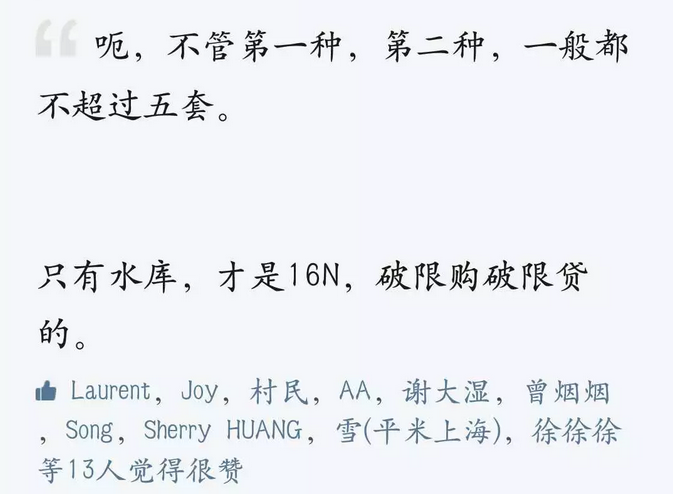
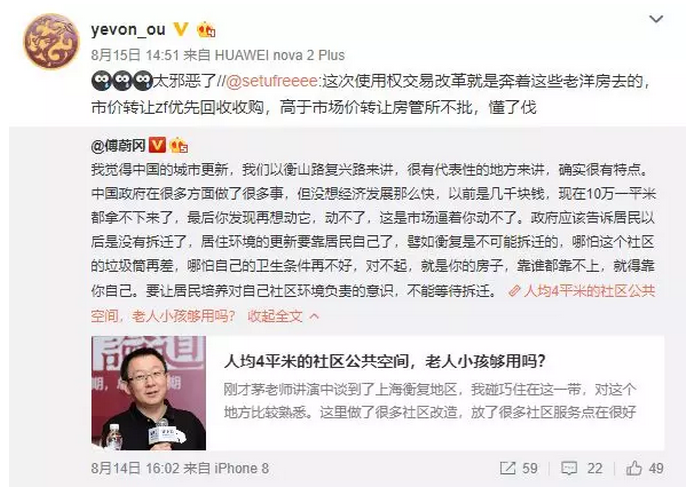

# 炼金之术 \#1930

原创： yevon1ou [水库论坛](/) 2018-08-27

**应激反应 ~\#1930~**

 

  

 

一）长平之战

 

今天看到一篇非常好的文章。叹为观止。

《赵括真是无能之辈吗？》

[zhihu.com/question/36082697/answer/454120423]

 

 

故事讲的是"长平之战"。整个历史，包括四个部分：

1.  韩国献出上党。赵国吞下

2.  廉颇应战，不利

3.  赵国求和，不成

4.  赵括应战，失败

这就是成语中"纸上谈兵"的由来。

 

"长平之战"这个话题，很早前我就写过《战国兵数万之谜》。前前后后的史料，自信也看过十七八遍了。

然后作者说了四个字："以上全错"。

 

 

作者说，"纸上谈兵"指的并不是赵括，而是"赵王"。

为什么，因为"赵国"的整个逻辑，是有问题的。

 

对于秦国来说，秦国的"战略目标"，是非常非常清晰的。

那就是摧毁赵国的野战军主力。

 

从始至终，秦国就这一个目标。为了这个目标，秦国可以榨干国内的粮食潜力。秦国可以放弃上党。

 

诸国均以为"长平之战"是为了争夺上党。其实不是的。

"长平之战"后，秦国本身的损耗也很严重。秦军甚至完全退出了上党郡。直到二年之后再回来。

 

秦国不是为了争夺土地。

秦国就是想要消灭"赵国的野战军主力"。

可是，和清晰的秦国相比，赵国呢。

赵孝成王的战略，是什么呢。

 

答案是：赵孝成王根本就没有战略。

-   第一阶段：赵国贪图土地

-   第二阶段：赵国想固守

-   第三阶段：赵国想议和（固守粮食不足）

-   第四阶段：赵国想进攻（议和失败）

 

从头到尾，赵王并没有"整体战略"。

赵王是"走一步，看一步"。Plan A失败，Plan B试试。始终都在修修补补之中。

 

作者用了一句话形容，这叫什么，这叫"应激反应"。

 

\* 你再想想石原莞尔和常凯申的评论。

 

 

点题点到了这个份上，后面的逻辑就很顺畅了。

作者认为，秦国的庙堂"总参谋部"是要超越赵国好几个等级的。

 

猪圈里的猪，是没有前途的。

当你想要砍它的时候，猪会哼哼啊啊逃走。甚至可以用很大的力气挣破囚笼。

 

但是你只要拿二颗大白菜引诱它，"亲，肚子饿了没有"。

猪就会哼哼啊啊地再跑回来，然后被你狠狠地关进笼子里。

 

 

 

无论是自然界，还是商场。"应激反应"的例子，也屡见不鲜。

在草原上，只要几只鬣狗，就可以把一整群的羚羊，吃得干干净净。

 

因为鬣狗捕食时，羚羊只会受惊般地躲开。蹦蹦跳跳地秀它们的弹跳技巧。

留下二只倒霉鬼，跑得最慢的，受害者作为鬣狗的食物。

 

而整个"羚羊"族群呢。他们是绝对不会团结起来。用头上的顶角，排成阵型，冲击鬣狗。甚至摆成前锋侧翼的阵型。

你是羊，你就一辈子被鬣狗吃。

}

同样道理，商场上某些品牌被蚕食时，老朽臃肿的企业。也只会如水牛般耸耸肩，蹬蹬腿。

"飘柔"市场份额下降，那就飘柔降价。

"海飞丝"卖不动，那就增加广告。

 

但是"联想集团"永远不会大刀阔斧地修改产品线，拥抱移动互联网。专心打造新型手持终端。浴火重生变成新一个TNT水果。

 

企业面对"外部侵扰"时，它的表现象一个僵尸。头痛医头，脚痛医脚，膝盖疼了就膝跳一下。这就叫"应激反应"。

 

 

 

二）房产专家

 

商场上什么样的企业最可怕。

很多年前我在外企上班的时候，公司全国份额3%

 

每次开会，老板指着另一家外企说，"这是我们主要竞争对手，要密切关注"。

这个竞争对手，市场份额2%。

 

除此之外，中国传统的"本土企业"，中华牙膏份额27%，美加净份额9%，蓝天六必治5%；

占据最大份额的巨无霸，竟然被视而无物。土鸡瓮狗，待人宰割一般。

 

进攻性和规模，是没有直接关系的。

 

为什么，因为"国营企业"真心是没有一点点进取心的。

"中华牙膏"既没有市场部，也没有研发部。

 

他们便如同"应激反应"一般。等你在郑州开设分公司，他们就降价。

如果你广告攻势削弱，他们也不会主动出击。

 

欧洲人当年倚仗海军，在非洲大陆横行无忌。

只有他们深入内地，捕猎黑奴。非洲人从来没能力追杀到海上。

"不对称战斗"经验久了，深入骨髓了吧。

 

 

同样道理，今天水库"知识星球"有人问了一个问题。 

我的回答也是，土鸡木狗，尸位素餐。

因为绝大多数的房地产专家，经济大师，宏观经济分析员，他们也是"应激反应"。

 

这些人，只不过因缘际会，会采取一些行动。

没一个，是具有长远规划，和战略眼光的。

 

 

 

你去看市场上的"房地产分析"文章。尤其是"证券类"的，由证券公司研究部颁发的。

他们的主要套路是这样的："因为出了xx政策，导致xx影响，所以房价xx"。

 

所以呢，他们的分析报告，也几乎从没准过，对过。

他们也是"应激反应"。市场上99%的平凡普通人，都是"应激反应"。

 

绝大多数的人，是被时代裹挟着走的。身不由己，随波逐流。

他们看待问题的方式，也都是在"面对外界的刺激，做出反应"。

看见二条新利空政策，就高喊要崩溃了。

 

 

亲爱的，你有没有想过，你本身就坐在一列急速高驰的列车上。

哪怕你什么都不做，你一年也亏损了12%

当你研究某项政策，会影响1\~2%之时。你对"坐地日行八万里"毫无所知。

 

v.qq.com/x/page/r0504h4sc40.html

 

三）旧版调控

 

把"应激反应"这个概念，再延伸一下。你会发现2003\~2013年的"宏观调控"，也颇为符合这个特征。

 

我们曾经写过，秀相的"十年调控"，大致可以切分三个阶段。

-   第一阶段：想敛财，试图增加税收收入

-   第二阶段：想斗气，脸面无光

-   第三阶段：惊惶错，破罐破摔

 

对于2003\~2013年的"宏观调控"，它其实也没有"战略目标"的。

它是"走一步，看一步"的。

站在2003年的关口，是绝对料想不到，2013年会层层加码\~调控成这样的。

 

 

相应的，2003\~2013年的"旧版调控"，其政策目标是相互冲突的。

杀伤力是孱弱的。

态度是摇摆的。

 

 

 

四）新版调控

 

与2003\~2013调控对应的，2013年之后的"新版调控"。

便如同糊涂的水牛，和精锐的狮子，区别一样巨大。

 

"新版调控"的战略十分之清晰：

切断地产的一切投资属性。

 

 

"房主不炒"。你[不可以从房地产中赚钱]。

房价或许可以涨。毕竟通货膨胀是无可阻挡的经济规律。

-   但是你限购。

-   限售

-   限价

-   限制购买资格

-   非常非常非常高的交易税

-   共有产权房

-   政府优先回购。

事情怎么会发展成这样。

他不是追求房价降下来。他是追求让你赚不到钱。

 

 

水库曾经写过一篇《[[世上再无商品房]](http://mp.weixin.qq.com/s?__biz=MzAxNTMxMTc0MA==&mid=2651018036&idx=1&sn=b5df4e98534c606bf026ef3dc973cd00&chksm=80720527b7058c31ba27de8f8f9a2120319a74b345aea758a800739e5479de07f9331762c7b4&scene=21#wechat_redirect)》。

各位可以设想一个"可怕的局面"。

假设彻底取消C2C交易，只保留G2C。

 

任何人，张三不可以卖给李四。

想卖房。张三只能够卖给政府。价格由政府说了算。

李四再向政府购买。

 

干脆把"交易所"关了。

这种事，如果"计划经济"发展到顶峰。也是完全做得出来的。

今日的共有产权房，不过一个预演。

 

 

 

五）错误的战略

 

（整节略，咖啡御免）

 

参阅《[[大秦崩溃于无仗可打，美国当年也面临过类似的困境]](https://mp.weixin.qq.com/s?__biz=MzIwMTM4MjQzMA==&mid=2656592669&idx=1&sn=d3c166f1b2df5ebbce89dc1000e0cab4&scene=21#wechat_redirect)》

 

 

 

六）结语

 

年轻的小朋友要择偶，怎样的"青年才俊"是有前途的。怎样的A货，看起来是普林斯顿毕业，其实却是绣花枕头一包草。

答案是，你要看他的"人生观"。

他对待世界的态度，是自省充满理想，试图改变这个世界。

还是应激反应，随波逐流，得过且过。

 

 

商场竞争，应该防范哪一类公司。看市场份额，还是看现金储备。

答案是看"理念"。有些清晰想法的公司，远远比老大帝国更可怕。

-   危险的不是Yahoo，Microsoft

-   危险的是今日头条，子弹短信。

 

 

国家竞争，哪一些虽然是小国，但却前途无量。

答案是，目前所有的民珠国家，统统完蛋。

当一个国家开始轮替式民珠，他就必然失去力量。

 

 

 

（yevon\_ou\@163.com，2018年8月29日子）
