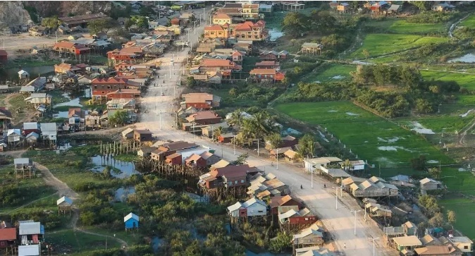
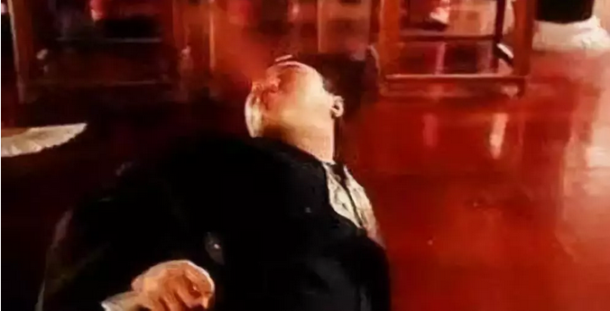
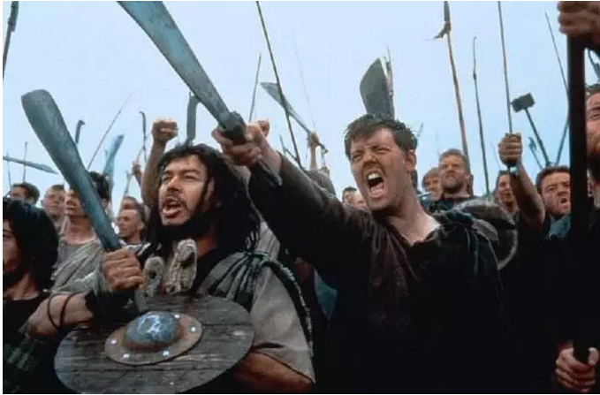

# 你的眼中写着怯懦 \#1960

yevon\_ou [水库论坛](/) 2018-12-19

**你的眼中写着怯懦 ~\#1960~**

 

 

大家都知道，水库最近在卖西港的项目。

为了这个项目，我每天都要面谈十几个客户。迄今已见了二百多个意向。

 

人见多了，真的是千奇百怪。

苦难便如同石雕上的裂缝，会泄露出心的颜色。

寥寥几秒，仿佛可以看见茧子的过去，现在，和未来。

 

今天我们举几个特别典型的例子。

 

 

 

一）追问姐

 

"追问姐"姓S，姑且叫她S女士。

S女士是咨询界的大灾难。

 

 

因为S姐总是持续不断地想出新的问题。

你回答了一个，又提出三个。

你回答了三个，又提出十个。

 

在追问姐的世界里，我们整个项目，永远都有风险。

而你的回答，怎样也无法使她放心。

 

 

譬如说，在我们整个项目描述中，有这样一段话： 

-   地块内部的道路建设，用户自己负责。

-   地块之间的道路建设，由大业主负责。

-   地块和外界的公路建设，由政府负责，但可能向地主摊派。

 

S姐皱着眉头看了半响，问道：

"我们这个土地下面，会不会有大型的地质裂缝"。

哐当，哥哥直接从凳子上摔了下去。

 

"姐姐啊，我们造的是公路。公路知不知道，就象鸡蛋壳薄薄的一层"。

"又不是建巨人大厦88楼，你关心溶岩、地缝干什么呀"。

 

 

S姐苦思凝想了半响，又继续问，"那么，会不会有地雷呢"。

哐当。哥哥好不容易爬上桌子。脚一软，不争气地又摔了下去。

"地雷很贵的，卖废铁比你地皮还贵呢"。

S姐拜了一会佛，突然又问，"会不会海啸和地震，把我们的道路冲垮呢"。

"大姐，我们隔壁是座山。山的隔壁是机场"。

"您见过海啸选址，把机场淹掉的么"

 

S大姐继续想了想，"公共区域是大业主负责建的吧"。

"万一老师您出门，被车撞死了呢" 

哥哥忍不住恶向胆边生，卷起袖子，露出拳头。

"你想干嘛"

"来来来，要不要再抽二管血，验一下我身体很健康"。

 

 

S女士这种人，在咨询界，称为"麋鹿"。也是韭菜的一种。

她们虽然质疑，疑问很多。其实却是最好对付，最容易割的那种。

 

因为她们的"疑问"虽然很多，但漫无边际，完全抓不住重点。既不能犀利地切中要害，连技术性约束合同细节，都做不到。

她们只能"泛泛"而谈，长篇累牍地提出问题。

 

而这些问题，与其说是"问题"，倒不如说是一种心安。显示我对这个项目已经"反复盘查"，买自己一个安慰。

 

其本质，好比虎妈为子女，买了很多超昂贵的补习班。

自以为已经给了"最好的教育"。但子女往往不会因此而成才。

 

 

 

在S女士身上，我们依稀可以看见她的过去，现在，未来。 

-   她这一辈子，肯定没有当过官。连小组长都没当过。

-   生活对她而言，充满了琐碎和苦难。

-   没有太多朋友

-   过往的投资成绩，不尽如人意。

 

又过了几天，我有机会加到了他先生的微信。

说起了S女士的情况。俺隐隐表示担忧。

以S女士的个性，她如果不是碰见水库，去哪都继续被人骗，被固安收割的概率极大。

S女士需要有人关心和呵护。

 

S先生沉默了半响，说"她是个好人，就是不安全感强了一点"。

 

 

 

二）挑剔的A小姐

 

第二位女士姓A，简称为A小姐。

 

 

A小姐是一位"锱铢必较"的女性。

我们一共准备了150份完全一模一样的标准合同。合同对于每一个人，都是平等的。

只有A小姐，皱着眉头看了二遍，皱着眉头看了四遍。无论如何，要从合同里榨出一点"额外价值"来。

 

 

于是A小姐要求，"回购合同"除了签字，还得打指模。

149份合同，就从她开始，唯一提出这个要求。

 

第二天，A小姐又来了。要求带走法人的身份证复印件。

第三天，A小姐又来了，要求观看护照原件，带走护照复印件。

 

第四天，A小姐又来了。助理小妹已经不待见她了。

A小姐提出，定金收据，除了签字，也得打指模。

小妹都发飙了，"三联单打指模，您是古往今来第一人"。

 

第五天，A小姐又来了。

这次A小姐提出的是，合同盖章回寄，不能用公司群发的邮政。得用她自己叫的顺丰，上门取件......

 

 

那你要说，我从A小姐身上看出了什么。

我觉得是挺不幸的。

 

有一句俗话说，"男人不冲，才需要女人冲在前面"。

譬如我们家的小公主吧，还有大公主，都是宠着爱着呵护在掌心。我是绝不舍得让欧米莱去冲锋陷阵的。

 

 

一个女人，如果要养成"锱铢必较"的性格，为了这么一点点，甚至称不上"利益"的事情怄气斗气。那么至少说明；

 

1）她很闲，她的时间不值钱。精力也不值钱。

2）她几乎没可能做出任何大的事业。

3）她没有男人可以依靠

4）她活得不快乐

 

是真心不快乐。一个人如果整天算计这些鸡毛蒜皮的小事，务求把每一件事做到完美。

那只能说明她的世界太小，商机太少。内卷化才值得优化。

 

她的世界，或许是那种九口人争夺50㎡老房子，昔年装修多买一个沙发，也要吵上"老娘舅"节目溯权的。

 

当我们法务小妹发飙的时候，我说，满足她的一切要求。

希望A小姐可以快乐一些。

 

 

 

三）颤抖的R小姐

 

第三位R小姐，是给我印象最深刻的一个人。

不是因为她380度的镜片，而是因为她在发抖。

 

北京的室内并不冷，但R小姐时刻不停在发抖。

R小姐是中原省来的公务员，三十多岁四十出头。

 

当你不动如渊的时候，R小姐从眉毛，眼角，肩耸，到指稍，分秒不停轻微地在颤抖着，畏缩着。

 

这样的颤态，只有在一些老会计，门岗，教工，上山下乡的"50后"身上看得见了。

我之所以熟悉，是因为一个至亲。

 

一声叹息，你几乎可以立刻还原出：

-   童年有一个严厉而训斥的父亲。

-   职场整天挨老板训，卑贱得宛如一条狗

-   铁饭碗一呆就是一辈子。

-   人生没有盼头。

 

R女士象一个惊弓之鸟，唯唯诺诺。她永远低着头，不敢正视你的目光。不敢驳斥你的讲话，甚至不敢插嘴。

 

R女士说，"我什么投资也不会，请你帮帮我"。

哥哥的心碎了。

 

这么多人，信赖水库的项目。

希望我们有一个好的钱景，或许能改变你的人生。让你扬眉吐气。

 

 

 

四）犹豫的V女士

 

第四位V女士，在办公室坐了三个半小时。

威哥几乎是逃一样地转交给我，"我搞不定，这客户太可怕了"。

 

因为这位姐姐很纠结，超级纠结。

-   纠结，柔肠百结。

-   犹豫，百转千回。

 

她几乎把所有的推介，听了三遍。

问问题也问了三遍，熟得不能再熟。

可就是做不了决断。

 

V小姐发梢中掺着银丝，岁月已留下了痕迹。她看着我，"水库招不招徒弟"。

"你可不可以带带我"。

"我真的不敢做决定，纠结得快发疯了"。

 

我坐下来，看着她的眼睛。她的眼睛清澈而明亮，年轻时一定是个美人。

"我在你的眼中，看到了怯懦"

 

 

对于V小姐，她显然属于那种"不需要判断"的人。天生好命。

年轻的时候有老爸罩着，长大了以后有LG罩着。

美人迟暮，她应该许许多多年，都不需要自己动手的。

 

因此当她人生转折，一生中少数几次需要自己拍板重大决策时，她显得手足无措。毫无经验。

惊惶地求助，也依然是强者依附的模式。

 

我把V小姐送到电梯口，她加了我微信。

微信发了个红包，请我给她建议。

我叹了口气，唉，真脱离社会啊。

 

 

 

五）结语

 

什么是勇敢。

在很多人印象中，勇敢依然是穿着铠甲，举着大盾，吼啦啦地冲向敌阵。

 

其实"商人"很勇敢。

最被你鄙视忽视的商人，勇敢远远胜过杂牌武士。

 

 

投资是人性的考验。

任何人性的黑暗面，在"投资"中会无限放大，并最终影响你的收益。

 

怯懦，自私，偏听，顽固，推卸责任，盲目无知，这些都会导致你的投资失败。

任何伪装都没有用。

 

性格决定命运

这些天我见了很多奇葩，S，A，R，V，我几乎可以猜出她们的人生和结局。

希望以上只是我的热昏。

希望我的猜测，离题万里。

希望她们幸福。

 

 

 

（yevon\_ou\@163.com，2018年12月19日子夜。有艺术夸大）
