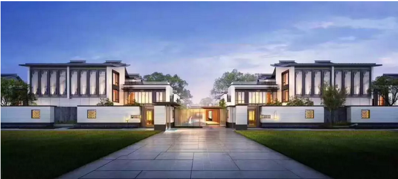
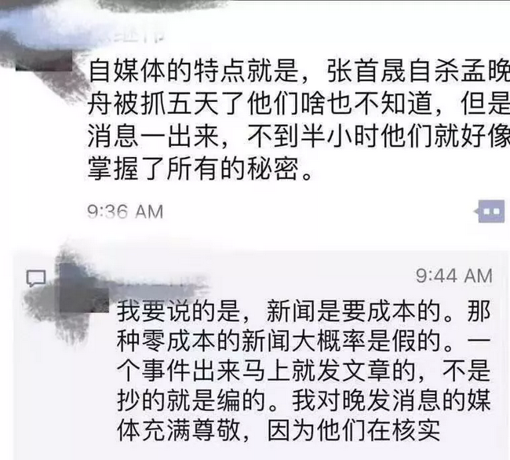
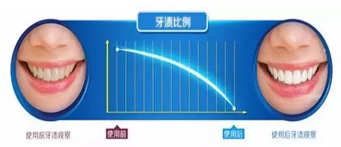

# 楼市的科技树被锁死了么 \#1970

原创： yevon\_ou [水库论坛](/) 2018-12-24

楼市的科技树被锁死了么 ~\#1970~

 

研发无力 

 

 

一）新闻V

 

12.22我在北京参加"新浪微博"房产年度互联网大会。大家给面子，位置也挺靠近C。

俺是抱着"学习进步"的心态去的。社交场合，主要是结识各大流派高手。

学习结果如何呢。一无所获。

 

我发现一个问题，其实很多"房产V"，并不是真正意义上的房产V。

他们依然是"新闻V"。

他们是媒体人，不是房产人。

 

出了水库系，对于大约90%的房产V，他们主要的工作是：解读新闻。

-   解读新闻

-   传播新闻

-   复述新闻

 

 

对于这些V来说，"政府的政策"就是最最重要的头等大事了。

-   朝鲜说要贸易，于是大热丹东。

-   搞个"租售并举"，全部都看好长租公寓

-   闹个甲醛事件，全部都看淡长租公寓

-   上周还有人问我，海南国际贸易岛，为什么不去炒海南，把我给气晕了。 

 

然而这是不对的

 

真正的楼市研究，应该是"由内而外"的。

从看房200套开始。

 

事物的发展，90%是因为"内因"。只有不到10%的干扰，才是"外界政策调控"。

房价涨，是因为房价被低估。

 

北京上海楼市，能涨到今天的地步，接近100000/m。纯粹是因为"内因"。

因为资本和人才的集聚。

因为帝都和魔都人才济济，商机繁荣，外滩新天地流淌着金钱的味道。所以才会有充沛的购买力。

 

 

你不能去看外因，外因的话，则年年都是"利空"。

从2003\~2018年，整整十五年了。每一年都是"调控"，每一年都是打压。

如果你光研究"外因"的话，你早就被吓死了。年年都是负面坏消息。

 

 

但是现在的V做学问，他们不肯踏踏实实地下"苦功夫"。

他们不肯从"看房200套"开始，切实地判断三房的购买人群是谁，二房的购买人群是谁，浦东和浦西的购买口味有何区别。贷款利率调整，对购房有何定量影响。

 

大家的研究都流于表面。都喜欢解读"最新政策消息"。

一个经济工作报告出来，相关的公众号可以写几十篇。前后持续半个月。

 

我是真心懒得蹭这种热点的。

菏泽现代史上，出过哪些名人。你们不会自己去查一下嘛。

这种地名，给我写，俺都不敢碰。

 

 

 

二）科技树

 

吐槽完这些不靠谱的"新闻V""作家V""悲情V"，就遇到了我们第二个问题。

 

 

吃饭的时候，"魔都财观"偷偷拉着我说："老大，最近有什么新的科技树"。

我大为诧异，"此话怎讲"。

 

观观尴尬地推了推眼镜说，"你也知道，近二年上海楼市的经济和行情，都不是太好"。

"按照原有的手法和技巧，大家赚不到什么钱"。

"前二天，上海大小的V，和管家公司们，闭门开了一个会"。

"研究新的对策，和生存之道"。

 

结果呢............

"结果大家二壶茶喝下来，发现整个'楼市学'的核心体系，还是水库那一套"。

"说来说去，最后总结的手法，还是叠债务"。

 

 

嗯，所以新浪开会，最后还是想到了我。

这么多做"楼市研究"的V们，你们都研究了啥。

 

市场不好做，生意难赚，就想问问有没有新的免费的"武林秘籍"。

难道我不说，你们就不会自己研发么。

 

 

 

三）被锁死的科技树

 

我举二个例子。第一个例子，是1945年之后的欧洲。

 

众所周知，1945年二战结束，是人类的一个重要分水岭。

二战之中，各项神奇的天顶星技术，宛如神迹。奠定了之后几十年民用科技发展的方向。

 

其中最主要的有：V2导弹技术，喷气式飞机，核能，电子计算机，广义相对论。

 

整个20世纪下半叶，人类文明乏善可陈。除了"互联网"，几乎没有真正意义上的突破发明。

一个1945年的人，穿越到2018年，他最多只会觉得"型号更新"。但是火车铁路无线电飞机，当时已经全部发明了。

 

 

 

你可以说科技停滞。但是，难道1945年之后，人类的文明，就没有革新发展了么。

"核心"科技不再发展，难道边缘科技也不发展么。

 

你这么漂亮的液晶屏哪来的，这么轻薄的手机哪来的。还不是近几年的科技产物。

飞机，高铁，廉价到人人都坐得起。难道不是时代进步。

 

 

推送人类文明进步的，有且仅有二股力量：

1）科学技术

2）科学技术的大规模应用

 

 

映射到楼市，整个原理也是一样的。

北京，上海等城市，接近饱和。而且在"限购限贷限价限售"的大环境之下，操作空间极大压缩。

京沪的市民，也有一点"疲了"。很多人买房子，终身无望。绝望性消费，对于"买房子"，甚至不再关心了。

 

 

但是中国这么大，不是仅仅只有北京，上海等一线城市啊。

中国还有很多个区域市场，远远没有饱和。

当欧洲经济进入停滞的时候，"亚洲四小龙"崛起了。此后还有中国，印度的大市场。

 

树挪死，人挪活。

哪怕同一套科技树，市场远未饱和。许多城市，宛如上海2001年。

 

在小说"三体"中，人类用了400年，都没有彻底完全消化现有的技术。

你们又何必担心"楼市科技树被锁死"呢。

 

把现有的边缘市场，全部都吃干净。足够各位过很长的好日子了。

动辄要求"更新更高"科技树，才是贪得无厌。

 

 

 

四）管家市场

 

第二个故事，是"有机农业"。

 

在一个类似于纽约，伦敦，北京上海之类的大城市。"有机农业"，或者非转基因农业市场份额，最终可以达到多高。

答案是8%

 

同样类似的例子："美白牙膏"。

美白牙膏，号称可以使得你的牙齿更白。Whitening面市的时候，它的市场份额，是爆发式增长的。

 

可是渐渐地，消费者发现，"美白牙膏"并不能达到广告中宣称的，使得牙齿白净的效果。很多是被夸大的。

但是依然有大量的消费者，追求哪怕"一丝一毫"的美白。

 

因此整个"美白类"牙膏的市场份额，表现为急剧的增长。然后到一个程度，就进入瓶颈期。此后长期在这个位置，不高也不低。

这个份额是多少呢，8%

 

8%是一个很特殊的数字，它意味着"细分特效市场"，能够急剧上升，并最终稳固住的位置。

 

 

好了，那我再告诉你一个被人忽视的数字。

有一家成立仅仅二年的公司，目前在上海市场的二手房交易份额，已经占到了1%

有一家成立仅仅二年的公司，目前在沈阳的一手房代理市场，份额已经占到了2%。成为最大的代理公司，超过中原链家。

 

 

我们说的第一家公司，是"淘屋"。

过去二年，"水库系"主要的科技树突破，都集中在管家公司领域。

to C固然是科技，to B同样也是科技呢。

 

在过去的二年中，雨后春笋般冒出来十几家管家公司。目前，他们普遍已经渡过了创业最初的迷惘期，找到了自己的赚钱模式，站稳了脚跟。

绝大多数管家公司，月收入已达到二十万（纯人力，没有成本的）。

 

 

其中最大的"淘屋"，已经开始进入公司化运营。

合法注册，合法纳税，企业化招聘。

在公司管理，管家流程，客户服务，人员培训方面，积累了大量的经验。

 

淘屋目前有50名员工，占上海二手房市场的1%

如果他们可以象"细分特效市场"再成长8倍。

也就是他们的员工，会超过400人。年利润超过2亿。

霸占一整幢写字楼，怎么看都是一个超级巨无霸。

 

 

更何况，这还仅仅是上海一个城市的8%

你再设想一下，假如管家公司，可以拓展到全国Top20的主要城市。北上深广宁杭汉蓉渝津。

"管家公司"这盘生意，又可以值多少钱呢。

 

仅仅是几个年轻人的奋斗和创业，不知不觉中，一个朝阳产业正在成型。

企业上市的科技树，或许比他们自己买房子，赚得更多。

 

 

中国人的传统，重视"硬核"科技。轻视服务业。

丝毫不知道60年代的Walmart，80年代的电视机，今天的微信，是多么伟大的创新。

 

"经销与营销"，一样也是科技树。

而且赚钱更迅猛，更暴利。

 

 

 

五）忽悠

 

等俺滔滔不绝讲完了这二串道理。魔都财观取了一片薄饼，夹了二片烤鸭，放了三丝黄瓜，四缕大葱，蘸了半勺甜酱。

 

"老大你变了"

"你以前不是这样忽悠人的"

"我又不是惘奸，科技树说一个塌一个"。

 

"大家要的是立竿见影的做法。在目前困难的时局，怎样赚点钱，没赚到钱的怎样更好地活下来"

"你说了很多，都有道理。可是这些道理，并不能立刻变成钱"。

 

 

我也严肃了起来。

"一个体系一旦建立了起来，其框架是不会变的"。

"水库体系的核心，就是叠债务，做空货币"。

"这样的年份，看空货币只有更坚定"。

 

"其他的借钱，筹款，信用卡贷，无非都是细节战术"。

"你们连跨越一个牛熊的耐心都没有，盲目追求高科技。这不是勤恳踏实的做法"

 

 

财观默默地把包好的烤鸭递给了我。

"满嘴是油，对吧"

"那您就一定还有办法。只不过你不说"。

 

  

 

（yevon\_ou\@163.com，2018年12月23日晚）
