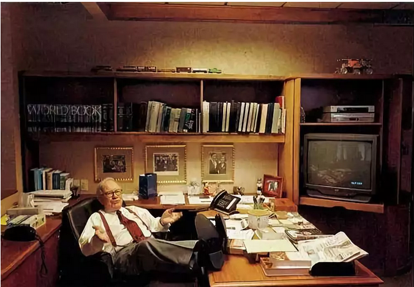

# 

**究竟谁在投机 ~\#1980~**

 

根据2011-02-16旧贴《[究竟谁在投机]》改写。

 

 

 

一）前言

 

二天前，有人塞给我一篇帖子《[[一位地产高管的2018年朋友圈]](https://mp.weixin.qq.com/s?__biz=MzA5MTc5MjE1MQ==&mid=2649555610&idx=1&sn=a33d9650797b042324ca6da6c5f69276&scene=21#wechat_redirect)》。这是一个很烂的高管，遇事蒙昧不明。哪家地产高层请了他，估计会战略决策失误。

 

其中有一句话，让我觉得似曾相识。

-   股市和楼市的两大差别，门槛和数据真实度。

-   股市的门槛低，但是数据真实度高；

-   楼市资金门槛高，但是往往很多城市的相关数据，都是经过美颜处理的。

 

 

 

2007年的时候，哥哥当时还在天涯晃悠。

天涯有一堆看空的傻V，类似于小象爸爸，天上的一朵云。较奇葩的，还有一个叫做"黄祖斌律师"的。

 

黄祖斌那帮人，属于"技术分析派"。

"技术分析"啥意思，就是完全只看K线图。根本不需要F10,从来不打开看"基本面"的。

 

 

从来，股市里"基本面"和"技术面"就是二批人，互相鄙视看不起。

只不过2007年那一次，黄祖斌不知道怎得，咬到了楼市身上。

 

黄痛斥楼市是一个不透明的，投机的，疯狂炒作的，连赌场都不如的骗局。

原文在这里：《房价与股价的四大区别》

[bbs.tianya.cn/post-house-62142-1.shtml]

 

哥哥懒得，一直到四年后才写了驳斥：《究竟谁在投机》

[bbs.tianya.cn/post-house-292892-1.shtml]

 

 

 

二）四大区别

 

当年，有人痛斥楼市是一个"不透明的，投机的，疯狂炒作的，连赌场都不如的骗局"。

 

他们的理由有四点：

1）股市有精确价格，楼市没有

2）股市有精确历史价格，楼市没有

3）股市有精确交易量，楼市没有

4）股市有精确挂牌量，楼市没有

 

 

设想一下，今天（600519）贵州茅台的收盘价是565，昨天是568，前天是572，这些都是清晰可查的。

对于理工数字男，是极大的安慰。

 

可是楼市不一样。楼市根本就没有"硬核"的估值算法。

一套房子，受楼层，朝向，采光，景观影响很大，基本都是"一房一价"。评估公司即便给了报告，最低精度也要到万位数。

 

而这个价格，也还是虚的。成交还要看买卖双方角力协商。

绝不代表，下一场交易，就可以按照"市场价"成交。

 

 

至于"历史交易数据"呢。抱歉，不仅不提供，而是很可能，是根本就没有！

很多房子，从20000/m涨到50000/m，它是一口气涨上去的。当中根本没有经过充分的换手。

有些市中心的小区，几年几个月的交易都是空白的。零换手。

 

 

除了价格上面的"透明度",交易量数据也是不透明的。

每个月，交易中心成交多少套，各自以什么价格成交。这些是不对公众披露的。

哪怕你披露了，申报价格，也未必是真实成交价。

 

整个楼市的成交，完全没有置于"公众监督"之下。

没有几千几万双眼睛盯着，谁知道你有多少暗箱交易。

 

在股市中，你很容易地看到买一，买二，买三，卖一，卖二，卖三。

在楼市中，你完全不知道买家在哪里。买家愿意出多少的心理价位。不知道承接力度有多深。

 

 

 

对于"技术分析派"，他们来到楼市，顿时感觉就绝望了。

全部的信仰，圣经，精神支柱：K线图没有了。

 

没有MACD，没有KDJ，没有钝化金叉十字星。

一堆楼市V，全部都是写文章的，连一个跑"大数据"的都没有。

人家就是要秀刀片服务器，跑上几十兆瓦时，这个才能叫"高科技"嘛。

 

综上所述，"技术分析派"痛斥楼市低端庸俗。

他们趾高气扬地给了一个结论："下九流"。

连赌场都不如。

 

 

 

三）红苹果

 

好了，现在作为楼市中的V，请问你该如何反击。"不透明的，投机的，疯狂炒作的，连赌场都不如的骗局"。

 

俺就不要用"上证指数收盘价"了。打人别打脸。

哥哥叹了口气，拿起一颗士多啤梨。

 

咬一口，甜不甜。

请问，我现在到超市去，要做出一个"是否购买草莓"的Shopping决定。

我需要哪些信息？

 

我需不需要知道，这箱草莓的农地价，批发价，进货价，冷链运输费，仓储运输费，换手率，毛利率，冷库现有库存么。

 

你TMD神经病啊，买草莓呐。

我需不需要知道，超市草莓上个月的挂牌价，价格走势，K线图，下一个价位的卖一，卖二，卖三。

 

这些统统都不需要。事实上，我只需要一个信息：

这草莓甜不甜

 

甜不甜，好不好吃，是否鲜嫩多汁。

富含维生素，个大径圆。饱满卫生。

 

 

 

我们再举一个反例。假设我现在去买一箱草莓。果蔬好的奸商，出示了全套"交易流程数据"。

包括但不限于：历史成交价，换手率，仓库库存，52周最高，52周最低，其他竞买人报价......统统精确到小数点后4位。

 

但是，超市唯一的限制是：不许打开箱子。

 

不许打开箱子。你不知道里面是不是烂桃子，坏桃子，酸桃子。甚至没桃子。

果子品相如何，口味如何，甜度如何，你一概不知道。

你手里只有一份报告，说果子的数量，大约是60个。

而这份报告，也是高度存疑的。

 

然后一群SB，不打开箱子，凭着"历史交易数据"，凭着K线图圣经，自得其乐地在那里互相交易博傻。

用了几千台电脑服务器分析，美其名曰"大数据"。

拜托，箱子里桃子都快被偷光了。

 

请你告诉我，到底谁在投机！

 

 

 

四）初心

 

我们已经走得太远，远到了忘却了初心。

究竟是什么让我们决定，买入一项资产。是K线图么，是买一卖一卖二么，是主力持仓成本么。

 

巴菲特说，他买入一支股票，甚至不需要知道它的历史交易价格。

伯克希尔哈撒韦办公室的桌面，连电脑终端都没有。

 

当我们决定购买一所房子之时，我们只需要去现场看看就行。

 

我们只需要在夕阳落日之下，凭靠着栏杆，看看远处的景色。

伸出双手，摸摸墙上的涂层，门框的木质。

用脚踱步，切身感受房间的大小，跃起摸高层高的度量。

 

"苹果甜不甜"，我心里很清楚。

 

 

我不需要知道它的K线图，不需要知道它昨天，前天，去年卖什么价格。

这些信息一点意义都没有。如果你不想投机的话。

 

你买入一斤草莓，不是因为它今天20元，昨天21元，明天即将22元。

低位抄底，高位可期。

 

你买入一斤草莓，是因为它很甜。它的甜度和口感，对得起20元的售价。

 

 

 

自本世纪初，关于"房地产泡沫"的说法，就不绝于耳。

"股市被低估，有价值"，几乎把所有的宣传力度，购买力都往股市里推。流量死命导。

 

可是你真心想一想，"究竟谁在投机"。

 

你不知道金风科技的主营收入是多少，你不知道华锐风电的业务在哪几个省份，你不知道财务报表是按哪一年版本的会计准则，你不知道一般性收益和偶然性收益的区别。在绝大多99%的情况下，你甚至不能信任A股财报的真与假。

 

中国A股对上市公司的约束几乎为零，中小股东对公司治理，更是完全毫无钳制。基本上99.99%的中小股东，都没有看过200页的季度报表。可以这么说吧，除了一个股票名称和股票代码，"你对这家公司一无所知"。你唯一关心的，是明天股票开盘价。

 

 

股市里面拥有完备的"交易数据"。动辄下载几十G的信息包。

等你掌握了哪怕全部的K线信息，你能涉足"企业管理"么。

 

这家公司，黑箱打开，里面究竟是什么样子的，苹果甜不甜。

大股东有没有掏空公司，有没有关联交易，有没有采购回扣。

你一无所知，即使你知道，你什么也管不了。

小股东微薄权益和保护，都伸张不了。

买卖一个黑箱子，算什么本领。

 

 

投资和投机的区别，在于买卖房地产，房子是"捏在"你自己手里的。

不需要再经过一层代理人陷阱，明明很好的公司，就是不分红。再过几年，莫名其妙钱都卷走了。

 

"控制权"才是上流社会的分水岭。

买卖K线图这种事，下九流，不入流。

 

炒股的都是下九流

 

 

 

（yevon\_ou\@163.com，2018年12月26日寅）
