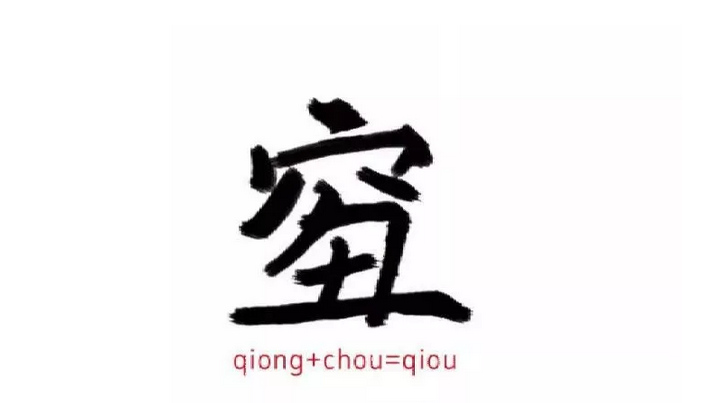
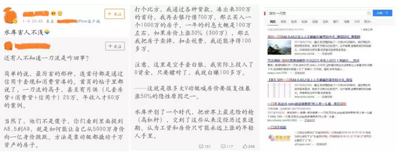
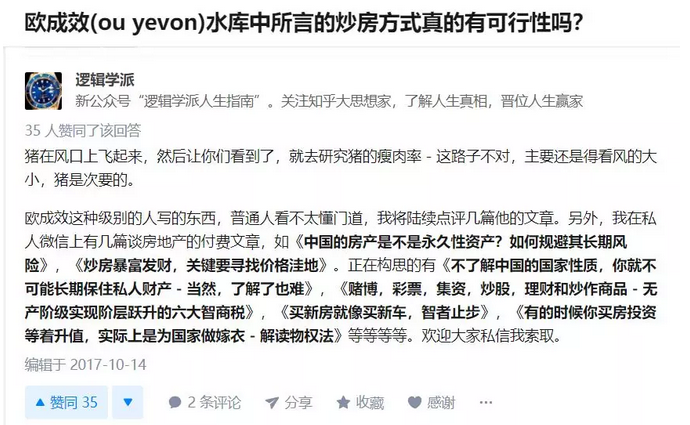
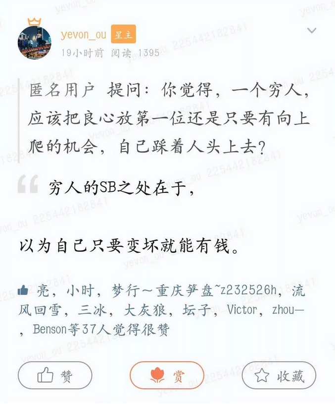
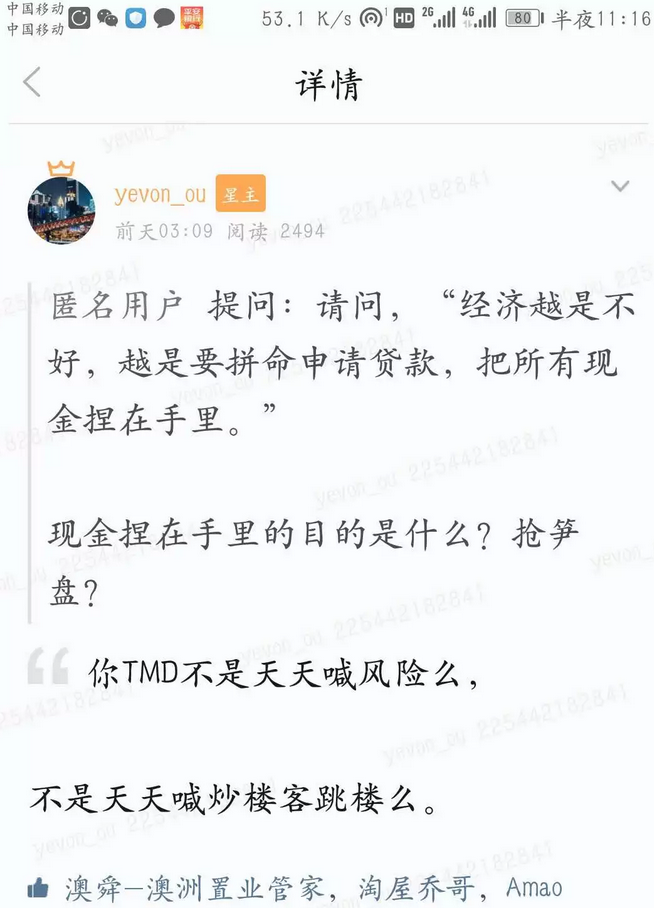

# 听说你一刀流断供了 \#1990
-------------------------

原创： yevon\_ou [[水库论坛]](/) 1月10日

**听说你一刀流断供了 ~\#1990~**

 

 

一）围攻

 

前二天哥哥在KL机场，被粉丝认出来了。

粉丝十分热情，拍照合影之余，还请俺吃哈根达斯冰淇淋。

 

揭开盖子一刻，粉丝来了句：

"听说你破产断供了"

"断供了，会不会被限制消费啊。还能坐国际航班"。

"我请你吃高档冰淇淋，不违法吧"。

哥哥手一颤，差点把葡萄兰姆酒的盖子，塞到她嘴里。

 

 

"你这乱七八糟的，都哪听来的"。

"深圳小V们盛传的呀，什么流血的ofo，戴威不是被限制消费了么"。

哥哥叹了口气。

"网络垃圾传言，最好少看"。

"前二天有个叫徐波的家伙，发微博胡说八道。哥哥打个电话，就让他删掉了"。

 

 

有时候我想想，这个世界也挺有趣的。我讲一个故事给你们听。

 

苏东坡与僧人佛印是好朋友。

有一天，二人相约打坐。苏东坡突然问道："大师，你看我的坐姿像什么？"

佛印看了他一眼道："我看你坐姿，像是佛祖！"

I'm fine，and you？

苏东坡摇了摇头，说"我看你，就象一堆牛粪"。

 

回到家里，苏东坡得意洋洋，和妹妹说起此事。

苏小妹摇头说："哥哥，你又被和尚耍了"。

佛家讲究"佛心自观"，你看别人是什么，就表示自己是什么。

 

 

我们看起点中文网，相当于中国杀马特的文字总输出。

对于一个三四线的小镇青年，他描写的商战巨亨，霸道总裁，是什么样子的。

 

-   动不动就是一竹筐iPhone，送同学随便挑。

-   炫富主要靠豪车。巨富靠五辆豪车。

-   霸道总裁嘴角"邪魅的微笑"。

-   再写下去，就是打胎，劈腿，割脉了。

 

 

因为对于一个驻马店绿发杀马特来说，他的"世界"是极端匮乏的。

他从来没有见过，外面的世界是怎么样的。身边接触的人，也都是社会底层。

 

网吧买瓶蜂蜜水，吃泡面加条火腿肠；

就算跨越"好嗨哟，人生的巅峰"。

 

这样的人，写"商战小说"霸道总裁，必然是不接地气的。

因为他根本就不知道，商业社会，企业尽职，究竟是怎样运转的。

 

 

在他"虚构"的世界中，空虚而苍白。

前一秒是前台小妹，孤苦伶仃。受够了继父和继母的虐待。

下一秒就是"邪魅地微笑"霸道总裁疯狂爱上她。给她买名车，豪表，iPhone。

 

当中有铺垫过渡么。有衔接场景么。

有白领间普遍的聚餐，抱团，八卦和诸婊么。没有。

有上流社会必不可少的酒会，家族，管家佣人司机秘书二秘么。没有。

 

 

下一集后，几乎99%的"女频杀马特"小说，"冲突"集中在劈腿，打胎，割脉，撕头发。

永远象拉三一样，泼妇打架。

因为作者的生活中，只有这些元素，他是熟悉，经历过的，贫民窟充斥不鲜。

 

 

"酸柠檬联盟"反对的不是水库。

而是他们想象中的炒房客。

 

 

 

二）断供谣言

 

为什么会有"断供"的谣言呢。

当很多微博小V发言的时候，他们批评的，其实不是"水库"。而是"他们想象中的炒房客"。

 

-   凡说多军，一定是杠杆加到极致的。

-   凡说多军，一定是三个月不涨就跳楼的。

-   凡说多军，一定是借高利贷的。

-   凡说多军，一定是买贵妇CEO盘，买在顶峰的。

 

TNND，你怎么不写"堕胎文"呢。

 

 

为什么傻空小V们，会将如此"呆板死蠢"的印象，套到水库锅上。

因为他们只懂下三滥，下三路。

屌丝底层厂妹的眼光。

 

不客气地说，微博上所有批评水库的小V们，没有一个严谨地看过水库系列整体。

水库接近600篇文章，200万字，相当于十本厚厚的《欧绅文集》。

 

除此之外，因为生怕理论写得不完善，实操不详细。

水库还有"知识星球"。几乎是一步步教，手把手教。

 

过去二年中，水库"知识星球"积攒了恐怖的4500 0000字。

人类很有希望，诞生第一个"亿字"问答社区。

 

{明年准备停球}

 

 

而傻空小V们呢，他们几乎没花几个小时了解"水库体系"。

要不就是轻飘飘的一句："他这一套以前是可以的，但现在形势不同了。今年再这样玩法就是找死"。

TMD你这不是废话么。

如果水库系统"去年有效，今年过时"，那还会形成今天这样庞大的枝叶体系么。

 

所谓理论，当然就是Sub()。

输入参数不同，输出流程也不同。一套理论可以适应很大范围的通用性。

 

 

目前我们看到的反对者们，很大程度反对的，是"他们想象出来的炒房客"。

"他们想象出来的炒房手法"。

"他们最希望的死法"。

 

而且我对于这帮家伙，抱有深深的怜悯。

 

为什么，因为他们懒。

他们是如此地懒，统统都是学渣。无法集中精力，从事数小时以上的认真学习。

 

因此当下一轮牛市来临时，或当水库传人取得成功，赚得数百万升值时。

他们也会眼红，又会杀进去。

采取他们自以为是的"伪水库一刀流"手法。

 

 

你心中有什么，你眼中看出去，就是什么。

你心中是狗屎，眼中看出去，都是狗屎。

下一轮牛市操作时，你必然采取最狗屎的手法。

 

 

 

三）务实

 

骂了二段"心中狗屎"。也有读者要求，您能不能别情绪发泄。

讲点干货？

毕竟大家是来学真本事的。

那么我讲几点。

 

 

1）是否断供，和"一刀流"没有任何关系。

 

这是"内行人"心知肚明。外行人极易踏坑的一个新闻关系。

你基本只要看到"房价三个月不涨，濒临资金链断裂"。就可以直接mark作者是个SB。

写的，转的，赞的，炫的，全部都是SB。

 

因为"涨价与否"和"现金流断裂"没有关联。

实战过你就知道，一套房子涨价+30%，这是令人满意的牛市。

可是你的现金状况，丝毫没有改善。

  

一套房子，涨到130%，你是不能加按揭"再抵押"的。

抵押率一般是55%，130\*55%=71%，

而普通的按揭，杠杆率通常70%

 

抵押率"天生"的缺陷，哪怕不考虑恶劣的"手续费"，你也是没钱抽水的。

那么，大家乐此不疲谈论的"牛市"，究竟还有什么意义？

 

"牛市"的价值，主要来自于"士气"。

不管房价涨三成，跌三成，对于你的现金流状态，几乎是一模一样的。

 

唯一的区别是，涨三成"欢欣鼓舞"。全家人团结在你的周围。

跌三成，或者不涨不跌，则"小人白眼"。冷嘲热讽总免不了，家里血肉骨肉至亲，有得是人希望你丢脸。

 

 

在"赚钱团结"的大好局面之下，很多资源可以"解锁"。

解锁，才是真正核心之处。

 

譬如说，你的父母，突然奇迹般的变出几十万养老钱。想要交给你去打理，并鼓励你继续买入更多。

亲戚朋友，不仅融资容易，还有人要拿钱出来"跟投"。

 

哪怕你自己继续去办信用卡，信用贷，心头也是"暖洋洋"的。

办理这些金融工具时，浑身充满了斗劲。

 

 

 

这些事，遇房价下跌三成，不涨不跌的时候，可以做么？

答案是一样可以做。该融的钱，还是可以融。

能搞到的钱，最后一样可以搞到。

 

区别是，"一片极寒"之中，要"解锁"资源，就显得很不容易。

你父母或许会破口大骂。哪怕连配偶，也会疑神疑鬼。ZMN的钱更是不用指望。

亲朋好友，非常难以劝服。

全靠跪。

 

唯一不会抛弃你的，是银行。

银行不管房价涨跌，该申请的卡，继续可以申请。

 

 

在今天的世道中，兼具"限售"等诸多约束。

我们买房子时，从来就没想过三个月抛售。

 

这段时间是涨是跌，对"现金流断裂，炒家跳楼"毫无区别。

唯一的影响，是解锁融资。

是受更多家里的指责咒骂白眼嘲讽侮辱短寿。

 

 

 

2）余力法

 

 

如果经济极度萧条，真正会"跳楼断供"的，也不是多军。

因为绝大多数"非水库系"菜鸟，他们的财务思路是错误的。

如果你购买"理财课程"99元某某，则你的严重程度，会错上加错。

 

 

绝大多数的乡村杀马特，尤其是穷人，他们秉承的是"不贷款"原则。

贷款多可怕啊，还要付利息。借一百万，一年足足要五万利息。

 

5W很多钱么，楼市一个涨跌停，一共涉及多少万？

身家性命相博，粮草值多少钱。

但是傻空小V的眼皮，就这么浅。几十元等额本金/本息，抖抖索索省很久。

 

越是经济萧条的时刻，越是应该多贷款，把更多的现金捏在手里

 

 

你拼拼凑凑，只需要贷四成就够了。年限还压得特别短，只贷了十年八年。

智商极低的人，甚至喊出了"前几年还的都是利息""30年本金接近翻倍"。

 

不要这样做，老老实实6.5成贷满。剩下二成宁可捏在手里。

哪怕存银行，让银行白赚"存贷息差"。舍得牺牲。

 

这里面学问就大了，一言难尽。

你应该关注真正的"水库体系"。

 

 

（yevon\_ou\@163.com，2019年1月9日晚）
