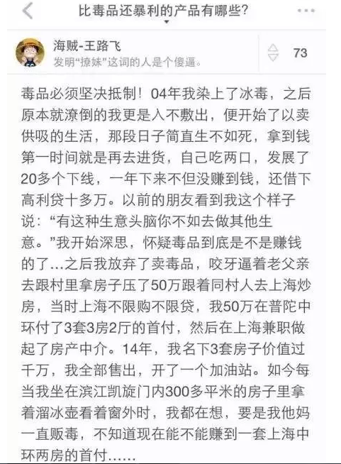

# 业绩的上限 \#2030

原创： yevon\_ou [水库论坛](/) 2016-06-03

业绩的上限 ~\#2030~

假设有一个人，是从2050年穿越回来的。他清楚的知道2000\~2016年之间楼市发生的所有事。

 

请问他可以赚多少倍？

 

 

一）翻倍

 

很久很久以前，我们就在想这个问题。假设一个人绝对不犯错。他清楚的知道，过去16年中，开了16把大。

 

他既预知了全部的K线图，而且也是一个行动能力很强的人。拼了全力去做。今天他能多有钱。

 

 

一些无知的人，譬如那些"蚂蚁变大象"，很喜欢将06\~07一波行情，就夸大为升值一百倍。其实这是绝对不可能的。

 

房地产最大的问题，是出不了货。一轮"暴涨"的行情，譬如2015.10\~2016.3，在短短的五个月内，上海房价就涨了50%。五百万的房子涨到了750W。

账面上看是不错。可是在750W这个价位，真正内行的人都知道，他是非常非常难以出货的。

 

因为市场上价格已经到了，但是买家还没有"屈服"。

买家喜欢的是什么呢。喜欢"观望"。你一下子涨了+50%，再让我接，我岂不是冤大头？

所以买家非常喜欢观望。价格虽然锁死在750W，但是成交殊为不易。

而真的要大量成交，或许又要等18个月。等到买家"观望结束"，确信房价就是这个价。

而这时候，新一轮的上涨又蠢蠢欲动。或许房东就跳价到950W了。

"出货不易"，导致外行人写的小说，处处破绽处处笑料。

 

 

好了，我们言归正传。假设有一个人，站在AD2000年的关口。他手里有50W元现金。请问他2016年有多少钱。

\[1\]

 

如果单纯以房价论，上海楼市十六年大概涨了16倍。50万可以变成800万元左右。

如果算上贷款的话，50W元三成首付，可以买入150W的房产。剩余部分付契税维修基金。

 

\* 一般单套150W元，在当时已经算顶级豪宅了。CEO盘涨幅不高。

如果他绕开第一个坑，买入三套50W的房子。譬如4000\*125平米。

则今天总资产在150W \*16倍= 2400万左右。

 

 

如果我们算一下的话，2400/50=48，勉勉强强当五十倍吧。

 

 

二）收入模型

 

所以，2016年和2000年的换算比例是50倍。

2016年的5000W，相当于2000年的100W身家地位？

这个说法，可以说是完全错误。

 

 

为什么，因为以上的"上限状况"，仅限于一类人群:"80岁无子女孤寡老人"。

为什么这么说呢，因为15年前，除非你65岁了。否则你不可能没收入的！

 

对于绝大多数人来说，更有可能的一种资产模型，应该是：

"2000年时你25岁，拥有一定的资产和家族支持。此后的15年你在职场上班，收入薪水不断上涨，持续投资"。

 

这样的一个模型，才是更贴切的模型。

 

 

也就是说，更有可能的模型是："2000年时，你有50W。还有每年5W的收入，收入按照每年+20%递增"。

请问这样一个模型。你最终的资产额，可以积累到多少。

 

为了这个模型，我们需要一个复杂得多的表格。

 

           现金     房价/m   面积   总价      三成首付
  -------- -------- -------- ------ --------- ----------
  2000     500000   3000     500    1500000   450000
  2001     50000    3568     42     150000    45000
  2002     60000    4243     42     180000    54000
  2003     72000    5045     43     216000    64800
  2004     86400    6000     43     259200    77760
  2005     103680   7135     44     311040    93312
  2006     124416   8485     44     373248    111974
  2007     149299   10091    44     447898    134369
  2008     179159   12000    45     537477    161243
  2009     214991   14270    45     644973    193492
  2010     257989   16971    46     773967    232190
  2011     309587   20182    46     928760    278628
  2012     371504   24000    46     1114513   334354
  2013     445805   28541    47     1337415   401225
  2014     534966   33941    47     1604898   481469
  2015     641959   40363    48     1925878   577763
  2016     770351   48000    48     2311053   693316
  合计：                     1221             

 

这是一个大幅精简的表格。已经省略了"月供---房租"的差额。

夫妻二个，假设都是50000元/年的年收入。生活开销只花一个人的钱，净储蓄50000元。

考虑到税费装修杂项，"三成首付"=现金\*90% 

 

如果我们观察这个表格的话，他最终买入了1221平米。比模型1几乎多了2.4倍。

如果按照尾端房价48000 \* 1221 = 5858W

贷款还剩下：1023W

实际净资产：4835W

负债率：17.5%

 

这是一个现实得多的模型。也是许多白领小夫妻"应该"有的模型。

或者说，在多军内部，"死多"的下场。

 

多军内部不乏许多"死多"拥趸派。

所谓"死多"，就是2000年时非常非常早期，就极度极度看好。一枪头把所有子弹打光。

把所有子弹打光还不够。随着时间的推移，此后每一年你会有"新的积蓄"。

 

 

"新的积蓄"是一件非常奇妙的事。之前一年，你觉得骨髓都要流尽了。筋疲力尽，把所有的血液骨髓榨光。

可是开春过了几个月，拿到了年终奖，补贴，外快，零零碎碎总有收入。

渐渐地，你手里又有了一笔小钱。

 

这真的是非常"奇妙"的一种体验。所谓贱贱贱贱贱，再买就剁手。

前一阵子满地打滚，发誓再买不是人。后一阵子则千手观音，手永远剁不完的。

 

 

如果你是一个"死多"，或者买房已上瘾，中度或者重度患者。

则你会想尽了法子，把每一分钱都变成房子。将每一寸力量都榨干。过一阵子就去买套42平米的老公房。十几年十几套老公房。

 

对于"死多"来说，资产的极限，大概是100倍。总金额在5000W元的样子。

这就是今天"多军"内部，极大多数人身家维持在4000\~5000W水准的原因。

数学模型决定了上限。

 

请记住五字真言： "买买买买买"。

 

 

三）上上限

 

那么，为什么多军内部，会有人资产比5000W更多呢。

因为他们的算法不对。

 

在"死多"之上，还有"死多多多"。要换一种玩法，比死多更死多。

A9和A8是二种算法。很后面再讲。

 

 

四）普通人

 

5858W，100倍，是一种极限算法。

一般情况下，一般普通人，是连5858W都达不到的。

 

 

为什么，因为普通人一眼就看到："你的按揭哪去了"？

普通人买房子，最关心的就是按揭。

上手50W买150W的房子，就要有100W按揭。月供5500元左右。

 

在2000年的时候，5500元是一个天文数字了。你旁边也可以看见，对于白领夫妻的设定，不过是"年收入5W"元。

更糟糕的是，此后部队没有得到休整。紧接着2001年，你又开始了第二场"战役"。

 

首付5W元，买入15W元的老公房。于是你又多了10W贷款。

你又多了10W贷款。

你又多了20W贷款。

你又多了30W贷款。

...............

 

财务象压死骆驼的稻草，是不停积聚着的。虽然多军看到此处时，已经是"会心一笑"。

可是傻空始终要揪着你的领头，蠢蠢问个清楚的。

 

 

问题的第二个部分，还是"全资产"收益率。

在2000年时，你其实是没可能"全资产"扑上的。

 

2000年假设你有50W元。但是这五十万不一定是你的钱，可能是你妈的钱，可能是退休工人一辈子的收入。

你初出茅庐，大学毕业。

 

你说你要全仓扑上，投资于一项"三倍杠杆"的危险事业。

家里人的第一反应，肯定是"稳健不足，轻佻草率"。

当你青涩无毛时，你是绝对不可能指挥全家跟着你搏命的。

 

 

真正的情况，更象是什么呢。以某情圣为例。

某情圣弃笔从戎，拿着设计院三年积蓄，30000大洋。去买了一套房子，赚了20W。

 

然后他以这20W元为根本，晓之以理，动之以情。

"这玩意赚钱啊，回报大大地高"。

老太太被说动了。答应取10W出来入股。

 

然后他拿了20+10W。再去炒套房子，又赚了20W。

分给老太太10W。

老太太激动了。颤悠着又掏出了30W。

 

他拿着30W，又去赚了30W。

老太太又掏出了50W.........

 

可见，"信任"是一步步建立的。

只有随着你的成功，你才获有更大的声望。有了更大的声望，你才有更大的授权。

如此循环。

 

等到某情圣最终把老太太手里的几百万全部都争取出来时。时间已拨过了2005年。

炒楼业最黄金的，涨得最快的几年。已悄然度过。

这也是没办法的事。你的确是尽力了。

 

"实战"的成绩，肯定是要比理论上限要低的。

一般我们身边，能翻到100倍"上限"的人极少。或者不说倍数吧，资产能超过5858W的人极少。

 

通常情况下，能做到50倍。或者净资产可以突破3000W元。已经可以说你是成功人士了。

 

 

 

（yevon\_ou\@163.com,2016年6月3日晨）

 

 

 

[\[1\]]这张图的错误之处在于： 

1）村里的房子，是绝对抵押不出50W的。

2）买房的初期，是绝对的负现金流。而高利贷几乎是每周都要结算利息的。你根本熬不到六个月。

3）普陀中环二手房很难卖到1000W。

4）一个加油站就要3000W
