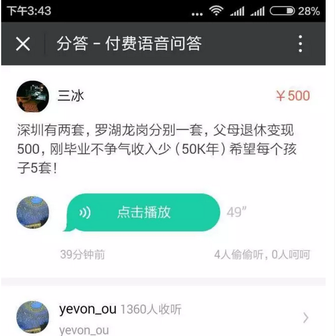
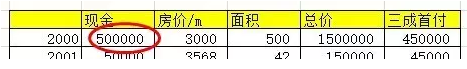
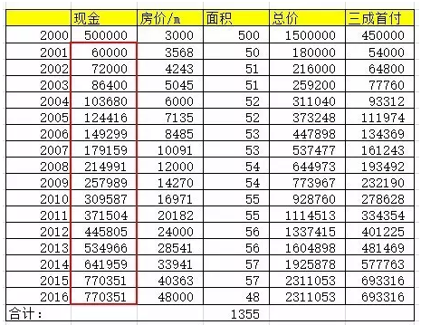
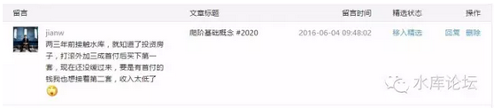

# 更多更早的金钱 \#2040 
----------------------

原创： yevon\_ou [[水库论坛]](/)
2016-06-04

更多更早的金钱 ~\#2040~
=======================

科技树主要是二个方向：

 

-   获得更多的现金

-   获得更早的现金

 

 

一）掘地三尺

 

昨天分答上有人提了一个问题，十分有趣。建议去看看。

首先我们讲"精细"的问题。

很多人挂在嘴边的一句话，"炒楼"啊完全没有技术含量的事情。

 

 

对于很多工科男来说，他们心目中No.1难度的，肯定是自己的工程力学，建筑力学，半导体无线电。

其次，"炒股"也被认为是一门有技术含量的学科。许多"股神"的论调，股票要炒得好，得关心国家大事，宏观经济，美国加息，次贷危机。

最后，"炒楼"普遍被认为是"没有技术含量"的事。很多人对于炒楼的印象，就是跑到售楼处去买了一套房子。

 

我们知道，这样的人，通常会死得很惨。他们要么是在黄金岁月没有买房子，当了傻空。

要么就是跑去远郊CEO买了一手盘。别人的巨大涨幅，到了他们手里就霉成没有涨幅。

 

 

"炒楼"真是一件很复杂的事。Section 1写了一百多篇。

你越是深入看得越多，越是觉得这里面门槛套路真多。歪歪曲曲的都是技巧。每多学一个技巧，你的回报就增加一点。类似于售出之前一定要打扫干净。

 

可是，接着在Section 2里面，我们要说:"付款"也是一门大学问。

简简单单的"去买房子"，可以被我们演化出无数伎俩，无数杂学。在平地处起惊雷。

而简简单单的"去付款"，同样也可以演化出无数诀窍，无数伎俩，于三尺处掘出清泉。

 

Money，国之大事,死生之地,存亡之道,不可不察也。

对于金钱，他主要的科技树有二个发展方向；

1）获取更多的现金

2）获取更早的现金

 

 

二）更多的现金

 

我们看回昨天《[[业绩的上限]](http://mp.weixin.qq.com/s?__biz=MzAxNTMxMTc0MA==&mid=2651014693&idx=1&sn=542fd158ef54081133956b8e7bb9c887&scene=21#wechat_redirect)》。

 

对于普通人来说，上限大约是5858万。再打个折扣。

钱总是越多越好的。任何人都喜欢发财，那么问题来了，怎样赚更多。

 

他的第一个解决方案。是"初始资金"更多。

好比这个表格里面。他的起步资金是50W元积蓄。

如果你换一个想法，刚开始第一年便拥有80W，100W，500W呢？

 

"以力破巧"永远是一等一的王道。

你再多的技巧，也抵不过别人是土豪。

你费尽心机，精研最佳版块最佳涨幅。可是你抵不过你买１套，别人买10套。

 

如果在2000年的时候掏出来500W，买上十套房子。

则到了今天，无论再怎样计算，也是上亿身家了。

(除了买浦东CEO盘那些可怜虫)

 

第一个发展方向，是"获得更多的现金"。

当然，这事说说容易，实际做起来一点都不容易。

 

 

在2000年时，"金钱"和现在绝对不是同一个概念。不仅仅中国还是一个贫穷薄弱的国家，香港老俵来到大陆依然是被当娘舅看的。

500W现金，说起来容易嘴皮一翻。可实际你要去操作，简直和今天动用5000W现金难度差不多。

更何况你还要贷款，还要月供数万。

 

人可以使自己获得"超额"现金的机会是很有限的。一般来说，无非是联姻，继承，彩票中大奖或者砸锅卖铁。

你要极其谨慎地使用手中每一分力量，精算到极限。才能做到更佳。

后面再讲。

 

 

三）更早的现金

 

第二种方法，则是"更早的现金"。

也就是我并没有办法，"无中生有"变出钱来。大家的当年都是苦哈哈的。

 

但是我能不能"提早"一些拿到这些钱。

譬如同样一笔100W的资金，如果你09年给我，自然不如08年给我。

08年买房，不如07年买房。

07年买房，不如06年买房。

06年买房，不如05年买房。

 

 

这里面"资金到位"的时间差个二三年。房价可能就差一倍。

你买一套，就能变成买二套。

就能额外多赚几百万。

例如这个表格，我们把昨天的"年收入"，全部都前移了一年。

则他最终可以拥有1355平米，而不是1221平米。

增幅+11%

 

 

看到这里，你或许已经明白"炒楼魔术手"的基本概念。

我们并没有"点石成金"的法子。

我们并没有哪一个大法，300个字，你抄到秘录之后，照本宣读，直接就可以发大财轻而易举赚很多的钱。

 

我们是一系列的"小技巧"。

每一个技巧，或许就是帮你额外搞点钱，或许就是帮你"提前"搞点钱。

或许就是"几十万元提前几个月"，这么微不足道的数量级。

 

 

"几十万元提前几个月"，对于很多浑浑噩噩的人来说，这就是身边溜走的一条小鱼。许多人活期一放，忘了存折在哪，这类事也常常发生。

而放在房地产市场呢，那就是09年上半年，和09年下半年的区别。

你自己算算差别多大！

 

在我们之后的篇幅，基本上就是一篇篇的精算法。类似于"[[等额本金和等额本息的经算法]](http://mp.weixin.qq.com/s?__biz=MzAxNTMxMTc0MA==&mid=205417929&idx=1&sn=7829f4cfc162e75d7f3c1c8f466ef472&scene=21#wechat_redirect)""[[贷款利率的精算法]](http://mp.weixin.qq.com/s?__biz=MzAxNTMxMTc0MA==&mid=205333857&idx=1&sn=8c9eeced5e837b33473eb0b974c248ec&scene=21#wechat_redirect)""信用卡分期的精算法"等等。

每一篇精算法，可以给你一点点的力量。

或许是几万元资金前移，或许是几万元额外资金。

 

 

但是，当这些东西汇聚在一起。成了几十篇，上百篇。

其总体效应就十分惊人。当你每一个环节争取0.5%的优异，上百个环节就是碾轧式优势。

踏踏实实，勤勤恳恳。百战千回，认真才是王道。

 

 

 

四）雪坡

 

如果我们知道一个市场非常地有前途。上海楼市的最终目标，可能能涨到250000元/平米。

而今天的价位，不过8/5/4，八万五万四万。

 

 

在这样的情况下，其实你利益最大化的，应该是：尽可能地买入尽量多的房产。

只要房价还没到顶，只要房价还没到250000/平米。

则你今天应该拼命地买入，无论单价是六万，八万，十万。

 

限制你买入的，主要是你的能力。

而Section 2告诉你的，主要就是："在现有的生产力约束下，如何买入更多"。

你其实是可以买入更多的，只需要一点技巧。

-   包括更多的融资。

-   包括更多的"资金前移"。

 

 

但是，我们反过来想一想，Section
2的整套科技，作为一个高等生物，作为一个高品阶应用，它的生命其实很受限的。

 

1）你必须在一个上涨的市场中。

楼市是涨，还是跌，这是一个大问题。

S2讲的是"拼命买入"。但如果你身处于一个下行趋势的市场。那可就死无葬身之地了。

 

 

2）你必须有足够长的雪坡。

S2的众多技巧，并不是一年或者数个月的。其中许多技巧，可能需要三年五年，甚至十几年才能腾挪。

 

这就需要你不仅有"牛市"，而且牛市还要"足够长"。要十几年的大牛市，否则S2也是没用的。

资深多军是幸运的。从2000年开始的十六年牛市，锻造了传奇。

但是2016年再入市，至少后几年牛市是肯定的。更长远的，会进入2026泡沫期。

 

 

3）你愿意付多大的代价。

任何一种"资金前移"都是有代价的。换言之，你提前一年买入房产，不仅要付房价，还要多付一年的利息。

 

这个"利息"和你理解的不同。它并不仅仅是房贷利息4.05%，而有可能是8%，10%，12%

甚至到了深圳"疯魔流"手里，达到了惊人的36%

我们一直不承认疯魔流是水库旁系，您死惊了别扯上我们。

 

你愿意支付的"代价"，直接影响到了你的"工具箱"。

与代价相对应的，则是"预期年涨幅"。这是天平砝码的二端。

 

 

综上，对于整个Section 2的定位，他是一种"买入更多"的技术。

在实行这一篇技术之前，请一定要想清楚；

1）你所处的市场，是不是一个爆发性上行牛市。

2）牛市剩余时间是不是足够长。

 

 

否则，"买入更多"的策略。药是要吃死人的。

 

 

（yevon\_ou\@163.com,2016年6月肆日早）
