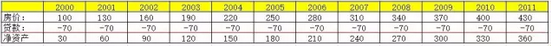
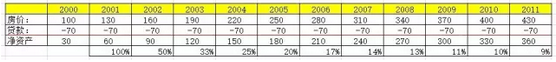

# 楼市的回报有多高 \#2070 
------------------------

原创： yevon\_ou [[水库论坛]](/)
2016-06-17

楼市的回报有多高 ~\#2070~
=========================

 

单利100%

 

 

一）回报

 

您买一个理财产品，承诺给你3%\~4.5%的近乎无风险回报。

你发现一个非常有潜力的商机。去投资了，获取20\~30%的回报。

某一些股神，吹起牛皮来可是相当犀利。他们的最佳战绩有多少，50\~60%年回报。

炒楼的回报有多高，100%

 

 

为什么你不信么。我们来看一个表格。

\
 

这是一个非常保守的例子，十年仅仅翻了400%

假设你第一年买入100W的房子，首付三成，贷款70万。

 

房价按照100，130，160，190，220的速度递增。

最初二年或许显得高，但是"非笋勿入"。买入时就七八折，所以也说得通。

就酱紫，你算算他的"净资产"增长，速度有多快。

 

净资产：

30-\>60-\>90-\>120-\>150-\>180-\>210-\>240-\>270

1，2，3，4，5，6，7，8，9

这是什么，这个就是"单利100%"。

 

 

炒楼这一行，是非常容易做到"单利100%"的。

投进去一百万，第二年就是200，第三年300，第四年400............

什么3\~6%的回报，一边见鬼去吧。

 

 

一个人只要沾过"炒楼"这一行，则其他基本任何投机赌博，他都不感兴趣了。

为什么，因为赚得多啊。

当别人还在费尽心机寻找20\~30%的回报项目时。炒楼这一行，基本是闭着眼睛"单利100%"。

 

别人来到澳门赌场手心出汗，多军基本只打哈欠。

 

 

 

二）复利回报

 

可是，我们接着再来看图2：

 

\
 

 图2的数据，就没这么好看的。

"单利100%"，听起来很吓人。可是你真的拿一个计算器算算复利，回报就没那么高了。

 

从30到60，你是100%的增长。

从60到90，增长率就只有50%了。

从90到120，增长率33%

............

............

330到360，年化增长只有9%

 

 

那么，问题出在哪呢。

问题在于，你正在迅速地"失去杠杆"。

 

令多军最为头疼的，是当你的财富以五倍十倍迅猛速度增加时，你的负债并不能以同样速度增加。

 

 

许多多军，包括楼市新人，普遍遇到过这样的经历；

"小夫妻结婚，父母给钱，凑伙按揭买一套楼。几年之后，楼市大涨，小夫妻就有了[五六百万的身家]"。

 

楼市大涨，财富暴增。这个说法是对的。

可是他们忽略了一件事，几年之后你去问他，"你们的负债还剩多少"。

 

答曰："和刚结婚的时候一样"。

甚至可以说，经过了几年的不断还款，负债比结婚时还要少些。

如果没去提前还款，已经算是财商很高，谢天谢地了。

 

 

正如我们之前所说的，蚂蚁变大象，绝对不是简单的放大100倍。

小夫妻从"刚结婚"时的状态，到了"结婚几年后"五六百万状态。财务增长潜力是绝对不同的。

别以为你能从A6.5升到A7.5，以后的日子也能同样幸福容易晋阶，A7.5升A8.5。

 

一个最关键的指标："负债/资产"比。

这个值是[无可挽回]的。

 

 

三）复利一百

 

有人仔细表2。擅于思考，苦思冥想之后，突然大喊道，"不对，你这里面逻辑有错误"。

 

为什么，我们知道自然界，林木到了一年树龄就被砍伐。

鸵鸟养殖到15个月，就被吃掉。

 

为什么。因为林木的成长速度，是小树快，大树慢。而美国专业的林业基金，对每一棵树都有标号。

一旦这颗树下一年的"生长速度"，低于国库券债券。这棵树就被砍伐。

 

同样道理，鸵鸟肉，养猪，养鸡。都是算好了时间。

一旦"增长率"慢下来，猪肉鸡就被杀掉。然后再孵小鸡。

 

 

对于房地产市场，如图2表格。

 

假设25%的年回报，是一个比较可以接受的下限。

则一套房产，持有到第五年，因为"负债/资产"比，杠杆率越来越低，回报越来越慢。

正确的做法，就应该是"抛掉"。再重新拿了300W，按揭买1000W的房子。

 

 

你要尽量把"单利100%"，变成"复利100%"，这样才是赚得最多，利润最大化的做法。

 

那么，为什么你没去做呢。答案还是"宏观调控"。

宏观调控至少造成了以下几个麻烦；

 

1）交易成本

假如我100W的房子，卖了扣税只剩下80W。

那么我这个"复利100%"，还值不值做，就得打个问号。

具体的分界线，分水岭。得需要精算，见以后的章节。

 

2）限贷

最理想的做法，始终是"抛掉一套，买进三套"。

抛掉一套几乎无贷款的， 30%首付加大杠杆买入三套。

 

可在实际操作中，由于"限购""限贷""第二套首付"等种种麻烦。使得"链式反应"放大很难操作。

这也解释了秀相遭人讨厌的原因。挡人财路，相当于xxxx。

具体精算也要后面。

 

3）收入证明

随着资产额的越来越做大，"工薪收入"逐渐终难以支撑月供。

如果300W的房子卖掉，当首付买入1000W房产。

则月供也是一般人难以承受瓶颈。

更何况一千万如果你再翻成三千万呢......

 

 

综上原因，在"单利""复利"和持有周期之间，有一个权衡。

这并不仅仅是二年，五年税费等问题。

就资产"角质化"本身，就存在重新配置的需求。

 

 

四）角质化

什么叫"角质化"。你的指甲就是角质化，老茧也是。

 

 

在楼市一科，我们喜欢用"角质化"形容整个"钝化"的过程。

当一套房子你刚买入时，"30%首付70%按揭"，那真的是[锐不可当]。

 

"锋锐"这个词，真的太确切不过了。因为楼市随通胀上涨。只要轻微上扬，100万的房子涨百分之十。

相对于30W首付，分分钟巨额回报。

 

 

可是随着你的房价越涨越贵，100万的房子涨到了200W，300W，400W。

而你的贷款，还是只有70W这么多。

 

则你的刀会"钝"掉。手心长了老茧而不再柔嫩，不再敏锐。

"角质化"的资产，增值回报率会越来越慢。

 

 

值得注意的是，秀相"宏观调控"这十年，就是多军手中的房产不断"角质化"的过程。

因为严格得吓死人的限购限贷政策，高昂的交易成本，你只能"长捂"。

 

眼睁睁地看着手里的资产，越来越不锋锐。越来越老化。

所以"炒楼"这一行，新人大跃进回报高。而老派多军就相对值而言，是被不断拉近的。

 

直到某一天可以"去角质"。

 

 

 

五）第一个一千万

 

水库论坛，之前有一篇《[[列兵和阶层
\#540]](http://mp.weixin.qq.com/s?__biz=MzAxNTMxMTc0MA==&mid=400767707&idx=1&sn=efe96aeaf2961d43ddf8718961c35994&scene=21#wechat_redirect)》，是非常重要的文章。推荐值得一看。

 

 

在《列兵和阶层》中，我们说，所谓赚钱，其实是一种"模式"的竞争。

你在菜场划鳝丝，终身是A6，几十万的收入。

你读大学做白领，是A7。数万年薪数百万终身积蓄。

你做企业ipo，是A10套路的玩法。

上面还有A15的玩法，喝咖啡不说了。

 

 

对于"炒楼"这一行，他其实是一种"A8"的心法。

-   炒楼这一行，赚"第一个1000万"很容易，大概和小白领攒第一个10W差不多。首房首贷所有的资源都是现成的。

 

-   赚到A9是可以的。你顺着这条路往前走，加上一点耐心和毅力。"1亿身家"终究是可以实现的。当然，能赚到一亿本身已经是成功学奇迹。

 

-   赚A10难，很难，非常难。因为10亿相当于"1000万"乘以100次。如果模式不变的话，你要把"赚1000W"的事重复100N。纯以数量堆积，这个在有生之年是可见的。但也基本到头了。

 

 

炒楼是一种"起于A8，兴于A9，止于A10"的游戏。

之所以不能把"单利"变成"复利"，这里面和角质化，限制链式反应等等，有很大的关系。

 

但是，你回过头来想想。

人生有几条能让你达到A9的大道！

 

这个世界，充满了艰苦和奋斗。你的父辈们，在机关里混了一辈子，充斥着王八潭子勾心斗角。为的只不过多加一级工资，多升一级职称。

在没有接触"炒房"之前，哪怕是1000W，都是遥不可及的理想。都是繁花盛开的幸福彼岸。

 

"炒楼学"已经是我接触过最NB，最强大，而且最干净的财路。

顺着这条路走下去，不需要冒险，不需要概率运，（不需要竞争！！！），纯种种地流。只需要坚毅和耐心。几乎每一个诚实的人最终都能攒满一亿。

仅此一点，已经堪称神迹。

 

 

（yevon\_ou\@163.com，2016年6月17日暮雨）[\[1\]]

[\[1\]] 本文为改写版，有一篇旧文可以参考：《炒楼的回报有多高》http://www.shuiku.net/forum.php?mod=viewthread&tid=6330
