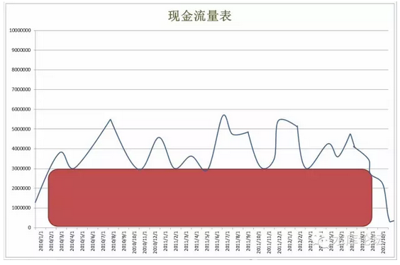
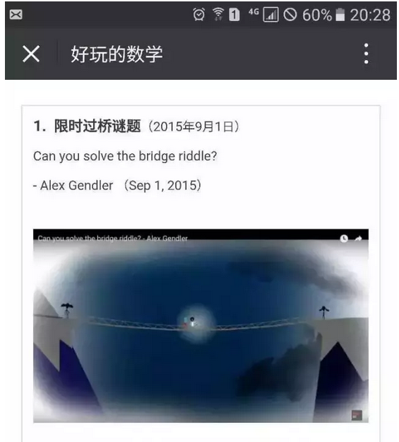
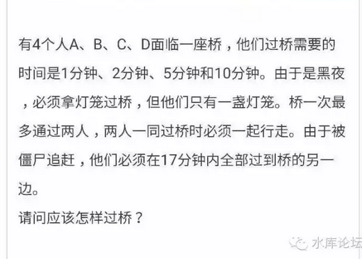

# 空当接龙 \#2160

原创： yevon\_ou [水库论坛](/) 2016-06-26

空当接龙 ~\#2160~

 

循环6次，12次，8次，7次。

 

 

一）目标

 

信用卡"借款流"，就像做数学题。

"把N根长短不一的木板，拼成一个木筏"。

如图，如果蓝线代表你的"现金流量表"。

那么你可以"对外投资"的最大极限，就是如图这个红柱。

 

这一些的内容，因为我们要到"现金管理入门"再详细解释。

所以在这里，你谨记住[结论]就行了。

 

 

好比鲍叔牙借了300W给管仲去炒楼。

过了几个月，鲍叔牙突然找到管仲，"哥哥，我这兜不下去了"。

"和你商量商量，还我50W"

"让我活下去可好"。

 

 

这是绝对不可以的。

用一个形容词来说，这就是做人"不靠谱"。

这样的人，一辈子无出息，一事无成。

 

 

 

二）信用卡原理

 

"借款流"的运作方法，和"信用卡"本身的特性高度相关。

 

 

信用卡的特性是什么呢。

中国的信用卡，免息期是56天。

 

这个56，是一个高度精巧的数字。因为他相当于"二个月"不到数天。

相应来说，银行批给你的信用卡额度。一般≈"月薪"X2

 

目前有一种倡议，行业协会有人认为应该把"免息期"延长到86天。

86天是什么概念呢。就是三个月。

 

 

看问题要看清楚实质。信用卡是什么，信用卡本质就是"个人小额借贷"。

美国人最初在美国搞出信用卡的时候，他们是非常聪明的。

 

信用卡的定位，在于一个"短期周转"的工具。

我给你的借款，就是二个月。就是你二个月的工资。就是寅吃牟粮。

 

这样你的授信额度就不会太大。你也能还得出来。

万一超支了，二个月粮单咬咬牙也就省出来了。

 

 

而为什么是56天，而不是63天呢。

为的就是不让你"熬"到发工资的那天。

因为63天，你可能又熬到第三轮工资。正好发钱把债填了。

 

56天的意思，就是故意在你"发工资"之前三天。

这样银行的利润，防超支风险，赚钱大大地巧妙。

 

 

三）刷卡原理

 

我们以信用卡"一哥"ICBC工商银行为例。

 

工商银行的规矩，是每个月25日还款。

-   一月的任何消费，统一到2月25日还款。

-   二月的任何消费，统一到3月25日还款。

-   三月的任何消费，统一到4月25日还款。

-   四月的任何消费，统一到5月25日还款。

-   ............

 

我们假设看5月份进行了大量的消费，那么到今天，2016.6.25你就要还款了。

问题是，还款之后呢？

 

 

好比你这张是50000元的金卡。

6月25日你把卡还清了。欠款为0.

请问你接着刷还是不刷。

 

如果6月25日马上刷。当场得现金取回五万，没有缺口。

但是"6月所有消费，7月25日还款"。

你7.25又要还款了。免息期只用了30天。

一年需循环12次。

 

 

另外一种做法。则是"6月25日还款后，不使用。一直拖到7月1日再用"。

7月任何消费，8月还款。

这样你就可以用足56天免息期。

一年循环6次。

 

 

四）成本的限制

 

每一次刷卡，都有成本。

刷6次是六次成本。

刷12次是十二次成本。

 

显然，任何一个神经正常的人，都会选择刷6次。

不仅节省费用，而且刷多伤卡。

 

所以，你一边咒骂着"56天缺德太甚"。

一边掏出钱，垫进去25日\~次月1日。大概要垫7天。

 

 

但是，我们仔细看，这里面是有bug的。

Bug就是，"你要垫钱，垫七天"。

 

绝大多数的人，没有这个概念。

因为他们就是"从不透支"。借记卡里永远有全额还款的那种人。

 

 

真正痛苦的，是"没有钱"的那批人。

好比我们把例子放大一点，举例极端一点。

假设鲍叔牙手里的那张，是大额白金卡。单张额度100W。

 

 

那么，到了6月25日那天。鲍叔牙就要填100W元进去，一直到7月1日再刷出来。

当数字上到百万数量级，你是垫不出的。

 

鲍叔牙去找管仲。

"哥哥，和你商量个事"。

"我6月25日需要借一百万，只借七天。只借七天"。

"你上次拿去炒房的300W，能不能抽出一百万，先给我用用"。

"滚"

 

 

用一个词形容，这种人就是"不靠谱"。赶紧绝交。

在真正的历史上，鲍叔牙必须自己把这个账做圆。自己维护这个bug。

 

 

 

五）八次流

 

昨天俺LP给我转了一个"限时过桥"问题。十分精妙，我贴在下面。

鲍叔牙必须自己解决这个问题。在问题的内部"挖潜"。

一个解决的方法，是使用"二张卡"

 

好比你手里有Ａ，Ｂ二张卡。

二张卡的账单日，分别是1号月头，和15号月中。

 

则:

-   月头刷A，还B卡。

-   月中刷B，还A卡。

这事基本上比你想象中的还要简单。

 

 

你只要很简单地将卡片分为A，B二批。

A，B，A，B，A，B循环操作。

这样就能填掉"垫资七天"的缺口。

 

 

而缺点是什么呢。"二班倒"实战中绝对不是主流。

我们再仔细看一看，"1月1日刷卡，2月15日归还"。

 

问题出在这个15日之上。

这意味着你的免息期没有用足。一张卡只免息了45天左右。一个半月。

 

所以你用"二班倒"的方式，你一年要刷8笔。

支付8次佣金。

 

 

而更精细一点的算法呢。

你至少要分成3批。三批的话，大约可以用到"1个月+20天"。

也就是50天免息期。这样一年刷7.3次。

 

而极限的话，则是要分成9批。卡得非常紧。每一批正好是"头尾相接"。

用足56日免息期。

一年刷6.5次。

 

 

如果我们按每次"刷卡费用"0.6%计算。

一年七次，"信用卡融资"的资金成本是4.2%/年。

 

 

六）设备利用率

 

信用卡利用率的极限是87%

也就是你拥有100W额度卡的话，你最多可以维持87W长期输出。

 

 

这个帐是怎么算的。

因为你铁了心的"双月刷"。

每次6.25还款，6.25\~6.30之间，你是不刷的。一直到7月1日再刷。

 

也就是信用卡每二个月有8天"维修保养"。[\[1\]]

一年有48天处于"空卡状态"。

48/365=13%

 

 

一般实战，维持70%的稳定输出就不错了。

也就是拉长到[整年]来看，100W额度的卡正常给你提供70W现金。

300W额度的卡可以提供200W现金。

要300W现金你至少需要430W额度的卡。

 

 

七）配平

 

如何识别菜鸟。

譬如说，如果有人和你夸夸其谈，讲"卡组"分为A，B，C

然后A还B，B还C，C还A。

那么这个人基本上就是口嗨，纯键盘流白菜鸟。

 

 

因为还有一个至关重要的环节。"配平"。

好比说，你将卡组分为A，B二批。A还B，B还A。

 

这个时候，至关重要的一点，A=B

这二组卡片的"额度"，必须是差不多的。

 

 

你想象一下，假如A组的总额度是140W，B组的总额度是40W。

则A组账单到期时，B组填40W，你还是有缺口的。

缺口100W。

 

 

A组B组必须平衡，必须都是90W左右。

然后你再想想你的循环次数。是循环6次，12次，8次，还是7次。

 

也就是你拿到一大堆的卡片之后，你必须立刻开始做规划。

拿一张大型的白纸，详详细细分为A,B,C,D,E,F组。

几号用哪一组还哪一组。

几号用哪一组还哪一组。

 

 

你必须改账单日，延迟配平单双月。

将二个月共计61个自然日，做到"余额"差不多。

不能出现"大月""小月"。

 

持续稳定的功率输出。

和木桶最短的一块板相等。

 

 

 

最后，解释一下为什么上图是菜鸟。

其一，全上海一共才32家银行。你带80张卡干什么。

其二，哪怕你卡再多，随身携带的终是有限。

 

譬如说，平时多军使用这种大型的100张以上的卡包放卡。

但是等我们出门，或者到售楼处去付上80W首付时，我们会换成小型的卡包，隔夜准备好插进去。只带本组F的卡。

\
专业不专业，一眼就看得出来的。

 

 

（yevon\_ou\@163.com，2016年6月25日午）[\[2\]]

 

 

各位，自从进入"信用卡卷"后，订阅号增长迅速。

 

学问之道，分为"体，用，术"。越是偏向应用的东西，越容易赚钱。造原子弹不如卖茶叶蛋的。

信用卡撸撸动辄就赚几万元了。

信用卡虽好，终是雕虫小技。属于"术"。世界观三观，"体"才是根本。

 

今天交叉推荐的是一个自由主义的大家。文笔很好，而且优点是更得勤。

"体"才是根本大道。

菁老师昨天写的脱欧分析也很好，值得推荐一看。"天不生大英，万古如黑夜"

 

[\[1\]]有部分是50天免息期的卡，所以平均要休息8天。

[\[2\]]本文有彩蛋。有一个预存的bug。但是那些说"懂了好棒"的人找不出。
