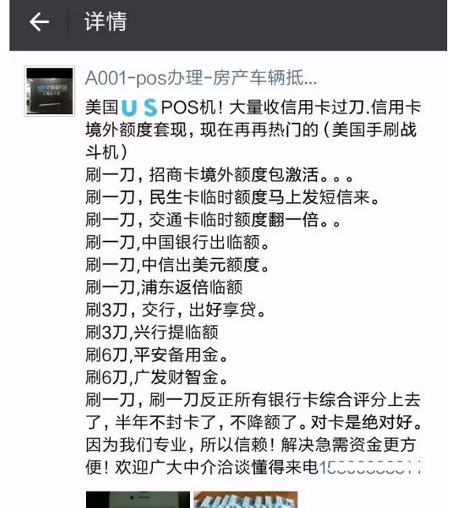

# 信用卡之旁门左道 \#2190

原创： yevon\_ou [水库论坛](/) 2016-07-17

信用卡之旁门左道 ~\#2190~

 

我们继续讲信用卡之雕虫小道。呃，旁门左道

 

 

一）退货交易

 

你去到外滩大楼的AIA，买一份保险。金额100W元。

 

按照保险法规定，10天之内是"犹豫期"。保险可以退的。所以你过几天打电话给保险公司。原路退回。

 

但是，在信用卡系统显示为什么呢。

7.15刷卡100W元。

7.18退款100W元。

但是，退款会冲掉"上期账单"。

 

 

这就是"退款交易"。在传统的信用卡系统中，退款被视为收入。

并且会抵扣掉上期账单。

 

而你的退款通道有很多。买保险只是一个最简单的说法。

一般有POS机的人，都可以直接在POS机上面执行退款。

 

退款不产生积分，没有手续费。

而且不会超出小型POS机每月卅万的限额。

 

 

这个洞用得多了，有一点的塌。

譬如目前华夏银行规定，退款只能冲抵下期账单。

 

但是，全市有32家信用卡发卡行。

每家银行内部流程不一样。

所以还是有漏。

 

 

二）跳码机

 

银行与客户之间，是一种矛与盾的关系。

 

如果你每二个月刷一次，一笔刷5W。

一年刷六轮。整个信用卡账单干干净净。那肯定是不行的。

 

 

在2012年之前，银行关注的是"刷卡笔数"。

譬如以ICBC为例，工商银行的要求是"刷满50笔"。无论你金额大小，刷满50笔，基本上他就不会封你的卡。

而商户类型如果可以多点变化。那就更好了。

 

在2011\~2012的封卡大浪潮中，催生了一种行为："养卡"。

譬如某人，23:59会冲到全家超市。买五瓶矿泉水，掏出五张信用卡，每张刷3元。

且慢，过了二分钟就是0:01，他再买五瓶矿泉水。再刷五张卡。

这样纯为了积累刷卡笔数。

 

 

可是之后的科技进步，出现了"跳码机"。

跳码机指的是一种POS机，每次刷出的商户名称不同，MCC动态在变。

这样，养卡就变得非常之简单。

 

"刷卡笔数"迄今仍然是一个非常重要的考核指标。

如果你不想被封卡的话，小额笔数一定要多。笔均要低。

跳码机无疑是一种强大的作弊机。

 

有时候银行还会有"每个月刷六笔88元""本月账单比上月多2000元"之类促销活动。

那就更等于送钱给你了。

 

 

不过银行后来也学乖了。考核逐渐以大数据"贡献度"导向。

只要你让银行赚到的佣金足够多。小额笔数逐渐不再是唯一考核。

但还是很重要。

 

 

 

三）外币机

 

比跳码机更进一步的，是外币机。

 

因为银联目前收费是0.78%，再要收单清算几家人分。

而Visa/Master一般的标准费率是2.25%，如果是海外刷卡，再加1.7%，总额接近4%（欧美国家水深火热）

 

所以在银行系统内部评估，对Visa/Master消费的评分是天价，绝对欢迎。

也就发生了"刷\$1送大礼包"等各项活动。

 

 

很多人痛苦于浦发兴业打电话"威胁"，不分期就销卡。

一般情况是认怂。然后讨价还价分个10000元意思意思。

但如果你有"外币消费"，就会对你的大数据评估好很多。

 

 

四）提额

 

江湖传言，保持30%左右的额度使用率，最有助于提额。

 

 

五）强制提额法

 

招商，平安，都可以强制提额。

本节不写。

 

 

六）积分

 

因为你要雨惠养卡，刷点积分是难免的事。

积分的处理，是件大麻烦。银行的积分兑换手册，99%情况下是鸡肋。

 

 

一般我们推荐，简单点就全部申请"航空里程卡"。

因为里程可以跨行。浪费不多。

 

还有几点说明；

-   一些积分最渣的银行，是没有航空卡的。例如光大。

-   一些积分很渣的银行，航空卡是分立的。例如招商。它的航空卡积分和普通积分是二套系统。不能互换的。

 

基本上遇到大派糖，送积分等翻倍活动。都会说明里程卡不参与。

银行送的，都是不值钱的积分。

 

 

七）Walmart积分

 

在所有的积分中，只有一款特例：交通银行Walmart卡。

这个卡惯例只能在Walmart店里申请。带上你的收入证明和身份证件。

 

 

交行Walmart卡，任何消费，1%回馈。

因为Union
Pay在国内几乎是没有佣金可以收的。这套系统如何运作，迄今仍是一个迷。

怀疑可能是美国人来到中国，不认识路，财大气粗。所以美国人是补贴的。

 

因为实在太NB了，到了2008年时脑残专家还跳出来。

"积分要交所得税，交20%所得税"。所以实际到手是0.8%

2015年之后中国人也觉得"公蜘"太丢党锅脸了。最近又改回了1%

 

 

Walmart还有一个活动，"最红星期五"。

也就是星期五沃尔玛购物5%回馈。部分搞活动季，惊人的50%减免（有上限）。

 

每到交通银行搞活动，就是人山人海排队。而且的确也没什么想买的。

正确的做法。应该是买Walmart储值卡。

你买三张500面额的储值卡，刷八张不同身份证的交行Walmart，一样的柜台收银POS。

这么简单的道理，为什么人不明白。

 

 

八）支付宝

 

支付宝的"信用卡还款"，是我迄今用到最难用的软件。

 

马云的产品经理们，就没一个懂信用卡的。

他根本就没考虑过"有100张卡"的客户体验，使用困难。

 

 

每当我要还一张卡，我就要把屏幕拉到最低部。找呀找呀，看得我眼睛都花了。

它是不是默认每人就二三张卡的屌丝。

拇指都酸了。

 

同样道理，支付宝的"代付水电煤"，也是界面极其不友好的。

连昵称都不允许备注。

你有没有考虑过20套房子房东的感受。

 

 

九）信用卡管家

 

不好用。很不好用。

 

我认为"email邮箱导入账单"，并不是一种很好的模式。

-   一方面，许多银行（浦发，花旗），发的邮件仅仅是"您有账单，请登录上网"。而不发明细的。

-   另一方面。迄今我所有账单都选择纸质的。不喜欢电子账单。

 

为什么，因为纸质账单里面会夹广告呀。我有一套别墅，就是靠这种广告买的。

 

 

其次，真正有活力的。应该象微信，支付宝这样。可以上网查询。

譬如支付宝在每次还款前，部分银行可以直接显示"本期账单"。例如温州，农商。

这是非常方便的一个功能。

 

但是随着Alipay明显地走下坡路，产品越做越差。把银行都得罪光了。

银行现在支持Alipay在线查询的也越来越少。

 

 

相对来说，更好用的是微信。

几乎在每次还款之前，用微信查询一下本期账单，是最快捷方便的了。

如果微信能增加主动提醒功能，就更好了。

 

微信的缺点，是"只能绑一张卡"。

好比你同时有你，你爸爸，你妈妈的中信银行卡。则微信绑定只能查一个身份证。

 

 

十）支付宝取现

 

对于ICBC工行卡，你可以多申请几张"白菜卡"。

 

即你的主卡是20W的。但是工行同时在发行"白菜卡"，例如猪猪卡，"建国60周年纪念"。

一套八张，但是每一张额度都是10元。

 

 

这种卡的主要用途，是"支付宝取现"。

支付宝还工行卡，二小时到帐。然后你可以直接网银转入借记卡。

这样无论支付宝里有多少钱。都可以瞬间转出。

微信同理。

 

 

十一） 异地存款

 

在罗湖大额现金存入ATM，存工行"白菜卡"卡号。可以瞬间在上海转出。

 

 

十二） 外卡

 

在香港办100W港币的信用卡，其难度比在国内办20W人民币白金卡还低。

 

不过后来银联学乖了。规定HK发行的银联双币卡，无论你的港币额度多少，CUP额度上限10W。

 

 

十三） eps

 

在香港买钻戒，最理想的办法，并不是刷银联机。

"海淘"刷银联更省钱？纯粹胡说八道。

 

 

你应该和店家说，刷eps，你把3%退给我。

因为商家默认刷Visa/Master，是要支付3%给信用卡公司的。欧美商户佣金非常之贵。

 

而如果你买大额奢侈品。最理想的办法，是付现金。然后让商家退3%给你。

当然不用携带现金这么麻烦。

香港叫做eps系统。是一种只能刷港币借记卡的POS机。

 

 

十四） 延伸阅读

 

还有一篇文章《1%的人口占有了80%的信用卡》，可以参考一下。

http://bbs.tianya.cn/post-develop-667309-1.shtml

 

 

 

（yevon\_ou\@163.com，2016年7月16日午）
