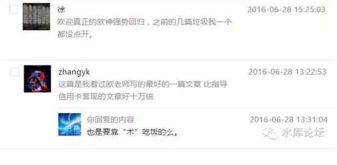

# 信用卡的战略意义 \#2220 
------------------------

原创： yevon\_ou [[水库论坛]](/)
2016-07-20

信用卡的战略意义 ~\#2220~
=========================

 

年轻十岁

 

 

一）信用卡的意义

 

信用卡这玩艺到底是怎么用的。信用卡这玩意到底有何用途。有许多人是不同意我们看法的。 

 

《[[美国的大脑生病了]](http://mp.weixin.qq.com/s?__biz=MzAxNTMxMTc0MA==&mid=2651014783&idx=1&sn=03046770bccc54cbf35f7064e64d0d77&scene=21#wechat_redirect)》，读者留言。

}

用一句话概括，信用卡的战略意义，是:

 

让你跳过了资本原始积累阶段

 

 

二）资本原始积累

 

什么叫资本原始积累。小学教科书都已经反复讲了无数次了。

 

如果你看现代财经杂志。他们和你说"+15%的复利"。

但是复利的伟大威力，也是建立在时间基础上的。

 

人生的大部分时间，都空耗在10W-\>350W的阶段上了。

而真正350W-\>1000W，按照复利的算法，也不过几年时间。

 

 

当你是一个大学生，二手空空，走上社会。

横亘在你眼前，真正的困难，是你"本金"太少。

 

如果你只有10W元储蓄的话，无论你如何理财，无论你理财的回报是多少。

都不能改变你贫困的命运。

 

 

对于一个青年人来说，他可能要消耗整十年的时间。整整的25岁\~35岁整段青春。

来积累他的"第一桶金"。

或者是第一个350万。

 

但是，从他的35岁\~45岁，下一个十年之中，他的资产有可能翻十倍。有可能从350万，升到3500万。

然并卵。你还是丧失了最宝贵的十年青春。

 

 

另一个角度，你的发展上限也受限制了。

-   如果你25岁的时候，就有350W。

-   那么你到了35W，就能有3500W。

-   到了45岁，你的目标是3.5亿！

 

可见你有更高的起点的话，你就能有更高的终点。

这里面的区别，差了十年的岁月。

 

 

多了10个Turns

玩《文明系列》的人，自然知道这是多大的意义。

 

 

三）办卡

 

信用卡有什么用呢。信用卡就是使得你25岁拥有350W本金。

虽然这个力量是虚的。是用幻术和技巧支撑的。但你的确是有了350W现金。

 

办卡永远比存钱容易！

对于一个刚刚踏上社会的大学生。你让他存5W元储蓄，那可能要存上整整一年的工资。

需要省吃俭用很长一段时间。每个月攒几千。

 

但是你让他办一张信用卡，动辄批2W，3W额度。这个是很容易的。

真的要批5W，乃至20W，30W的白金卡，也不是不可能的。

 

从一个大的尺度来讲。如果你要办150W的信用卡，其难度，和一个23岁的大学生要存150W现金；绝对不是一个难度数量级的。

办卡终究相对容易。

 

 

 

四）焚城烈火

 

前二天有一个小朋友讨教我的问题。他羡慕职业炒家的日进斗金，希望也能尽快赚到衣食无忧。

 

我问他的财务状态。他回答说：

-   年薪18W

-   存款10W

-   信用卡额度共6W

 

 

我叹了口气，其实我并不想教他。

为什么呢，因为一般缺乏"人文关怀"的精算师。会给他开出如下药方。

 

1）办卡。再办大约400W元信用卡额度

2）按照75%的输出率，可以长期维持300W现金

3）《[[楼市的回报有多高]](http://mp.weixin.qq.com/s?__biz=MzAxNTMxMTc0MA==&mid=2651014724&idx=1&sn=6f8e68cd2c77c1e7fe2d4c321d714456&scene=21#wechat_redirect)》以这300W现金，购买1000W的房产。则每年净赚300W。

你的净资产，将会以0，300，600，900，1200，1500............的速度在增长。

 

 

"炒楼是一桩非常非常赚钱，非常非常赚钱的行业"。

你真的按照传统教科书模式，这个"回报率"是没法算的。

 

怎么算，我的本金为零。

一年赚300W，你说我的"投资回报"是多少。

 

 

但是我为什么不推荐他去做呢。

因为金庸的《倚天屠龙记》里面写道，"精妙的内功心法，就好比娃娃舞大锤。锤法越是精妙，越容易砸伤自身"。

 

如果你本金只有10W，几乎不值一晒。

而你要去走"买1000W房子，每年升值300W"。那么意味着你任何错误都不能犯。

 

从头到尾，每一个环节，每一个步骤，每一个细节。任何错误都不能犯。

这个是能够做到的，但是很难很辛苦。

 

 

而你的"本金"意味什么。本金多少，其实是你的"容错度"。

相当于张无忌的内力。

 

因为楼市总体而言是赚钱的。具体操作中，总有一些不可测的麻烦和断档。

这个时候就需要你用"自有实力"去填。

你自己的本金越是丰厚，你的处境越是安全。

 

 

当许多小朋友起步，假设你只有10W元。理论上你也可以炒1000W的房子，也可以每年涨大几百万。

但你就是拿命在博了。

除非人生中遭遇巨大刺激，女朋友被人抢走了，否则不建议如此不要命。

 

 

五）负责任的人

 

如果你真的一定想用信用卡做"启动资金"。一毕业就有几百万"起步"。

那你需要怎样的个人品质呢。

-   严谨，极度的严谨。

 

如果一个人可以玩转信用卡，那他这辈子干其他任何事，估计都不会太差。

因为信用卡要求高度的"责任心"。

 

 

信用卡本身的游戏规则决定了。到了第56天的最后一刻，你必须要把卡债还上。

哪怕相差一天，哪怕是第57天凌晨，它就会产生利息。

你也不可以早还。

因为你吃的就是免息。赚的就是免息期。早还了你就没得赚。

 

 

懒癌症者死死死，拖延症者死死死。

-   巨婴症者死死死

-   逃避现实者死死死

-   草莓心者死死死

-   抱怨社会者死死死

你只有坚强，你只有踏实。除了你自己，没有任何人可以救你。

 

 

另一方面，"循环套卡"的原理是"空账"。

也就是该你还钱的时候，你账户里是没有钱的。

这真是巨大的折磨！

 

 

这种状态下，要么你分为ABC组，有着良好的预期安排。

要么你问朋友垫资借款。

无论这二项解决方案，都需要极强的"执行能力"。

 

如果一个人可以兜60张卡，兜几年，从来不发生缺失和错漏。

其品性，其认真，其踏实坚韧，做公司高管是足够了。

战火淬炼人。

 

 

在水库系列，我们写出了信用卡"空当接龙"的全套技巧。

但是我们并不希望读者去做。

因为"负责任"这项素质，本身就是极高端极珍贵。

 

以中国人懒懒散散的样子，99%的人都是做不到的。

懒癌入骨，拖延症入骨，不愿意承受压力，不愿意午夜23:30去打电话借钱。

不愿意对着电话一遍遍刷通讯录。

这条路名义上是通。其实99%的人素质干不了。

 

 

 

六）信用卡的退场

 

信用卡是一项重要的工具。上了规模，就是大杀器。

我们谈论信用卡，不是谈论6W，10W的总额度。

我们谈论的是300\~500W的卡额度。

 

办卡本身就是一件"艰辛"的事。甚至可以看作对一个人的考验。

如果一个人懒懒散散，办了一轮，有了十几万卡他就停下来了。

那他也不用走下去了。

因为"兜卡"比办卡再难十倍。办卡你办不出300W，后面也不用走了。

 

 

出了足够多的卡额度。最好你也有一些"自有资金"。这样不容易死。

如果你实在没有自有资金，你别报水库的师承............

 

 

信用卡的意义，在A7，A8，A9完全不同。

在第一套，第六套，第十六套阶段，完全不同。

 

在起步阶段，"信用卡"是性命纠关的技巧。有了信用卡，你可以少奋斗十年。或者多战斗十年。

而在A8阶段，当你有了三千万身家。三百万的信用卡就显得不再那么重要。

当然还是有关注的。因为那是三百万现金。所以A8.3还是挺在意信用卡的。

 

 

再往上走，到了A9以后，信用卡就逐渐丧失意义。

对于功成名就的财富人士来说，兜兜转转几百万卡并不是太大的利益。相对于牵涉的精力，更是得不偿失。

精力这种东西，只属于初出茅庐的年轻人啊。

A9之后，信用卡会逐步削减淡化。养身第一。

 

 

七）利益与回报与道德

"高度的杠杆，高度的风险，空手套白狼"。

这样的赚钱方法，流落到文科生小编手里，肯定又要友邦惊诧了。

 

这也同时引发了一个问题。

值得么，可以么，道德么？

我们的回答是："你能告诉我一个短期内速成到A8，没有副作用的容易方法么"。

 

 

轻松赚1000W，这种事肯定是没有的。

能告诉你一条方法，已经是莫大的恩德了。

而且你自己的"本金"是随意的。本金越多，越安全。

 

岁月静好，人生的路，都是自己选的。

 

 

 

（yevon\_ou\@163.com,2016年7月16日晚。信用卡卷完）
