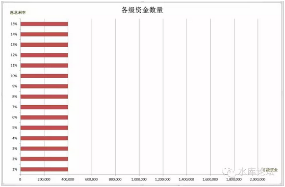
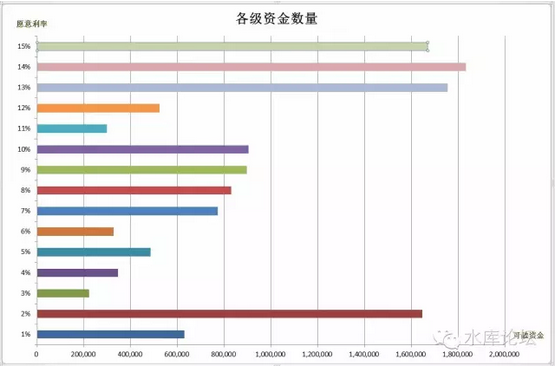
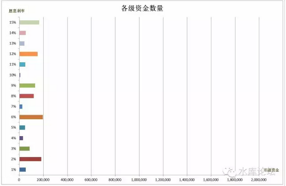
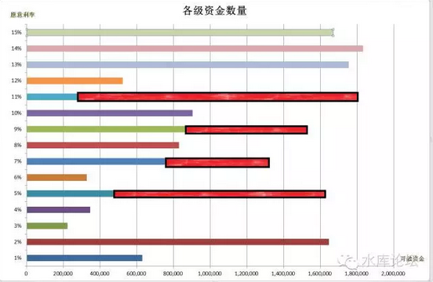

# 资金的分层（上） \#2240 
------------------------

原创： yevon\_ou [[水库论坛]](/)
2016-07-25

资金的分层（上） ~\#2240~
=========================

 

利率是三维的。              

 

 

一）借银行

 

借款融资主要有三种渠道：信用卡，银行，私人借贷。

 

其中；

-   信用卡，提供了一个初期虚空借力的方式

-   银行贷款，90%的主流

-   私人借贷，抹平波峰

 

很多人对于银行贷款的看法，十分浅陋。还停留在"售楼处首付三成，贷款七成"。

甚至还有很多人嫌图利息，不肯贷款。

以目前的上海市场而论，售楼处平均卖掉100亿房产，贷款22亿左右。

 

 

对于《银行贷款》这一卷，当然不是讨论"贷不贷"，贷几成。

事实上，我们的回答极为清晰，二个字："尽贷"。

 

 

尽贷，有多少贷多少。对于目前4.9%的利率，有多少贷多少，全力往上限贷款。

那么，"贷款卷"讲的是什么呢。

讲的是"有成本下的贷款"。

 

好比普通的贷款是4.9%，但是他还要收"手续费"。还要收20W元好处费。

请问你贷不贷。

 

 

在这样的情况下，你贷款的"实际成本"就会上升。真实利率不是4.9%，而有可能是6%，8%，10%

整个贷款卷，其实就是一篇又一篇的精算。计算在各种情况下，你的真实利率是多少。

然后再由你来决定要不要做。

 

 

 

二）资金的分层

 

基本利率4.9%，是一条分水岭。

 

-   在0\~4.9%的阶段，是储蓄段。是资金的提供方。

-   在4.9%\~36%的阶段，是借贷段。是资金的借入方。

 

在《[[更多更早的金钱]](http://mp.weixin.qq.com/s?__biz=MzAxNTMxMTc0MA==&mid=2651014700&idx=1&sn=afe95be2d14493541e7d4074652e0669&scene=21#wechat_redirect)》一文中，我们说到，赚钱的秘诀，就是尽早尽多地买入房产。

但是，任何一个人的资金都是有限的。

 

一般来说，我们引入一个"分层"的概念。

A. 0\~2%的资金成本，主要是活期和闲置资金

B. 3\~4%的资金成本，主要是定期和理财产品

 

这句话什么意思呢。意思是你踏上了"炒楼"这条不归路，从此现金是路人。

那么，你第一步打掉的子弹，肯定是"自有资金"。

 

 

上手，你肯定是把自己历年的储蓄，积蓄，角角落落公积金，这些最容易的子弹打掉。

打掉这些子弹，你也是没有任何心理负担的。

 

可是，之后，之后就有问题了。

因为你很快发现，"房价"非常非常之贵。

 

 

水库多军们，奉行的是"2N"理论。

2N的意思是说，不管刮风下雨，不管大年小年。每一年你的房产证要+2。

 

在《[[Section
2筑基卷总纲]](http://mp.weixin.qq.com/s?__biz=MzAxNTMxMTc0MA==&mid=2651014681&idx=1&sn=86321b0f46693cfdd3b762756c15c02a&scene=21#wechat_redirect)》\#2000一文中，我们说到；

 

（30岁时的人生）你只能买一套。可是别人可以买二套，三套，总收益轻松超过你。

而真正的绝顶高手，可以买10套，20套，50套。

 

 

那么很多人问，HOW？

房价是如此之贵，我哪怕买一套房子，都已经耗尽了全部积蓄。

更正，哪怕买半套房子，首付都攒了十几年呢!

 

普通人可能也就80\~200W的现金。

如何实现一年买二套呢。如何象下蛋一样不停地买呢。

答案毫不出奇。就一个字:"借"。

 

 

在耳熟能详的TVB剧《大时代》中，方展博学艺，师傅教他的就是"借钱借势借虫，天下大事无一不借"。

因为个人原始积累，永远都是慢的。你要等一个月一个月地发工资，再从牙齿缝里省出钱来投资。这样速度永远不够。

 

天下大势，就是一个"借"字。所以你还要启动四级五级资金。

C. 4\~5%的资金成本，信用卡

D. 5\~6%的资金成本，满地打滚亲友借款

E. 6\~7%，抵押贷款，白领通

F. 7\~8%，截断

G. 8\~9%，高评

H. 8\~9%，买卖

I. 11\~12%，信用卡分期

J. 12\~15%，临时拆借

K. 14\~18%，无抵押信用贷

L. 18\~36%，社会借款

 

 

当资金超过4.9%利率，你就进入"分水岭"。此后的资金，全部都是借来的。

你等于用借来的钱，在做投资。

 

但即使是这样，和社会上热炒的"首付贷"仍有很大的区别。

因为无论你怎样努力，《[[长线负债率]](http://mp.weixin.qq.com/s?__biz=MzAxNTMxMTc0MA==&mid=2651014727&idx=1&sn=b64eae1b2a0b201fd8676aa3286849e4&scene=21#wechat_redirect)》也很难超过25%

 

 

三）资金分层的意义

 

天底下无事不杠杆。

 

杠杆玩得最厉害的，反而是最道貌岸然的"银行"。

根据巴塞尔协议规定，银行业的资金充足率是8%。也就是8元借100元做生意。

杠杆率12倍。

 

"借钱"来做投资，这件事本身没什么可耻的。道德上更加没有任何可以指责之处。

你只要保证你的商业模式是可行的，赢利的。借款方是自由的，自愿的。双方签订平等自愿的合约，那就是符合正义的。

最简单点说，"超市卖储值卡"，还是一种吃上下游的行为呢。

 

 

那么，我们为什么要说"资金的分层"呢。

这其中牵涉到一个"回报率"的问题。

 

如果你完全纯粹用自己的资金，那么输了亏了各由天怨。大不了晚上减一个菜。

但是如果你用借来的资金，输了就很难看。

如果你输光了妈妈的养老金，那就得跪门汀了。

 

 

所以我们非常关注"成本"和"收益"二个端。

-   一方面，是你融资的"成本"。利率多少。

-   另一方面，是你投资回报。

 

 

 

四）资金的形状

 

在上表中，我们划分了ABCDEFG类资金，分别对于的资金利率1%，2%，3%，5%，7%，8%，10%，12%

 

和很多人理解的不同。资金的可获取性，并不是每一级都一样的。如图：

这样单细胞大脑印象中的"资金分布"，在现实生活中永远也不会发生。

图形永远不会是圆柱形。

每上一级利率成本+1%，可融资金绝不会都是四十万。

 

 

在真实实战中，更有可能的情况如下图。

(数据纯随机，无意义纯示意)。

在这个图表中，每一级的资金数量是不一样的。

有凸起，有洪峰。

 

所以，这时候你用到"哪一级"的资金。就有很大的讲究了。

考究许多经验和判断。

 

 

譬如说，你买一套500W的房子，只需要用到三级资金。最高资金成本控制在5%就可以了。

但是，你买一套800W的房子，就要额外动用到八级资金。最终几笔钱的成本高到10%。

 

这些都是典型例子。

 

 

 

五）边际效应

 

如果你看一个"典型"的多军。那可真的是"家无隔夜粮"。

因为一个真正的，纯正的，狂热的楼市多军。那肯定是每一分钱子弹都打光的。

 

 

我们的一级资金，二级资金，三级资金，早早地就已经全部消耗完。

十几年都没见到"定期存款"长什么样子了。

 

多军目前普遍消耗的是8\~10%的资金成本。

意思并不是我们的低成本资金不厚，并不是起家底蕴不厚。

纯粹是买得太多。

 

 

而"扩张之路"什么时候达到尽头呢。

尽头是，"资金成本"="投资收益"。

或者说，边际成本等于边际收益。

 

每一个人最终都会停下。

促使多军止步的原因，并不是看空。也不是我们的手法不够犀利。

纯粹是资源耗尽。

 

 

每一个人都有自己的全方位资源，资源的概念，指的是资金，人脉，亲属，同学，商业机会............资源是全方位的，而不仅仅是金钱。

譬如说，你的身份证，你的房票，都是资源。

 

现金仅仅是一种最狭义的"资源"。

亲属关系，家庭关系，朋友人脉，这些都是"资源"。你没有使用三级，四级，五级资金。纯粹是你没有去挖掘。

 

 

在《[[回报率的真相]](http://mp.weixin.qq.com/s?__biz=MzAxNTMxMTc0MA==&mid=207495196&idx=1&sn=4825572100d53270086233f8719760c4&scene=21#wechat_redirect)》一文中，我们说到:"富人其实没有那么富，穷人其实没有那么穷"。

富人的现金资产，可能是穷人的100倍。但他的实际实力，并没有100倍。

 

因为"资源"是一个全方位的概念。穷人之所以穷，是因为穷人的资源没有"调度和整合"起来。

没有将所有的力量拼拼凑凑起来，拧成一股拳头。

 

 

你如果看日本的极道文学，有一股精神是贯穿始终的；

"将所有的资源整合，将所有的潜力挖掘到极致"

 

燃烧吧，小宇宙！

 

 

 

六）社交的意义

 

有些事，看似是没意义的。但其实又是有意义的。譬如说"社交"。

 

 

社交有什么用。你在马路上逮一个屌丝，捏住他的脖子一通乱晃。

"七天之内必须凑齐200W，否则错过这个店"。

屌丝哭丧着脸，"大爷呀，你就算是杀了我。也拿不到200W"。

 

 

为什么。因为如果你是那种；

-   一下班就回家

-   公司里只有仇人，没有朋友。

-   同乡同学从来不联系，不热络形同陌人。

-   不参加网路社团，没有户外爱好，整天宅在家里面。

 

 

则你的各项"指标值"。是非常短的。类似于下图；

很多屌丝你让他们"凑钱"。他们是真的凑不出钱。

因为他们不仅仅是"弱"。他们是"全方位弱"。

 

 

不仅硬实力家底子穷，父母农民。

而且软实力情商，能动力，个人社交也做得一塌糊涂。

他们是真的凑不出钱来，哪怕你把"融资利率"提高到10%，12%，15%，每一格也就多凑几万。

 

 

而一个富有的"人脉"是什么样子的呢。

}

图中的红色柱线，意味着"人脉"加成。

每一档容量都"接了"长长的一段。

 

 

当你需要融资时，登高一呼，你就能从同学手中借到NN张信用卡。

你想用长钱，男同学们会把自己的私房钱8%放在你这里一年。

你需要调度大笔资金，12%能聚拢几百万。

 

 

一个人花许多时间在"务虚"上面，构建他在社会关系网中的位置。结识更多的人，小心翼翼维护自己完美的声誉。

这一切，都是在增强你的实力。

 

屌丝们平时不努力，事到临头说全世界都欠他的。

呸，别人努力时，你TMD瞎了看不见。

 

所谓"人脉"，平日时并不需要动用。

但是当你需要帮助时，"千金散去复归来"。你就可以在短时间内调度大量资金。不论是给你抢笋盘，还是应付突发不可测灾难。都非常地有帮助。

 

 

 

上几节"信用卡卷"写完之后，有一些清高人士说他们学不会，也不屑于学。

其实哪怕你永远用不到，你也应该申请一二百万卡额度放着。

闲着也是闲着。办卡又不伤身。只要不开卡，对你的信用贷就没有大影响。

 

而到了万一你有危难的时候，宝藏解封，顿时就是源源不断的武器库。

从03年开始时，我不断地听到有傻空哭诉。怎么可以贷款买房子。

"你怎么不想想失业的风险，万一生大病住医院"。

这些玻璃心都是极脆弱的。我唯一奇怪的是，那些口口声声说"失业医疗费"的人，你怎么不去办几张信用卡？

 

 

（未完待续）[\[1\]]

 

 

 

(yevon\_ou\@163.com,2016年7月25日午)

\[1\]关联阅读《论资金来源》http://www.shuiku.net/forum.php?mod=viewthread&tid=13779
